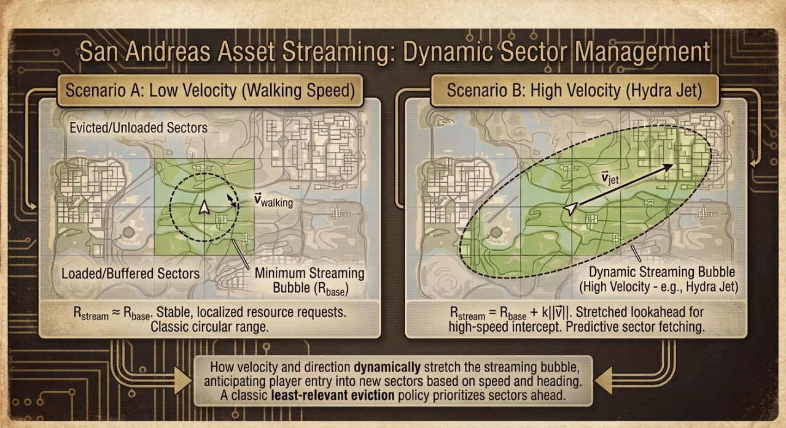

import { Alert } from '@/components/ui/feedback/Alert';

Tres ciudades, un estado ficticio completo con zonas rurales que las conectan y cero pantallas de carga; todo funcionando en una consola con 32 MB de RAM de sistema y un presupuesto de memoria de vídeo más pequeño que una sola fotografía 4K sin comprimir. Esa era la premisa de ingeniería, implícita o no, detrás de *Grand Theft Auto: San Andreas* de Rockstar North en 2004, y obligó a un pequeño equipo de programadores de bajo nivel a tratar la PlayStation 2 menos como una consola de videojuegos y más como un sistema embebido en tiempo real con un medio de almacenamiento hostil acoplado a un lado.

Esta no es una retrospectiva sobre la narrativa o la banda sonora del juego. Es un análisis de la infraestructura interna: el pipeline de streaming asíncrono, la jerarquía LOD (Level of Detail) que oculta la latencia mecánica del disco, el microcódigo de la Unidad de Vectores (VU) escrito a mano que omitía por completo al compilador, y los trucos de memoria de color indexado que hicieron que un presupuesto de memoria de vídeo de solo 4 MB se estirara por todo un estado. Algunas de las constantes internas exactas que utilizó Rockstar nunca se publicaron y la comunidad de ingeniería inversa solo las ha calculado de forma aproximada a lo largo de las últimas dos décadas; allí donde sea el caso, lo he señalado. La arquitectura, sin embargo, está bien documentada y es una clase magistral de ingeniería basada en restricciones.

## 1. La crisis de hardware de 2004 y la paradoja

Emotion Engine de la PlayStation 2 direccionaba 32 MB de RDRAM Direct como su memoria principal de sistema: el código, el estado de la IA, la física, los búferes de audio, la geometría por streaming y las texturas en tránsito competían por el mismo pool de memoria. Por su parte, el Graphics Synthesizer (el rasterizador de la PS2) trabajaba con un bloque independiente de 4 MB de DRAM embebida (eDRAM) situado directamente en el *die* de la GPU, el cual debía albergar simultáneamente el *framebuffer*, el *Z-buffer* y cada textura vinculada activamente para el renderizado. No existía una arquitectura de memoria unificada ni paginación de texturas virtuales en el sentido moderno; si un recurso no estaba físicamente residente en uno de esos dos pools, simplemente no existía para el renderizador.

<Alert variant="warning">
**El verdadero cuello de botella no era la RAM, sino la unidad lectora.** Un lector de DVD-ROM a velocidad 4x ofrece una tasa de transferencia secuencial teórica de aproximadamente 5,28 MB/s ($4 \times 1.32\ \text{MB/s}$ para un lector de DVD de velocidad simple). Sin embargo, el rendimiento secuencial representa el mejor de los escenarios. Las unidades ópticas de esta generación pagaban una penalización enorme (que solía rondar entre los 100 y 200 ms) cada vez que el cabezal de lectura tenía que realizar una búsqueda hacia un sector no contiguo. Una *sola* búsqueda podía consumir el presupuesto de tiempo equivalente a seis o más fotogramas del juego.
</Alert>

 

Ese presupuesto de tiempo era implacable. Con un objetivo de 30 FPS, el motor disponía de:

$$
T_{frame} = \frac{1}{30\ \text{fps}} \approx 33.3\ \text{ms}
$$

para actualizar la simulación, ejecutar la animación y la física, emitir las llamadas de dibujo (*draw calls*) y mantener alimentado el pipeline de streaming, todo sin que el jugador notara un solo tirón. Si multiplicamos de manera ingenua la velocidad secuencial de la unidad en el mejor de los casos por esa ventana de tiempo por fotograma, obtenemos el límite teórico de datos por fotograma:

$$
D_{frame} = R_{DVD} \times T_{frame} = 5.28\ \frac{\text{MB}}{\text{s}} \times 0.0333\ \text{s} \approx 176\ \text{KB}
$$

Esa cifra es tan optimista que en la práctica resulta ficticia, ya que asume que no hay sobrecoste por tiempos de búsqueda, una condición que jamás se cumple cuando el jugador conduce por una ciudad y la lectora salta entre sectores del disco en un patrón que no tiene nada que ver con el orden lineal de los archivos. Todo el problema de diseño para el equipo de desarrollo del motor de San Andreas se reducía a una sola pregunta: ¿cómo ocultas un dispositivo de almacenamiento que puede quedarse bloqueado durante cientos de milisegundos dentro de un *game loop* al que solo le quedan 33 milisegundos de margen?

El objetivo era innegociable: un streaming fluido por todo el estado, donde desplazarse por el mundo jamás requiriese una sola pantalla de carga; algo que ningún juego de mundo abierto en consola había intentado antes a esta escala geográfica.

## 2. Streaming de recursos: Vectorización y segmentación de San Andreas en tiempo real

Rockstar licenció RenderWare para San Andreas, el middleware de renderizado multiplataforma de Criterion, pero solo la capa de rasterización de bajo nivel *RenderWare Graphics*, omitiendo los módulos de nivel superior de gestión de escenas, audio, físicas o IA de Criterion. Rockstar North desarrolló su propio grafo de escena, esquema de oclusión, sistema LOD y motor de streaming completamente de forma interna, ejecutándolos sobre las primitivas de renderizado de RenderWare en lugar de integrarlos dentro de ellas. Decir que se trataba de un «RenderWare fuertemente personalizado» es, en un sentido muy literal, quedarse corto: gran parte de lo que la gente llamaba «el motor RenderWare» en San Andreas era código propio de Rockstar que usaba el rasterizador de RenderWare simplemente como *backend*.

El mundo en sí estaba dividido en una cuadrícula 2D de sectores de escena: celdas espaciales discretas, cada una de las cuales poseía el conjunto de modelos, datos de colisión y texturas que pertenecían físicamente a esa parcela del mapa. En cada fotograma, el motor comprueba la posición del jugador en el espacio del mundo frente a los límites del sector; cruzar a un nuevo sector activa una *solicitud de streaming* para el conjunto de recursos de ese sector. Un contador en segundo plano (efectivamente un registro continuo de la «memoria de streaming en uso») realiza un seguimiento de cuánta parte del presupuesto de RAM está asignada actualmente a los recursos cargados. Cuando ese contador se aproxima a su límite, el motor comienza a desalojar los objetos residentes menos relevantes: cosas lejanas a la cámara, fuera del frustum de visualización o simplemente aquellas más alejadas del jugador, liberando espacio antes de que lleguen los datos del nuevo sector.

<Alert variant="info">
Esta es una clásica política de caché de **desalojo del elemento menos relevante** (least-relevant eviction), no una política LRU (de uso menos reciente). La distancia y la visibilidad, y no la proximidad temporal de uso, deciden qué se purga; algo que resulta enormemente importante en un mundo abierto donde el jugador puede darse la vuelta y regresar de golpe a un sector que acaba de abandonar.
</Alert>

 

El radio de activación para una solicitud de streaming no es un círculo fijo alrededor del jugador: debe tener en cuenta la velocidad con la que el jugador reduce la distancia hacia la geografía que aún no se ha cargado. Un jugador a pie y un jugador que pilota un caza Hydra a toda velocidad presentan requisitos de anticipación (*lookahead*) abismalmente diferentes. A nivel conceptual (las constantes de ajuste exactas de Rockstar nunca se publicaron, por lo que conviene tratar esto como un modelo ilustrativo del mecanismo y no como su código fuente literal), el radio de streaming escala con la velocidad:

$$
R_{stream}(\vec{v}) = R_{base} + k \cdot \lVert \vec{v} \rVert
$$

donde $R_{base}$ es el radio mínimo de la burbuja que se necesita a un ritmo de caminata, $\lVert \vec{v} \rVert$ es la magnitud del vector de velocidad actual del jugador y $k$ es una constante de ajuste que ensancha la burbuja a medida que aumenta la velocidad. Una variante más predictiva proyecta una posición futura a lo largo de la trayectoria actual y centra la solicitud de carga allí, en lugar de hacerlo en la coordenada actual del jugador:

$$
\vec{p}_{predicted} = \vec{p}_{current} + \vec{v} \cdot T_{lookahead}
$$

Esta es la diferencia entre un motor que *reacciona* a la entrada del jugador en un nuevo territorio y uno que se *anticipa* a ella. Teniendo en cuenta que la latencia de búsqueda del DVD se medía en cientos de milisegundos frente a un presupuesto de fotograma de 33,3 ms, reaccionar nunca iba a ser lo suficientemente rápido. La velocidad máxima del Hydra obliga básicamente al sistema de streaming a empezar a recuperar la geografía segundos antes de que llegue el jugador, o de lo contrario el mundo desaparecería bajo sus pies.

Figura 1: La relación entre la cuadrícula de sectores de escena y la burbuja de streaming dinámico. A baja velocidad, el radio de carga es prácticamente circular; a alta velocidad, se estira por delante de la trayectoria del jugador, priorizando los sectores en los que el jugador está a punto de entrar por sobre aquellos que ya han quedado atrás.

## 3. Mitigación de la latencia de almacenamiento: Jerarquías LOD y la resolución del «pop-in»

Incluso con una burbuja de streaming predictiva, la física siempre acaba ganando: un caza moviéndose lo suficientemente rápido puede ir más veloz que el propio disco. Esta es la causa principal del infame «pop-in» de San Andreas: edificios, puentes y árboles con todo detalle que aparecen de golpe en pantalla un instante después de cuando ya deberían estar allí, debido a que el DVD sencillamente no podía entregar la geometría a máxima resolución a tiempo.

Cada vez que un jugador presenciaba cómo un puente colgante o un grupo de árboles detallados se materializaban repentinamente de la nada justo en frente de su vehículo a gran velocidad, no estaba presenciando únicamente un fallo de software: estaba siendo testigo de los límites mecánicos del hardware de 2004. Dentro de la consola PlayStation 2, el cabezal físico del lector láser de la unidad de DVD se desplazaba frenéticamente de un lado a otro sobre el disco en rotación. Para recuperar las texturas de alta resolución y las mallas 3D de un nuevo vecindario, ese cabezal láser tenía que reposicionarse físicamente, tardando hasta 200 milisegundos en posarse sobre el sector correcto. Mientras el láser se desplazaba por el disco, el *game loop* continuaba su curso a 33,3 milisegundos por fotograma. En lugar de congelar todo el juego a la espera de que el láser se pusiera al día, el motor optaba por seguir ejecutándose, renderizando un espacio vacío o un marcador de posición de baja resolución (*placeholder*).

La solución no consistía en eliminar el problema —algo físicamente imposible con una unidad óptica de 5,28 MB/s—, sino en hacer que la transición fuera lo más fluida posible. El mecanismo principal es un modelo proxy persistente de pocos polígonos: una versión tosca y «siempre residente» de la geografía distante que permanece en memoria independientemente del estado de streaming. Cuando la versión de alto detalle de un edificio o punto de interés termina de cargarse, el motor la intercambia por su sustituto de pocos polígonos. Al haber *siempre* algo en pantalla —aunque no siempre sea el recurso con la calidad final—, el pipeline visual se degrada de manera elegante a un marcador de posición de menor detalle, en lugar de sufrir una caída catastrófica hacia un vacío absoluto sin renderizar.

<Alert variant="info">
**La histéresis evita el parpadeo constante (thrashing).** Si un motor utilizara un único umbral de distancia para decidir cuándo alternar entre los niveles de detalle (LOD), un objeto situado exactamente en ese límite —algo que ocurre constantemente al conducir con un radio constante alrededor de un punto de interés— parpadearía alternando entre modelos en cada fotograma. Los motores de la era de San Andreas solucionaron esto utilizando dos umbrales en lugar de uno: una distancia más lejana para realizar el *downgrade* al modelo de pocos polígonos, y una distancia más cercana para hacer el *upgrade* de nuevo al nivel de detalle completo, creando así una zona muerta donde no se produce ningún cambio. El intercambio en sí suele suavizarse aún más aplicando una transición de transparencia (*alpha cross-fade*) a lo largo de un puñado de fotogramas, de modo que incluso la transición real se perciba como una mezcla fluida y no como un corte abrupto.
</Alert>

 

Lo interesante es lo que esto le aporta al motor, expresado en el propio presupuesto de fotograma: la capa proxy de bajo poligonaje tiene una dependencia prácticamente nula de la latencia del DVD porque nunca sale de la memoria. Esto significa que el *peor de los casos* en la salida visual del renderizador es siempre «correcto pero de baja fidelidad», nunca «inexistente». De este modo, la latencia de búsqueda del DVD deja de ser un problema de corrección de datos para convertirse en un simple problema de calidad de servicio (Quality of Service), que es exactamente el tipo de tolerancia a fallos en el que un sistema en tiempo real quiere operar.

## 4. Magia del ensamblador: Exprimiendo el Emotion Engine y las Unidades Vectoriales

El complejo de CPU de la PlayStation 2 —el «Emotion Engine» de Sony y Toshiba— es arquitectónicamente asimétrico de una forma que no tiene un análogo moderno directo. En su centro se sitúa un núcleo MIPS R5900 de 128 bits que funciona a unos 294,912 MHz y se encarga de la lógica general del juego. Acopladas a ese núcleo se encuentran dos Unidades Vectoriales, la VU0 y la VU1; cada una de ellas es un pequeño procesador SIMD diseñado en torno a registros de 128 bits optimizados para operaciones matemáticas con vectores flotantes de 4 elementos (4-wide), que es precisamente la estructura de datos utilizada en transformaciones 3D, cálculos de cuaterniones e integración de físicas.

La VU0 opera estrechamente acoplada al núcleo principal, funcionando prácticamente como una extensión de coprocesador del propio flujo de instrucciones de la CPU. Era el lugar natural para las operaciones vectoriales más sensibles a la latencia y ligadas a la jugabilidad: el modelado de la suspensión de los vehículos, la respuesta de colisiones por fotograma o las físicas de tipo *ragdoll*; es decir, cualquier cosa que necesitara comunicarse bidireccionalmente con la lógica del juego en el mismo ciclo de reloj. La VU1 es un animal completamente diferente: cuenta con su propia memoria local de datos e instrucciones y puede ejecutarse de forma *autónoma*, procesando su propio microprograma en paralelo con la CPU principal en lugar de esperar a ser alimentada instrucción por instrucción. Crucialmente, la VU1 dispone de un bus privado de alta prioridad que va directo al Graphics Synthesizer —el «Path 1» en la terminología de PS2—, controlado por una sola instrucción: `XGKICK`. Esta instrucción envía una ráfaga de geometría transformada, iluminada y recortada (*clipped*) directamente a la GPU, sin pasar en ningún momento por la CPU principal ni por el bus de la memoria RAM del sistema.

<Alert variant="info">
**¿Por qué escribir ensamblador de la VU a mano en lugar de confiar en el compilador?** La VU0 y la VU1 ejecutan dos ranuras de instrucción (*instruction slots*) por ciclo: una ranura «superior» (upper slot) para aritmética vectorial y una ranura «inferior» (lower slot) para operaciones como acceso a memoria o bifurcaciones. Obtener un rendimiento real de ese pipeline requería coordinar manualmente los pares de instrucciones de forma conjunta (*co-scheduling*), gestionar un archivo de registros locales diminuto y mitigar a mano los retardos (*stalls*) de latencia fija en el pipeline. Los compiladores de la época no eran lo suficientemente solventes a la hora de realizar este tipo de planificación de instrucciones de doble emisión (*dual-issue*) y mitigación de latencias en una arquitectura tan inusual. Los estudios que querían alcanzar de verdad el rendimiento de transformación de vértices anunciado de la PS2 —estimado habitualmente en decenas de millones de vértices por segundo cuando la VU0 y la VU1 trabajaban al unísono— recurrían de forma rutinaria a microcódigo puro de la VU para los bucles internos más críticos (*hot loops*): *skinning*, transformaciones de paleta de matrices, *frustum culling* y proyección en el espacio de recorte (*clip-space*).
</Alert>

 

El pipeline resultante se asemeja a esto: la CPU principal (con la asistencia de la VU0) actualiza el estado del juego y las físicas para el fotograma en curso; la VU1 toma los resultados y procesa de forma independiente las transformaciones de matrices, la iluminación y el recorte en el espacio de visualización para la geometría que ha superado las pruebas de visibilidad; finalmente, las primitivas terminadas y listas para la GPU se lanzan al Graphics Synthesizer a través del Path 1, mientras la CPU ya ha pasado al siguiente bloque de trabajo. Se trata de un paralelismo estructurado por software (*software-pipelined*) exprimido de un hardware muy cercano al de función fija, años antes de que el término «compute shader» siquiera existiera.

Figura 2: Flujo de datos a través del Emotion Engine. La VU0 permanece cerca de la CPU para los cálculos físicos acoplados a la jugabilidad, mientras que la VU1 se ejecuta de forma semiautónoma y transmite la geometría terminada al GS a través del bus dedicado Path 1 mediante la instrucción XGKICK, sin tocar nunca el bus de la RAM del sistema principal.

## 5. Economía de memoria: Texturizado CLUT y reciclaje procedimental de entidades

Con solo 4 MB de eDRAM para albergar cada textura vinculada activamente durante un fotograma, San Andreas dependió en gran medida del color indexado —Tablas de Búsqueda de Color, o CLUT (Color Look-Up Tables)— para la gran mayoría del arte de sus escenarios. En lugar de almacenar un color RGBA completo de 32 bits por píxel, una textura indexada guarda un pequeño *índice* entero por píxel, y una tabla de paleta independiente y diminuta asocia cada índice con un color real de 16 bits. El Graphics Synthesizer de la PS2 admitía de forma nativa dos profundidades indexadas: de 4 bits (16 colores posibles por textura) y de 8 bits (256 colores posibles por textura).

El ahorro es drástico e independiente de la escala; se mantiene esencialmente en el mismo porcentaje sin importar la resolución de la textura, ya que el coste adicional de la paleta (*palette overhead*) es insignificante en comparación con los propios datos de píxeles:

| Tamaño de textura | Formato | Datos de píxeles | Paleta (CLUT) | Tamaño total | Ahorro frente a RGBA de 32 bits |
|---|---|---|---|---|---|
| 128×128 | RGBA de 32 bits | 64 KB | — | 64 KB | — |
| 128×128 | Indexado de 8 bits (256 colores) | 16 KB | 0,5 KB | 16,5 KB | ~74,2% |
| 128×128 | Indexado de 4 bits (16 colores) | 8 KB | ~0,03 KB | ~8,03 KB | ~87,4% |
| 256×256 | RGBA de 32 bits | 256 KB | — | 256 KB | — |
| 256×256 | Indexado de 8 bits (256 colores) | 64 KB | 0,5 KB | 64,5 KB | ~74,8% |
| 256×256 | Indexado de 4 bits (16 colores) | 32 KB | ~0,03 KB | ~32,03 KB | ~87,5% |

*Los tamaños de la paleta asumen una entrada de color de 16 bits por índice: 256 entradas × 2 bytes = 512 bytes para las CLUT de 8 bits; 16 entradas × 2 bytes = 32 bytes para las CLUT de 4 bits.*

La fórmula detrás de la columna de datos de píxeles es una simple operación matemática de empaquetado de bits (*bit-packing*). Para una textura de $W \times H$ píxeles a $b$ bits por píxel:

$$
S_{pixels} = \frac{W \times H \times b}{8}\ \text{bytes}
$$

razón por la cual reducir de 32 bits por píxel a 4 bits por píxel no representa un ahorro lineal: es una reducción de 8 veces en el almacenamiento de píxeles sin procesar, ya que $32 / 4 = 8$.

La indexación CLUT tiene un segundo beneficio, más sutil que el mero almacenamiento bruto: dado que cada píxel en una textura indexada es simplemente un puntero hacia una pequeña paleta, se puede cambiar radicalmente el *aspecto* de una textura reescribiendo únicamente la paleta (unas pocas docenas o cientos de bytes) sin tocar un solo byte de los datos de píxeles (que son mucho más grandes). Al intercambiar, rotar o desvanecer (*fade*) las entradas de la paleta, cada píxel que hace referencia a ellas se actualiza de manera instantánea y uniforme. Esta técnica de alternancia de paletas (*palette shifting*), muy consolidada en los gráficos de color indexado desde la época del hardware de 8 bits, es precisamente el tipo de truco que hace viables a escala de consola los cambios de iluminación con un coste de VRAM casi nulo (como la gradación de color o *color grading* que requiere una escena a medida que el ciclo día-noche de San Andreas transiciona las texturas del entorno desde la intensa luz del mediodía hacia los tonos ámbar del atardecer). Volver a cargar un puñado de bytes de la paleta es órdenes de magnitud más eficiente que reescribir o mezclar de nuevo los datos de textura a resolución completa en cada fotograma.

Figura 3: Cómo la indexación CLUT desacopla el almacenamiento de píxeles del almacenamiento de color. Reescribir la pequeña franja de la paleta cambia el color de forma instantánea en cada píxel que hace referencia a ella: el mecanismo detrás de los efectos de iluminación económicos y la alternancia de paleta sin coste de VRAM.

La economía de memoria en el lado de la CPU dentro del presupuesto de RAM funcionaba bajo la misma filosofía: no almacenes lo que puedas volver a generar. La población de peatones y el tráfico de San Andreas no eran un conjunto fijo de actores persistentes: se trataba de un pool gestionado de forma procedimental, que se generaba (*spawn*) y eliminaba (*despawn*) dinámicamente a medida que el jugador se movía por el mundo. Este proceso estaba delimitado por tablas deterministas ponderadas por zonas que influían en qué modelos podían aparecer en cada distrito (vehículos de estilo *lowrider* concentrados en Ganton, coches deportivos acumulados en Las Venturas, etc.). La generación de entidades estaba restringida por el *view frustum* (el volumen de visualización de la cámara): las nuevas entidades se materializaban justo fuera del campo de visión en lugar de hacerlo en cualquier parte del mundo cargado. La eliminación era igualmente agresiva: cualquier cosa que saliera del *frustum* y se alejara lo suficiente del jugador se purgaba del *heap* activo de inmediato, evitando que permaneciera como un lastre innecesario en el presupuesto de RAM. Todo el sistema se comporta como un pool de objetos (*object pool*) de capacidad fija con una capa de políticas espaciales y estadísticas superpuestas; que es precisamente lo que necesitas cuando tu población simulada debe competir por la memoria contra la geometría, las texturas y el audio cargados por streaming, todo ello bajo el mismo techo de 32 MB.

## 6. Conclusión: El triunfo de la arquitectura basada en restricciones

Al analizar *Grand Theft Auto: San Andreas* bajo una perspectiva moderna, queda claro que el vasto y fluido mundo del juego no fue producto de la potencia bruta del hardware, sino una ilusión sostenida por un microcódigo implacable, un almacenamiento en caché agresivo y una gestión del presupuesto de memoria sumamente estructurada. Los 32 MB de RAM del sistema y los 4 MB de eDRAM no limitaron la visión de Rockstar North; de forma paradójica, esos límites tan rígidos definieron un marco de ingeniería limpio y predecible que hizo posible el juego.

El motor de streaming no se limitaba a cargar recursos: orquestaba una danza en tiempo real contra los límites físicos y mecánicos de un cabezal láser en rotación. Las Unidades Vectoriales no solo transformaban vértices: omitían las abstracciones de software de alto nivel para extraer paralelismo de ejecución puro directamente del silicio.

En una era donde el desarrollo moderno de videojuegos y web suele superponer una capa de abstracción sobre otra —lo que a menudo da lugar a un tamaño de despliegue descomunal y a entornos de ejecución poco optimizados—, San Andreas se erige como una clase magistral de ingeniería de sistemas de bajo nivel (*bare-metal*). Es un recordatorio de que, cuando el hardware no te regala nada, la herramienta definitiva de optimización es un conocimiento profundo e inflexible de la arquitectura física. El estado de San Andreas nunca estuvo almacenado realmente en ese DVD de doble capa: se materializó a base de ingeniería, fotograma a fotograma de 33 milisegundos.

---

## Referencias y lecturas adicionales

* **Copetti, R.** (2018). <a href="https://www.copetti.org/writings/consoles/playstation-2/" target="_blank" rel="noopener noreferrer">*PlayStation 2 Architecture: A Practical Analysis*</a>. Un análisis profundo de los pipelines del Emotion Engine, las Unidades Vectoriales y el Graphics Synthesizer.
* **Criterion Software.** (2002). <a href="https://gtamods.com/wiki/RenderWare" target="_blank" rel="noopener noreferrer">*RenderWare Graphics SDK Documentation*</a>. Especificaciones estructurales y detalles preservados por la comunidad sobre la capa de rasterización de bajo nivel.
* **GTA Modding Community.** <a href="https://gtamods.com/wiki/Memory_Addresses_(SA)" target="_blank" rel="noopener noreferrer">*GTA:SA Memory Addresses*</a> y <a href="https://gtamods.com/wiki/Resource_Streaming" target="_blank" rel="noopener noreferrer">*Resource Streaming Documentation*</a>. Wiki de ingeniería inversa impulsada por la comunidad que detalla las estructuras `.ipl`, `.ide` y las constantes de streaming de memoria.
* **Proyectos re3 y reVC.** <a href="https://github.com/Cai1Hsu/re3" target="_blank" rel="noopener noreferrer">*Decompilación de código abierto de los motores de GTA de la era RenderWare*</a> (y su <a href="https://archive.org/details/gta-3-gta-vc-re_20210222_0707" target="_blank" rel="noopener noreferrer">torrent preservado en Internet Archive</a>). Código fuente original obtenido por ingeniería inversa que mapea las estructuras del motor, el pooling de memoria y las rutinas de reciclaje de entidades.

---

## Technical Glossary

| Term | Definition |
|---|---|
| **Emotion Engine (EE)** | La CPU principal de la PS2: un núcleo MIPS R5900 de 128 bits (~294,912 MHz) emparejado en el mismo *die* con dos Unidades Vectoriales (VU0, VU1) y una unidad de coma flotante, diseñado específicamente para la simulación 3D en tiempo real. |
| **RDRAM** | Direct Rambus DRAM: la memoria principal de sistema de 32 MB de la PS2, que ofrece un ancho de banda de aproximadamente 3,2 GB/s y es compartida por el código, el estado del juego y todos los recursos cargados por streaming. |
| **eDRAM** | DRAM embebida (Embedded DRAM) integrada directamente en el *die* del Graphics Synthesizer; un pool de memoria independiente, mucho más rápido pero bastante más pequeño (4 MB), que alberga el *framebuffer*, el *Z-buffer* y las texturas vinculadas activamente. |
| **Graphics Synthesizer (GS)** | La GPU de rasterización dedicada de la PS2. De función fija, sin sombreadores (*shaders*) programables; consume geometría y texturas pretransformadas y genera píxeles. |
| **VU0** | Una Unidad de Vectores acoplada de forma estrecha al núcleo del EE como coprocesador; utilizada habitualmente para operaciones matemáticas vinculadas a la jugabilidad (como físicas y modelado de suspensión) que necesitan entrelazarse con la lógica de la CPU en cada ciclo. |
| **VU1** | Una segunda Unidad de Vectores más autónoma y con su propia memoria local; dedicada habitualmente a transformaciones geométricas, iluminación, recorte (*clipping*) y descarte (*culling*) antes de enviar los datos al GS. |
| **GIF (Graphics Interface)** | La interfaz de hardware que arbitra la entrega de datos al GS desde tres rutas («Paths») prioritarias, asegurando que los datos de geometría y texturas lleguen al rasterizador en el orden correcto. |
| **Path 1 / XGKICK** | La ruta de bus de mayor prioridad desde la VU1 directamente al GS, activada por la instrucción `XGKICK`; permite a la VU1 enviar geometría terminada a la GPU sin pasar por la RAM principal. |
| **CLUT (Color Look-Up Table)** | Una pequeña tabla de paleta emparejada con una textura indexada; cada píxel almacena un índice compacto en lugar de un color completo, y la CLUT mapea dichos índices con valores de color reales. |
| **Palette Shifting** | Reescritura de la paleta CLUT de una textura (unas pocas docenas o cientos de bytes) para cambiar el color aparente de cada píxel que hace referencia a ella, sin alterar los datos de píxeles subyacentes. |
| **LOD (Level of Detail)** | Un modelo sustituto con menos polígonos y menor fidelidad que permanece residente para que el renderizador siempre tenga *algo* que dibujar cuando se trata de geografía lejana o que aún no se ha cargado por streaming. |
| **Hysteresis (LOD swapping)** | El uso de dos umbrales de distancia distintos (uno para degradar la calidad y otro para mejorarla) en lugar de uno solo, para evitar que un objeto cercano al límite parpadee constantemente entre niveles de detalle en cada fotograma. |
| **Streaming Sector** | Una celda discreta de la cuadrícula del mundo del juego que posee un conjunto delimitado de recursos de geometría, colisiones y texturas; se utiliza como la unidad atómica para las decisiones de carga y descarga del sistema de streaming. |
| **Streaming Bubble** | El radio dinámico de la burbuja alrededor del jugador dentro del cual el motor solicita datos de sectores de forma proactiva, escalado según el vector de velocidad del jugador para compensar la latencia de búsqueda del DVD. |
| **DVD-ROM (4x)** | El medio de almacenamiento óptico de la PS2; ofrece una tasa de transferencia secuencial teórica de aproximadamente 5,28 MB/s, donde la latencia de búsqueda (estimada habitualmente entre 100 y 200 ms) representa el verdadero cuello de botella para las lecturas no contiguas. |
| **Frustum Culling** | La eliminación de la geometría que queda fuera del campo de visión actual de la cámara antes de enviarla a la GPU, lo que ahorra costes de transformación y de tasa de relleno (*fill-rate*). |
| **RenderWare Graphics** | El middleware de rasterización 3D de bajo nivel (desarrollado por Criterion Software) sobre el cual se construyó San Andreas; los sistemas personalizados de gestión de escenas, streaming y LOD de Rockstar North se ejecutaban sobre él en lugar de estar integrados en su interior. |