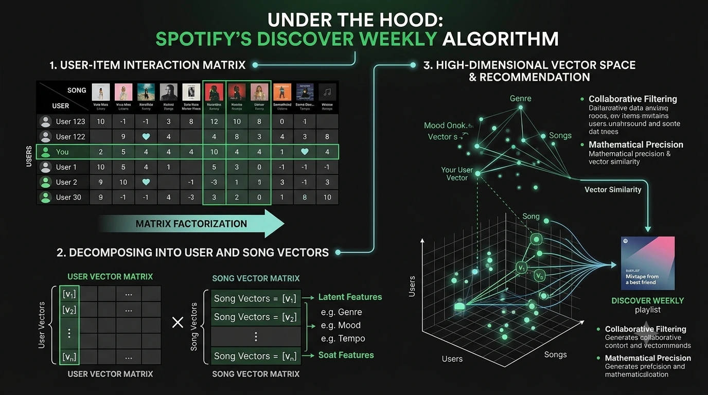

import { Alert } from '@/components/ui/feedback/Alert';

Si alguna vez has sentido que el *Descubrimiento semanal* de Spotify funciona con una precisión casi misteriosa y clarividente, no estás solo. Puede que abras la aplicación un martes por la tarde, dejes que tome el control y, de repente, te encuentres con una canción que encapsula tan perfectamente tu estado de ánimo actual que empiezas a preguntarte si tu teléfono te está escuchando.

El sistema no te está leyendo la mente, ni está escuchando a escondidas tus conversaciones. Matthew Ogle, quien lideró el área de descubrimiento en Spotify durante la era de *Discover Weekly*, definió la meta con una frase célebre: crear *"un casete de mezclas hecho por un mejor amigo"*. Detrás de esa visión con tintes tan humanos, sin embargo, se encuentra un sistema de una precisión matemática notable.

Lo que parece telepatía digital es en realidad la ejecución elegante de una matemática brutal y de alta dimensión. La arquitectura de recomendación de Spotify es una clase magistral de la ciencia de datos moderna: no depende de un único modelo monolítico, sino que orquesta un conjunto de distintos paradigmas de aprendizaje automático que funcionan de forma síncrona. Desarmemos el motor y analicemos la arquitectura matemática que hay bajo el capó.

*Figura 1: La macroorquestación del motor de recomendaciones de Spotify, que demuestra el flujo desde la matriz cruda de interacción usuario-elemento hasta las incrustaciones (embeddings) de vectores latentes de alta dimensión.*

---

## La arquitectura central: Los tres pilares de la extracción

Para entender Spotify, primero debemos diferenciarlo de los algoritmos deterministas de coincidencia de audio. Shazam, por ejemplo, <a href="https://www.toptal.com/algorithms/shazam-it-music-processing-fingerprinting-and-recognition" target="_blank" rel="noopener noreferrer">se basa en espectrogramas y hash combinatorio localizado</a> para identificar una huella digital de audio conocida en una base de datos estática. Spotify, sin embargo, resuelve un problema probabilístico fundamentalmente más difícil: predecir preferencias futuras basándose en un comportamiento humano abstracto que nunca ha observado directamente.

Para lograrlo, recurre a tres fuentes de datos completamente distintas de forma simultánea: comportamiento, lenguaje y sonido puro.

### Pilar 1: Filtrado colaborativo a través de mínimos cuadrados alternos (ALS)

La piedra angular del motor de Spotify es el **filtrado colaborativo** (Collaborative Filtering). En lugar de analizar la música en sí, analiza los metadatos del comportamiento humano a escala civilizatoria.

Spotify conceptualiza su ecosistema como una matriz de interacción masiva $R$, donde las filas representan usuarios ($u$) y las columnas representan elementos/canciones ($i$). El valor en cada celda, $r_{ui}$, codifica una señal implícita: un recuento de reproducciones, cuántas veces se reprodujo una pista por completo, si se guardó o si se saltó en los primeros 30 segundos. Debido a que los usuarios en su conjunto solo escuchan una pequeña fracción de los más de 100 millones de canciones disponibles, esta matriz es extraordinariamente dispersa.

El objetivo es la **factorización de matrices** (Matrix Factorization): descomponer $R$ en dos matrices densas de menor dimensión — una matriz de usuarios $U$ y una matriz de elementos $V$ — de tal manera que su producto punto se aproxime al original:

$$R \approx U V^T$$

Cada fila de $U$ es un vector de características latentes que representa el gusto musical de un usuario en un espacio abstracto de $k$ dimensiones. Cada fila de $V$ es el vector correspondiente para una canción. Siguiendo la notación estándar de ML, denotamos al vector latente para el usuario $u$ como $p_u$ y para el elemento $i$ como $q_i$. Su producto punto $p_u^T q_i$ predice con qué fuerza respondería el usuario $u$ a la canción $i$.

Para aprender estos vectores a gran escala, Spotify utilizó históricamente el **<a href="https://medium.com/data-science/alternating-least-square-for-implicit-dataset-with-code-8e7999277f4b" target="_blank" rel="noopener noreferrer">algoritmo de mínimos cuadrados alternos (ALS)</a>**. El objetivo es minimizar la siguiente función de pérdida ponderada:

$$J = \min_{P, Q} \sum_{u, i} c_{ui} (r_{ui} - p_u^T q_i)^2 + \lambda (\|p_u\|^2 + \|q_i\|^2)$$

Donde:
* **$r_{ui}$**: La interacción implícita observada entre el usuario $u$ y el elemento $i$.
* **$p_u^T q_i$**: La afinidad predicha; el producto punto de los vectores latentes del usuario y del elemento.
* **$c_{ui}$**: Un peso de confianza. Dado que los datos de streaming son implícitos (no escuchar una canción no significa necesariamente que no te guste; tal vez simplemente no te has topado con ella), $c_{ui}$ escala la importancia de las interacciones observadas de manera proporcional. Una canción reproducida 50 veces recibe mucho más peso en la optimización que una canción reproducida una sola vez.
* **$\lambda$**: El parámetro de regularización L2 para penalizar pesos grandes y evitar el sobreajuste (overfitting).

Debido a que resolver simultáneamente tanto para $U$ como para $V$ da como resultado un problema de optimización no convexo, el algoritmo ALS fija una matriz para resolver la otra mediante mínimos cuadrados lineales, y luego alterna. Este truco hace que el cómputo sea altamente paralelizable en clústeres distribuidos, algo crítico cuando se opera sobre una matriz con 600 millones de usuarios.

La intuición práctica: si tu comportamiento de escucha se asemeja mucho al de un usuario en Tokio, el algoritmo deduce que son "almas gemelas musicales" y te recomienda las pistas que a ellos les encantan pero que tú aún no has descubierto. Tu *Descubrimiento semanal* es, en su esencia, una recopilación curada de lo que tus vecinos matemáticos más cercanos están reproduciendo en bucle esta semana.

<Alert variant="info">
    **Actualización de 2026 — Redes neuronales de grafos.** Si bien ALS sigue siendo la base conceptual, Spotify se ha inclinado cada vez más hacia las **redes neuronales de grafos (GNN)** para las recomendaciones a escala de producción. A través de su plataforma interna **Twine**, Spotify modela todo el ecosistema —usuarios, canciones, listas de reproducción, artistas y podcasts— como un único grafo heterogéneo. Las GNN pueden capturar relaciones de múltiples saltos (multi-hop) que son invisibles para la factorización de matrices: por ejemplo, que tú y el superfán de un artista en Seúl están conectados a través de tres saltos de listas de reproducción, no solo por una coescucha directa. ALS explica el *porqué* del enfoque; las GNN se encargan cada vez más del trabajo pesado en producción.
</Alert>

*Figura 2: La arquitectura del marco de filtrado colaborativo de Spotify, que ilustra la factorización de la matriz dispersa de interacción usuario-elemento en vectores de características latentes, la optimización matemática de la función de pérdida y la ejecución iterativa del algoritmo de mínimos cuadrados alternos (ALS).*

### Pilar 2: Procesamiento del lenguaje natural — Las listas de reproducción como oraciones

El filtrado colaborativo es potente, pero sufre del **problema de inicio en frío** (Cold Start Problem): ¿cómo se recomienda una canción que tiene cero datos históricos de reproducción? Un nuevo lanzamiento de un artista independiente no tiene ninguna señal de comportamiento. Se necesita un segundo sistema complementario.

Spotify cierra esta brecha recurriendo a la internet cultural en un sentido más amplio. Sus rastreadores (crawlers) <a href="https://variogram.com/2012/12/11/how-music-recommendation-works-and-doesnt-work/" target="_blank" rel="noopener noreferrer">extraen contenido web</a> continuamente —blogs de música, artículos editoriales— y, lo que es más crítico, los títulos y descripciones de millones de listas de reproducción generadas por usuarios. La famosa observación de Ogle también se aplica aquí: la verdadera inteligencia del sistema *"se apoya en los hombros de gigantes humanos"*, los millones de usuarios comunes que, sin saberlo, etiquetan la música cada vez que le dan nombre a una lista de reproducción.

El flujo de NLP trata a las listas de reproducción como oraciones y a las canciones como palabras, aplicando modelos arquitectónicamente similares a **<a href="https://arxiv.org/abs/1301.3781" target="_blank" rel="noopener noreferrer">Word2Vec</a>** (específicamente variantes de Skip-gram o CBOW). Al entrenarse con la secuencia de canciones dentro de las listas de reproducción, el modelo se optimiza para maximizar la probabilidad de predecir las canciones circundantes dada una canción de anclaje, un objetivo que normalmente se logra a través del **muestreo negativo** (Negative Sampling, una aproximación computacionalmente eficiente de la pérdida completa de entropía cruzada softmax). Esto obliga al modelo a aprender incrustaciones (embeddings) vectoriales densas donde las canciones que coocurren en las mismas listas de reproducción quedan geométricamente cerca unas de otras.

Esta es la misma intuición detrás de la famosa propiedad de Word2Vec: así como *"Rey" − "Hombre" + "Mujer" ≈ "Reina"* en el espacio de incrustación de palabras, una canción que vive entre listas de reproducción de *"lo-fi hip hop"* y *"late night study"* se agrupará en consecuencia en el espacio de incrustación musical.

Una vez que se aprenden estas incrustaciones, el sistema evalúa la proximidad cultural entre una canción candidata y el perfil de preferencias de un usuario utilizando la **similitud de coseno** (Cosine Similarity):

$$\cos(\theta) = \frac{A \cdot B}{\|A\| \|B\|}$$

Si miles de usuarios colocan de manera independiente una canción en listas de reproducción tituladas *"sad boy hours"*, *"crying in the rain"* o *"2 AM existential crisis"*, la representación vectorial de esa canción ($A$) se acerca de forma medible en el espacio de alta dimensión a las representaciones vectoriales de esos descriptores emocionales ($B$). Esta es exactamente la razón por la que una recomendación te llega en el momento preciso: la mente colmena global ya ha realizado el etiquetado emocional en nombre de Spotify.

Spotify se refiere a estas representaciones aprendidas como **"vectores culturales"** (cultural vectors). Codifican no solo el género, sino también el estado de ánimo, el contexto, la subcultura y el significado social; dimensiones a las que el análisis de audio puro simplemente no puede acceder.

*Figura 3: El marco conceptual del pilar de procesamiento del lenguaje natural (NLP) de Spotify, que ilustra cómo las listas de reproducción generadas por los usuarios se modelan como oraciones semánticas a través de la arquitectura Word2Vec para generar incrustaciones de canciones culturalmente conscientes y calcular la proximidad emocional.*

### Pilar 3: Análisis de audio puro a través de CNN

Para las canciones en las que están ausentes tanto las señales de comportamiento como las textuales, el tercer pilar de Spotify toma el control: un análisis acústico profundo utilizando **redes neuronales convolucionales (CNN)** aplicadas a una representación espectral del audio.

La forma de onda del audio puro se convierte primero en un **espectrograma de Mel** (Mel-Spectrogram), una representación bidimensional del espectro de frecuencias a lo largo del tiempo, con contenedores de frecuencia escalados logarítmicamente para aproximarse a la percepción auditiva humana. La CNN procesa esta matriz a través de múltiples capas convolucionales, aprendiendo a detectar patrones jerárquicos en el sonido: desde características de bajo nivel como inicios transitorios y estabilidad tonal, hasta cualidades de orden superior como la textura del género y el registro emocional.

El resultado es un vector de características denso que codifica características acústicas medibles, todas normalizadas en una **escala de 0.0 a 1.0** (excepto la sonoridad, que se mide en dB):

| Característica | Escala | Qué captura |
| :--- | :--- | :--- |
| **Valencia** | 0.0 – 1.0 | Positividad musical. Alto = eufórico, alegre. Bajo = melancólico, tenso. |
| **Energía** | 0.0 – 1.0 | Intensidad perceptiva. Combina el rango dinámico, la sonoridad y la tasa de aparición de notas (onset rate). |
| **Bailabilidad** | 0.0 – 1.0 | Estabilidad rítmica, regularidad del tempo y fuerza del compás (beat). |
| **Acusticidad** | 0.0 – 1.0 | Confianza de que la pista es acústica (natural frente a electrónica). |
| **Instrumentalidad** | 0.0 – 1.0 | Probabilidad de que no contenga elementos vocales. Los valores superiores a 0.5 suelen ser instrumentales. |
| **Sonoridad** | −60 a 0 dB | Sonoridad promedio general de la pista (no el volumen de reproducción). |

Al generar este vector de características denso para cualquier canción nueva, el sistema puede eludir por completo la ausencia de datos de usuario e igualar inmediatamente la topología acústica de la canción con las preferencias de los oyentes que históricamente registran índices altos en vectores similares. El problema de inicio en frío colapsa, pasando de ser una brecha insalvable a una simple búsqueda del vecino más cercano.

*Figura 4: La arquitectura de la red neuronal para el análisis de audio puro de Spotify, que ilustra el flujo de extracción desde un espectrograma de Mel a escala logarítmica a través de una CNN para generar un vector de características denso de propiedades acústicas para resolver el problema de inicio en frío.*

---

## Discover Weekly: Donde convergen los tres pilares

*Discover Weekly* no es un único algoritmo. Es un producto que surge de la salida sincronizada de los tres pilares anteriores.

Aquí tienes un seguimiento simplificado de lo que sucede cada lunes cuando se arma tu nueva lista de reproducción:

1. **Generación de candidatos.** El modelo ALS identifica a tus vecinos más cercanos en el espacio de incrustación de usuarios —oyentes cuyos vectores de gusto están más cerca del tuyo en función de señales de comportamiento recientes—. A partir de su historial de escucha colectivo, se reúne un grupo de canciones candidatas: temas que a ellos les encantan y que tú aún no has escuchado.

2. **Puntuación y reclasificación (Re-ranking).** Cada canción candidata se puntúa en función de tu perfil acústico (a partir de las características de audio de la CNN) y su vector cultural (del flujo de NLP). Una pista que resulta relevante en cuanto al comportamiento *y* acústicamente consistente *y* que además lleva descriptores culturales que coinciden con tu contexto, sube a la cima.

3. **Restricción de novedad.** El sistema filtra explícitamente las canciones que ya has reproducido o guardado. El objetivo es el descubrimiento, no la repetición.

4. **El límite de 30 canciones.** El equipo de producto de Spotify ha afirmado sistemáticamente que 30 canciones es la longitud óptima para una lista de reproducción de descubrimiento semanal: lo suficientemente larga como para parecer completa, lo suficientemente corta como para consumirse en un solo viaje al trabajo o al salir a correr. La lista final clasificada se reduce a 30, ponderando las recomendaciones de mayor confianza en la parte superior y las apuestas más exploratorias en la parte inferior.

5. **Reclasificación final a través de BaRT.** Antes de que se entregue la lista, el mismo marco **BaRT** (Bandits for Recommendations as Treatments) descrito en la sección de Smart Shuffle realiza una pasada final sobre el orden. Basándose en tus señales contextuales en el momento de abrir la aplicación —hora del día, historial de la sesión de escucha, tasa de omisión (skip rate) reciente—, decide si la posición número 3 de tu lista de reproducción del lunes por la mañana debe ser una opción segura y de alta confianza (explotación) o una apuesta exploratoria calculada (exploración). Ambos sistemas comparten el mismo motor de aprendizaje por refuerzo (RL) subyacente.

El resultado final es una lista de reproducción que, en su mejor versión, se siente exactamente como la recomendación de un amigo que comparte tus gustos pero que ha escuchado muchísima más música de la que tú jamás podrías.

*Figura 5: El flujo de trabajo de generación de extremo a extremo de Discover Weekly, que muestra la convergencia del filtrado colaborativo, los vectores culturales de NLP y las características acústicas de CNN en un motor de puntuación unificado, seguido de la depuración por novedad y la optimización contextual en tiempo real a través del marco de aprendizaje por refuerzo BaRT.*

---

## La matemática de Smart Shuffle: bandidos contextuales

<Alert variant="warning">
    **La paradoja de la aleatoriedad:** Los humanos son notoriamente malos para percibir la verdadera aleatoriedad estadística.
</Alert>

 

Al principio de su ciclo de vida, Spotify utilizaba un generador aleatorio real: el **barajado de Fisher-Yates** (Fisher-Yates shuffle). Estadísticamente, la verdadera aleatoriedad a menudo produce agrupamientos (clustering): es completamente posible escuchar tres canciones consecutivas del mismo artista en una biblioteca de 400 canciones. Cuando los usuarios se topaban con esto, se quejaban enérgicamente de que el sistema "no era aleatorio". La aleatoriedad percibida fallaba, a pesar de que la aleatoriedad matemática era perfecta.

Los ingenieros respondieron <a href="https://web.archive.org/web/20220215030739/https://engineering.atspotify.com/2014/02/how-to-shuffle-songs/" target="_blank" rel="noopener noreferrer">implementando un algoritmo inspirado en el dithering</a> —una técnica tomada del procesamiento de imágenes— que rompe deliberadamente la verdadera aleatoriedad para crear la *percepción* de equidad al distribuir a los artistas de manera uniforme a lo largo de la cola de reproducción.

Hoy en día, el barajado estándar ha sido reemplazado por **Smart Shuffle** (Orden aleatorio inteligente), un sistema de enrutamiento inteligente gobernado por el **aprendizaje por refuerzo** (Reinforcement Learning), específicamente una arquitectura que Spotify llama **BaRT** (Bandits for Recommendations as Treatments).

Este es un problema de **bandidos multibrazo contextuales** (Contextual Multi-Armed Bandit). El algoritmo debe equilibrar constantemente la *explotación* (reproducir canciones que sabe que te encantan) con la *exploración* (inyectar canciones desconocidas para mapear la evolución de tus gustos y evitar que caigas en una "burbuja de filtro"). La clase de algoritmos que impulsa esto está mejor ejemplificada por **<a href="https://arxiv.org/abs/1003.0146" target="_blank" rel="noopener noreferrer">LinUCB (Linear Upper Confidence Bound)</a>**:

$$\text{LinUCB}(a) = \underbrace{ \hat{\theta}_a^T x_{t,a} }_{\text{Exploitation}} + \underbrace{ \alpha \sqrt{ x_{t,a}^T A_a^{-1} x_{t,a} } }_{\text{Exploration}}$$

Así es como el algoritmo "piensa" en tiempo real, en cada paso de tu cola de reproducción:
1.  **Explotación** ($\hat{\theta}_a^T x_{t,a}$): La recompensa predicha por elegir la canción $a$ dado tu vector de contexto actual $x$ —el cual codifica señales como la hora del día, el tipo de dispositivo (auriculares, automóvil, altavoz inteligente) y los patrones de omisión recientes.
2.  **Bono de exploración** ($\alpha \sqrt{ x_{t,a}^T A_a^{-1} x_{t,a} }$): La incertidumbre estadística de esa canción. Las canciones que el sistema rara vez ha ofrecido a usuarios como tú en contextos similares reciben una puntuación inflada matemáticamente, lo que incentiva al algoritmo a recopilar más información sobre ellas. $\alpha$ es un hiperparámetro ajustable que controla la agresividad de esta exploración.

El bucle de retroalimentación (feedback loop) es directo y brutal: si el algoritmo ofrece una canción exploratoria y la saltas dentro de los primeros 30 segundos, registra una fuerte señal de recompensa negativa y la matriz de covarianza $A_a$ se actualiza en consecuencia. Si añades la canción a tu biblioteca o subes el volumen, el algoritmo acaba de recibir la confirmación de que esa apuesta contextual dio sus frutos. El sistema aprende continuamente, ajustando cada decisión posterior.

*Figura 6: Las mecánicas de aprendizaje por refuerzo de la función Smart Shuffle de Spotify, contrastando la verdadera aleatoriedad estadística con la equidad percibida y describiendo la ejecución del algoritmo de bandidos multibrazo contextuales LinUCB junto con su bucle continuo de retroalimentación de usuarios en tiempo real.*

---

## Cambios arquitectónicos: Búsqueda de vectores y LLM

Los teoremas matemáticos fundamentales que rigen las recomendaciones se han mantenido estables, pero la infraestructura que los ejecuta en 2026 ha evolucionado drásticamente.

### Vecinos más cercanos aproximados (ANN)

Una vez que los usuarios y las canciones se representan como vectores, la operación fundamental que impulsa la recomendación es una búsqueda de **k-vecinos más cercanos (kNN)**: encontrar los $k$ vectores en la base de datos que están más cerca de un vector de consulta determinado. Calculada de forma ingenua como productos punto a través de todos los vectores, esta operación escala como $O(n \cdot d)$ por consulta para $n$ canciones en $d$ dimensiones, lo cual es computacionalmente imposible en tiempo real para un catálogo de 100 millones de canciones.

La solución de Spotify fue construir y lanzar como código abierto **<a href="https://erikbern.com/2015/10/01/nearest-neighbors-and-vector-models-part-2-how-to-search-in-high-dimensional-spaces.html" target="_blank" rel="noopener noreferrer">Annoy (Approximate Nearest Neighbors Oh Yeah)</a>**, desarrollado originalmente por Erik Bernhardsson en 2013. Annoy particiona el espacio vectorial utilizando un bosque de árboles de hiperplanos aleatorios, lo que permite búsquedas de vecinos más cercanos aproximados en un tiempo de $O(\log n)$. El compromiso es una pérdida pequeña y acotada de precisión, algo aceptable para las recomendaciones, donde un resultado con un 99.9% de optimización es indistinguible de uno con el 100% de optimización.

Para 2023, Spotify hizo la transición a su biblioteca sucesora, **<a href="https://engineering.atspotify.com/2023/10/introducing-voyager-spotifys-new-nearest-neighbor-search-library/" target="_blank" rel="noopener noreferrer">Voyager</a>**, la cual mejoró la escalabilidad, la eficiencia de memoria y el tiempo de construcción del índice de Annoy; aspectos críticos cuando la base de datos de vectores subyacente se actualiza continuamente a medida que fluyen los nuevos comportamientos de los usuarios.

### La capa cognitiva: Modelos de lenguaje grandes (LLM)

Con el advenimiento de la IA generativa, los resultados matemáticos puros del flujo de recomendación ahora están orquestados por una capa semántica basada en LLM. Funciones como el **AI DJ** actúan como una interfaz de traducción inteligente: el LLM interpreta el contexto no estructurado del usuario —una indicación conversacional (*prompt*), un estado emocional implícito, la hora y la ubicación— y lo traduce en una consulta dimensional precisa en la base de datos de vectores subyacente.

Los sistemas antiguos y los nuevos no compiten entre sí. El LLM personaliza la narrativa y humaniza la entrega. La factorización de matrices, la similitud de coseno y la optimización LinUCB siguen encargándose del trabajo pesado de la selección musical real. La IA generativa es el *front-end* elocuente; la matemática es el motor sobre el que corre.

*Figura 7: La arquitectura moderna unificada de Spotify, que ilustra la intersección entre las bibliotecas de búsqueda de vectores de vecinos más cercanos aproximados (ANN) de alto rendimiento como Annoy y Voyager, y la capa cognitiva de orquestación de LLM que traduce el contexto humano semántico en consultas de base de datos estructuradas.*

---

## Glosario técnico

| Término | Definición |
| :--- | :--- |
| **Filtrado colaborativo** | Enfoque de recomendación basado en patrones de comportamiento compartidos entre los usuarios. |
| **Factorización de matrices** | Descomposición de una matriz dispersa usuario-elemento en matrices de factores latentes $U$ y $V$. |
| **ALS** | Mínimos cuadrados alternos (*Alternating Least Squares*); un algoritmo iterativo para resolver la factorización de matrices. |
| **Vector latente** | Una representación numérica densa de las características abstractas de un usuario o canción en un espacio de $k$ dimensiones. |
| **Problema de inicio en frío** | El desafío de recomendar elementos que no tienen datos históricos de interacción con los usuarios. |
| **Word2Vec** | Una red neuronal superficial que aprende incrustaciones (*embeddings*) de palabras (o canciones) a partir de su coocurrencia en secuencias. |
| **Vector cultural** | Una incrustación musical derivada del análisis de NLP de títulos de listas de reproducción, artículos y contexto cultural. |
| **Similitud de coseno** | Una medida del ángulo entre dos vectores; 1.0 = dirección idéntica, 0 = ortogonal. |
| **Espectrograma de Mel** | Una representación bidimensional de tiempo-frecuencia del audio, con la frecuencia escalada para coincidir con la percepción auditiva humana. |
| **Valencia** | Característica de audio (0.0–1.0) que codifica la positividad musical o la melancolía. |
| **Bandido multibrazo** | Un paradigma de aprendizaje por refuerzo para equilibrar la exploración de lo desconocido frente a la explotación de recompensas conocidas. |
| **LinUCB** | Límite de confianza superior lineal (*Linear Upper Confidence Bound*); un algoritmo de bandidos contextuales que selecciona acciones basándose tanto en la recompensa predicha como en la incertidumbre. |
| **ANN / Annoy / Voyager** | Bibliotecas de vecinos más cercanos aproximados (*Approximate Nearest Neighbor*) para la búsqueda rápida de similitudes vectoriales en espacios de alta dimensión. |
| **BaRT** | *Bandits for Recommendations as Treatments*; el marco de aprendizaje por refuerzo (RL) de Spotify para la personalización de la cola de reproducción en tiempo real. |

---

## Conclusión: Un espejo multidimensional

En última instancia, el motor de recomendaciones de Spotify no lee la mente. Es un espejo imperturbable de alta frecuencia que te devuelve el reflejo de tus propios patrones de comportamiento, amplificados por la inteligencia colectiva de más de 600 millones de oyentes en todo el mundo.

Tu identidad musical dentro del *backend* de Spotify no se almacena como una lista de géneros o artistas. Es un array de números de punto flotante: una sola coordenada que flota a través de un espacio infinito y multidimensional. La capacidad del algoritmo para encontrar la canción exacta que coincide con tu estado de ánimo de un martes por la noche es simplemente el resultado de miles de millones de multiplicaciones de matrices continuas, decisiones de bandidos contextuales y búsquedas de similitud de coseno, todas convergiendo implacablemente en el punto de ese espacio vectorial donde ya resides.

El alma que parece leer siempre fue, simplemente, geometría.
