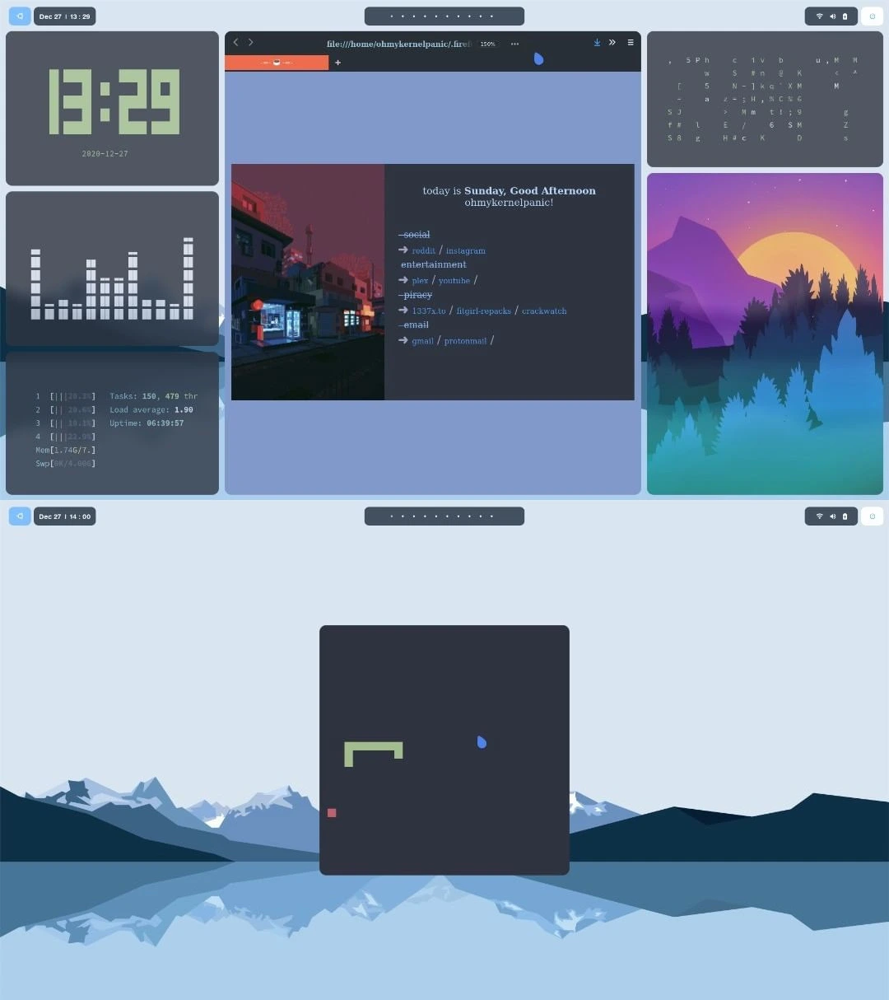
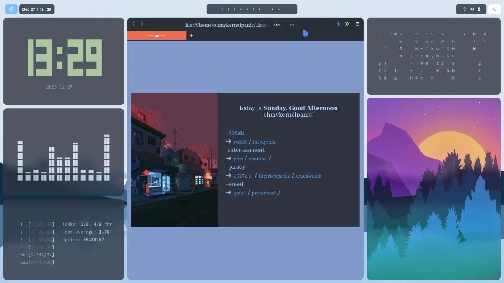
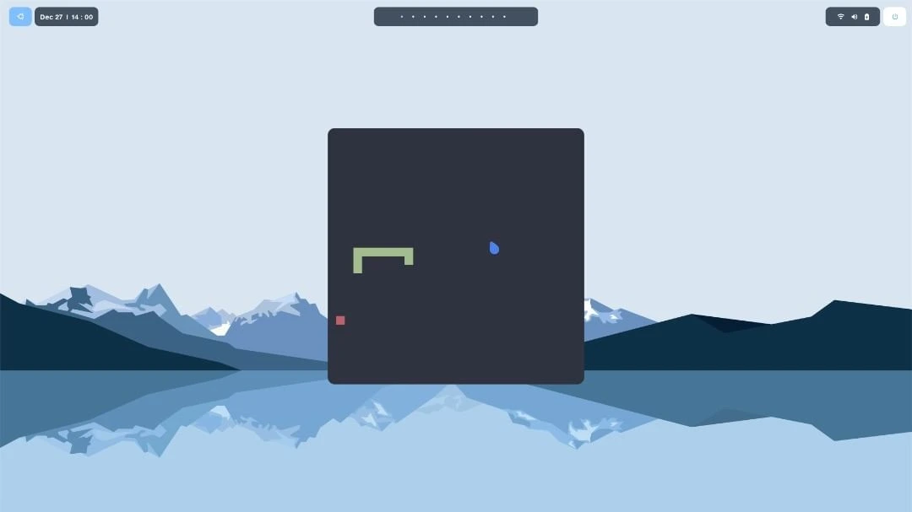

Los gestores de ventanas en mosaico (WM) son muy elogiados en la comunidad Unix por su ligereza, su extremo potencial de personalización y su eficiencia. Al reemplazar los entornos de escritorio tradicionales por una gestión de ventanas controlada por teclado, los desarrolladores pueden lograr un flujo de trabajo altamente optimizado.

Esta guía detalla la configuración paso a paso de un entorno de escritorio personalizado basado en **Pop!_OS** y **BSPWM** (Binary Space Partitioning Window Manager). Basado en la popular paleta de colores **Nórdica**, esta configuración combina una estética minimalista con una potente utilidad.

---

## Muestra del Espacio de Trabajo

Aquí tienes una descripción visual general del entorno finalizado ejecutando varias utilidades del sistema y de la terminal personalizadas:



---

## Arquitectura Central del Sistema

Para replicar este entorno, reemplazamos el escritorio GNOME estándar de Pop!_OS con una configuración modular de utilidades individuales. La siguiente tabla muestra las especificaciones técnicas del entorno:

| Componente | Software / Proyecto | Descripción |
| :--- | :--- | :--- |
| **Sistema Operativo** | <a href="https://pop.system76.com/" target="_blank" rel="noopener noreferrer">Pop!_OS</a> | Distribución Linux estable basada en Debian/Ubuntu |
| **Gestor de Ventanas** | <a href="https://github.com/baskerville/bspwm" target="_blank" rel="noopener noreferrer">BSPWM</a> | Gestor de ventanas en mosaico de particionamiento binario del espacio |
| **Demonio de Atajos de Teclado** | <a href="https://github.com/baskerville/sxhkd" target="_blank" rel="noopener noreferrer">Sxhkd</a> | Demonio simple de atajos de teclado para X |
| **Barra de Estado** | <a href="https://github.com/polybar/polybar" target="_blank" rel="noopener noreferrer">Polybar</a> | Generador de barras de estado rápido y fácil de usar |
| **Compositor X** | <a href="https://github.com/ibhagwan/picom" target="_blank" rel="noopener noreferrer">Picom (fork de ibhagwan)</a> | Compositor con esquinas redondeadas y desenfoque dual-kawase |
| **Lanzador de Aplicaciones** | <a href="https://github.com/davatorium/rofi" target="_blank" rel="noopener noreferrer">Rofi</a> | Cambiador de ventanas, lanzador de aplicaciones y reemplazo de dmenu |
| **Emulador de Terminal** | <a href="https://github.com/alacritty/alacritty" target="_blank" rel="noopener noreferrer">Alacritty</a> | Emulador de terminal acelerado por GPU |
| **Shell y Tema** | <a href="https://ohmyz.sh/" target="_blank" rel="noopener noreferrer">Zsh</a> + <a href="https://github.com/romkatv/powerlevel10k" target="_blank" rel="noopener noreferrer">Powerlevel10k</a> | Entorno de shell interactivo de alto rendimiento |
| **Tema Visual** | <a href="https://www.gnome-look.org/p/1267246/" target="_blank" rel="noopener noreferrer">Nordic Dark GTK</a> | Tema GTK oscuro y limpio inspirado en los colores árticos |
| **Iconos y Cursores** | <a href="https://www.gnome-look.org/s/Gnome/p/1332404" target="_blank" rel="noopener noreferrer">Flattery Dark</a> & <a href="https://www.gnome-look.org/s/Gnome/p/1360254/" target="_blank" rel="noopener noreferrer">Oreo Blue</a> | Iconos planos y punteros de cursor modernos y elegantes |
| **Fuente Principal** | <a href="https://fonts.google.com/specimen/Source+Code+Pro" target="_blank" rel="noopener noreferrer">Source Code Pro</a> | Tipografía monoespaciada optimizada para la legibilidad del código |

---

## Instalación y Compilación Paso a Paso

Esta guía asume que estás comenzando desde una instalación limpia de Pop!_OS. Para garantizar un control absoluto sobre las dependencias y un rendimiento óptimo, compilaremos varios componentes centrales directamente desde el código fuente.

### 1. Sincronización de Repositorios y Paquetes del Sistema

Antes de descargar las dependencias, asegúrate de que la base de datos de paquetes locales esté actualizada y que todos los programas base del sistema estén completamente actualizados:

```shell
sudo apt update
sudo apt upgrade -y
```

### 2. Instalación y Configuración de BSPWM

BSPWM es un gestor de ventanas en mosaico ligero que representa las ventanas como las hojas de un árbol binario completo.

#### Obtención de Dependencias Centrales

Compila y ejecuta BSPWM de forma segura instalando las librerías del sistema y XCB necesarias:

```shell
sudo apt install -y build-essential git vim xcb libxcb-util0-dev libxcb-ewmh-dev libxcb-randr0-dev libxcb-icccm4-dev libxcb-keysyms1-dev libxcb-xinerama0-dev libasound2-dev libxcb-xtest0-dev libxcb-shape0-dev
```

#### Compilación desde el Código Fuente

Clona el repositorio oficial, compila el binario y realiza una instalación a nivel de todo el sistema:

```shell
cd ~/Downloads
git clone https://github.com/baskerville/bspwm.git
cd bspwm
make
sudo make install
```

#### Inicialización de Configuraciones

Establece la estructura de directorios de configuración y copia el script de inicialización por defecto:

```shell
mkdir -p ~/.config/bspwm
cp examples/bspwmrc ~/.config/bspwm/
chmod +x ~/.config/bspwm/bspwmrc
cd ..
```

---

### 3. Configuración del Demonio Simple de Atajos de Teclado para X (sxhkd)

A diferencia de otros gestores de ventanas en mosaico, BSPWM no maneja las entradas de teclado de forma directa. En su lugar, depende de un demonio independiente, **sxhkd**, para vincular las pulsaciones de teclas con los comandos.

#### Compilación de sxhkd

```shell
git clone https://github.com/baskerville/sxhkd.git
cd sxhkd
make
sudo make install
```

#### Configuración de Atajos de Teclado

Crea el directorio de configuración y prepara las definiciones de ejemplo para los atajos de teclado:

```shell
mkdir -p ~/.config/sxhkd
cp ../bspwm/examples/sxhkdrc ~/.config/sxhkd/
cd ..
```

> **Nota de Configuración:** Si modificas `~/.config/sxhkd/sxhkdrc`, verifica que el emulador de terminal definido sea el correcto. Si estás realizando pruebas dentro de un entorno de shell GNOME estándar antes de realizar la transición, ajusta el bloque de comandos de la terminal por defecto para invocar `gnome-terminal`.

---

### 4. Compilación de Polybar para Pantallas de Estado

Polybar es una herramienta altamente modular que genera barras de estado elegantes y personalizables.

#### Obtención de Dependencias de Compilación

```shell
sudo apt install -y cmake cmake-data pkg-config python3-sphinx libcairo2-dev libxcb1-dev libxcb-util0-dev libxcb-randr0-dev libxcb-composite0-dev python3-xcbgen xcb-proto libxcb-image0-dev libxcb-ewmh-dev libxcb-icccm4-dev libxcb-xkb-dev libxcb-xrm-dev libxcb-cursor-dev libasound2-dev libpulse-dev libjsoncpp-dev libmpdclient-dev libcurl4-openssl-dev libnl-genl-3-dev
```

#### Compilación e Instalación

```shell
git clone --recursive https://github.com/polybar/polybar
cd polybar
mkdir build
cd build
cmake ..
make -j$(nproc)
sudo make install
cd ../..
```

---

### 5. Compilación de Picom con Backends Experimentales

Los entornos de escritorio estándar utilizan sistemas de composición para gestionar las ventanas. Para BSPWM, utilizamos un fork personalizado de **Picom** (mantenido por `ibhagwan`) que admite un desenfoque dual-kawase fluido, transparencia en ventanas activas y esquinas redondeadas de ventana muy elegantes.

#### Obtención de Dependencias

```shell
sudo apt install -y meson libxext-dev libxcb1-dev libxcb-damage0-dev libxcb-xfixes0-dev libxcb-shape0-dev libxcb-render-util0-dev libxcb-render0-dev libxcb-randr0-dev libxcb-composite0-dev libxcb-image0-dev libxcb-present-dev libxcb-xinerama0-dev libpixman-1-dev libdbus-1-dev libconfig-dev libgl1-mesa-dev libpcre2-dev libevdev-dev uthash-dev libev-dev libx11-xcb-dev
```

#### Generación del Binario con Ninja

```shell
git clone https://github.com/ibhagwan/picom.git
cd picom
git submodule update --init --recursive
meson --buildtype=release . build
ninja -C build
sudo ninja -C build install
cd ..
```

---

### 6. Componentes Centrales del Escritorio: Rofi y Alacritty

Con la arquitectura central de gestión de ventanas ya instalada, obtenemos nuestro menú de aplicaciones y el entorno principal de la terminal:

```shell
sudo apt install -y rofi alacritty
```

#### Configuración de Personalizaciones

Clonamos el repositorio de dotfiles preconfigurados para extraer nuestras configuraciones personalizadas:

```shell
git clone https://github.com/lukapiplica/nordic-bspwm-dotfiles
mkdir -p ~/.config/alacritty
cp nordic-bspwm-dotfiles/alacritty/alacritty.yml ~/.config/alacritty/
```

> **Consejo de Aceleración por Hardware:** Si encuentras el error `GLSL 3.30 is not supported` en tarjetas gráficas antiguas o entornos virtuales, fuerza la rasterización por software modificando el archivo de configuración de escritorio de Alacritty:
>
> ```shell
> sudo nano /usr/share/applications/com.alacritty.Alacritty.desktop
> ```
> Reemplaza la línea `Exec=alacritty` por `Exec=bash -c "LIBGL_ALWAYS_SOFTWARE=1 alacritty"`.

---

## Pulido de la Interfaz y Ajuste del Entorno

Ahora configuramos ZSH, los temas, las fuentes, los fondos de pantalla y las pantallas de bloqueo para unificar la estética del espacio de trabajo Nórdico.

### 1. Tipografía y Caché de Fuentes

Inyecta la tipografía monoespaciada principal para el código para garantizar la correcta renderización de los símbolos y los glifos de la terminal:

```shell
sudo cp -r ~/Downloads/nordic-bspwm-dotfiles/Source_Code_Pro /usr/share/fonts/
fc-cache -fv
```

### 2. Configuración de Fondos de Pantalla Mediante Feh

Para gestionar la colocación del fondo de pantalla de forma programada al iniciar sesión, instala la utilidad de línea de comandos **feh**:

```shell
sudo apt install feh -y
mkdir -p ~/Wall
cp -r ~/Downloads/nordic-bspwm-dotfiles/Wallpapers/ ~/Wall/
```

Inyecta el comando de inicio para el fondo en tu `bspwmrc` para que se ejecute al inicializar el gestor de ventanas:

```shell
echo 'feh --bg-fill $HOME/Wall/Wallpapers/wallpaper2.jpeg &' >> ~/.config/bspwm/bspwmrc
```

### 3. Activación de Temas Personalizados de Polybar

Exporta nuestras configuraciones personalizadas de Polybar y copia las fuentes TrueType requeridas para admitir los iconos de la barra de estado:

```shell
mkdir -p ~/.config/polybar
cp -r ~/Downloads/nordic-bspwm-dotfiles/polybar/* ~/.config/polybar/
echo '~/.config/polybar/./launch.sh &' >> ~/.config/bspwm/bspwmrc
sudo cp ~/.config/polybar/fonts/* /usr/share/fonts/truetype/
fc-cache -fv
```

### 4. Optimización de la Shell Interactiva (ZSH y Powerlevel10k)

Cambia el entorno de la shell por defecto de la Bash estándar a ZSH, luego descarga el framework **Oh-My-ZSH**:

```shell
sudo apt install zsh -y
sh -c "$(curl -fsSL https://raw.github.com/ohmyzsh/ohmyzsh/master/tools/install.sh)"
```

#### Aplicación del Prompt Powerlevel10k

```shell
git clone --depth=1 https://github.com/romkatv/powerlevel10k.git ${ZSH_CUSTOM:-$HOME/.oh-my-zsh/custom}/themes/powerlevel10k
```

Modifica la configuración del entorno:
1. Abre el perfil de tu terminal (`nano ~/.zshrc`).
2. Establece la línea del tema activo en: `ZSH_THEME="powerlevel10k/powerlevel10k"`.
3. Guarda y cierra. Ejecuta `source ~/.zshrc` o escribe `p10k configure` para avanzar por el asistente de configuración visual.

### 5. Desarrollo en Vim: Integración de Temas Nórdicos

Porta la matriz de color Nórdica a Vim e instala la utilidad estética de estado **Vim-Airline**:

```shell
mkdir -p ~/.vim/colors
cp ~/Downloads/nordic-bspwm-dotfiles/nord.vim ~/.vim/colors/
```

Clona la extensión Airline:

```shell
git clone https://github.com/vim-airline/vim-airline.git ~/Downloads/vim-airline
cp -r ~/Downloads/vim-airline/* ~/.vim/
```

Activa las reglas de configuración en tu perfil del editor:

```shell
echo 'colorscheme nord' >> ~/.vimrc
echo "let g:airline_theme='base16'" >> ~/.vimrc
```

### 6. Personalización del Menú de Aplicaciones Rofi

Copia el archivo del tema Nord y configúralo como la interfaz principal:

```shell
mkdir -p ~/.config/rofi/themes
cp ~/Downloads/nordic-bspwm-dotfiles/nord.rasi ~/.config/rofi/themes/
rofi-theme-selector
```

> **Activación del Tema:** Navega hasta el `Nord theme` dentro del selector, presiona **Enter** para la vista previa y aplícalo globalmente presionando **Alt + a**.
>
> Para vincular Rofi como nuestro lanzador de aplicaciones predeterminado, actualiza tus atajos de teclado:
> ```shell
> nano ~/.config/sxhkd/sxhkdrc
> ```
> Modifica la combinación de teclas para el lanzamiento de aplicaciones cambiando `dmenu_run` por `rofi -show drun`.

---

## Productividad en el Espacio de Trabajo y Utilidades CLI

Para construir una estación de trabajo de desarrollo completamente funcional, instalamos varios programas de línea de comandos y utilidades visuales que poblarán nuestros espacios de trabajo personalizados.



### Instalación de la Suite CLI Personalizada

Instala visualizadores modernos, monitores de hardware del sistema y gestores de archivos utilizando los repositorios de paquetes estándar:

```shell
# Monitor de sistema (Htop)
sudo apt install htop -y

# Efecto de pantalla lluvia de Matrix (Cmatrix)
sudo apt install cmatrix -y

# Visor de imágenes minimalista (Sxiv)
sudo apt install sxiv -y

# Navegador de archivos para la terminal (Ranger)
sudo apt install ranger -y

# Reloj digital para la terminal (Tty-clock)
sudo apt install tty-clock -y
```

### Visualizadores Avanzados y Motores de Información del Sistema

#### CAVA (Console-based Audio Visualizer)

Compila CAVA para generar visualizadores de barras basados en las señales de entrada de ALSA/PulseAudio en tiempo real:

```shell
sudo add-apt-repository ppa:hsheth2/ppa -y
sudo apt update
sudo apt install cava -y
```

#### pfetch (Extractor de Información del Sistema Minimalista)

```shell
git clone https://github.com/dylanaraps/pfetch.git ~/Downloads/pfetch
sudo install ~/Downloads/pfetch/pfetch /usr/local/bin/
```

#### Chafa (Motor de Arte con Caracteres para la Terminal)

Chafa analiza imágenes estándar y las transforma en arte de caracteres altamente detallado renderizado directamente en la terminal:

```shell
git clone https://github.com/hpjansson/chafa.git ~/Downloads/chafa
cd ~/Downloads/chafa
./autogen.sh
make
sudo make install
cd ~
```

#### Snake (Recreación de un Clásico en la Terminal)

Recrea el clásico juego de la serpiente de Nokia utilizando las librerías de python-pygame:

```shell
sudo apt install python3-pip -y
python3 -m pip install -U pygame --user
git clone https://github.com/Unixado/Snake.git ~/Downloads/Snake
```

Ejecuta el juego directamente desde las sesiones de la terminal:

```shell
python3 ~/Downloads/Snake/src/game.py
```



#### Lollypop (Reproductor de Audio Moderno para el Escritorio)

```shell
sudo add-apt-repository ppa:gnumdk/lollypop -y
sudo apt update
sudo apt install lollypop -y
```

---

## Personalización Estética de GTK y Firefox

Para que la interfaz de un sistema operativo se sienta unificada, tanto las aplicaciones como los navegadores web deben compartir el mismo esquema de color.

### 1. Integración de la Interfaz de Escritorio a través de Lxappearance

Para cargar y asignar estilos de widgets personalizados, paquetes de iconos y cursores en gestores de ventanas ligeros, instala LXAppearance:

```shell
sudo apt install lxappearance -y
```

Abre `lxappearance` para seleccionar y aplicar los componentes de diseño Nórdicos descargados:
* **Estilo de Diseño GTK:** <a href="https://www.gnome-look.org/p/1267246/" target="_blank" rel="noopener noreferrer">Nordic Dark theme</a>
* **Librería de Iconos:** <a href="https://www.gnome-look.org/s/Gnome/p/1332404" target="_blank" rel="noopener noreferrer">Flattery Dark icons</a>
* **Paquete de Puntero del Ratón:** <a href="https://www.gnome-look.org/s/Gnome/p/1360254/" target="_blank" rel="noopener noreferrer">Oreo Blue cursor</a>

### 2. Tematizado Minimalista del Navegador (Firefox y Minimal Functional Fox)

Descarga la configuración personalizada y minimalista de userChrome para eliminar las barras de título estándar, centrar los elementos web y hacer que los bordes del navegador coincidan con la paleta de colores Nórdica:

```shell
sh -c "$(curl -fsSL https://raw.githubusercontent.com/mut-ex/minimal-functional-fox/master/install.sh)"
cp -r ~/Downloads/nordic-bspwm-dotfiles/.firefoxthemes ~/
```

1. Lanza **Firefox**.
2. Navega a **Ajustes > Inicio** (o Preferencias > Inicio).
3. Busca **Página de inicio y nuevas ventanas**, selecciona **URLs personalizadas** e introduce la ruta de destino que apunta a tu página de inicio local:
   `file:///home/<TU_USUARIO>/.firefoxthemes/startpage/Startpage/index.html`
4. Reinicia la aplicación para inicializar los cambios de diseño.

---

## Atajos de Teclado y Navegación de Escritorio

Los gestores de ventanas en mosaico (tiling) optimizan la productividad al mantener tus manos en la fila principal del teclado. La tecla Windows/Super (`super`) está configurada como la tecla modificadora principal.

A continuación se muestra la lista de referencia estándar de los atajos de teclado predeterminados y personalizados:

| Combinación de Teclas | Acción / Evento Destinado |
| :--- | :--- |
| <kbd>super + Enter</kbd> | Lanza una instancia de la terminal Alacritty acelerada por GPU |
| <kbd>super + Space</kbd> | Abre el menú de aplicaciones Rofi para lanzar herramientas GUI |
| <kbd>super + Escape</kbd> | Recarga las reglas de configuración de sxhkd al instante |
| <kbd>super + Alt + r</kbd> | Reinicia el gestor de ventanas BSPWM |
| <kbd>super + w</kbd> | Destruye/cierra la ventana activa en foco |
| <kbd>super + [1-0]</kbd> | Navega entre los espacios de trabajo del 1 al 10 |
| <kbd>super + g</kbd> | Intercambia la ventana enfocada con el marco maestro principal |
| <kbd>super + m</kbd> | Alterna la maximización a pantalla completa |
| <kbd>super + [h,j,k,l]</kbd> | Mueve el foco de la ventana direccionalmente (Izquierda, Abajo, Arriba, Derecha) |
| <kbd>super + Alt + [h,j,k,l]</kbd> | Expande el borde de la ventana enfocada hacia afuera |
| <kbd>super + Alt + Shift + [h,j,k,l]</kbd> | Contrae el borde de la ventana enfocada hacia adentro |
| <kbd>super + s</kbd> | Alterna el modo flotante en la ventana seleccionada |
| <kbd>super + Ctrl + [Teclas de Dirección]</kbd> | Mueve una ventana flotante a través de las coordenadas |

---

## Conclusión y Retrospectiva Profesional

Reconstruir un entorno de escritorio a partir de utilidades CLI modulares demuestra la flexibilidad y profundidad de los sistemas basados en Linux. Más allá del diseño Nórdico limpio y minimalista, este espacio de trabajo con BSPWM y Pop!_OS ofrece ventajas de rendimiento significativas: reducción del uso de CPU/memoria, control absoluto sobre el mapeo de atajos de teclado y un entorno altamente receptivo adaptado para flujos avanzados de desarrollo de software.

*Ya seas desarrollador, administrador de sistemas o entusiasta de Linux, diseñar tu propio espacio de trabajo guiado por teclado es una inversión muy gratificante para tu experiencia de desarrollo diaria y tu eficiencia operativa.*
