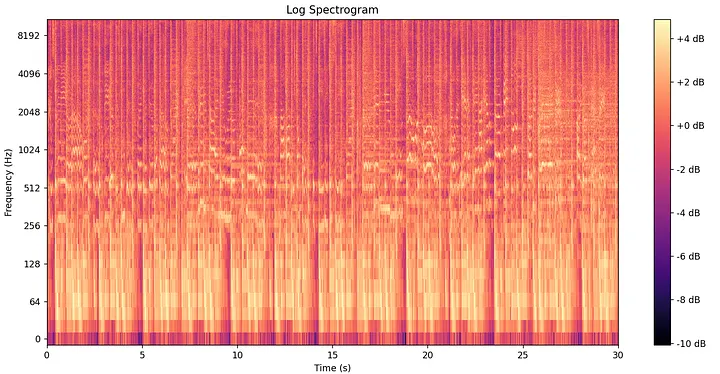
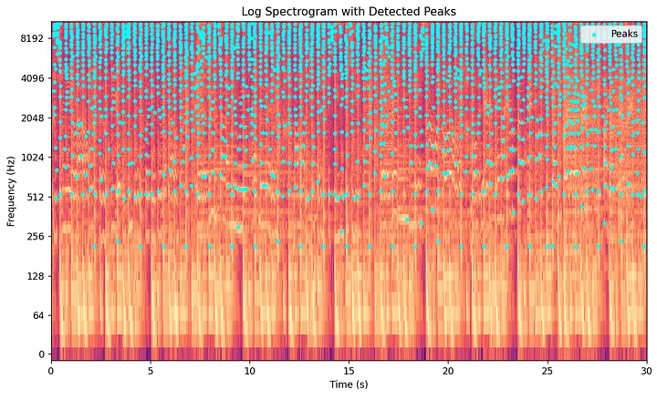
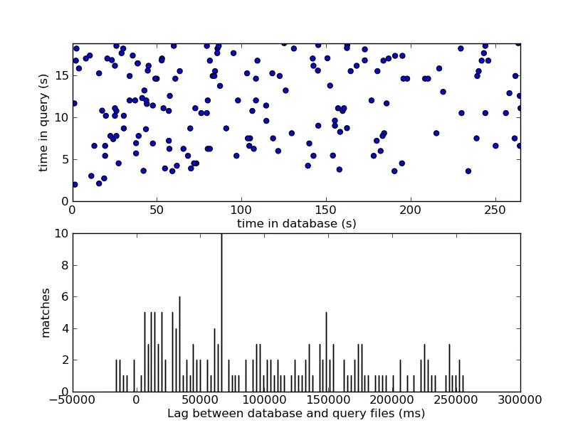

Estás sentado en una cafetería. Una canción se escucha a través de los altavoces; sabes que la conoces, pero el nombre se te ha ido por completo. Sacas tu teléfono, tocas **Shazam** y, en menos de cinco segundos, te dice la pista exacta, el artista y el álbum. Sin escribir la letra, sin tararear, sin buscar. Solo audio puro capturado en una habitación ruidosa.

Esto parece magia. No lo es. Detrás de ese toque se encuentra uno de los algoritmos más elegantes de la matemática aplicada: un sistema construido a partir del **procesamiento de señales**, el **hashing combinatorio** y el **emparejamiento probabilístico** que funciona de manera confiable incluso con ruido de fondo, micrófonos deficientes y grabaciones recortadas. Así es como funciona.

---

## Una breve historia: De una epifanía en un pub a la adquisición de Apple

La historia comienza en **1999**, cuando <a href="https://www.chrisjbarton.com/" target="_blank" rel="noopener noreferrer">Chris Barton</a> —un estudiante de MBA en la <a href="https://www.berkeley.edu/" target="_blank" rel="noopener noreferrer">UC Berkeley</a>— se encontró frustrado en un bar de Londres, incapaz de identificar una canción que sonaba por los altavoces. Tuvo una idea simple pero radical: ¿y si un teléfono pudiera hacerlo por ti, solo con el sonido del ambiente?

Barton cofundó **Shazam Entertainment Ltd** junto a Philip Inghelbrecht y Dhiraj Mukherjee. La contratación crucial llegó cuando el <a href="https://ccrma.stanford.edu/~jos/" target="_blank" rel="noopener noreferrer">profesor Julius Smith</a> de Stanford los orientó hacia <a href="https://www.ee.columbia.edu/~dpwe/papers/Wang03-shazam.pdf" target="_blank" rel="noopener noreferrer">Avery Wang</a>, un doctorado en procesamiento de señales digitales. El veredicto inicial de Wang sobre el proyecto fue contundente: *"Es imposible"*. Los desafíos eran sustanciales: el sistema necesitaba reconocer música en tiempo real, a través del ruido ambiental, a una escala de millones de canciones, y sobre los canales de audio de notoriamente baja calidad de los primeros teléfonos móviles.

Wang estuvo a punto de rendirse. Luego, en junio de 2000, lo descifró, inventando el sistema de huellas digitales que impulsa a Shazam hasta el día de hoy.

En **2002**, el servicio se lanzó en el Reino Unido, no como una aplicación, sino como un número de teléfono de cuatro dígitos (`2580`). Los usuarios llamaban al número, acercaban su teléfono a un altavoz y recibían un mensaje de texto identificando la canción. La elección de `2580` fue intencionada: estas teclas están dispuestas en una línea vertical recta en el centro del teclado de un teléfono móvil antiguo, lo que hacía que fuera increíblemente fácil de marcar mientras te movías en un pub ruidoso. La base de datos en el lanzamiento contenía un millón de canciones y tardaba unos 15 segundos en responder. 

Cuando Apple lanzó la App Store en 2008, todo cambió de la noche a la mañana. Shazam fue una de las primeras aplicaciones disponibles y la fricción desapareció por completo. Para 2022, la aplicación se había descargado más de **2.000 millones de veces**. Apple anunció formalmente su acuerdo para adquirir Shazam en diciembre de 2017, cerrando oficialmente el trato en septiembre de 2018 por un valor estimado de **400 millones de dólares**.

El algoritmo publicado por Avery Wang en su emblemático **artículo de 2003** — <a href="https://www.ee.columbia.edu/~dpwe/papers/Wang03-shazam.pdf" target="_blank" rel="noopener noreferrer">"An Industrial-Strength Audio Search Algorithm"</a> — sigue siendo la arquitectura fundacional del sistema en la actualidad.

---

## El problema central: Por qué el reconocimiento de audio es difícil

Antes de examinar la solución, vale la pena entender con precisión por qué reconocer una canción a partir de una muestra ruidosa de 10 segundos es un problema computacional difícil.

**El desafío es de triple naturaleza:**

1. **Escala.** La base de datos de Shazam contiene cientos de millones de canciones. La huella digital de una muestra debe compararse con todo este catálogo en cuestión de segundos.
2. **Ruido.** El audio capturado contiene conversaciones de fondo, la acústica de la habitación, la compresión de un micrófono de baja calidad y artefactos de transmisión; nada de esto está presente en la grabación de estudio original en la base de datos.
3. **Desplazamiento temporal.** La muestra podría tomarse de *cualquier* punto de la canción (el inicio, el puente, el final), por lo que el emparejamiento no puede depender de la posición absoluta dentro de la pista.

Un enfoque ingenuo —comparar formas de onda en bruto— fallaría instantáneamente en las tres pruebas. La forma de onda de tu muestra grabada y la forma de onda de la pista de estudio son simplemente demasiado diferentes para correlacionarse directamente. Se necesita una representación más inteligente del audio.

---

## Paso 1: Captura y optimización de la señal

Cuando tocas Shazam, la aplicación graba una **muestra de audio de 5 a 10 segundos** a través del micrófono de tu dispositivo. Este sonido analógico —una onda de presión continua que viaja a través del aire— se convierte en una señal digital mediante un proceso llamado **conversión analógica-digital (ADC)**.

Mientras que el audio de alta fidelidad estándar se graba normalmente a **44.100 muestras por segundo** (44,1 kHz), Shazam emplea una ingeniosa estrategia de diezmado (downsampling) y optimización para ahorrar memoria y potencia de procesamiento. El audio entrante se remuestrea a **8 kHz** (o a veces a 11 kHz) y se convierte de estéreo a un único **canal mono** antes de que ocurra cualquier otro procesamiento matemático.

¿Por qué funciona tan bien esta optimización? El oído humano se extiende hasta los 20 kHz, pero la gran mayoría de las características "energéticas" únicas que distinguen a la música popular —como las voces, los transitorios de percusión y las estructuras armónicas dominantes— se encuentran cómodamente por debajo de los 4 kHz. Según el **<a href="https://es.wikipedia.org/wiki/Teorema_de_muestreo_de_Nyquist-Shannon" target="_blank" rel="noopener noreferrer">teorema de muestreo de Nyquist-Shannon</a>**, una frecuencia de muestreo de 8 kHz es matemáticamente suficiente para capturar y reconstruir perfectamente todas las frecuencias hasta los 4 kHz. Este paso de optimización comprime drásticamente el volumen de datos que el algoritmo debe procesar cada segundo sin perder las características vitales necesarias para la identificación.

---

## Paso 2: La Transformada de Fourier — Descomponiendo el sonido en frecuencias

La herramienta matemática fundamental que hace posible a Shazam es la **<a href="https://es.wikipedia.org/wiki/Transformada_de_Fourier_discreta" target="_blank" rel="noopener noreferrer">Transformada Discreta de Fourier (DFT)</a>**, implementada en la práctica a través de la **<a href="https://es.wikipedia.org/wiki/Transformada_r%C3%A1pida_de_Fourier" target="_blank" rel="noopener noreferrer">Transformada Rápida de Fourier (FFT)</a>**, la cual está optimizada computacionalmente.

La DFT toma una señal en el dominio del tiempo —una secuencia de amplitudes— y la descompone en sus componentes de frecuencia constituyentes. En términos sencillos: no te dice *qué tan fuerte* es el sonido en un momento dado, sino *qué frecuencias* están presentes y con qué intensidad.

Matemáticamente, la DFT de una señal $x[n]$ de longitud $N$ se expresa bellamente en formato LaTeX como:

$$X[k] = \sum_{n=0}^{N-1} x[n] \cdot e^{-j\frac{2\pi}{N}kn}$$

Donde:
- $x[n]$ es la señal de entrada en el dominio del tiempo (amplitud en la muestra $n$)
- $X[k]$ es la salida compleja en el dominio de la frecuencia en el contenedor de frecuencia (frequency bin) $k$
- $e^{-j\frac{2\pi}{N}kn}$ es una exponencial compleja que representa un vector unitario en rotación
- $|X[k]|$ da la **magnitud** (amplitud) en la frecuencia $k$

La FFT calcula esta transformada en un tiempo de $O(N \log N)$ en lugar del enfoque ingenuo de $O(N^2)$, lo que hace que el procesamiento de audio en tiempo real sea altamente viable en hardware de consumo.

El problema con una sola FFT aplicada a toda la muestra es que la música **no es estacionaria**: las frecuencias cambian dinámicamente con el tiempo. Una sola FFT te diría que una guitarra, un piano y un bajo están presentes en algún lugar, pero perdería por completo el contexto temporal de *cuándo* ocurre cada nota.

---

## Paso 3: La Transformada de Fourier de Tiempo Reducido y el Espectrograma

Para capturar cómo evolucionan las frecuencias a lo largo del tiempo, Shazam aplica la **<a href="https://es.wikipedia.org/wiki/Transformada_de_Fourier_de_Tiempo_Reducido" target="_blank" rel="noopener noreferrer">Transformada de Fourier de Tiempo Reducido (STFT)</a>**. En lugar de ejecutar una sola FFT masiva sobre todo el fragmento, el algoritmo desliza una pequeña **ventana de análisis** —típicamente de 10 a 30 milisegundos de ancho— a lo largo de la señal y calcula una FFT en cada intervalo discreto.

El resultado es una representación en 2D:
- **Eje horizontal:** Tiempo (cada posición de la ventana)
- **Eje vertical:** Frecuencia (cada contenedor de frecuencia de la FFT)
- **Color/intensidad:** Amplitud (magnitud de esa frecuencia en ese momento determinado)

Esta estructura en 2D se denomina **<a href="https://es.wikipedia.org/wiki/Espectrograma" target="_blank" rel="noopener noreferrer">espectrograma</a>**, y sirve como el paisaje central para la generación de huellas digitales.



Para evitar un artefacto conocido como **<a href="https://es.wikipedia.org/wiki/Manchado_espectral" target="_blank" rel="noopener noreferrer">dispersión espectral (spectral leakage)</a>** —donde la energía de un contenedor de frecuencia definido se "filtra" hacia los contenedores vecinos debido a los cortes abruptos de una ventana rectangular— la STFT aplica una función de **<a href="https://es.wikipedia.org/wiki/Ventana_(funci%C3%B3n)#Hamming" target="_blank" rel="noopener noreferrer">ventana de Hamming</a>**. Esta curva de campana suave atenúa los bordes de cada trama de análisis. La ventana de Hamming $w[n]$ se define matemáticamente como:

$$w[n] = 0.54 - 0.46 \cdot \cos\left(\frac{2\pi n}{N-1}\right)$$

El espectrograma de una canción captura su cuadrícula completa de huella acústica. Sin embargo, comparar matrices en bruto en una base de datos de millones de canciones seguiría siendo computacionalmente insostenible. Se requiere una mayor abstracción.

---

## Paso 4: El mapa de constelaciones — Extrayendo picos espectrales

Aquí es donde brilla la idea central de Avery Wang. La mayor parte de un espectrograma consiste en ruido de fondo, reverberación y elementos de relleno de baja energía. Los componentes acústicamente *significativos* de la música —el impacto transitorio de un bombo, el inicio de un acorde de guitarra o el pico de una melodía vocal— se manifiestan como **máximos locales** en el espectrograma. Estos son puntos que son más intensos que todos sus vecinos inmediatos tanto en el tiempo como en la frecuencia.

El algoritmo de Shazam identifica estos **picos espectrales** y descarta todo lo demás. Un pico es un punto $(t, f)$ cuya magnitud $|X(t, f)|$ supera a la de todos sus vecinos dentro de una región local definida en la cuadrícula bidimensional de tiempo-frecuencia.

Esto reduce el denso espectrograma a un gráfico de dispersión disperso de pares de coordenadas. Debido a que este gráfico de dispersión se asemeja a las estrellas en el cielo nocturno, se le conoce formalmente como un **mapa de constelaciones**.



Este paso proporciona una potente resistencia al ruido. Las conversaciones de fondo o las distorsiones de los altavoces de baja calidad distribuyen la energía de manera uniforme y a niveles más bajos a lo largo de la cuadrícula del espectrograma. Rara vez generan los picos locales dominantes y concentrados que se requieren para superar el umbral. Los picos espectrales que sobreviven son los elementos acústicamente más fuertes, lo que permite que Shazam funcione incluso en un bar caótico. Además, almacenar solo las coordenadas de los picos en lugar de las matrices completas del espectrograma comprime la capacidad de almacenamiento requerida en varios órdenes de magnitud.

---

## Paso 5: Hashing combinatorio — Convirtiendo puntos en huellas digitales

Un solo punto aislado en un mapa de constelaciones tiene muy poca entropía. Una frecuencia de 1.400 Hz ocurre en miles de pistas diferentes. Lo que hace que una firma de audio sea altamente distintiva es su **relación combinatoria con los puntos circundantes**.

Para desbloquear esta especificidad, el algoritmo de Shazam empareja cada **punto de anclaje (anchor point)** con múltiples **puntos objetivos (target points)** que caen dentro de una "zona objetivo" de tiempo-frecuencia predefinida y ubicada delante de él. Para cada par único de anclaje-objetivo, calcula un **hash** compacto y altamente discriminativo a partir de tres variables estructurales:

```
hash = (f_anchor, f_target, Δt)
```

Donde:
- `f_anchor` es la frecuencia del pico de anclaje
- `f_target` es la frecuencia del pico objetivo
- `Δt = t_target − t_anchor` es la diferencia de tiempo precisa entre ambos

Para maximizar el rendimiento de la base de datos a nivel de procesador, Wang utilizó una elegante estrategia de empaquetado de bits para codificar todo este triplete en un único **entero sin signo de 32 bits (`uint32`)**:
- **Frecuencia del anclaje ($f_A$):** 9 bits (asignando 512 contenedores de frecuencia distintos)
- **Frecuencia del objetivo ($f_T$):** 9 bits (asignando 512 contenedores de frecuencia distintos)
- **Diferencia de tiempo ($\Delta t$):** 14 bits
- **Total:** $9 + 9 + 14 = 32$ bits

Esta estructura de enteros de 32 bits permite que la base de datos del sistema realice búsquedas de igualdad ultrarrápidas a nivel de hardware. Estos hashes se almacenan en una enorme **tabla de hash (hash table)**, indexada por el propio valor del hash. Cada entrada apunta directamente a la identificación de la pista correspondiente y a la marca de tiempo absoluta en la que ocurrió el punto de anclaje en la versión de estudio:

```
hash → { track_id, t_anchor }
```

Debido a que el hash solo captura la diferencia de tiempo *relativa* ($\Delta t$) entre los dos picos en lugar de una ubicación en una línea de tiempo absoluta, la huella digital resultante es completamente **invariante a la traslación**. Una muestra grabada desde el puente de una pista producirá hashes idénticos a los indexados a partir de ese segmento exacto en la base de datos maestra.

---

## Paso 6: Emparejamiento probabilístico y alineación de desplazamiento temporal

Cuando un usuario activa Shazam, la aplicación construye un mapa de constelaciones en tiempo real y extrae un conjunto de hashes de consulta utilizando exactamente este mismo proceso. Luego, consulta la base de datos central en busca de coincidencias.

Debido a que los hashes individuales de 32 bits aún pueden colisionar en una base de datos enorme, una sola coincidencia no demuestra nada. El ingrediente secreto del motor de emparejamiento radica en la **alineación coherente de los desplazamientos temporales**.

Por cada coincidencia de hash encontrada entre la muestra de consulta y una pista candidata de la base de datos, el motor calcula el *desplazamiento (offset)* temporal entre la aparición del hash en la muestra del usuario frente a su aparición en la pista de estudio:

$$\text{offset} = t_{\text{database}} - t_{\text{query}}$$

Si la muestra de consulta pertenece genuinamente a una pista candidata específica, *cada una de las coincidencias de hash supervivientes* de esa muestra debe arrojar **exactamente el mismo valor de desplazamiento**, ya que todas conservan su espaciado relativo de la grabación original. Por el contrario, las colisiones aleatorias de pistas incorrectas generarán desplazamientos no correlacionados y caóticos, dispersos uniformemente a lo largo de la línea de tiempo.

El sistema construye un histograma de estos desplazamientos calculados para cada ID de pista candidata y busca un **pico nítido e innegable en el histograma**. 

Encontrar un pico en el histograma es una aproximación discreta de identificar una línea diagonal en un gráfico bidimensional donde un eje representa el tiempo de la base de datos ($t_{\text{database}}$) y el otro representa el tiempo de la consulta ($t_{\text{query}}$). Si los puntos coincidentes se alinean perfectamente a lo largo de una línea diagonal de 45 grados (una pendiente de $+1$), se confirma que ambas fuentes de audio progresan exactamente a la misma velocidad. Un grupo significativo de puntos que coinciden en un desplazamiento constante fijo ($t_{\text{database}} - t_{\text{query}} = \text{constante}$) proporciona una señal estadísticamente abrumadora que supera por completo el ruido de fondo.



---

## La probabilidad detrás de la magia

Hagamos que la resistencia al ruido sea matemáticamente explícita. Supongamos que un pico espectral dado tiene una probabilidad $p$ de sobrevivir a un entorno de grabación ruidoso. Para que un hash combinatorio se genere con éxito, tanto su pico de anclaje como su pico objetivo deben sobrevivir. La probabilidad conjunta de que un solo hash sobreviva es:

$$P(\text{el hash sobrevive}) = p^2$$

Aunque $p^2 < p$ representa un sacrificio en la tasa de supervivencia bruta para los hashes individuales, la compensación vale la pena exponencialmente durante la búsqueda. Una sola coincidencia de un hash emparejado que sobreviva con la alineación temporal adecuada es enormemente más específica que un pico aislado. El algoritmo está diseñado estructuralmente para requerir solo una **pequeña fracción** del total de hashes de una canción para establecer una coincidencia indiscutible, lo que le permite recuperar audio degradado de manera fluida.

---

## Glosario Técnico

| Término | Definición |
| :--- | :--- |
| **ADC** | Conversión Analógica-Digital — transforma una onda de sonido continua en muestras digitales discretas |
| **Teorema de Nyquist** | Establece que una señal debe ser muestreada al doble de su frecuencia más alta para ser reconstruida fielmente |
| **FFT** | Transformada Rápida de Fourier — un algoritmo de complejidad $O(N \log N)$ para descomponer una señal en componentes de frecuencia |
| **STFT** | Transformada de Fourier de Tiempo Reducido — aplica la FFT sobre ventanas deslizantes para capturar el contenido de frecuencia que varía con el tiempo |
| **Espectrograma** | Una representación bidimensional de tiempo-frecuencia-amplitud de una señal de audio |
| **Ventana de Hamming** | Una función de atenuación suave aplicada a cada trama de la STFT para reducir la dispersión espectral (spectral leakage) |
| **Pico Espectral** | Un máximo local en el espectrograma — un punto cuya amplitud supera a la de todos sus vecinos en una región definida |
| **Mapa de Constelaciones** | Un conjunto disperso de coordenadas de picos espectrales que forma la base para la generación de huellas digitales |
| **Hash Combinatorio** | Un hash de 32 bits que codifica $(f_{\text{anchor}}, f_{\text{target}}, \Delta t)$ — la unidad central de la huella digital |
| **Alineación de Desplazamiento Temporal** | La técnica de emparejamiento que agrupa los desplazamientos de las coincidencias de hash para confirmar una identificación de canción coherente |
| **Invarianza a la Traslación** | La propiedad de que la huella digital es independiente del punto de la canción donde comienza la muestra |

---

## "Sin Aprendizaje Automático" — Una nota para romper mitos en 2026

El algoritmo clásico de Avery Wang es una obra maestra del procesamiento de señales puro y determinista en 1D/2D y del hashing rápido. No contiene redes neuronales, ni pesos, ni modelos de entrenamiento de aprendizaje automático (machine learning). 

Sin embargo, al observar la arquitectura desde una **perspectiva de 2026**, vale la pena añadir una pequeña nota a pie de página moderna. Si bien el marco central de emparejamiento y la indexación de huellas digitales siguen anclados a estos mismos principios matemáticos, el Shazam moderno (que opera bajo el ecosistema de Apple) ha evolucionado hacia un sistema híbrido. Modelos de aprendizaje profundo (Deep Learning) ligeros y altamente optimizados —específicamente **Redes Neuronales Convolucionales (CNN)**— se implementan con frecuencia en la fase inicial de ingesta. Estos modelos neuronales sirven como filtros front-end ultraeficientes para eliminar el ruido extremo de las cafeterías externas, aislar las voces o realizar la separación de fuentes *antes* de que el audio entre en la fase de mapeo de constelaciones. 

Incluso con las adiciones de la IA moderna, el esfuerzo principal, la velocidad de emparejamiento y la confiabilidad última del sistema siguen basándose completamente en los hermosos fundamentos matemáticos establecidos hace más de dos décadas. La próxima vez que toques ese botón, estarás viendo cómo la transformada de Fourier ejecuta algo verdaderamente atemporal.