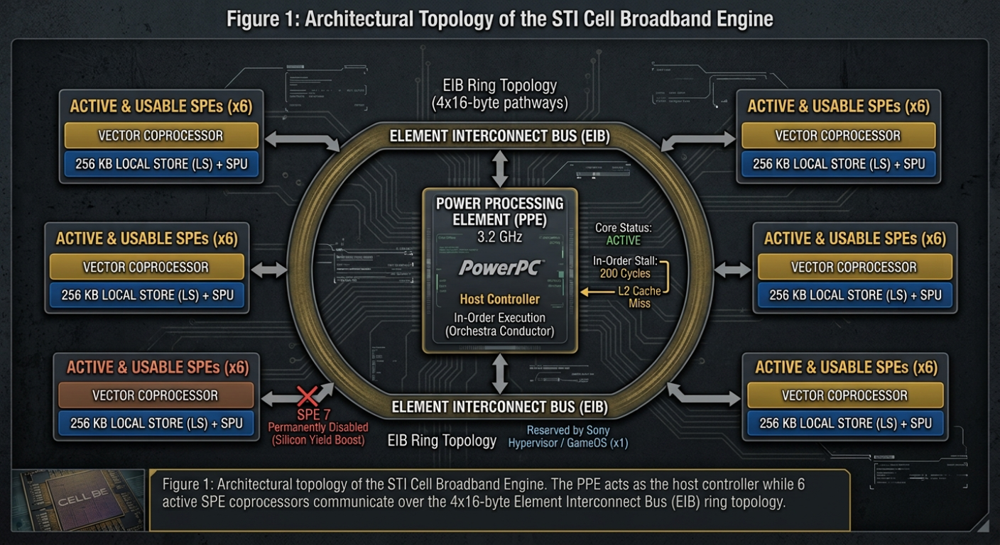
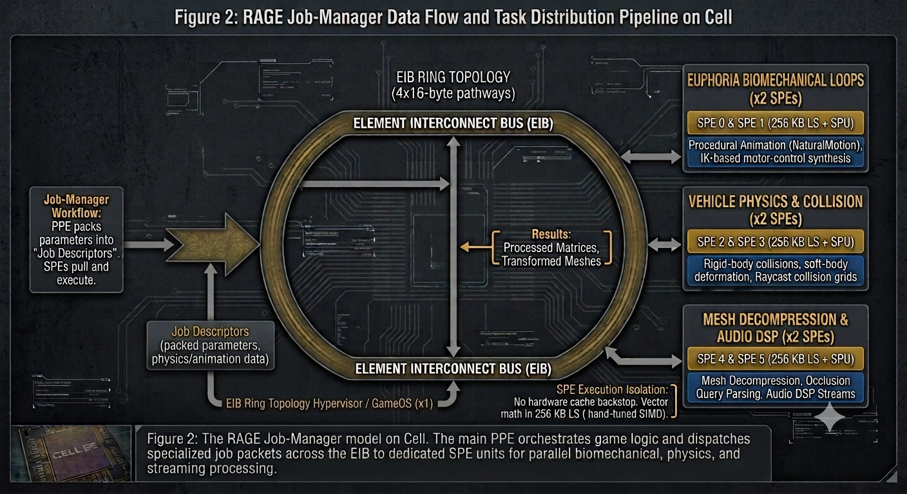
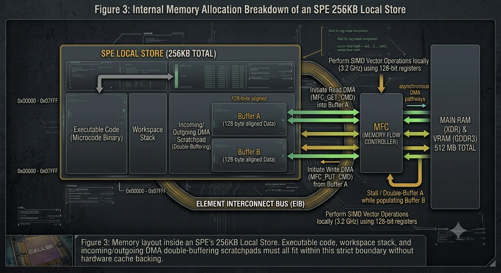
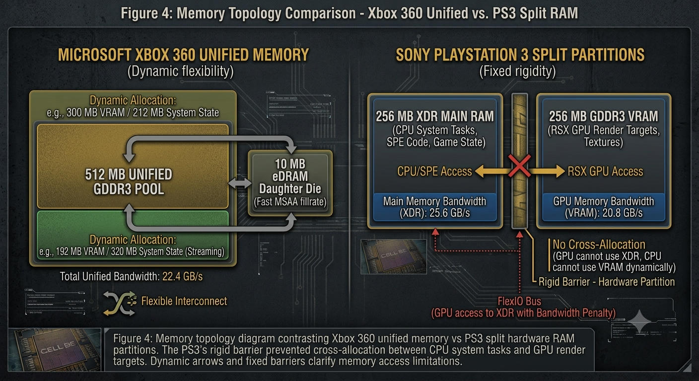
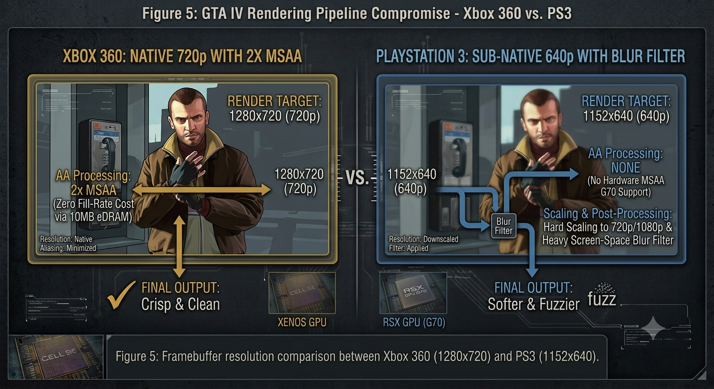

import { Alert } from '@/components/ui/feedback/Alert';
import CodeBlock from '../../../components/ui/content/CodeBlock/CodeBlock.astro';

2005年に発表され、2006年11月に発売されたソニーのPlayStation 3には、IBMおよび東芝と共同で4億ドルを投じて開発されたCell Broadband Engineが搭載されていました。テラフロップ級の浮動小数点演算スループット、リアルタイムのスーパーコンピューティング、そして完全な世代的優位性を謳い文句にしたこのハードウェアは、複雑な現代の物理演算を容易にするはずでした。しかし、Rockstar Gamesが2008年4月に『グランド・セフト・オートIV』をリリースしたとき、低レイヤーのプログラマーたちが直面したのは、容易なスーパーコンピューターなどではなく、民生用電子機器の歴史において最も極悪なメモリおよび実行モデルの一つでした。

MicrosoftのXbox 360が、柔軟で一元化された512 MBのUnified RAMプール上で標準的なC++マルチスレッドコードを実行する快適で対称的なマルチコア環境を提供していたのに対し、PlayStation 3は極端な工学的異端児でした。リバティーシティに命を吹き込むには、根本的なパラダイムシフトが必要でした。高頻度の剛体物理演算、NaturalMotionのEuphoriaエンジンによる手続き型キャラクターアニメーション、そして継続的なアセットストリーミングを、アグレッシブな非対称アーキテクチャへと移植しなければならなかったのです。

本記事では、Rockstar GamesのRAGEエンジンがどのようにしてCellプロセッサを攻略したのかをシステムレベルで解剖します。1 PPE + 6 SPEの分散パイプライン、非同期ダイレクトメモリアクセス（DMA）を介した256 KB Local Store制限管理の過酷なロジスティクス、そしてPS3のメモリ分割ボトルネックによって強いられた視覚的妥協点について解説します。

## 1. スーパーコンピュータの幻想：PS3のヘテロジニアスな現実

Cell Broadband Engineは、根本的に非対称マルチプロセッシングを中心に設計されたベクタ処理パイプラインでした。その中心には、3.2 GHzで動作するデュアルスレッド対応の64ビットPowerPCベースコアである単一の**PPE (Power Processing Element)**が配置されていました。PPEの周囲には、同じクロック速度で動作する小型で高度にストリームライン化された8つのベクタコプロセッサである**SPE (Synergistic Processing Element)**が配置され、それぞれに**SPU (Synergistic Processing Unit)**と**Local Store (LS)**と呼ばれる256 KBの専用ローカルメモリ空間が含まれていました。歩留まり向上のため工場出荷時に1つのSPEが恒久的に無効化され、2つ目のSPEはソニーのHypervisor / GameOS専用に予約されていたため、開発者が一般的な計算ワークロードに使用できたのは正確に**6つの利用可能なSPE**のみでした。

図1: STI Cell Broadband Engineのアーキテクチャトポロジ。PPEがホストコントローラとして機能する一方、6つのアクティブなSPEコプロセッサが4x16バイトのElement Interconnect Bus (EIB) リングトポロジを介して通信します。

この構成の理論上の計算能力は圧倒的でした。単一のSPEは、128ビットSIMDレジスタを使用して、1サイクルあたり最大4つの単精度浮動小数点演算を実行できました：

$$
\text{FLOPS}_{\text{SPE}} = 4\ \text{ops/cycle} \times 2\ (\text{FMA}) \times 3.2\ \text{GHz} = 25.6\ \text{GFLOPS}
$$

利用可能な6つのSPE全体で、生（raw）のベクタ性能は以下に達しました：

$$
\text{FLOPS}_{\text{SPE\_Total}} = 6 \times 25.6\ \text{GFLOPS} = 153.6\ \text{GFLOPS}
$$

PPEのベクタ処理ユニット（Altivec/VMX）と組み合わせることで、このチップは理論上約200 GFLOPSの性能を誇っていました。しかし、この理論上の計算ピークは、深刻なアーキテクチャ上の制約によって封印されていたのです。それは、**PPEコアがインオーダー実行エンジンであった**ということです。

<Alert variant="warning">
**インオーダー実行の落とし穴：** 現代のデスクトップCPU（およびある程度のXbox 360のXenonコア）は、アウトオブオーダー実行（OoOE）に依存して命令を動的に再スケジューリングし、メモリストールやキャッシュミスを回避します。しかし、PS3のPPEにはそのような贅沢はありませんでした。PPE上で実行されているスレッドがL2キャッシュミスを起こした場合、パイプラインは最大200クロックサイクル完全にストールしました。ゲームエンジンにおけるC++オブジェクトグラフで典型的な、複雑なポインタ追跡（pointer-chasing）を行う標準的なC++コードは、PPE上では極めて低速に動作しました。
</Alert>

 

したがって、PPEはオーケストラの指揮者に過ぎないと見なす必要がありました。もし開発者が、従来のモノリシックなC++ゲームループ、AI意思決定ツリー、レンダリングセットアップ、物理シミュレーションのすべてをPPE上のみで実行しようとすれば、PS3はミドルクラスのPentium 4よりも遅く動作しました。性能を引き出すには、ゲームシステムを根本から分解してベクトル化し、自律的なSPEコプロセッサへとオフロードしなければならなかったのです。

## 2. 非対称マルチスレッディング：Euphoriaと車両物理のオフロード

Xbox 360は、共有L2キャッシュと統合メモリに平等にアクセスできる3つの対称型PowerPCコア（6ハードウェアスレッド）を備えていました。Xenonコアもインオーダー実行エンジンでしたが、共有されたキャッシュコヒーレントなメモリ階層のおかげで、スレッドプールやOpenMPを使用して従来の多スレッドへワークロードを分散するといった標準的なマルチスレッドのパラダイムが自然に機能しました。

PS3では、このモデルは完全に崩壊しました。SPEは汎用コアではなかったのです。標準的なポインタのロード/ストア操作をバックアップするハードウェアL1/L2データキャッシュも、標準的な分岐予測ハードウェアも存在せず、標準的なPowerPC/x86コードとの命令セット互換性もありませんでした。従来のC++スレッドを単にSPEへディスパッチすることは不可能だったのです。

『グランド・セフト・オートIV』を動作させるため、RockstarのRAGE（Rockstar Advanced Game Engine）チームは、物理演算およびアニメーションパイプラインをジョブマネージャー（Job-Manager）モデルへと再設計する必要がありました。

### Euphoriaと剛体物理演算のSPEへのオフロード

GTA IVは、オープンワールドゲームに2つの革新的なシステムを導入しました：
1. **手続き型アニメーション (NaturalMotion Euphoria)：** 事前作成された（プリベイクされた）死亡アニメーションを再生する代わりに、Euphoriaは生体力学的な運動制御レスポンスをリアルタイムで合成しました。中枢神経系の反射、筋肉の緊張、バランス制約、そして骨格の運動量をシミュレートしたのです。
2. **車両力学と衝突物理演算：** 高頻度のレイキャストサスペンションモデリング、タイヤ摩擦曲線、ソフトボディ変形、そして数十台のアクティブな車両における複雑な剛体衝突。

図2: Cell上のRAGEジョブマネージャーモデル。メインPPEがゲームロジックを統括し、並列の生体力学処理、物理演算処理、ストリーミング処理のために、EIB経由で専用SPEユニットへ特化されたジョブパケットをディスパッチします。

これらの計算は数学的に非常に高負荷であり、決定論的でベクトル化が可能であったため、SPEに最適な対象となりました。
- **PPEの役割：** ゲームプレイロジック、ミッションスクリプト、ハイレベルなAI経路探索、オーディオミキシングのルーティング、およびOSコールを管理。シミュレーションパラメータを軽量な「ジョブ記述子（Job Descriptors）」にパッキングしました。
- **SPEの役割：** ジョブ記述子を取得し、分離された環境で純粋なベクタ数学演算を実行して、変換された行列を返却。SPE 0およびSPE 1はEuphoriaの生体力学ループを実行し、SPE 2およびSPE 3は車両物理演算とレイキャスト衝突グリッドを処理、SPE 4およびSPE 5はメッシュ展開、オクルージョンクエリの解析、およびオーディオDSPストリームを担当しました。

<Alert variant="info">
**SPE上のEuphoria：** 人間の生体力学をリアルタイムでシミュレートするには、毎フレーム（33.3 ms）ごとに複雑な逆運動学（IK）および多体剛体力学を解決する必要がありました。SPEは手動調整されたSIMDベクタレジスタを使用して、キャラクター全身の筋肉反応をわずか数マイクロ秒で計算できたため、PPEを数十万回もの行列変換処理から解放しました。
</Alert>

## 3. 256 KB Local Storeの地獄と手作業によるDMAの配管処理

Cellプロセッサにおける唯一にして最も過酷なボトルネックは、メモリの孤立化（アイソレーション）でした。SPEは、PS3のメインとなる256 MBのメインRAM (XDR) や256 MBのビデオRAM (GDDR3) から直接読み込むことが**できません**でした。

その代わりに、各SPEは自身の**256 KB Local Store**内に物理的に存在するコードの実行およびデータの読み書きしか行えませんでした。この256 KBのメモリ空間は、実行可能コード（マイクロコードのバイナリ）、スタック、およびデータバッファの間で共有されていました。

図3: SPEの256KB Local Store内部のメモリレイアウト。実行可能コード、ワークスペーススタック、そして入力/出力用DMAダブルバッファリングスクラッチパッドのすべてが、ハードウェアキャッシュのバックアップなしにこの厳格な境界内に収まる必要があります。

SPEには、不足しているメモリブロックをメインRAMから自動的に取得してくれるような、ハードウェア制御のL1/L2データキャッシュは存在しませんでした。もしSPEプログラムが256 KB Local Storeの外側にあるメモリアドレスを要求した場合、ハードウェアはそれを自動フェッチすることはできず、そもそもアドレス指定することすら不可能でした。

### 非同期DMA転送の仕組み

SPE上でメッシュ、衝突ツリー、またはラグドールインスタンスを処理するために、開発者は各SPEにアタッチされた**MFC (Memory Flow Controller)** インターフェースに対して発行される手作業の**Direct Memory Access (DMA)** 命令を記述しなければなりませんでした。

データパイプラインは厳格な非同期パターンで動作しました：
1. **リードDMAの開始：** Element Interconnect Bus (EIB) を介してメインXDR RAMからLocal Store Buffer Aへデータのブロックを取得するようMFCに命令します。
2. **ストールまたはダブルバッファリング：** SPEはタググループ完了マスク信号を待機します（あるいは、Aにデータがロードされている間、Local Store Buffer B上で計算を行います）。
3. **ベクタ演算の実行：** 128ビットSIMDレジスタを使用し、プロセッサのフルスピード（3.2 GHz）でローカルデータを処理します。
4. **ライトDMAの開始：** 計算結果をメインXDR RAMまたはVRAMへ書き戻すようMFCリクエストを発行します。

export const spuDmaCode = `// SPU上で直接実行される概念的な低レイヤーC/C++コード
#include <spu_mfcio.h>

#define BUFFER_SIZE 16384 // 16 KBチャンク（128バイトアライメント必須）
#define DMA_TAG 1

unsigned char local_buffer[BUFFER_SIZE] __attribute__((aligned(128)));

void process_physics_chunk(uint64_t main_ram_ea) {
    // 1. メインRAMからLocal Storeへデータを取得するため非同期DMA GETコマンドを発行
    spu_mfcdma64(
        (void*)local_buffer,        // Local Storeの転送先
        mhi(main_ram_ea),           // EAアドレスの上位32ビット
        mlo(main_ram_ea),           // EAアドレスの下位32ビット
        BUFFER_SIZE,                // 転送サイズ
        DMA_TAG,                    // タグ識別子
        MFC_GET_CMD                 // コマンド種別
    );

    // 2. DMA転送が完了するまでSPUパイプラインをストール（待機）
    mfc_write_tag_mask(1 << DMA_TAG);
    mfc_read_tag_status_all();

    // 3. Local Store内で高速SIMDベクタ演算を実行
    vector float* vec_data = (vector float*)local_buffer;
    for(int i = 0; i < (BUFFER_SIZE / 16); i++) {
        vec_data[i] = spu_add(vec_data[i], spu_splats(1.0f)); // SIMDベクタ演算
    }

    // 4. 演算結果をXDR RAMへ書き戻すため非同期DMA PUTコマンドを発行
    spu_mfcdma64(
        (void*)local_buffer, 
        mhi(main_ram_ea), 
        mlo(main_ram_ea), 
        BUFFER_SIZE, 
        DMA_TAG, 
        MFC_PUT_CMD
    );
    
    mfc_write_tag_mask(1 << DMA_TAG);
    mfc_read_tag_status_all(); // 書き戻しの完了を確認
}
`;

<CodeBlock 
  code={spuDmaCode} 
  filename="spu_dma_physics.c" 
  showLineNumbers={true} 
/>

 

DMA転送中にSPEがアイドル状態になるのを防ぐため、Rockstarはダブルバッファリングを活用しました。バッファAでSPEの処理が実行されている間、MFCはElement Interconnect Bus (EIB)を介して並行して受信DMAデータをバッファBへとストリーミングしていました。これにより実行ユニットの稼働率を最大に保つことができましたが、ただでさえ極小な256 KBの空間をさらに小さなサブスクラッチパッドへと分割する必要がありました。

## 4. メモリ分割のボトルネック：PS3対Xbox 360

プロセッサパイプラインがソフトウェアアーキテクチャ上の課題をもたらした一方で、物理メモリの制限はPS3版『GTA IV』に対して厳しいグラフィックスおよびレンダリングの妥協を強いました。

| ハードウェア仕様 | Microsoft Xbox 360 | Sony PlayStation 3 |
|---|---|---|
| **総システムRAM** | 512 MB 統一GDDR3 | 512 MB 分割パーティション |
| **システムRAM割り当て** | 動的に共有（例：VRAM 300 MB / システム 212 MB） | **固定：** 256 MB XDR メイン + 256 MB GDDR3 VRAM |
| **メインメモリ帯域幅** | メインシステムへ 22.4 GB/s | 25.6 GB/s（XDR メインRAM） |
| **GPUメモリ帯域幅** | 22.4 GB/s（統一） | 20.8 GB/s（GDDR3 VRAM） |
| **eDRAM / ドーターダイ** | **10 MB ドーターダイ**（高速なMSAA フィルレート） | **なし** |
| **バス・トポロジ** | 柔軟な統一インターコネクト | 厳格な分割バスアーキテクチャ |

### 分割RAMの罠

Xbox 360では、ゲーム開発者が512 MBの統一メモリプールを柔軟に割り当てることが可能でした。もし『GTA IV』のようなゲームがストリーミングのために、より多くのジオメトリやシステム状態用メモリを必要とした場合、開発者はシステムRAMに320 MB、テクスチャやレンダリングターゲットに192 MBを割り当てることができました。

一方、PS3は厳格にハードウェアレベルでパーティションで区切られた壁を強制していました：
- **256 MB XDR メインRAM**（CPU、SPE、ゲーム状態のために予約された超高速・低レイテンシRAM）。
- **256 MB GDDR3 VRAM**（RSX GPUのレンダリングターゲットやテクスチャマップ専用に厳格に固定）。

密集したシーンでRSX GPUのVRAMが不足した場合、技術的にはFlexIOバスを介してメインのXDR RAMにアクセスすることはできましたが、このブリッジを越えた読み込みは甚大な帯域幅ペナルティを伴いました。さらに、PPE上で実行されているゲームロジックが256 MB以上のメインRAMを必要とした場合、GPUメモリがどれほど空いていようとも、256 MBのVRAMプールから1キロバイトたりとも借りることは不可能だったのです。

図4: Xbox 360の統一メモリとPS3の分割ハードウェアRAMパーティションを対比したメモリトポロジ図。PS3の厳格なバリアにより、CPUのシステムタスクとGPUのレンダリングターゲット間での相互割り当てが妨げられました。動的な矢印と固定バリアがメモリ基盤のアクセス制限を明らかにしています。

### 640pレンダリングの妥協点とブラーフィルター

この厳格なパーティション構造は、PS3における『GTA IV』のレンダリングパイプラインに直接的な影響を及ぼしました：

1. **アンチエイリアシング用eDRAMの欠如：** Xbox 360のGPUは、GPUダイ上に直接専用の10 MB eDRAMモジュールを搭載しており、フィルレートのコストを実質ゼロに抑えながら2xまたは4xのマルチサンプル・アンチエイリアシング（MSAA）を実行できました。一方、PS3のRSX GPU（NVIDIAのG70アーキテクチャベース）にはeDRAMが一切存在しませんでした。720pでネイティブ2x MSAAを実行することは、貴重なVRAMを消費し、フレームレートを破壊することを意味しました。
2. **解像度のダウンスケーリング：** フレームバッファターゲット、深度バッファ、動的シャドウマップのVRAM割り当てを管理しながら目標の30 FPSフレームレートを維持するため、RockstarはPS3のフレーム出力を解像度ダウンスケールせざるを得ませんでした：
   - **Xbox 360解像度：** ネイティブ 1280x720 (720p) + 2x MSAA
   - **PS3解像度：** ネイティブ 1152x640 (640p) + ハードウェアMSAAなし
3. **ソフトウェアアンチエイリアシングとポストプロセス・ブラー：** 640pの画像を720pや1080pディスプレイへ拡大処理する際に生じる深刻なジャギー（エイリアシング）を覆い隠すため、RockstarはPS3上に強力なポストプロセス・スクリーンスペース・ブラーフィルターを実装しました。これによりエッジのギザギザ感を軽減することには成功したものの、Xbox 360版と比較してPS3版独特の柔らかく、明らかに「ぼやけた」ビジュアル表現をもたらすことになりました。

図5: Xbox 360 (1280x720) と PS3 (1152x640) のフレームバッファ解像度の比較。

## 5. 結論：ベアメタル最適化の模範（マスタークラス）

PlayStation 3版の『Grand Theft Auto IV』は、第7世代ゲーム機時代における最も驚異的な技術的偉業の1つであり続けています。一見すると単なる低解像度の移植版のように思えたものは、その内部においては現代的なゲームエンジンの実行パイプラインの完全な再構築でした。

Rockstar Gamesは、現代の標準的なプログラミング規約を拒絶するアーキテクチャを取り込み、それを力づくで従わせました。彼らは従来のハイレベルなC++抽象化レイヤーを捨て去り、独自のDMA駆動マイクロコードパイプラインを設計し、複雑な生体力学的プロシージャル計算を6つの独立したベクターコプロセッサへとオフロードし、現代のゲーム史上で最も制約の厳しいメモリトポロジの1つを乗り越えたのです。

Cell Broadband Engineは最終的に退役しました——その後のコンソール世代は満場一致で統一（ユニファイド）メモリアーキテクチャと対称型のx86-64マルチコアCPUを採用しました。しかし、リバティーシティをわずか256 KBのLocal Storeに押し込むことで得られたアーキテクチャ上の知見は、現代のジョブシステム・タスクスケジューラ、コンピュートシェーダー・パイプライン、そして今日業界全体で使われている低レイヤーの明示的グラフィックスAPI（Vulkan、DirectX 12）の基礎を築くこととなったのです。

---

## 参考文献 & 関連資料

* **Gschwind, M.** (2006). <a href="https://www.researchgate.net/publication/221151072_Chip_multiprocessing_and_the_cell_broadband_engine" target="_blank" rel="noopener noreferrer">*Chip Multiprocessing with the Cell Broadband Engine*</a>. IEEE Micro Journal. PPE、SPE、およびEIBリングバス仕様に関する詳細な技術・アーキテクチャ解説。
* **Riley, M. W., Warnock, J. D., & Wendel, D. F.** (2007). <a href="https://ieeexplore.ieee.org/document/5388682" target="_blank" rel="noopener noreferrer">*Cell Broadband Engine Processor: Design and Implementation*</a>. IBM Journal of Research and Development, 51(5), 545–557. Cell BEプロセッサの回路設計、SoC実装、および製造上の制約に関する包括的な技術論文。
* **Wikipedia.** <a href="https://en.wikipedia.org/wiki/Euphoria_(software)" target="_blank" rel="noopener noreferrer">*Euphoria (software)*</a>. NaturalMotionによるDynamic Motion Synthesisミドルウェア、リアルタイムプロシージャルアニメーション、および『Grand Theft Auto IV』におけるRockstarのRAGEエンジンとのソースコード統合に関する技術的背景。
* **PS3Dev Wiki Archives.** <a href="https://www.psdevwiki.com/ps3/CELL_BE" target="_blank" rel="noopener noreferrer">*Cell Broadband Engine and RSX Hardware Specifications*</a>. コミュニティによって保存された低レイヤーのハードウェア仕様書、DMAレジスタレイアウト、およびメモリマップ。

---

## 用語集（テクニカル・グロッサリー）

| 用語 | 定義 |
|---|---|
| **Cell Broadband Engine** | PlayStation 3に搭載された、Sony、Toshiba、IBM (STI) によって共同開発された高性能なヘテロジニアス（異種混合）マイクロプロセッサ。 |
| **PPE (Power Processing Element)** | Cellプロセッサ上に搭載された、3.2 GHzで動作するメインの汎用64ビットPowerPCデュアルスレッドコア。 |
| **SPE (Synergistic Processing Element)** | Cellプロセッサ上に搭載された8つの専門化された独立ベクターコプロセッサユニットの1つ。高スループットな単精度SIMDベクタ演算に最適化されている。 |
| **Local Store (LS)** | 各SPE専用の超高速な256 KB SRAMアドレス空間。実行可能なマイクロコードと計算用データバッファの両方を保持する。 |
| **DMA (Direct Memory Access)** | メインRAMとLocal Store間でのメモリブロック転送を行うため、Memory Flow Controller (MFC) を介して実行されるハードウェア調停型の非同期メモリ転送命令。 |
| **EIB (Element Interconnect Bus)** | PPE、SPE、メモリコントローラ、およびGPUインターフェースを最大204.8 GB/sで接続する、広帯域な内部循環リングバス。 |
| **Euphoria Engine** | NaturalMotionによって開発されたプロシージャルアニメーション合成ランタイム。生体力学的なモータ動態と物理的応答をリアルタイムで計算する。 |
| **RSX 'Reality Synthesizer'** | NVIDIAと共同開発されたPS3のグラフィックス・プロセッシング・ユニット（NV47/G70アーキテクチャベース）。550 MHzで動作し、256 MBのGDDR3 VRAMを備える。 |
| **XDR DRAM** | PS3のメインシステムメモリ（256 MB）として使用される、超低レイテンシのRambus DRAM。64ビットバスで動作し、25.6 GB/sの帯域幅を提供する。 |
| **In-Order Execution（インオーダー実行）** | 命令がハードウェアレベルでの動的な並べ替えを行わず、厳密に順序通り（シーケンシャル）に処理されるCPUパイプライン設計。メモリレイテンシ発生時に深刻なストールを引き起こす。 |