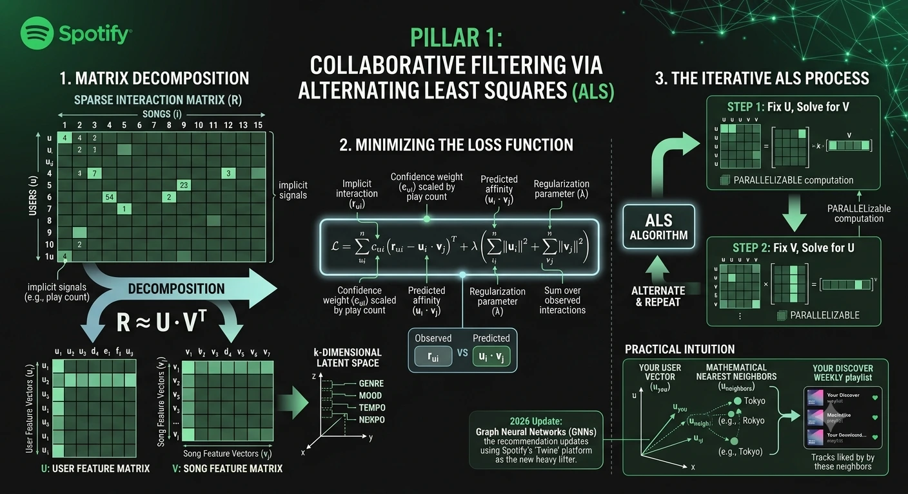
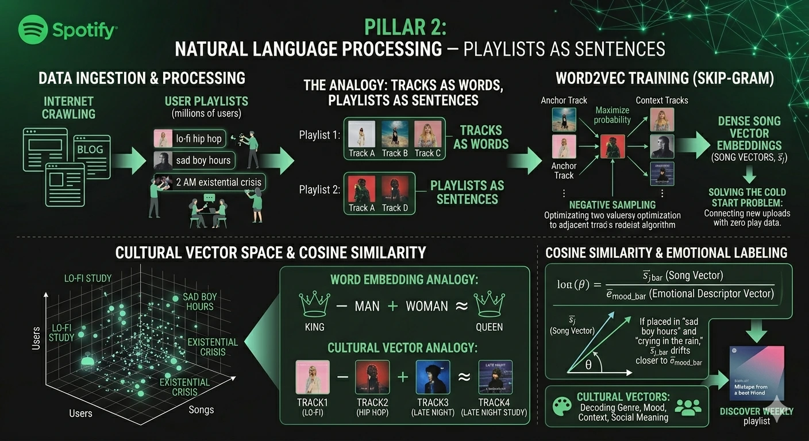
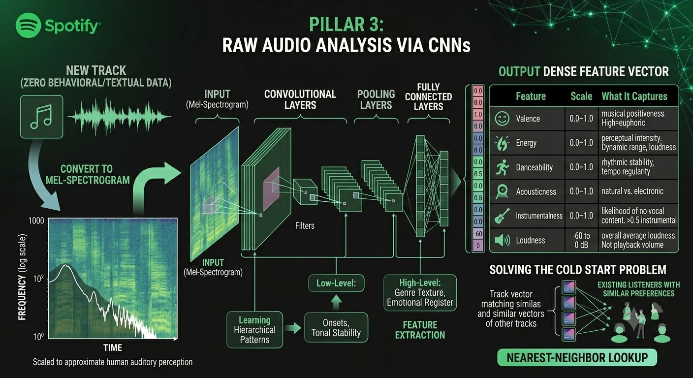
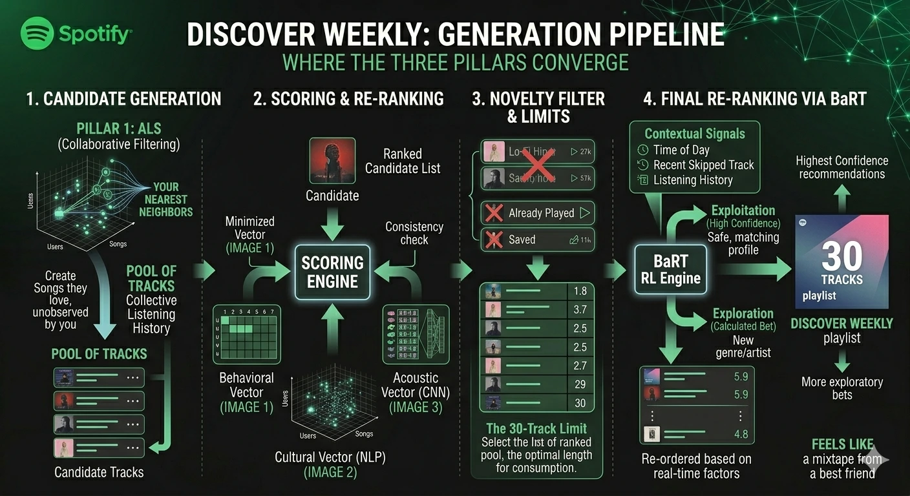
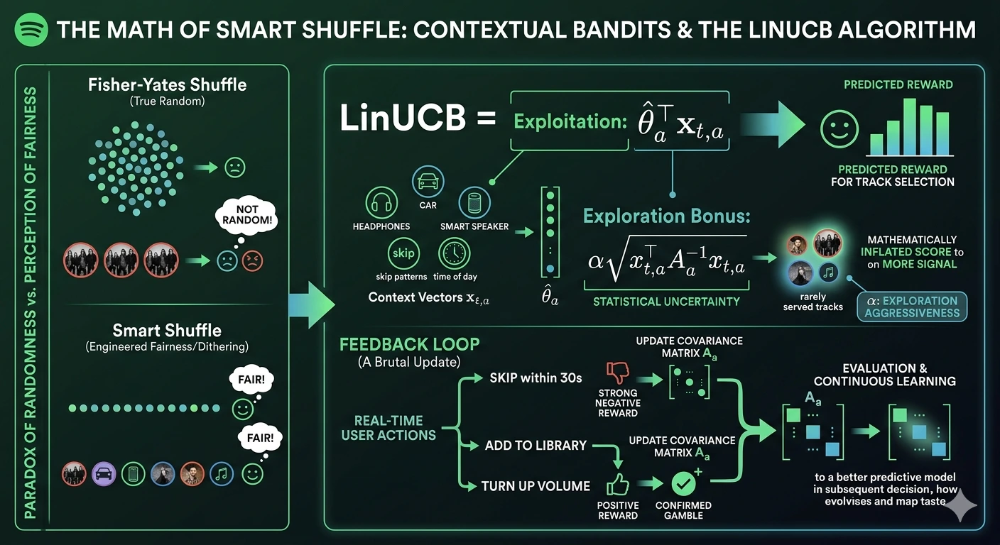
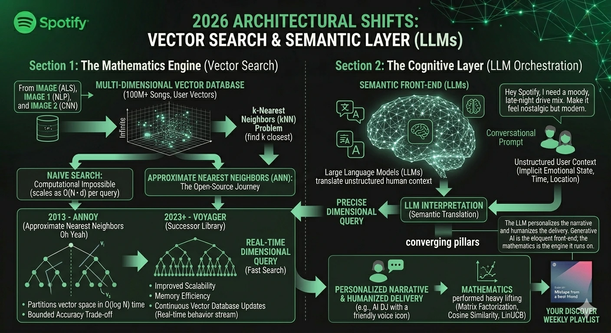

import { Alert } from '@/components/ui/feedback/Alert';

Spotifyの『Discover Weekly（今週のおすすめ）』が、まるでこちらの心を見透かしているかのような不気味なほどの精度で動いていると感じたことがあるなら、それはあなただけではありません。火曜日の夜にアプリを開き、再生を任せてみると、突然その時の気分に完全にマッチした曲が流れ出し、「スマホに盗聴されているのではないか」と疑い始めることもあるでしょう。

もちろん、システムがあなたの心を読んでいるわけでも、会話を盗聴しているわけでもありません。『Discover Weekly』の全盛期にSpotifyでディスカバリー部門を率いていたマシュー・オーグル（Matthew Ogle）は、その目標を「親友からのミックステープ」を作ることだと表現したことで有名です。しかし、その人間味あふれるビジョンの裏側には、驚くべき数学的精度を備えたシステムが存在しています。

デジタルなテレパシーのように思えるものは、実際には容赦のない高次元数学のエレガントな実行結果なのです。Spotifyのレコメンデーション・アーキテクチャは、現代のデータサイエンスにおける最高傑作（マスタークラス）と言えます。単一のモノリシックなモデルに依存するのではなく、それぞれ異なる機械学習パラダイムのアンサンブル（組み合わせ）を同期して機能させているのです。それでは、このエンジンの内部を解剖し、その裏側にある数学的アーキテクチャを紐解いていきましょう。

*図1：Spotifyのレコメンデーションエンジンのマクロなオーケストレーション。生のユーザー・アイテム相互作用行列から高次元の潜在ベクトル埋め込み（latent vector embeddings）に至るパイプラインを示している。*

---

## コア・アーキテクチャ：特徴抽出の3つの柱

Spotifyを理解するには、まず決定論的なオーディオマッチング・アルゴリズムと区別する必要があります。例えばShazamは、静的なデータベースに対して既知のオーディオフィンガープリントを特定するために、<a href="https://www.toptal.com/algorithms/shazam-it-music-processing-fingerprinting-and-recognition" target="_blank" rel="noopener noreferrer">スペクトログラムと局所的な組合せハッシュ（localized combinatorial hashing）に依存しています</a>。しかし、Spotifyが解決しているのは、本質的により困難な「確率論的」な問題です。それは、直接観察したことのない抽象的な人間の行動に基づいて、未来の好みを予測するというものです。

これを実現するために、Spotifyは「行動」「言語」「生の音響」という、完全に異なる3つのデータソースを同時に活用しています。

### 第1の柱：交互最小二乗法（ALS）による協調フィルタリング

Spotifyのエンジンの土台となる基盤は**協調フィルタリング（Collaborative Filtering）**です。音楽そのものを分析するのではなく、人類規模における人間の行動のメタデータを分析します。

Spotifyはそのエコシステムを巨大な相互作用行列 $R$ として概念化しています。ここで、行はユーザー（$u$）を表し、列はアイテム/楽曲（$i$）を表します。各セル内の値 $r_{ui}$ は、再生回数、トラックが最後まで再生された回数、お気に入りに保存されたかどうか、あるいは最初の30秒以内にスキップされたかどうかといった「暗黙的なシグナル（implicit signal）」をエンコードしています。ユーザー全体を合わせても、利用可能な1億曲以上の楽曲のごく一部しか聴かないため、この行列は極めて疎（スパース）になります。

目標は**行列分解（Matrix Factorization）**です。$R$ を2つの高密度な低次元行列（ユーザー行列 $U$ とアイテム行列 $V$）に分解し、それらの内積（ドット積）が元の行列を近似するようにします。

$$R \approx U V^T$$

$U$ の各行は、ある抽象的な $k$ 次元空間におけるユーザーの音楽の好みを表す「潜在特徴ベクトル（latent feature vector）」です。$V$ の各行は、それに対応する楽曲のベクトルです。標準的な機械学習（ML）の表記法に従い、ユーザー $u$ の潜在ベクトルを $p_u$、アイテム $i$ の潜在ベクトルを $q_i$ と表します。それらの内積 $p_u^T q_i$ は、ユーザー $u$ が楽曲 $i$ に対してどれほど強く反応するかを予測します。

これらのベクトルを大規模に学習するために、Spotifyは歴史的に**<a href="https://medium.com/data-science/alternating-least-square-for-implicit-dataset-with-code-8e7999277f4b" target="_blank" rel="noopener noreferrer">交互最小二乗法（ALS：Alternating Least Squares）アルゴリズム</a>**を利用してきました。その目的は、以下の重み付き損失関数を最小化することです。

$$J = \min_{P, Q} \sum_{u, i} c_{ui} (r_{ui} - p_u^T q_i)^2 + \lambda (\|p_u\|^2 + \|q_i\|^2)$$

ここで：
* **$r_{ui}$**: ユーザー $u$ とアイテム $i$ の間の、観測された暗黙的な相互作用。
* **$p_u^T q_i$**: 予測された親和性（アフィニティ） — ユーザーとアイテムの潜在ベクトルの内積。
* **$c_{ui}$**: 信頼度の重み。ストリーミングデータは暗黙的であるため（ある曲を聴いていないからといって、必ずしもそれが嫌いだとは限らず、単に出会っていないだけかもしれません）、$c_{ui}$ は観測された相互作用の重要性を比例的にスケーリングします。50回再生された曲は、1回しか再生されていない曲よりも、最適化において遥かに大きな重みが与えられます。
* **$\lambda$**: 重みの肥大化をペナルティ化し、過学習（オーバーフィッティング）を防ぐための L2 正則化パラメータ。

$U$ と $V$ の両方を同時に解こうとすると、非凸最適化問題（non-convex optimization problem）になってしまうため、ALSアルゴリズムは一方の行列を固定して線形最小二乗法でもう一方の行列を解き、それを交互に繰り返します。このトリックにより、分散クラスター間での計算を高度に並列化することが可能になります。これは、6億人ものユーザーを抱える行列を処理する上で極めて重要な要素です。

実用的な直感：もしあなたのリスニング行動が東京にいるあるユーザーと酷似していれば、アルゴリズムはあなたたちが「音楽のソウルメイト」であると推論し、相手が気に入っていてあなたがまだ出会っていない楽曲をレコメンドします。あなたの『Discover Weekly』は、本質的には、あなたの「数学的な最近傍（nearest neighbors）」が今週ヘビロテしている楽曲を厳選してまとめたコンピレーション・アルバムなのです。

<Alert variant="info">
    **2026年のアップデート — グラフニューラルネットワーク。** ALSが概念的な基盤であり続ける一方で、Spotifyは本番環境（プロダクション規模）のレコメンデーションにおいて、**グラフニューラルネットワーク（GNN）**への移行を急速に進めています。社内の**Twine**プラットフォームを通じて、Spotifyはユーザー、楽曲、プレイリスト、アーティスト、ポッドキャストなど、エコシステム全体を単一のヘテロジニアス（異種）グラフとしてモデル化しています。GNNは、行列分解では見えないマルチホップの関係性を捉えることができます。例えば、あなたとソウルにいるあるアーティストの熱狂的なファンが、直接同じ曲を聴いている（共同聴取）だけでなく、3つのプレイリストのホップを介して繋がっている、といった関係性です。ALSはこのアプローチの「なぜ（仕組み）」を説明するものですが、本番環境で実際に力仕事（ヘビーリフティング）をこなす主役は、ますますGNNへと移り変わっています。
</Alert>

*図2：Spotifyの協調フィルタリング・フレームワークのアーキテクチャ。疎なユーザー・アイテム相互作用行列から潜在特徴ベクトルへの分解、数学的な損失関数の最適化、および交互最小二乗法（ALS）アルゴリズムの反復的な実行を示している。*

### 第2の柱：自然言語処理 — 文としてのプレイリスト

協調フィルタリングは強力ですが、**コールドスタート問題（Cold Start Problem）**を抱えています。過去の再生データが全く存在しない楽曲を、一体どのようにレコメンドすればよいのでしょうか？ インディーズアーティストがアップロードしたばかりの最新曲には、行動シグナルが一切ありません。そこで、それを補完する第2のシステムが必要になります。

Spotifyは、より広い文化的インターネットに目を向けることで、このギャップを埋めています。同社のクローラーは、音楽ブログや編集記事などの<a href="https://variogram.com/2012/12/11/how-music-recommendation-works-and-doesnt-work/" target="_blank" rel="noopener noreferrer">ウェブコンテンツを継続的にスクレイピングし</a>、さらに最も重要な要素として、ユーザーが作成した何百万ものプレイリストのタイトルや説明文を収集しています。ここでもオーグルの有名な洞察が当てはまります。システムの真のインテリジェンスは「人間の巨人の肩の上に立っている」のです。つまり、プレイリストに名前を付けるたびに、知らず知らずのうちに音楽にラベルを貼っている何百万人もの一般ユーザーのことです。

このNLP（自然言語処理）パイプラインは、プレイリストを「文」、楽曲を「単語」として扱い、アーキテクチャ的に**<a href="https://arxiv.org/abs/1301.3781" target="_blank" rel="noopener noreferrer">Word2Vec</a>**（具体的にはSkip-gramやCBOWのバリアント）に類似したモデルを適用します。プレイリスト内のトラックのシーケンス（順序）に基づいて学習を行うことで、ある特定のアンカートラックが与えられたときに、その周辺にあるトラックを予測する確率を最大化するようにモデルが訓練されます。この目的関数は、通常**ネガティブサンプリング（Negative Sampling）**（完全なソフトマックス交差エントロピー損失の計算効率の高い近似手法）を介して最適化されます。これにより、同じプレイリスト内で共起（同時出現）する楽曲同士が、幾何学的に近い位置に配置される高密度なベクトル埋め込み（dense vector embeddings）をモデルに学習させることができます。

これは、Word2Vecの有名な特性（単語埋め込み空間において「王」−「男」＋「女」≒「女王」となるような性質）と同じ直感に基づいています。音楽の埋め込み空間でも同様に、「lo-fi hip hop」と「late night study（深夜の勉強）」プレイリストの中間に位置する楽曲は、それに応じたクラスタを形成することになります。

これらの埋め込みが学習されると、システムは**コサイン類似度（Cosine Similarity）**を用いて、推薦候補となる楽曲とユーザーの好みプロファイルとの間の文化的近接性を評価します。

$$\cos(\theta) = \frac{A \cdot B}{\|A\| \|B\|}$$

もし何千人ものユーザーが、各自で独立してある楽曲を「sad boy hours」「crying in the rain」「2 AM existential crisis」といったタイトルのプレイリストに追加した場合、その楽曲のベクトル表現（$A$）は、高次元空間においてそれらの感情的記述子のベクトル表現（$B$）へと目に見えて近づいていきます。これこそが、レコメンドがまさにぴったりのタイミングであなたに届く理由です。世界中の集合知（グローバル・ハイブマインド）が、Spotifyに代わってすでに感情的なラベル付けを済ませてくれているのです。

Spotifyは、これらの学習された表現を**「カルチャーベクトル（cultural vectors）」**と呼んでいます。これらはジャンルだけでなく、ムード、文脈（コンテキスト）、サブカルチャー、そして社会的意味までもエンコードします。これらは、生の音響分析だけでは決して到達できない次元です。

*図3：Spotifyの自然言語処理（NLP）の柱の概念フレームワーク。ユーザー生成プレイリストをWord2Vecアーキテクチャを介して意味論的な文としてモデル化し、文化を認識した楽曲埋め込みを生成して感情的な近接性を計算する仕組みを示している。*

### 第3の柱：CNNによる生の音響分析

行動シグナルと言語シグナルの両方が欠如している楽曲については、Spotifyの第3の柱がその役割を引き継ぎます。それが、オーディオのスペクトル表現に**畳み込みニューラルネットワーク（CNN：Convolutional Neural Networks）**を適用したディープな音響分析です。

生のオーディオ波形は、まず**メルスペクトログラム（Mel-Spectrogram）**に変換されます。これは、時間の経過に伴う周波数スペクトルの2次元表現であり、人間の聴覚知覚に近似させるために周波数ビンが対数的にスケーリングされています。CNNは複数の畳み込み層を通じてこの行列を処理し、音の過渡的な立ち上がり（トランジエントオンセット）や音調の安定性といった低次の特徴から、ジャンルの質感や感情のレジスター（音域・雰囲気）といった高次の性質に至るまで、音の中にある階層的なパターンを検出することを学習します。

出力されるのは、計測可能な音響特性をエンコードした高密度な特徴ベクトルであり、すべて**0.0〜1.0のスケール**（dBで測定されるラウドネスを除く）に正規化されています。

| 特徴 (Feature) | スケール (Scale) | キャプチャする内容 (What It Captures) |
| :--- | :--- | :--- |
| **Valence（ポジティブ度）** | 0.0 – 1.0 | 音楽的なポジティブさ。高い＝幸福感、陽気。低い＝憂鬱、緊張。 |
| **Energy（エネルギー）** | 0.0 – 1.0 | 知覚的な強度の度合い。ダイナミックレンジ、ラウドネス（音の大きさ）、音の立ち上がり率（onset rate）を組み合わせたもの。 |
| **Danceability（ダンス度）** | 0.0 – 1.0 | リズムの安定性、テンポの規則性、そしてビートの強さ。 |
| **Acousticness（アコースティック度）** | 0.0 – 1.0 | そのトラックがアコースティックであるかどうかの確信度（生楽器 vs 電子音）。 |
| **Instrumentalness（インスト度）** | 0.0 – 1.0 | ボーカルが含まれていない可能性。0.5を超える値はインストゥルメンタル（歌なし）である可能性が高い。 |
| **Loudness（音の大きさ）** | −60 〜 0 dB | トラック全体の平均的なラウドネス（再生音量ではなく、音響的な音の強さ）。 |

任意の新しい楽曲に対してこの高密度な特徴ベクトルを出力することで、システムはユーザーデータの欠如を完全にバイパスし、その曲の音響的なトポロジー（位相幾何学的構造）を、過去に同様のベクトルで高い数値を記録したリスナーの好みと即座にマッチングさせることができます。これにより、コールドスタート問題は、克服不可能なギャップから単なる「最近傍探索（nearest-neighbor lookup）」へと解消されます。

*図4：Spotifyの生音響分析のためのニューラルネットワーク・アーキテクチャ。コールドスタート問題を解決するために、対数スケールのメルスペクトログラムからCNNを介して音響特性の高密度特徴ベクトルを生成する抽出パイプラインを示している。*

---

## Discover Weekly：3つの柱が収束する場所

『Discover Weekly』は単一のアルゴリズムではありません。それは、上記の3つの柱の同期された出力から生まれるプロダクトです。

毎週月曜日に新しいプレイリストが組み立てられる際に何が起きているのか、その簡略化されたプロセスは以下の通りです：

1. **候補生成（Candidate Generation）。** ALSモデルが、ユーザー埋め込み空間におけるあなたの「最近傍（nearest neighbors）」を特定します。これは、最近の行動シグナルに基づいて、あなたの好みのベクトルに最も近いリスナーたちのことです。彼らの集合的なリスニング履歴から、候補曲のプールが組み立てられます。つまり、彼らが愛聴しており、あなたがまだ聴いたことのない楽曲です。

2. **スコアリングと再ランキング（Scoring and Re-ranking）。** 各候補曲は、あなたの音響プロファイル（CNNのオーディオ特徴量から）およびそのカルチャーベクトル（NLPパイプラインから）に対してスコア付けされます。行動的に関連性があり、**かつ**音響的に一貫しており、**かつ**あなたの文脈にマッチする文化的記述子を持つ楽曲が、上位に浮上します。

3. **新規性の制約（Novelty Constraint）。** システムは、あなたがすでに再生したことのある曲や保存した曲を明示的に除外します。目標は「発見（ディスカバリー）」であり、反復ではありません。

4. **30曲の制限（The 30-Track Limit）。** Spotifyのプロダクトチームは、週刊のディスカバリープレイリストとして30曲が最適な長さであると一貫して述べています。これは、網羅的であると感じられるほど十分に長く、1回の通勤やランニングで消費できるほど十分に短い長さです。最終的なランキングリストは30曲にトリミングされ、上部には信頼度の高いレコメンドが、下部にはより探索的な新しい試みが配置されるように重み付けされます。

5. **BaRTによる最終再ランキング。** リストが提供される直前に、スマートシャッフル（Smart Shuffle）のセクションで説明したのと同じ**BaRT**（Bandits for Recommendations as Treatments）フレームワークが、曲順の最終パスを実行します。アプリを開いた瞬間のあなたの文脈シグナル（時間帯、リスニングセッションの履歴、最近のスキップ率など）に基づいて、月曜日の朝のプレイリストの3番目（position #3）の曲を、安全で信頼度の高い選択肢（搾取：exploitation）にするか、あるいは計算された探索的な賭け（探索：exploration）にするかを決定します。これら2つのシステムは、同じ基礎となる強化学習（RL）エンジンを共有しています。

その最終結果が、最高の状態においては、あなたと好みを共有しつつも、あなたが決して聴ききれないほど遥かに多くの音楽を聴いてきた友人からのレコメンドのように感じられるプレイリストなのです。

*図5：エンドツーエンドのDiscover Weekly生成パイプライン。協調フィルタリング、NLPカルチャーベクトル、およびCNN音響特徴量が統合されたスコアリングエンジンへと収束し、その後に新規性の剪定（プルーニング）とBaRT強化学習フレームワークを介したリアルタイムの文脈最適化が行われる様子を示している。*

---

## スマートシャッフルの数学：コンテキスト・バンディット

<Alert variant="warning">
  **ランダム性のパラドックス：** 人間は、真の統計的ランダム性を知覚するのが極めて苦手なことで知られています。
</Alert>

 

サービスの初期段階において、Spotifyは真のランダムジェネレーターである**フィッシャー–イェーツのシャッフル（Fisher-Yates shuffle）**を利用していました。統計学的に見ると、真のランダム性はしばしば「クラスタリング（偏り）」を生み出します。つまり、400曲のライブラリの中から同じアーティストの楽曲が3曲連続で流れるといったことは、十分に起こり得るのです。ユーザーがこの現象に遭遇した際、「ランダムに再生されていない」という不満の声が多く寄せられました。数学的なランダム性は完璧であったにもかかわらず、ユーザーが体感する「ランダム感」は失敗していたのです。

エンジニアたちは、画像処理技術から着想を得た<a href="https://web.archive.org/web/20220215030739/https://engineering.atspotify.com/2014/02/how-to-shuffle-songs/" target="_blank" rel="noopener noreferrer">ディザリング（dithering）を応用したアルゴリズムを実装することで</a>これに対応しました。これは、真のランダム性をあえて「崩す」ことで、キュー（再生待ちリスト）全体にアーティストを均等に分散させ、公平に感じられる「疑似的なランダム感」を作り出す手法です。

現在、標準のシャッフル機能は**スマートシャッフル（Smart Shuffle）**へと進化しています。これは**強化学習（Reinforcement Learning）**によって制御されるインテリジェントなルーティングシステムであり、Spotifyが**BaRT**（Bandits for Recommendations as Treatments）と呼ぶアーキテクチャを採用しています。

これは**コンテキスト・マルチアーム・バンディット（Contextual Multi-Armed Bandit）**問題に該当します。アルゴリズムは、「搾取（Exploitation）」（ユーザーがお気に入りと分かっている楽曲を再生すること）と、「探索（Exploration）」（ユーザーの進化する好みをマッピングし、「フィルターバブル」に陥るのを防ぐために未知の楽曲を注入すること）のバランスを常に維持しなければなりません。このシステムを駆動するアルゴリズムの代表例として挙げられるのが、**<a href="https://arxiv.org/abs/1003.0146" target="_blank" rel="noopener noreferrer">LinUCB（Linear Upper Confidence Bound）</a>**です。

$$\text{LinUCB}(a) = \underbrace{ \hat{\theta}_a^T x_{t,a} }_{\text{Exploitation}} + \underbrace{ \alpha \sqrt{ x_{t,a}^T A_a^{-1} x_{t,a} } }_{\text{Exploration}}$$

アルゴリズムがキューの各ステップにおいて、リアルタイムでどのように「考えて」いるかは以下の通りです：
1. **搾取（Exploitation）** ($\hat{\theta}_a^T x_{t,a}$): 現在のコンテキストベクトル $x$ が与えられたときに、トラック $a$ を選択した際の予測報酬。コンテキストベクトルには、時間帯、デバイスのタイプ（ヘッドフォン、車、スマートスピーカーなど）、最近のスキップのパターンといったシグナルがエンコードされています。
2. **探索ボーナス（Exploration Bonus）** ($\alpha \sqrt{ x_{t,a}^T A_a^{-1} x_{t,a} }$): そのトラックの統計的な不確実性。同様のコンテキストにおいて、あなたのようなユーザーに対してシステムがめったに提供したことがないトラックは、数学的に膨らまされたスコアを受け取ります。これにより、アルゴリズムはそのトラックに関するより多くのシグナルを収集するよう促されます。$\alpha$ は、この探索の積極性を制御する調整可能なハイパーパラメータです。

フィードバックループは直接的かつ容赦のないものです。アルゴリズムが探索的なトラックを提供し、あなたがそれを30秒以内にスキップした場合、強力な負の報酬シグナルとして記録され、それに応じて共分散行列 $A_a$ が更新されます。逆に、あなたがそのトラックをライブラリに追加したり、音量を上げたりした場合、アルゴリズムはこの文脈的な賭けが成功したという確証を得たことになります。システムは継続的に学習し、それ以降のすべての決定を微調整します。

*図6：Spotifyのスマートシャッフル機能の強化学習メカニズム。真の統計的ランダム性と体感的な公平性を対比させ、継続的なリアルタイムのユーザーフィードバックループとともにLinUCBコンテキスト・マルチアーム・バンディット・アルゴリズムの実行を概説している。*

---

## アーキテクチャの転換：ベクトル検索とLLM

レコメンデーションを支配する核心的な数学的定理は安定したままですが、2026年現在、それらを実行するインフラストラクチャは劇的な進化を遂げています。

### 近似最近傍探索（ANN）

ユーザーと楽曲がベクトルとして表現されると、レコメンデーションを駆動する根本的な操作は**k最近傍（kNN：k-Nearest Neighbors）**探索になります。これは、与えられたクエリベクトルに最も近いデータベース内の $k$ 個のベクトルを見つけ出す処理です。すべてのベクトル間で内積を計算する愚直な方法では、この操作の計算量は $d$ 次元の空間にある $n$ 曲に対してクエリあたり $O(n \cdot d)$ となり、1億曲のカタログに対してリアルタイムで処理することは計算上不可能です。

Spotifyの解決策は、2013年にErik Bernhardsson氏によって開発された**<a href="https://erikbern.com/2015/10/01/nearest-neighbors-and-vector-models-part-2-how-to-search-in-high-dimensional-spaces.html" target="_blank" rel="noopener noreferrer">Annoy（Approximate Nearest Neighbors Oh Yeah）</a>**を構築し、オープンソース化することでした。Annoyは、ランダムな超平面の木（フォレスト）を用いてベクトル空間を分割し、近似最近傍探索を $O(\log n)$ 時間で実行可能にします。トレードオフとして、精度にわずかで限定的な損失が生じますが、99.9%最適な結果と100%最適な結果が区別できないレコメンデーションにおいては、これは許容できるものです。

2023年までに、Spotifyは後継ライブラリである**<a href="https://engineering.atspotify.com/2023/10/introducing-voyager-spotifys-new-nearest-neighbor-search-library/" target="_blank" rel="noopener noreferrer">Voyager</a>**へと移行しました。Voyagerは、Annoyのスケーラビリティ、メモリ効率、インデックス構築時間を改善したものであり、新しいユーザー行動が絶え間なく流れ込み、基礎となるベクトルデータベースが継続的に更新される環境において、これは極めて重要です。

### 認知レイヤー：大規模言語モデル（LLM）

生成AIの登場により、レコメンデーションパイプラインの生の数学的出力は、現在、LLM上に構築されたセマンティック（意味論的）レイヤーによってオーケストレーションされています。**AI DJ**のような機能は、インテリジェントな翻訳インターフェースとして機能します。LLMが、会話型のプロンプト、暗黙的な感情状態、時間や場所といった構造化されていないユーザーの文脈（コンテキスト）を解釈し、それを基礎となるベクトルデータベースに対する精密な次元クエリへと翻訳するのです。

従来のシステムと新しいシステムは競合しているわけではありません。LLMはナラティブ（語り口）をパーソナライズし、提供方法を人間味のあるものにします。行列分解、コサイン類似度、およびLinUCBの最適化は、依然として実際の選曲という力仕事を担っています。生成AIは雄弁なフロントエンドであり、数学はその背後で駆動するエンジンなのです。

*図7：Spotifyの統合された現代的アーキテクチャ。AnnoyやVoyagerのような高性能な近似最近傍探索（ANN）ベクトル検索ライブラリと、意味論的な人間の文脈を構造化されたデータベースクエリに翻訳する認知的なLLMオーケストレーションレイヤーとの交差点を示している。*

---

## 技術用語集

| 用語 | 定義 |
| :--- | :--- |
| **協調フィルタリング (Collaborative Filtering)** | ユーザー間で共有される行動パターンの類似性に基づくレコメンデーション手法 |
| **行列分解 (Matrix Factorization)** | 疎なユーザー・アイテム行列を潜在因子行列 $U$ と $V$ に分解すること |
| **ALS** | Alternating Least Squares（交互最小二乗法） — 行列分解を解くための反復アルゴリズム |
| **潜在ベクトル (Latent Vector)** | $k$ 次元空間におけるユーザーまたは楽曲の抽象的な特徴の高密度な数値表現 |
| **コールドスタート問題 (Cold Start Problem)** | 過去のユーザー相互作用データが全くないアイテムを推薦する際の課題 |
| **Word2Vec** | シーケンス（順序）内での共起関係から単語（またはトラック）の埋め込みを学習する浅いニューラルネットワーク |
| **カルチャーベクトル (Cultural Vector)** | プレイリストのタイトル、記事、文化的文脈のNLP分析から導き出される音楽の埋め込み |
| **コサイン類似度 (Cosine Similarity)** | 2つのベクトル間の角度の尺度。1.0 ＝ 同一方向、0 ＝ 直交 |
| **メルスペクトログラム (Mel-Spectrogram)** | 人間の聴覚知覚に合わせるために周波数をスケーリングした、オーディオの2次元時間-周波数表現 |
| **Valence（ポジティブ度）** | 音楽的なポジティブさ、または憂鬱さをエンコードした音響特徴量（0.0〜1.0） |
| **マルチアーム・バンディット (Multi-Armed Bandit)** | 未知の要素の「探索」と、既知の報酬の「搾取」のバランスを取るための強化学習のパラダイム |
| **LinUCB** | Linear Upper Confidence Bound — 予測報酬と不確実性の両方に基づいてアクションを選択するコンテキスト・バンディット・アルゴリズム |
| **ANN / Annoy / Voyager** | 高次元空間における高速なベクトル類似性検索のための近似最近傍探索（Approximate Nearest Neighbor）ライブラリ |
| **BaRT** | Bandits for Recommendations as Treatments — キューのリアルタイムなパーソナライズのためのSpotify独自の強化学習（RL）フレームワーク |

---

## 結論：多次元の鏡

結局のところ、Spotifyのレコメンデーションエンジンは読心術（マインドリーディング）を行っているわけではありません。それは、瞬きをすることのない高頻度な「鏡」なのです。世界中の6億人を超える他のリスナーの集合知によって増幅された、あなた自身の行動パターンをあなた自身に映し出しているに過ぎません。

Spotifyのバックエンドにおいて、あなたの音楽的アイデンティティはジャンルやアーティストのリストとして保存されているわけではありません。それは浮動小数点数の配列であり、無限の多次元空間を浮遊する単一の「座標」なのです。火曜日の夜のあなたのムードに完璧にマッチするトラックをアルゴリズムが見つけ出せるのは、何十億回もの継続的な行列乗算、コンテキスト・バンディットの決定、そしてコサイン類似度の検索が、あなたがすでに存在しているベクトル空間のその一点へと容赦なく収束し続けた結果に過ぎないのです。

アルゴリズムが読み取っているかのように見えたその「魂」の正体は、いつだって単なる幾何学だったのです。
