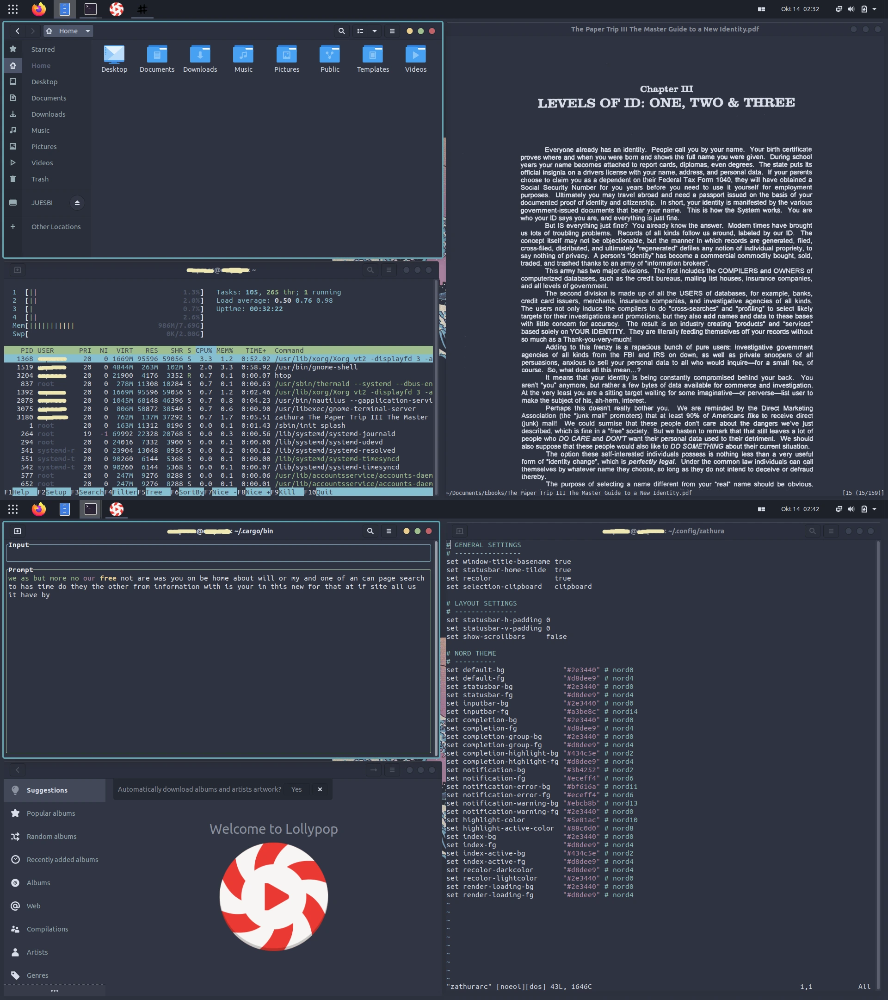
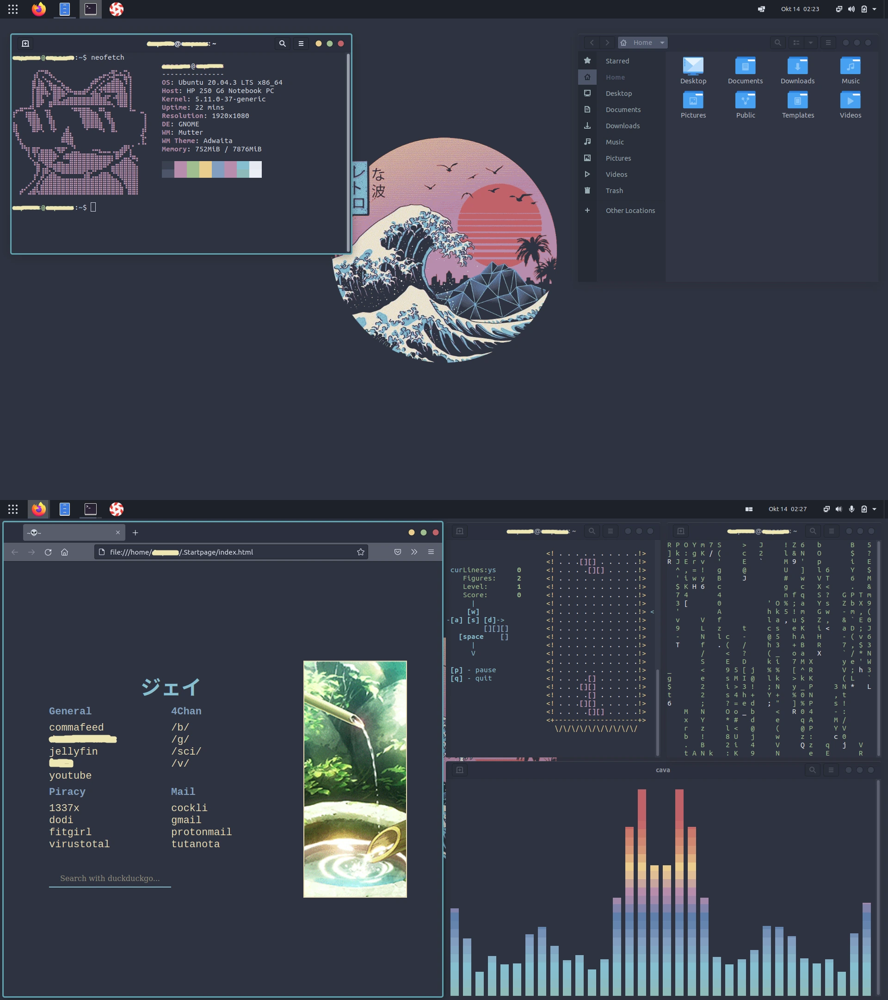

GNOMEは、その高い安定性、モジュール式の拡張機能（Extensions）フレームワーク、数々の洗練されたデスクトップサービスにより、Linuxエコシステム内で非常に高く評価されています。しかし、パワーユーザーや開発者の多くは、キーボードから手を離さずに操作できるタイル型ウィンドウマネージャー（Tiling Window Manager）の効率性を好みます。従来、これを実現するにはBSPWMやi3といったカスタムウィンドウマネージャーへ完全に移行する必要がありました。

幸いなことに、GNOME Shellの拡張機能エコシステムと、System76が開発したPop Shellの自動タイルコンパイラを活用することで、Ubuntu標準のGNOMEデスクトップを、キーボード駆動型の超高生産性タイル型ワークステーションへと変貌させることができます。これにより、デスクトップ環境（DE）が持つシステムデーモンの利便性を維持しながら、ウィンドウマネージャーの手軽な効率性を手に入れることが可能になります。

本ガイドでは、プロフェッショナル向けの**Nordic**カラーパレットと、カスタマイズされたコマンドラインユーティリティを中心に、Ubuntu上で洗練された自動タイル型ワークスペースを構築するための詳細な手順を解説します。

---

## コアシステムアーキテクチャ＆ビジュアルパレット

統一感のある高パフォーマンスなワークステーションを構築するために、標準のウィンドウ操作を自動タイルスクリプトに置き換え、高コントラストなダーク調のGTKテーマを一貫して適用します。この環境の主なシステム構成は以下の通りです：

| コンポーネント | ソフトウェア / プロジェクト | 技術的な目的と役割 |
| :--- | :--- | :--- |
| **オペレーティングシステム** | <a href="https://ubuntu.com/" target="_blank" rel="noopener noreferrer">Ubuntu</a> | 安定したDebianベースのLinuxディストリビューション |
| **デスクトップ環境** | <a href="https://www.gnome.org/" target="_blank" rel="noopener noreferrer">GNOME</a> | コアデスクトップマネージャーおよびディスプレイコンポジター |
| **ウィンドウタイルエンジン** | <a href="https://github.com/pop-os/shell" target="_blank" rel="noopener noreferrer">Pop Shell</a> | キーボード駆動型の自動タイル拡張機能 |
| **デザイン / GTKテーマ** | <a href="https://www.gnome-look.org/p/1267246" target="_blank" rel="noopener noreferrer">Nordic</a> | アプリケーションフレーム用の深いアークティックブルーパレット |
| **アイコンセット** | <a href="https://www.gnome-look.org/p/1332404" target="_blank" rel="noopener noreferrer">Flatery Dark</a> | 高コントラストでミニマルなフラットアイコンベクトル |
| **カーソルポインター** | <a href="https://www.gnome-look.org/s/Gnome/p/1360254/" target="_blank" rel="noopener noreferrer">Oreo Blue</a> | カスタマイズされた円形のモダンなカーソルポインター |
| **デフォルトブラウザ** | <a href="https://www.mozilla.org/en-US/firefox/new/" target="_blank" rel="noopener noreferrer">Firefox</a> | 高パフォーマンスかつプライバシー重視のWebブラウザ |

---

## ステップバイステップのインストールとワークスペースの調整

システムの絶対的な安定性を確保するため、Ubuntuのクリーンインストール（初期のパッケージ肥大化を抑えるために「最小インストール」を推奨）から開始することをお勧めします。

### 1. リポジトリの同期とアップグレード

まず、パッケージインデックスを同期し、コアシステムコンポーネントを最新の状態にアップグレードします：

```shell
sudo apt update
sudo apt upgrade -y
```

### 2. GNOME拡張機能＆各種調整ツールのセットアップ

テーマやカスタムパネルの拡張機能を管理するために、GNOMEの拡張機能パッケージマネージャーとTweaks（拡張設定）ユーティリティをインストールします：

```shell
sudo apt install -y gnome-tweaks gnome-shell-extensions
```

#### 必須となるGNOME Shell拡張機能のインストール

Firefoxを開き、<a href="https://extensions.gnome.org/" target="_blank" rel="noopener noreferrer">GNOME Extensionsポータル</a> にアクセスしてブラウザコネクタプラグインをダウンロードします。その後、以下の3つの拡張機能のトグルスイッチを **「On」** に切り替えてインストールしてください：

1.  <a href="https://extensions.gnome.org/extension/1160/dash-to-panel/" target="_blank" rel="noopener noreferrer">Dash to Panel</a>：上部バーとシステムドックを1つの洗練されたタスクバーに統合し、貴重な画面の表示領域を節約します。
2.  <a href="https://extensions.gnome.org/extension/19/user-themes/" target="_blank" rel="noopener noreferrer">User Themes</a>：ユーザーフォルダからカスタムGTKシェルテーマを直接読み込めるようにします。
3.  <a href="https://extensions.gnome.org/extension/1446/transparent-window-moving/" target="_blank" rel="noopener noreferrer">Transparent Window Moving</a>：フローティング（浮動）ウィンドウのレイアを移動する際に不透明度を微調整する効果を加え、視覚的な視認性を高めます。

*ヒント：**Gnome Tweaks** アプリケーションを開き、「拡張機能」タブに移動して、各拡張機能が有効になっていることを確認してください。また、レガシーな「デスクトップアイコン」はオフに設定します。視覚的なバランスを最適化するために、Transparent Window Movingの設定から不透明度の値を `0.2` に変更することをお勧めします。*

### 3. Pop Shell自動タイルエンジンの統合

System76が開発した **Pop Shell** 拡張機能は、GNOMEの最上層で高度なタイル型ウィンドウ管理機能（バイナリツリー形式の自動タイル配置、ギャップ設定、キーボードによるウィンドウフォーカスの切り替えなど）を提供します。

コンパイル（ビルド）に必要な依存パッケージをインストールします：

```shell
sudo apt install -y git node-typescript make
```

ローカルの「ダウンロード」フォルダに移動し、Pop Shellのソースリポジトリをクローンしてコンパイル（ビルド）を行います：

```shell
cd ~/Downloads
git clone https://github.com/pop-os/shell.git
cd shell
make local-install
```

コンパイルが正常に完了したら、GNOME Shellを再読み込みします（`Alt + F2` を押し、`r` を入力して `Enter` を叩くか、一度ログアウトして再度ログインしてください）。上部のステータスパネルに新しく追加されたタイルアイコンから、タイル型ウィンドウ機能を有効化します。

---

## CLI生産性スイートのコンパイルとインストール

タイル化されたワークスペースに効率的なターミナルベースのアプリケーションを配置するために、以下のユーティリティをコンパイルおよびインストールしていきます：

### 1. ターミナルシステム情報＆システムモニター

標準的なシステム可視化ツールおよび監視プログラムをインストールします：

```shell
# 視覚的なハードウェアダッシュボード (Htop)
sudo apt install -y htop

# コマンドライン用のシステム詳細情報表示ツール (Neofetch)
sudo apt install -y neofetch

# ターミナル用ファイルエクスプローラー (Ranger)
sudo apt install -y ranger

# ターミナル用デジタル時計 (Tty-clock)
sudo apt install -y tty-clock

# レトロなコードビジュアライザー (Cmatrix)
sudo apt install -y cmatrix

# ターミナルテキストプロセッサ (Vim および Zathura PDFリーダー)
sudo apt install -y vim zathura
```

### 2. デスクトップミュージックプレイヤー (Lollypop)

美しく軽量なインターフェースでローカルのメディアファイルを管理するために、以下のパッケージをインストールします：

```shell
sudo apt install -y lollypop
```

### 3. ターミナル用キャラクターアート生成ツール (cbonsai)

ncursesベースのターミナル用盆栽ツリージェネレーターをコンパイルします：

```shell
cd ~/Downloads
sudo apt install -y libncursesw5-dev
git clone https://gitlab.com/jallbrit/cbonsai.git
cd cbonsai
make install PREFIX=~/.local
```

### 4. 対話型ターミナル用テトリスゲーム (tty-tetris)

ターミナルウィンドウ上で直接動作する、高性能なカスタムテトリスゲームをコンパイルします：

```shell
cd ~/Downloads
sudo apt install -y cmake
git clone https://github.com/Holixus/tty-tetris-v2.git
cd tty-tetris-v2
cmake .
make 
sudo make install
```

### 5. CAVA (Console Acoustic Visualizer for Alsa) のコンパイル

音声を検知して高コントラストなバーで可視化するオーディオビジュアライザー「CAVA」をコンパイルします：

```shell
# コンパイルに必要なヘッダーファイルのインストール
sudo apt install -y libfftw3-dev libasound2-dev libncursesw5-dev libpulse-dev libtool automake libiniparser-dev

# ヘッダー用フラグのエクスポート
export CPPFLAGS=-I/usr/include/iniparser

# CAVAのソースコードをクローンしてコンパイル
cd ~/Downloads
git clone https://github.com/karlstav/cava.git
cd cava
./autogen.sh
./configure
make
sudo make install
```

### 6. ターミナル用タイピング速度測定ツール (Ttyper)

Rustベースのターミナル用タイピング速度モニターをインストールします：

```shell
sudo apt install -y cargo
cargo install ttyper
```

---

## Grubブートローダー＆テーマの全面刷新

上質な視覚的セットアップは、オペレーティングシステムが起動する前から始まります。ここでは、カスタム仕様のブートローダースクリーンをインストールし、すべてのデスクトップアプリケーションシェルにNordicカラーパレットを適用していきます。

### 1. ブートローダーのビジュアルアップグレード

「SEKIRO」デザインのGRUBブートローダーテーマのリポジトリをクローンし、自動インストールスクリプトを実行します：

```shell
cd ~/Downloads
git clone https://github.com/semimqmo/sekiro_grub_theme.git
cd sekiro_grub_theme
sudo ./install.sh
```

### 2. Nordicビジュアル資産の配置

ウィンドウの境界線やアイコンのベクトルをカスタマイズするために、ローカルのホームディレクトリ内に2つの非表示ディレクトリを作成します：

```shell
cd ~/
mkdir -p .themes
mkdir -p .icons
```

* **GTKテーマ：** <a href="https://www.gnome-look.org/p/1267246" target="_blank" rel="noopener noreferrer">Nordic GTKテーマ</a>をダウンロードし、そのフォルダを新しく作成した `~/.themes` ディレクトリに直接展開します。
* **アイコンセット：** <a href="https://www.gnome-look.org/p/1332404" target="_blank" rel="noopener noreferrer">Flatery Darkアイコンテーマ</a>を `~/.icons` に直接展開します。
* **カーソルポインター：** <a href="https://www.gnome-look.org/s/Gnome/p/1360254/" target="_blank" rel="noopener noreferrer">Oreo Blueカーソル</a>を `~/.icons` に直接展開します。

**GNOME Tweaks** を開き、**「外観（Appearance）」** タブに移動して、アプリケーション/シェルテーマに **Nordic**、アイコンに **Flatery Dark**、カーソルに **Oreo Blue** をそれぞれ選択します。

---

## ワークスペースのレイアウト＆システムカスタマイズの紹介

自動タイル機能が有効になり、テーマが適用されると、ワークスペースには幾何学的な隙間（ギャップ）を持った、視覚的コントラストの高い洗練されたアプリケーション画面が配置されます。

### システムレイアウト＆ターミナルワークスペース

ターミナルワークスペースでは標準のレイアウトグリッドを活用し、ウィンドウの重なりを排除して、主要なシステムメトリクスやテキストファイルをリアルタイムで視認できるようにしています：



### ミニマリストなホームページ＆ミュージックワークスペース

ホーム画面には、カスタマイズされたデスクトップ壁紙、動的なオーディオビジュアライザー（CAVA）、ミニマリストなFirefoxのスタートページ、そしてローカルのターミナルベースのPythonユーティリティが表示されています：



---

## テクニカルグロッサリー：カスタムワークステーション用語集

| ツール | 技術的概要 | 視覚的・運用上のメリット |
| :--- | :--- | :--- |
| **Pop Shell** | ウィンドウマネージャーのラッパー | アプリケーションの起動をクリーンなバイナリツリー分割へと変換。モニター空間を節約し、マウスへの依存度を下げます。 |
| **Neofetch** | 暗号風ビジュアル情報取得ツール | OSの高解像度ASCIIアートとともに、コア仕様（カーネル、シェル、システムテーマ）を整形して表示します。 |
| **Zathura** | Vim風の軽量PDFリーダー | カスタマイズ可能なキーボードショートカットと最小限のメモリフットプリントでドキュメントを描画。ダークモードのページ色反転にも対応。 |
| **Ranger** | ncursesベースのPythonファイルナビゲーター | フォルダ移動を高速なターミナルグリッドに変換し、複数列の階層的なディレクトリプレビューを提供します。 |
| **Vim** | 高度なターミナルテキストエディタ | モーダル編集ショートカットと深いコードカスタマイズ機能を備えた、高速なターミナルベースのIDE。 |
| **cbonsai** | CLIベクトルアニメーションアルゴリズム | 開いているシェル内にアスキーアートの木を反復的に描画し、背景のターミナルに視覚的な彩りを加えます。 |
| **tty-tetris** | C++ターミナルゲームマトリクス | キーボードマッピングを使用し、シェルセッション内で動作する高リフレッシュレートのレトロゲーム。 |
| **ttyper** | Rustベースのタイピングテストユーティリティ | ターミナルセッション中に、入力キーの速度（WPM）とスペル正確性を測定します。 |
| **Nordic GTK** | 調和のとれたアークティックカラーテーマ | 目を眩ませるような白いUIの光を排除し、エレガントで負担の少ないダークブルーとパステルカラーのアクセントに置き換えます。 |
| **Flatery** | 高コントラストなフラットアイコンライブラリ | ランチャーとタスクバーのアイコンシルエットを統一し、モダンなベクトルデザインに揃えます。 |
| **Oreo Blue** | ベクトルスケールされた円形ポインター | 従来の矢印ポインターを、視認性の高いモダンな円形のターゲットに置き換えます。 |
| **Firefox** | メモリ安全なカスタムWebブラウザ | ミニマリズムを追求するため、カスタムCSSスタートページ（`userChrome.css`）で高度にカスタマイズされたブラウザ。 |
| **tty-clock** | ターミナル時刻信号モジュール | 大きなターミナルブロック文字のレイアウトを使用してシステム時刻を投影します。 |
| **CAVA** | バースペクトルオーディオビジュアライザー | リアルタイムのデスクトップ音声周波数を、応答性の高い視覚的なバーに変換します。 |
| **HTop** | アクティブシステムマネージャーダッシュボード | リアルタイムのCPU/メモリコア使用率、ロードアベレージ、アクティブなプロセスを表示する高度なタスクマネージャー。 |
| **CMatrix** | 揮発性テキストスクロールエンジン | クラシックなSFコンピューターの美学にマッチする、緑色の落ちてくる文字のアニメーションを描画します。 |
| **Lollypop** | モダンな音楽再生カタログ | 音声のメタデータやカバーアートを解析し、美しいデスクトップミュージックプレイヤーのインターフェースを提供します。 |

---

## 結論＆カスタマイズの回顧

GNOMEのようなモノリシック（一体型）なデスクトップ環境をカスタマイズすることは、キーボード駆動型のウィンドウマネージャーが持つ効率性を楽しむために、モダンなシステムサービスやデバイスの安定性を犠牲にする必要がないことを証明しています。System76の自動タイルスクリプトを標準のUbuntuパッケージと統合することで、応答性が高く、低遅延で、美しい開発プラットフォームが実現します。

*このデスクトップ環境の解説は、オープンソースのデスクトップシステムやキーボード駆動型のターミナルワークフローが持つ深いカスタマイズの可能性を示すことを目的とした、教育および参考用のガイドです。*