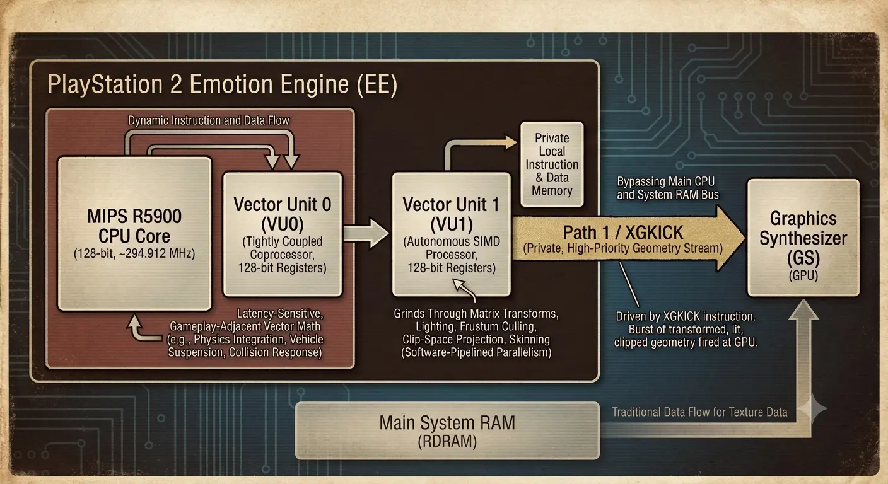
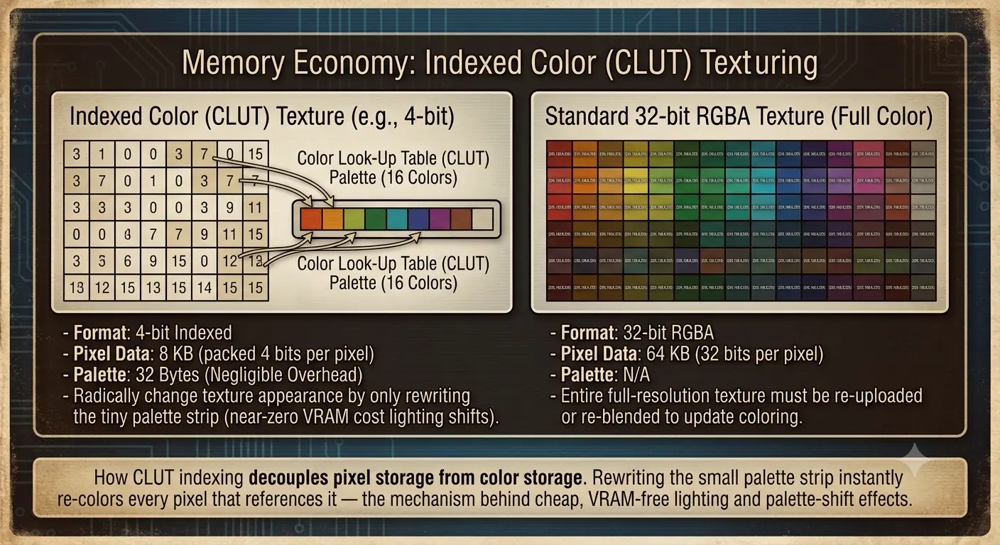

import { Alert } from '@/components/ui/feedback/Alert';

三座城市，一片连接郊区的完整虚构州，全程零加载画面 —— 这一切都运行在一台仅有 32MB 系统内存、且显存预算比一张未压缩的 4K 照片还要小的游戏主机上。这就是 2004 年 Rockstar North 开发《侠盗猎车手：圣安地列斯》（Grand Theft Auto: San Andreas）时面临的技术任务。它迫使一小群底层程序员不能将 PlayStation 2 仅仅视为一台普通的游戏机，而必须将其视为一个侧面连接了“难以驾驭的存储介质”的实时嵌入式系统。

本文并非是对游戏剧情或原声带的回顾，而是对其系统底层“管道”的解剖：包括异步流式处理流水线、掩盖物理磁盘延迟的 LOD（细节层次）层级结构、完全绕过编译器的手写向量单元（Vector Unit）微代码，以及将 4MB 显存极限利用到覆盖整个州区域的索引色（CLUT）内存魔法。Rockstar 使用的部分精确内部常量从未公开，过去二十年来仅由逆向工程社区进行过大致推算 —— 在这些地方，我已做了相应标注。然而，其体系结构本身已被充分记录，是“约束驱动型工程”的典范。

## 1. 2004年的硬件危机与悖论

PlayStation 2 的 Emotion Engine 将 32MB 的 Direct RDRAM 作为其主系统内存寻址——代码、AI 状态、物理运算、音频缓冲区、流式传输的几何体以及正在处理的纹理，全都在争抢这同一个内存池。PS2 的光栅化器 Graphics Synthesizer，则依靠位于 GPU 芯片上独立的 4MB 嵌入式 DRAM (eDRAM) 运行，其中必须同时容纳帧缓冲区、Z 缓冲区以及渲染时所有活跃绑定的纹理。当时不存在统一内存架构，也没有现代意义上的虚拟纹理分页——如果一个资源没有物理地驻留在这两个内存池中的其中一个里，那么对于渲染器而言，它就等于不存在。

<Alert variant="warning">
**真正的瓶颈不是内存，而是光驱。** 4 倍速 DVD-ROM 提供的理论顺序传输速率约为 5.28 MB/s（单倍速 DVD 读取器的 $4 \times 1.32\ \text{MB/s}$）。但顺序吞吐量只是最理想的情况。这一代的光驱在读取头必须寻道（seek）到非连续扇区时，都要支付沉重的代价——通常被认为在 100 到 200 毫秒左右。哪怕*一次*寻道，就可能消耗掉相当于游戏 6 帧以上的运行时间预算。
</Alert>

 

这一时间预算极其苛刻。在 30 FPS 的目标下，引擎只有：

$$
T_{frame} = \frac{1}{30\ \text{fps}} \approx 33.3\ \text{ms}
$$

来完成模拟更新、动画和物理计算、发出绘制调用（draw calls），并保持流式传输流水线的供给——且不能让玩家感觉到任何卡顿（stutter）。如果你单纯地将光驱在最理想情况下的顺序传输速率乘以这每一帧的窗口时间，就能得出一帧的理论数据上限：

$$
D_{frame} = R_{DVD} \times T_{frame} = 5.28\ \frac{\text{MB}}{\text{s}} \times 0.0333\ \text{s} \approx 176\ \text{KB}
$$

实际上，这个数值乐观到近乎虚构，因为它假设寻道开销（seek overhead）为“零”——一旦玩家在城市中驾驶，在磁盘布局的各个扇区之间跳跃，其顺序与文件的线性排列完全不同，这一假设就会瞬间崩塌。《圣安地列斯》引擎开发团队所面临的整个设计难题归结为一个问题：在一个仅有 33 毫秒余量可用的游戏循环中，如何隐藏一个可能会停顿数百毫秒的存储设备？

开发目标是不妥协的：实现整个州区域的无缝流式传输，在世界穿梭中绝不出现任何加载画面——这在当时的游戏地理尺度上，是之前任何主机开放世界游戏都未曾尝试过的挑战。

## 2. 资源流式传输：圣安地列斯的实时空间分割与预加载

《圣安地列斯》获得了 Criterion 开发的跨平台渲染中间件 RenderWare 的授权，但仅使用了其低层级的 *RenderWare Graphics* 光栅化层，而非 Criterion 的高层级场景管理、音频、物理或 AI 模块。Rockstar North 完全自主构建了场景图、遮挡方案、LOD 系统和流式传输引擎，这些全都位于 RenderWare 渲染图元之上，而非内部。“深度定制的 RenderWare” 在字面意义上其实过于保守了：人们在《圣安地列斯》中所称的“RenderWare 引擎”，大部分实际上是 Rockstar 自己的代码，只不过把 RenderWare 的光栅化器当作后端来使用。

游戏世界本身被分割为 2D 场景扇区（scene sectors）网格——即离散的空间单元，每一个都拥有物理上属于该地图区块的模型、碰撞数据和纹理集合。每一帧，引擎都会将玩家的世界空间位置与扇区边界进行比对；一旦进入一个新扇区，就会触发该扇区资源集的“流式传输请求（streaming request）”。后台计数器——实际上是“正在使用的流式传输内存”的运行计数——会跟踪当前分配给已加载资源的 RAM 预算有多少。当计数器接近上限时，引擎开始逐出相关性最低的常驻对象：即距离摄像机过远、位于视锥体之外、或者仅仅是距离玩家最远的对象，从而在新的扇区数据抵达之前腾出空间。

<Alert variant="info">
这是一个经典的**“最小相关性逐出（least-relevant eviction）”**缓存策略，而非 LRU（最近最少使用）。决定逐出什么的是“距离”和“可见性”，而非“时间”——这在开放世界中至关重要，因为玩家随时可能回头，重新穿过刚才离开的扇区。
</Alert>

 

流式传输请求的触发半径并非玩家周围的固定圆圈——它必须考量玩家接近未加载地理区域的速度。步行玩家与全速驾驶九头蛇（Hydra）战斗机的玩家，其所需的预取（lookahead）条件截然不同。从概念上讲（Rockstar 的确切调整常量从未公开，因此请将此视为机制的说明模型，而非其字面源代码），流式传输半径随速度缩放：

$$
R_{stream}(\vec{v}) = R_{base} + k \cdot \lVert \vec{v} \rVert
$$

其中 $R_{base}$ 是步行速度下所需的最小气泡半径，$\lVert \vec{v} \rVert$ 是玩家当前速度矢量的大小，$k$ 是随着速度增加而扩大气泡的调整常量。更具预测性的变体沿着当前的航向预测未来的位置，并将加载请求集中在那里，而不是玩家当前的坐标上：

$$
\vec{p}_{predicted} = \vec{p}_{current} + \vec{v} \cdot T_{lookahead}
$$

这就是“在玩家进入新领土后才做出反应”的引擎与“预见”它的引擎之间的区别——考虑到 DVD 寻道延迟通常在数百毫秒，而每一帧的预算仅为 33.3 毫秒，反应式系统永远无法达到要求。九头蛇战斗机的极限速度本质上迫使流式传输系统必须在玩家到达前几秒钟就开始获取地理数据，否则玩家脚下的世界就会消失。

图 1：场景扇区网格与动态流式传输气泡之间的关系。低速行驶时，加载半径大致呈圆形；而在高速行驶时，它会沿着玩家的行进方向向前拉伸，优先加载玩家即将进入的扇区，而非身后的扇区。

## 3. 缓解存储延迟：LOD 层级与“Pop-in”问题的解决方案

即使有了预测性流式传输气泡，物理定律最终还是会获胜：高速移动的喷气机最终会跑赢光驱的读取速度。这就是《圣安地列斯》中臭名昭著的“Pop-in”（模型突现）问题的根本原因——全细节的建筑、桥梁和树木在它们本应出现后的那一刻才突然显现，因为 DVD 驱动器根本无法及时提供全分辨率的几何数据。

每当玩家目睹悬浮桥梁或一丛高细节树木在高速行驶的载具前方凭空出现时，他们看到的不仅仅是软件故障，而是 2004 年硬件的物理极限。在 PlayStation 2 主机内部，DVD 驱动器的物理激光头在旋转的光盘上来回疯狂扫动。为了获取新街区的高分辨率纹理和 3D 网格，激光头必须进行物理重定位，最多需要 200 毫秒才能降落到正确的扇区。当激光头在光盘上移动时，游戏循环仍在以每帧 33.3 毫秒的速度滴答作响。引擎没有选择冻结整个游戏来等待激光头追上，而是选择继续运行——渲染出空白空间或方块状的占位符。

缓解措施并非消除这一问题——对于 5.28 MB/s 的光驱来说，这在物理上是不可能的——而是让这种转换尽可能无缝。核心机制是一个持久的低多边形代理模型（proxy model）——这是远景地理的粗糙、“始终驻留”的版本——无论流式传输状态如何，它都保存在内存中。当建筑或地标的高细节版本加载完成时，引擎会将其与低多边形替身进行交换。因为屏幕上*始终*有东西显示——尽管并非总是最终质量的资源——视觉管道会优雅地降级为低细节占位符，而不是灾难性地降级为未经渲染的空白虚空。

<Alert variant="info">
**迟滞现象（Hysteresis）可防止颠簸（thrashing）。** 如果引擎使用单一距离阈值来决定何时在 LOD 层级之间切换，那么一个恰好悬停在该边界上的对象——这在以恒定半径绕地标行驶时会不断发生——就会在每一帧之间闪烁切换模型。《圣安地列斯》时代的引擎通过使用两个阈值而非一个来解决这个问题：一个较远的距离用于*降级*到低多边形模型，一个较近的距离用于*升级*回全细节模型，从而创造出一个不会发生切换的“死区”。切换本身通常通过跨越几帧的 Alpha 交叉淡入淡出来进一步柔化，因此即使发生了转换，看起来也更像是一种融合，而非硬切。
</Alert>

 

有趣的是，这为引擎带来了什么，体现在帧预算本身：低多边形代理层对 DVD 延迟的依赖几乎为零，因为它从不离开内存，这意味着渲染器在*最坏情况*下的视觉输出始终是“正确但低保真”的，而绝不会是“缺失的”。这重新定义了 DVD 寻道延迟，将其从一个正确性问题转变为一个纯粹的服务质量问题——这正是实时系统希望处于的故障域。

## 4. 汇编魔术：利用 Emotion Engine 与向量单元

PlayStation 2 的 CPU 复合体 —— 由索尼和东芝共同开发的“Emotion Engine” —— 在架构上呈现出一种在现代没有任何直接对应物的非对称性。在其核心位置坐落着一个主频约为 294.912 MHz 的 128 位 MIPS R5900 核心，负责运行常规游戏逻辑。该核心上挂载了两个向量单元（Vector Units，简称 VU0 和 VU1），每个单元都是一个小型的 SIMD 处理器，围绕 128 位寄存器构建，专门针对 4 通道浮点向量数学进行了优化 —— 这正是 3D 变换、四元数数学和物理积分计算中所使用的数据形态。

VU0 与主核心紧密耦合，实际上充当了 CPU 自身指令流的协处理器扩展，是处理对延迟敏感、紧邻游戏逻辑的向量数学的最佳场所：车辆悬挂建模、逐帧碰撞响应、类似布娃娃系统的物理处理 —— 任何需要在同一时钟周期内与游戏逻辑来回交互的处理都适合在此运行。VU1 则完全不同：它拥有自己的本地指令和数据内存，并且能够*自主*运行，与其等待 CPU 一条条地投喂指令，不如说它是在与主 CPU 并行执行自己的微程序。至关重要的是，VU1 拥有一条通往 Graphics Synthesizer（图形合成器）的私有高优先级总线 —— 在 PS2 术语中称为“Path 1” —— 该总线由单一指令 `XGKICK` 驱动，能够将爆发式的已变换、已光照和已裁剪的几何数据直接踢向 GPU，而无需绕道主 CPU 或系统 RAM 总线。

<Alert variant="info">
**为什么要手写 VU 汇编而不是信任编译器？** VU0 和 VU1 每个周期执行两个指令槽 —— 一个用于向量算术的“上层”槽，和一个用于内存访问或分支等操作的“下层”槽 —— 要从该流水线中获得真正的吞吐量，意味着必须手动进行指令对的协同调度、管理微小的本地寄存器文件，并手动隐藏固定延迟的流水线停顿（stalls）。在当时，编译器无法在这类不寻常的架构上可靠地完成这种双发射（dual-issue）、隐藏延迟的指令调度。那些想要真正达到 PS2 宣传的顶点转换吞吐量（当 VU0 和 VU1 协同工作时，通常被认为在每秒数千万个顶点）的开发工作室，在处理最核心的内循环（蒙皮、矩阵调色板变换、视锥体剔除、裁剪空间投影）时，通常会直接使用原始的 VU 微代码。
</Alert>

 

最终形成的流水线大致如下：主 CPU（在 VU0 的协助下）更新该帧的游戏状态和物理运算，VU1 接收结果并独立地处理通过了可见性测试的几何体的矩阵变换、光照和裁剪空间剔除，处理完成并准备好供 GPU 使用的图元随后通过 Path 1 发送到 Graphics Synthesizer，而此时 CPU 已经转而处理下一块工作负载了。这是在“计算着色器（compute shader）”这一术语普及之前数年，从接近固定功能的硬件中榨取出的软件流水线并行化技术。

图 2：Emotion Engine 中的数据流。VU0 保持在 CPU 附近以处理与游戏逻辑耦合的物理数学运算，而 VU1 则半自主运行，通过 XGKICK 指令经由专用的 Path 1 总线将处理完成的几何体流式传输到 GS —— 全程不触碰主系统 RAM 总线。

## 5. 内存经济：CLUT 纹理与程序化实体回收

仅有 4MB 的 eDRAM 来容纳每一帧活跃绑定的所有纹理，因此《圣安地列斯》在绝大多数环境美术中大量依赖索引色（Indexed color）——即颜色查找表（Color Look-Up Tables，简称 CLUTs）。与其为每个像素存储完整的 32 位 RGBA 颜色，索引纹理为每个像素存储一个小整数*索引*，并由一个独立的微小调色板表将每个索引映射到实际的 16 位颜色。PS2 的图形合成器（Graphics Synthesizer）原生支持两种索引深度：4 位（每张纹理 16 种可能颜色）和 8 位（每张纹理 256 种可能颜色）。

这种节省效果是巨大的且与分辨率无关——无论纹理分辨率如何，它们在本质上保持着相同的节省比例，因为与像素数据本身相比，调色板的开销几乎可以忽略不计：

| 纹理尺寸 | 格式 | 像素数据 | 调色板 (CLUT) | 总大小 | 相比 32-bit RGBA 的节省率 |
|---|---|---|---|---|---|
| 128×128 | 32-bit RGBA | 64 KB | — | 64 KB | — |
| 128×128 | 8-bit 索引 (256 色) | 16 KB | 0.5 KB | 16.5 KB | ~74.2% |
| 128×128 | 4-bit 索引 (16 色) | 8 KB | ~0.03 KB | ~8.03 KB | ~87.4% |
| 256×256 | 32-bit RGBA | 256 KB | — | 256 KB | — |
| 256×256 | 8-bit 索引 (256 色) | 64 KB | 0.5 KB | 64.5 KB | ~74.8% |
| 256×256 | 4-bit 索引 (16 色) | 32 KB | ~0.03 KB | ~32.03 KB | ~87.5% |

*调色板大小假设每个索引占用 16 位颜色条目：8 位 CLUT 为 256 个条目 × 2 字节 = 512 字节；4 位 CLUT 为 16 个条目 × 2 字节 = 32 字节。*

像素数据列背后的计算公式是简单的位打包（bit-packing）数学。对于 $W \times H$ 像素、每像素 $b$ 位的纹理，计算公式如下：

$$
S_{pixels} = \frac{W \times H \times b}{8}\ \text{bytes}
$$

这就是为什么从每像素 32 位降至 4 位带来的节省并非线性——它意味着原始像素存储量减少了 8 倍，因为 $32 / 4 = 8$。

除了原始存储空间的节省外，CLUT 索引化还有第二个更微妙的好处：由于索引纹理中的每个像素仅仅是指向小调色板的指针，你只需重写调色板（仅需几十到几百字节），而无需触碰（大得多的）像素数据本身的任何一个字节，就能彻底改变纹理的“外观”。交换、旋转或渐变调色板条目，引用它们的每个像素都会瞬间统一更新。这种“调色板移位（palette shifting）”技术在 8 位机时代的索引色图形中就已经相当成熟，它正是那种让几乎零 VRAM 成本的光照变化变得可行的技巧——例如《圣安地列斯》昼夜循环中，环境纹理从刺眼的午间阳光转向琥珀色的黄昏色调——这在控制台规模下极其高效：重新上传少量的调色板字节，其成本比每一帧重新上传或重新混合全分辨率纹理数据要低几个数量级。

图 3：CLUT 索引化如何将像素存储与颜色存储解耦。重写小块调色板条目可瞬间重新着色所有引用它的像素——这是实现低成本、零 VRAM 占用光照和调色板移位特效的机制。

RAM 预算中 CPU 侧的内存经济性遵循同样的哲学：不要存储可以重新生成的内容。《圣安地列斯》中行人和车辆的群体并非固定的持久性角色集合——它们是一个程序化管理的对象池，随着玩家在世界中移动而动态地生成（spawn）和销毁（despawn），并受限于确定性的区域权重表，这些表决定了哪些模型可以在哪些地区生成（例如，低底盘车聚集在葛兰顿（Ganton），跑车集中在拉斯云祖华（Las Venturas）周边等）。生成过程由视锥体（view frustum）控制——新实体出现在摄像机视野之外的边缘，而不是已加载世界的任何地方。销毁过程同样非常激进：任何离开视锥体并距离玩家足够远的物体都会立即从活跃堆（active heap）中清除，而不是作为 RAM 预算的死重（dead weight）滞留。整个系统表现为一个叠加了空间和统计策略的固定容量对象池，当你的模拟群体必须与流式传输的几何体、纹理和音频竞争同一块 32MB 的内存上限时，这正是你所需要的架构。

## 6. 结语：约束驱动型架构的胜利

当我们从现代视角回顾《侠盗猎车手：圣安地列斯》时，可以清楚地看到，游戏中那宏大而无缝的世界并非单纯依靠硬件性能堆砌而成，而是一种由残酷的微代码、激进的缓存控制以及高度结构化的内存预算所维系的“幻觉”。32MB 的系统内存和 4MB 的 eDRAM 并没有限制 Rockstar North 的愿景——矛盾的是，正是这些严格的边界定义了清晰、可预测的工程框架，才使得这款游戏成为可能。

流式传输引擎不仅仅是在加载资源，它还在与旋转激光头的机械物理极限之间进行着一场实时的博弈。向量单元（Vector Units）也不仅仅是在变换顶点，它们绕过了高层的软件抽象，直接从硅片中提取出原始的执行并行性。

在一个现代 Web 和游戏开发频繁堆叠抽象层——往往导致巨大的部署体积和未优化的运行时环境——的时代，《圣安地列斯》成为了裸机系统工程（bare-metal systems engineering）的典范。它提醒我们，当硬件无法提供任何免费资源时，终极的优化工具就是对底层硬件深入且毫不妥协的理解。圣安地列斯州从未真正完整地存储在那张双层 DVD 中；它是通过工程手段，在 33 毫秒的每一帧中被“创造”出来的。

---

## 参考文献与延伸阅读

* **Copetti, R.** (2018). <a href="https://www.copetti.org/writings/consoles/playstation-2/" target="_blank" rel="noopener noreferrer">*PlayStation 2 Architecture: A Practical Analysis*</a>. 对 Emotion Engine、向量单元及图形合成器流水线的深度剖析。
* **Criterion Software.** (2002). <a href="https://gtamods.com/wiki/RenderWare" target="_blank" rel="noopener noreferrer">*RenderWare Graphics SDK Documentation*</a>. 低层级光栅化层的结构规范及社区保存的细节文档。
* **GTA Modding Community.** <a href="https://gtamods.com/wiki/Memory_Addresses_(SA)" target="_blank" rel="noopener noreferrer">*GTA:SA Memory Addresses*</a> & <a href="https://gtamods.com/wiki/Resource_Streaming" target="_blank" rel="noopener noreferrer">*Resource Streaming Documentation*</a>. 社区驱动的逆向工程 Wiki，详细记录了 `.ipl`、`.ide` 文件结构及内存流式传输常量。
* **The re3 & reVC Projects.** <a href="https://github.com/Cai1Hsu/re3" target="_blank" rel="noopener noreferrer">*Open-source decompilation of RenderWare-era GTA engines*</a> (以及保存于 <a href="https://archive.org/details/gta-3-gta-vc-re_20210222_0707" target="_blank" rel="noopener noreferrer">Internet Archive Torrent</a> 的备份). 完全逆向的原始源代码，映射了引擎结构、内存池和实体回收例程。

---

## 技术术语表

| 术语 | 定义 |
|---|---|
| **Emotion Engine (EE)** | PS2 的主 CPU：一个 128 位 MIPS R5900 核心（约 294.912 MHz），片上集成了两个向量单元（VU0, VU1）和一个浮点运算单元，专为实时 3D 模拟构建。 |
| **RDRAM** | 直接内存总线 DRAM — PS2 的 32MB 主系统内存，提供约 3.2 GB/s 的带宽，由代码、游戏状态和所有流式传输资源共享。 |
| **eDRAM** | 直接构建在图形合成器芯片上的嵌入式 DRAM — 一个独立、速度更快但小得多（4MB）的内存池，用于保存帧缓冲区、Z 缓冲区和当前绑定的纹理。 |
| **Graphics Synthesizer (GS)** | PS2 专用的光栅化 GPU。固定功能，无可编程着色器；负责消耗预转换的几何体和纹理，并输出像素。 |
| **VU0** | 一个与 EE 核心紧密耦合的向量单元，作为协处理器，通常用于像物理和悬挂建模这样需要每一周期都与 CPU 逻辑交错的玩法相关数学运算。 |
| **VU1** | 第二个更自主的向量单元，拥有自己的本地内存，通常专门用于 GS 之前的几何体变换、光照、裁剪和剔除。 |
| **GIF (Graphics Interface)** | 从三个优先“路径”向 GS 传递数据的硬件接口，确保几何体和纹理数据以正确的顺序到达光栅化器。 |
| **Path 1 / XGKICK** | 从 VU1 直接到 GS 的最高优先级总线路径，由 `XGKICK` 指令触发 — 让 VU1 无需经过主 RAM 即可将处理完成的几何体直接推送到 GPU。 |
| **CLUT (Color Look-Up Table)** | 与索引纹理配对的小型调色板表；每个像素存储一个紧凑的索引而非完整颜色，CLUT 将索引映射为实际颜色值。 |
| **Palette Shifting** | 重写纹理的 CLUT 调色板（几十到几百字节），以改变每个引用它的像素的外观颜色，而不触及底层的像素数据。 |
| **LOD (Level of Detail)** | 一种常驻内存的低多边形、低保真度替代模型，以便渲染器在处理远处或尚未流式传输的几何体时总有东西可画。 |
| **Hysteresis (LOD swapping)** | 使用两个不同的距离阈值 — 一个用于降级，一个用于升级 — 而不是一个，以防止边界附近的对象在每一帧之间闪烁切换 LOD 层级。 |
| **Streaming Sector** | 游戏世界中离散的网格单元，拥有一组有界的几何体、碰撞和纹理资源，用作流式传输系统加载/卸载决策的原子单位。 |
| **Streaming Bubble** | 玩家周围的动态半径，引擎在该范围内主动请求扇区数据，并根据玩家的速度矢量进行缩放，以补偿 DVD 寻道延迟。 |
| **DVD-ROM (4x)** | PS2 的光存储介质；理论顺序吞吐量约为 5.28 MB/s，其中寻道延迟（通常在 100–200ms 范围内）代表了非连续读取的真正瓶颈。 |
| **Frustum Culling** | 在几何体发送到 GPU 之前，丢弃落在摄像机当前视野之外的几何体，从而节省变换和填充率成本。 |
| **RenderWare Graphics** | 圣安地列斯所构建的底层 3D 光栅化中间件（由 Criterion Software 开发）；Rockstar North 自己的自定义场景管理、流式传输和 LOD 系统位于其之上而非其内部。 |