去中心化金融 (DeFi) 和代币化的兴起彻底重塑了全球金融生态系统。与拥有原生底层区块链的独立加密货币（如比特币或 Solana）不同，加密代币是部署在现有的智能合约平台之上的。

对于希望发行代币的开发者而言，**Solana** 已成为首选生态系统。利用名为 **历史证明 (Proof of History, PoH)** 的独特共识机制，并结合 **Sealevel 运行时** 的并行处理能力，Solana 提供了极低的交易费用（仅几分之一美分）以及亚秒级的确认速度。

本技术指南将逐步指导你如何搭建安全的 Debian Linux 纯 CLI 环境、编译基于 Rust 的区块链依赖项、铸造自定义 **Solana 程序库 (SPL)** 代币，以及理解新旧代币元数据标准。

> **更新说明 (2026年5月19日)：** Solana Labs 已弃用并归档了本指南中提到的基于 GitHub 的 `token-list` 仓库。代币元数据现在通过 Metaplex 直接在链上处理。由于此次迁移，像 HSKY 这样未更新至新链上标准的旧代币已不再被 Solscan 索引，但其底层的区块链核心概念保持完全一致！

---

## 架构与系统先决条件

为了确保安全性和可复现性，我们将在一个极简的 **Debian Linux 纯 CLI 虚拟机** 中构建此代币架构。剔除图形用户界面 (GUI) 可以减少系统的攻击面，并确保最高程度的加密隔离。

### 所需软件与平台

* **取证/铸造系统：** <a href="https://www.debian.org/" target="_blank" rel="noopener noreferrer">Debian Linux</a> (仅 CLI 安装)
* **版本控制：** <a href="https://github.com/" target="_blank" rel="noopener noreferrer">GitHub</a> (用于托管初始仓库资产)
* **流动性网关：** <a href="https://www.binance.com/" target="_blank" rel="noopener noreferrer">Binance</a> (或其他受监管的加密货币交易所，用于获取 Gas 代币)
* **客户端钱包：** <a href="https://phantom.app/" target="_blank" rel="noopener noreferrer">Phantom Wallet</a> (浏览器插件版) 和 <a href="https://solflare.com/" target="_blank" rel="noopener noreferrer">Solflare</a> (移动端/硬件接口)

> **重要提示：** 在 Solana 网络上创建账户和执行交易需要消耗 Gas。你必须预先获取少量 **SOL** 代币以支付交易费用。

---

## 分步 CLI 执行与铸造流程

### 1. 准备 CLI 工作空间

在虚拟环境中安装一个纯净、极简的 Debian Linux 操作系统。下图展示了最小化 Debian 系统的成功启动过程：

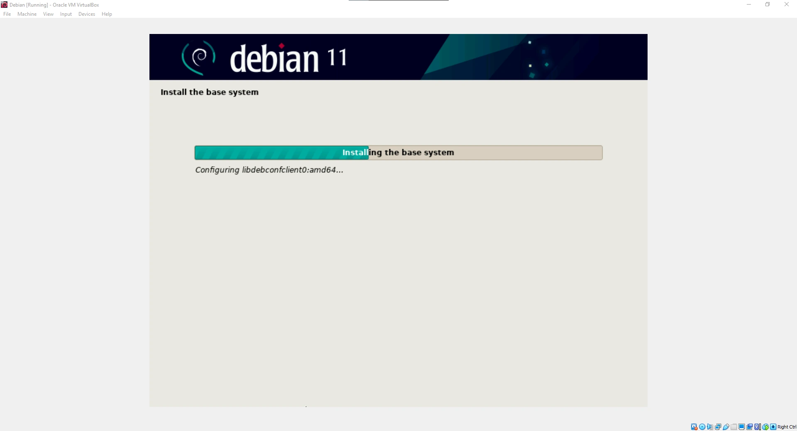

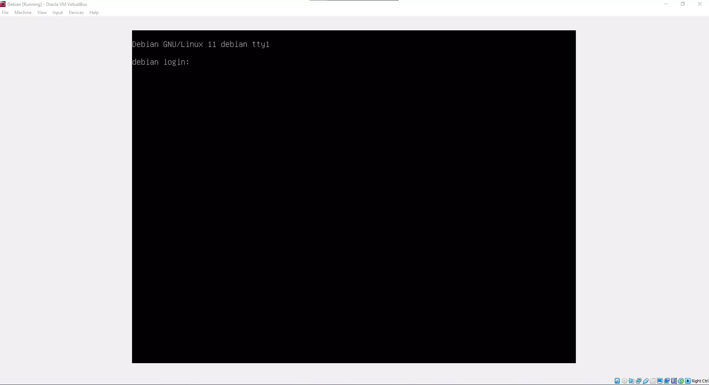

登录 CLI 控制台后，请同步本地包索引并升级所有基础系统包：

```shell
sudo apt update
sudo apt upgrade -y
```

### 2. 安装 Solana 工具套件 (Solana Tool Suite)

为了直接与 Solana 账本进行交互，请安装官方的 Solana CLI 二进制文件：

```shell
sh -c "$(curl -sSfL https://release.solana.com/v1.8.5/install)"
```

安装脚本完成后，请通过退出当前会话并重新登录，或者执行以下命令来刷新活跃的 shell 环境变量：

```shell
source ~/.profile
```

### 3. 生成非对称加密密钥对

Solana 网络上的每个钱包都由一对非对称加密密钥对表示，其中包括公钥（钱包地址）和私钥（授权支付权限）。生成一个新的本地密钥对：

```shell
solana-keygen new
```

在生成过程中，系统会提示你输入一个可选的 BIP39 口令（passphrase）。完成后，系统将输出你的公钥以及一个 12 词的助记词（mnemonic seed phrase）。

> **警告：** 你的 12 词助记词是访问你资金的主密钥。请务必将其离线抄写并妥善保管。切勿与他人分享，也不要以明文形式存储。

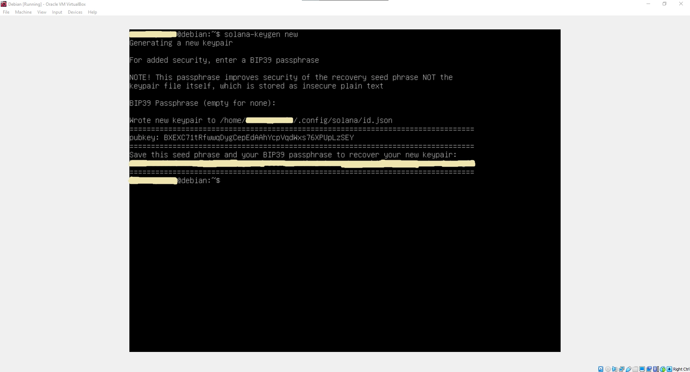

### 4. 为铸造钱包充值

若要购买支付 Gas 所需的 SOL 代币，请使用币安 (Binance) 等交易所：

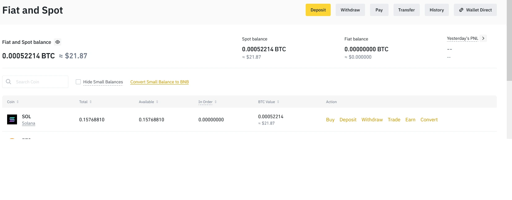

获取 SOL 后，从交易所执行转账至你刚刚生成的**公钥**（钱包地址）：

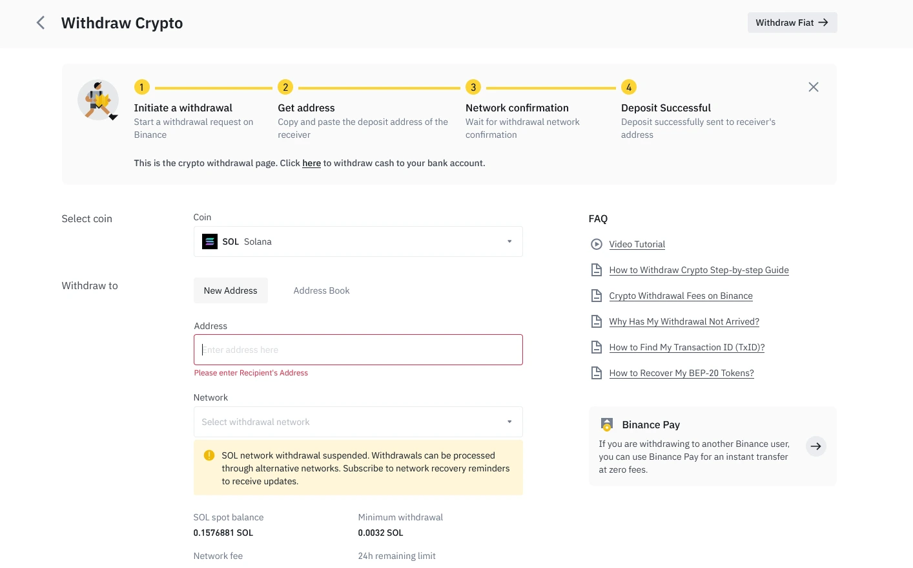

若要确认交易已结算，并直接在你的 Debian 终端中检查当前余额，请执行：

```shell
solana balance
```

### 5. 编译 Rust 及开发者库

Solana 程序库 (SPL) 命令行界面需要 **Rust 编译器** 来构建本地配置。

安装 Rustup 和默认的 Cargo 工具链：

```shell
curl https://sh.rustup.rs -sSf | sh
```
*(出现提示时按 `1` 继续标准安装)*

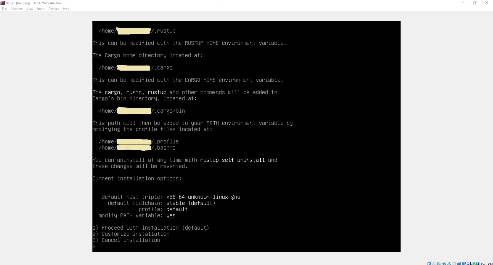

重新加载你的 shell 配置文件或执行 `source $HOME/.cargo/env`。接下来，安装系统编译器依赖项：

```shell
sudo apt install -y libudev-dev libssl-dev pkg-config build-essential
```

使用 Cargo 全局编译并安装 SPL Token CLI 工具：

```shell
cargo install spl-token-cli
```

### 6. 初始化并铸造 SPL 代币

在完成工具编译并为钱包充值后，我们将在 Solana 账本上初始化自定义代币注册表。

#### 步骤 A：创建代币蓝图 (Blueprint)
初始化一个全新的 SPL 代币铸造程序 (mint)：

```shell
spl-token create-token
```
终端将输出你唯一的 **代币 ID (Token ID)**（即铸造地址）。

#### 步骤 B：建立代币账户
在钱包持有特定的 SPL 代币之前，必须建立一个与该特定铸造地址（mint ID）关联的关联代币账户 (Associated Token Account, ATA)：

```shell
spl-token create-account <YOUR_TOKEN_ID>
```

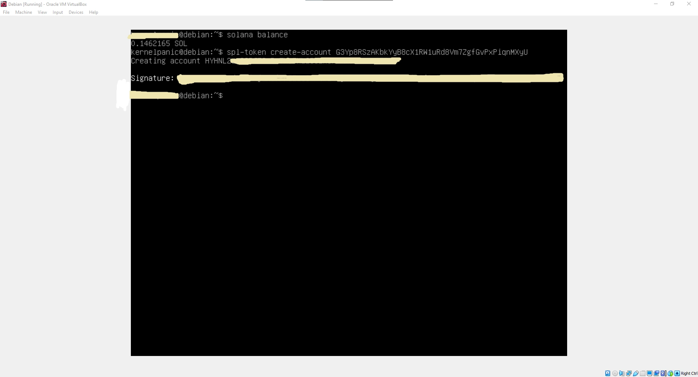

#### 步骤 C：铸造代币供应量
将你所需数量的代币铸造到你的关联代币账户中：

```shell
spl-token mint <YOUR_TOKEN_ID> <MINT_QUANTITY> <YOUR_ASSOCIATED_ACCOUNT_ID>
```

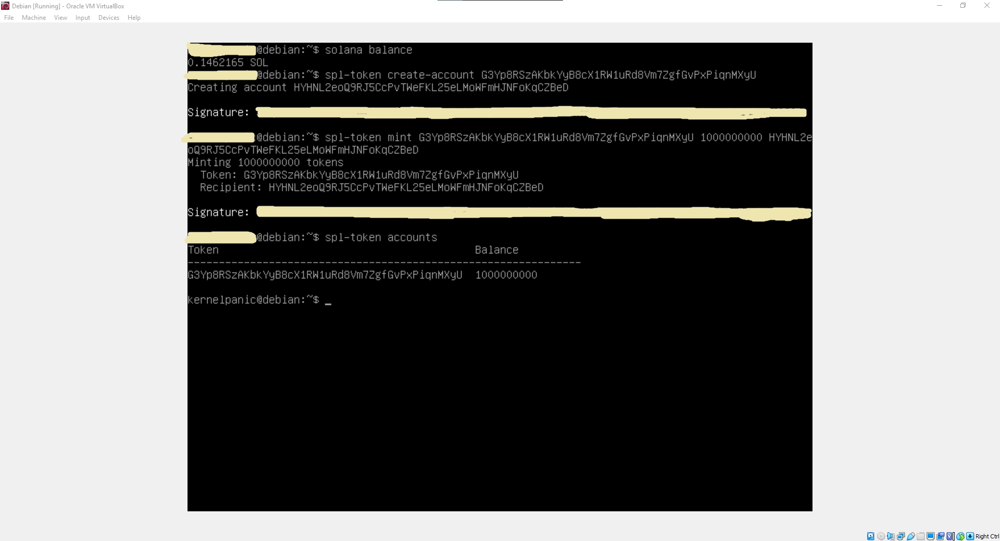

恭喜你！你的自定义代币现已在 Solana 区块链上正式上线。

### 7. 向接收方转账

若要分发代币，接收方必须拥有兼容的钱包。强烈推荐在移动端使用 Solflare，在网页浏览器中使用 Phantom Wallet。

使用 CLI 客户端执行转账。如果接收方尚未拥有该代币的账户，使用 `--fund-recipient` 和 `--allow-unfunded-recipient` 标志可以自动代为支付关联代币账户 (ATA) 的创建费用：

```shell
spl-token transfer --fund-recipient --allow-unfunded-recipient <YOUR_TOKEN_ID> <TRANSFER_AMOUNT> <RECIPIENT_WALLET_ADDRESS>
```

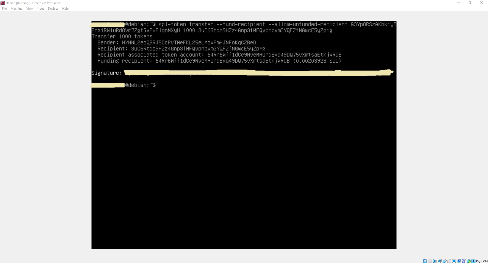

---

## 在 Solscan 上验证交易

Solana 交易可以实时审计。将你的 **代币 ID (Token ID)**（即铸造地址）粘贴到 [Solscan](https://solscan.io/) 中，即可查看交易历史、总供应量以及代币分布指标：

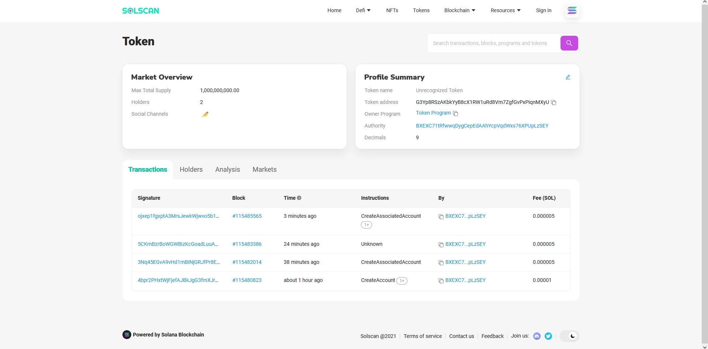

---

## 代币注册表：旧版与现代元数据标准

为了让你的代币图标、符号和名称显示在各种去中心化钱包和区块链浏览器中，你需要注册其元数据。

> **技术过渡说明：** 如本指南开头的更新警告中所述，基于 GitHub 的 `token-list` 注册表已被归档，取而代之的是 Metaplex。以下步骤详细说明了旧版工作流程，旨在提供关于早期去中心化注册表如何运作的历史背景参考。

### 旧版 GitHub 注册流程（历史参考）

此前，Solana 使用了一个基于 GitHub 的中心化存储库，将代币地址映射到元数据资产。

1.  准备一张代币的透明 PNG 格式图标（大小需在 200KB 以下）。
2.  创建一个 GitHub 账号，将该资产托管在公共仓库中，并命名为 `logo.png`：

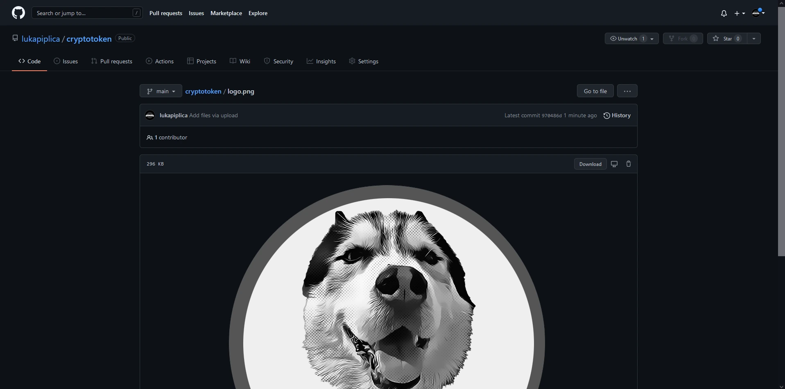

3. 导航至官方的 <a href="https://github.com/solana-labs/token-list" target="_blank" rel="noopener noreferrer">Solana Labs Token List 仓库</a> 并点击 <b>Fork</b>：

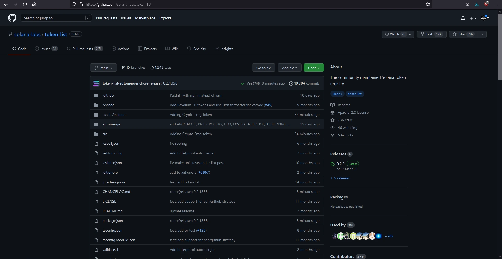

4.  在浏览器中，于 Fork 后的仓库内按下 `.` 键，启动 Visual Studio Code Online：

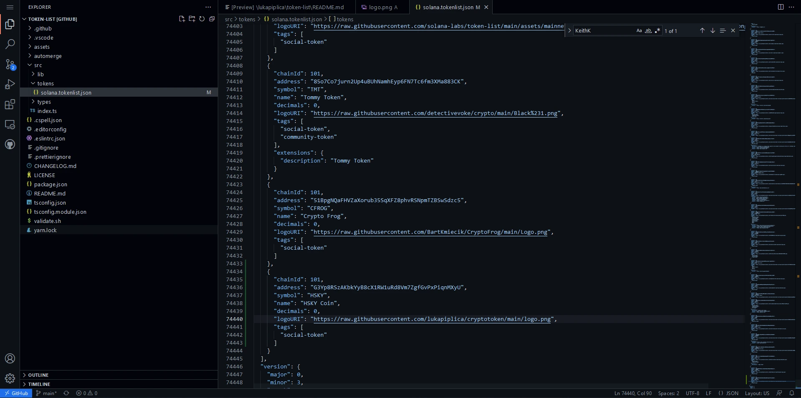

5.  定位到 `assets/mainnet` 目录，以你的 **代币 ID** 为名创建一个子文件夹，并上传你的 `logo.png`。
6.  导航至 `src/tokens/solana.tokenlist.json`，以 JSON 格式追加你的代币元数据配置块，提交更改，并向父级 Solana Labs 仓库提交 **拉取请求 (Pull Request, PR)**。

### 最终的代币产品

一旦被索引，HSKY 代币的自定义名称、供应量和图标即可在去中心化网页钱包中无缝显示：

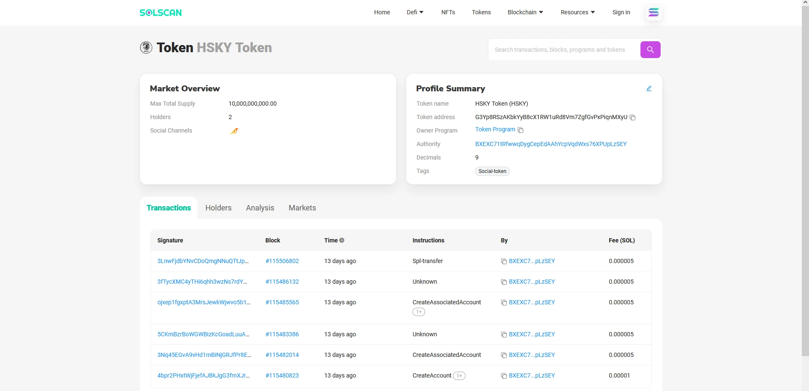

<div style={{ maxWidth: '280px', margin: '0 auto' }}>

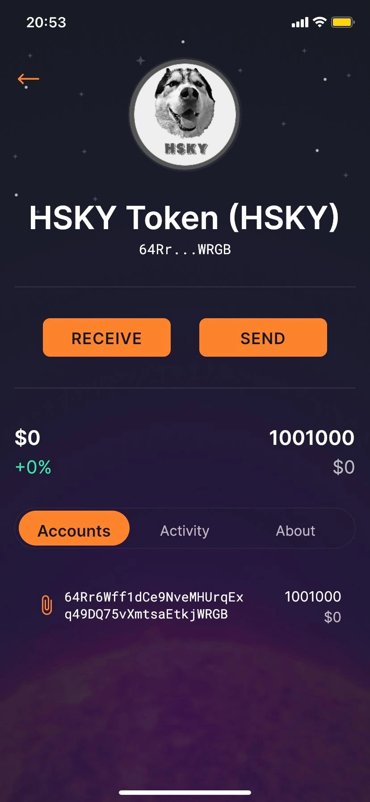

</div>

---

## 技术术语表：区块链集成词汇 (Technical Glossary: Blockchain Integration Lexicon)

| 术语 / 组件 | 技术概述 | 实际操作角色 |
| :--- | :--- | :--- |
| **SPL Token** | Solana 程序库代币 | 管理 Solana 区块链上自定义同质化和非同质化资产的代币标准。 |
| **Solana Tool Suite** | 账本交互命令行客户端 | 用于直接与 Solana RPC 节点通信、查询余额和查看交易日志的命令集。 |
| **Asymmetric Keypair** | 非对称加密密钥对 | 公共网络上的核心身份系统。公钥即为钱包地址；私钥用于授权签名。 |
| **Mnemonic Seed Phrase** | 12 词 BIP39 字典序列 | 私有种子的可读表示，用于衍生你的加密私钥。 |
| **Rust & Cargo** | 内存安全的系统编程语言及编译器 | 用于构建高性能智能合约二进制文件和工具套件的开发者运行环境。 |
| **`spl-token-cli`** | Rust 编译的代币命令套件 | 用于部署、铸造、冻结和转账自定义代币的特定命令行客户端。 |
| **Associated Token Account** | 程序派生地址 (PDA) | 链上创建的特定程序账户，用于将用户的钱包地址映射到特定的代币铸造地址 (Mint ID)。 |
| **Metaplex Protocol** | 链上元数据标准 | 用于铸造、显示和管理 NFT 及同质化代币元数据的现代去中心化智能合约标准。 |
| **Solscan** | 区块链交易浏览器 | 基于网页的账本审计工具，用于可视化交易、监控 Gas 消耗和验证代币持有者信息。 |

---

## 结论与架构回顾

直接从命令行 (CLI) 构建自定义代币，可以深入了解去中心化账本、公钥密码学和智能合约运行时引擎的核心原则。尽管传统的 GitHub 元数据路径已被 Metaplex 现代化的链上程序派生元数据标准所取代，但 Solana 程序库 (SPL) 底层的加密创建、铸造生命周期和钱包结构保持完全一致。

*在去中心化账本上部署自定义资产，展示了现代公钥密码学和系统自动化如何实现无缝的全球金融工具开发与无需许可的工程实践。*