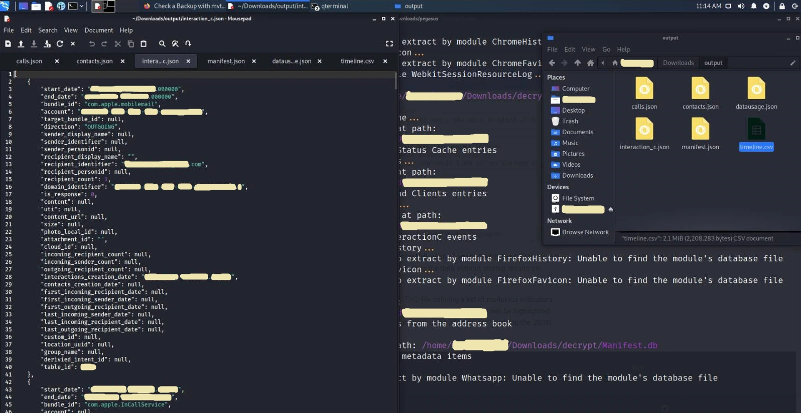

巴黎非营利组织 <a href="https://forbiddenstories.org/" target="_blank" rel="noopener noreferrer">Forbidden Stories</a> 与<a href="https://www.amnesty.org/en/" target="_blank" rel="noopener noreferrer">国际特赦组织（Amnesty International）</a>对 Pegasus 间谍软件活动的曝光，标志着现代网络安全领域的一个重要里程碑。调查显示，多个国家级攻击者利用由以色列公司 <a href="https://en.wikipedia.org/wiki/NSO_Group" target="_blank" rel="noopener noreferrer">NSO Group</a> 开发的尖端商业级监控软件，在全球范围内针对政治家、外交官、人权活动人士和记者实施监控，并将调查结果分享给了 <a href="https://www.washingtonpost.com/" target="_blank" rel="noopener noreferrer">华盛顿邮报</a> 和 <a href="https://www.theguardian.com/international" target="_blank" rel="noopener noreferrer">卫报</a> 等知名媒体。

Pegasus 代表了一类高度复杂的移动端恶意软件。一旦成功部署到目标设备上，它就会在后台静默运行，窃取敏感通信数据（短信、WhatsApp、Signal、电子邮件）、提取系统日志、录制语音通话、追踪实时 GPS 位置，并通过设备的麦克风和摄像头捕捉环境媒体信息。

本技术指南分析了 Pegasus 的传播机制，并提供了使用 **移动验证工具包（Mobile Verification Toolkit, MVT）** 对 iOS 和 Android 设备进行数字取证的逐步操作指南。

---

## 技术机制：零点击漏洞的威力

在过去，移动端恶意软件的感染需要受害者进行某种形式的互动——例如点击钓鱼链接、恶意附件或遭受社会工程学攻击。然而，Pegasus 通过利用**零点击（zero-click）漏洞**取得了巨大的成功。

零点击漏洞完全不需要用户进行任何交互即可入侵设备。这些攻击通常针对在用户收到通知之前处理传入数据的系统守护进程（daemons）。例如，通过发送特制的 iMessage 载荷或 WhatsApp 数据包，该恶意软件会在底层操作系统的渲染库（例如苹果处理 PDF 或 JBIG2 图像的 CoreGraphics 库）中触发内存损坏漏洞（如整数溢出或缓冲区溢出）。

应用程序或守护进程会静默崩溃，以 root 级权限执行 shellcode，下载核心载荷并建立持久化机制——而这一切都发生在目标手机响铃或显示通知之前。这些漏洞被归类为**零日漏洞（zero-day exploits）**，因为它们针对的是软件厂商尚未知晓的漏洞，在安全补丁开发和部署完成之前，目标设备几乎毫无防备。

---

## 取证框架：移动验证工具包（MVT）

<a href="https://github.com/mvt-project/mvt" target="_blank" rel="noopener noreferrer">移动验证工具包（MVT）</a> 是一个开源、模块化的取证分析框架，旨在获取和分析移动系统的日志、数据库记录以及系统配置。MVT 通过解析历史系统痕迹，来识别与 Pegasus 入侵痕迹相匹配的已知失陷指标（IOCs）。已知的威胁特征和 IOC 数据集正在 <a href="https://github.com/AmnestyTech/investigations/tree/master/2021-07-18_nso" target="_blank" rel="noopener noreferrer">AmnestyTech Investigations GitHub</a> 上持续编译更新。

### 前提条件与取证工作台搭建

虽然 MVT 可以在大多数基于 Debian 的 Linux 环境中运行，但本指南将使用 **Kali Linux** 作为主要的取证工作站。

#### 1. 同步取证环境
确保所有系统软件包库均已完全更新：

```shell
sudo apt update
sudo apt upgrade -y
```

#### 2. 安装核心依赖
MVT 需要 Python 3、软件包编译器以及 USB 通信库，以便与连接的移动设备进行交互：

```shell
sudo apt install -y python3 python3-pip libusb-1.0-0 git
```

#### 3. 从源码安装 MVT
下载最新的 MVT 存储库，在本地编译工具包，并更新系统 shell 的执行路径：

```shell
cd ~/Downloads
git clone https://github.com/mvt-project/mvt.git
cd mvt
pip3 install .
```

要全局执行 MVT 二进制文件，请将本地用户二进制路径添加到您的环境变量路径中：

```shell
export PATH=$PATH:/home/$USER/.local/bin
```
*(请务必将 `$USER` 替换为您的 Linux 系统活动用户名，或将此命令直接追加到您的 `~/.bashrc` 或 `~/.zshrc` 文件中)。*

#### 4. 获取国际特赦组织 IOC 特征码
克隆国际特赦组织调查（Amnesty International Investigations）的官方存储库，其中包含经过验证的飞马（Pegasus）失陷指标（IOCs）的历史数据库（特别是 `.strix2` 特征码文件）：

```shell
cd ~/Downloads
git clone https://github.com/AmnestyTech/investigations.git
```

---

## iOS 设备的数字取证

通过 MVT 进行 iOS 取证分析，涵盖了对历史数据库记录、SQLite 结构以及缓存网络请求的分析。要执行此操作，必须首先获取目标设备操作系统结构的副本。

### 数据获取：文件系统转储 vs. iTunes 备份

获取 iOS 取证数据主要有两种方法：
1. **文件系统转储 (Filesystem Dump)：** 需要对 iOS 内核进行完整越狱（例如，利用像 <a href="https://checkra.in/" target="_blank" rel="noopener noreferrer">checkra1n</a> 这样的硬件漏洞）。此方法可提供对整个根目录、系统缓存和原始分区的绝对读取权限。然而，越狱会使设备保修失效，并可能改变系统文件的取证完整性。
2. **加密的 iTunes 备份 (Encrypted iTunes Backup)：** 一种不会破坏设备且能保持保修的替代方案。至关重要的是，**备份必须使用本地密码进行加密**。加密备份会强制 iOS 导出高度敏感的本地数据库（包括 Safari 历史记录、通话记录、短信数据库以及应用程序数据），这些数据出于安全考虑通常会被排除在纯文本备份之外。

### iOS 取证操作步骤指南

1. 将目标 iPhone 连接到工作站，并通过 iTunes（Windows/macOS）或在 Linux 上使用 `idevicebackup2` 执行**加密备份**。
2. 找到备份文件夹，该文件夹以设备的唯一设备识别码 (UDID) 命名。
3. 将该 UDID 文件夹传输到您的 Linux 取证环境中（例如，传输到您的 `~/Documents` 目录中）。
4. 创建一个解密目标目录，并利用 MVT 对备份进行解密：

```shell
mkdir -p ~/Documents/decrypted
mvt-ios decrypt-backup -p 'YOUR_DECRYPTION_PASSWORD' -d ~/Documents/decrypted ~/Documents/<UDID_FOLDER_NAME>
```

5. 创建一个目标输出文件夹，用于存储生成的取证报告：

```shell
mkdir -p ~/Downloads/output_forensics
```

6. 执行 MVT 扫描引擎，将解密后的 iOS 备份数据库结构与验证过的 Pegasus STIX2 特征指标进行比对：

```shell
mvt-ios check-backup -i ~/Downloads/investigations/2021-07-18_nso/pegasus.strix2 -o ~/Downloads/output_forensics ~/Documents/decrypted
```

MVT 将系统地解析所有数据库。如果检测到与恶意请求、进程或短信载荷匹配的签名，终端将显示关键警告输出。



---

## Android 设备的数字取证

由于 Android 操作系统的碎片化特性，对该设备的取证极具挑战性。MVT 主要利用两个检测向量：APK 文件完整性检查和电话数据库解析。

### 1. APK 完整性与声誉验证

Android 上的恶意应用程序通常伪装成良性工具。MVT 可以直接从设备中提取已安装的软件包，并将其加密哈希值与全球威胁情报网络进行交叉比对。

1. 在目标 Android 设备的“开发者选项”菜单中启用 **USB 调试 (USB Debugging)**。
2. 通过 USB 将设备连接到您的取证工作站，并在手机屏幕上授权 ADB 密钥。
3. 创建一个输出文件夹，并下载所有处于活动状态的系统及用户 APK 二进制文件：

```shell
mkdir -p ~/Downloads/output_forensics
mvt-android download-apks -o ~/Downloads/output_forensics
```

4. 若要自动查询所有已提取应用程序的 SHA256 哈希值并与 <a href="https://www.virustotal.com/gui/" target="_blank" rel="noopener noreferrer">VirusTotal</a> 数据库进行比对，请在执行提取时加上 API 标志：

```shell
mvt-android download-apks -o ~/Downloads/output_forensics --virustotal
```

### 2. 电话与短信数据库分析

Pegasus 通常通过包含特定链接的恶意短信启动感染途径。

1. 使用 ADB 触发系统电话提供商数据库的备份：

```shell
adb backup com.android.providers.telephony
```

2. 在目标设备屏幕上授权备份传输。数据库将以 Android 备份文件 (`backup.ab`) 的格式存储在本地。
3. 若要读取 `.ab` 归档文件，请使用基于 Java 的 <a href="https://github.com/nelenkov/android-backup-extractor" target="_blank" rel="noopener noreferrer">Android 备份提取器 (ABE)</a> 工具提取其内容：

```shell
java -jar ~/Downloads/abe.jar unpack backup.ab backup.tar
tar -xvf backup.tar
```

4. 扫描已解析的电话数据库，查找与 Pegasus 基础设施相匹配的可疑链接：

```shell
mvt-android check-backup -o sms .
```
*(可选，使用 `-i` 标志指向特定的 IOC 定义文件)。*

---

## 取证记录：已分析的核心 iOS 工件

解析完成后，MVT 会导出详细的 JSON 文件，记录关键系统数据库的状态。理解这些文件对于绘制攻击时间轴至关重要。

| 生成的工件 | 源系统路径 | 技术取证意义 |
| :--- | :--- | :--- |
| **`cache_files.json`** | `*Library/Caches/` SQLite 数据库 | 提取 HTTP/HTTPS 请求头和响应。对于识别最初的零点击下载触发器至关重要。 |
| **`calls.json`** | `/private/var/mobile/Library/CallHistoryDB/CallHistory.store` | 所有电话事件的历史日志，包括第三方安全应用程序（如 WhatsApp、Signal）的 VoIP 记录。 |
| **`chrome_favicon.json`** | `*Library/Application Support/Google/Chrome/Default/Favicons` | 解析网站图标。有助于跟踪静默触发的隐藏网页重定向（在 <a href="https://www.youtube.com/watch?v=X7OW5hTt5hY" target="_blank" rel="noopener noreferrer">YouTube</a> 上了解更多关于图标劫持漏洞的信息）。 |
| **`chrome_history.json`** | `*Library/Application Support/Google/Chrome/Default/History` | 在 Chrome 浏览器中进行的所有网站交互数据库。 |
| **`contacts.json`** | `/private/var/mobile/Library/AddressBook/AddressBook.sqlitedb` | 包含系统联系人的原始 SQLite 表。通常是数据库采集的目标向量。 |
| **`id_status_cache.json`** | `/private/var/mobile/Library/Preferences/com.apple.identityservices.idstatuscache.plist` | 跟踪 Apple ID、生物识别验证令牌和密钥的历史系统验证。 |
| **`interaction_c.json`** | `/private/var/mobile/Library/CoreDuet/People/interactionC.db` | 高价值数据库，用于监控底层后台系统事件和用户交互遥测。 |
| **`locationd_clients.json`** | `/private/var/mobile/Library/Caches/locationd/clients.plist` | 请求过活动 GPS 设备位置的所有进程和应用程序的缓存。 |
| **`manifest.json`** | `Manifest.db` (iTunes 备份数据库) | 作为 iTunes 备份的文件分配注册表，将目标设备文件映射到本地备份哈希值。 |
| **`safari_history.json`** | `/private/var/mobile/Library/Safari/History.db` | 使用原生 Safari 浏览器执行的网络搜索、重定向和访问的详尽历史记录。 |
| **`sms.json`** | `/private/var/mobile/Library/SMS/sms.db` | 包含所有解析后的短信，专门过滤嵌入的 URL 以识别钓鱼载荷。 |
| **`version_history.json`** | `/private/var/db/analyticsd/Analytics-Journal-*.ips` | 跟踪历史操作系统更新、补丁级别和内核配置的分析日志。 |
| **`whatsapp.json`** | `*ChatStorage.sqlite` | 解密后的 WhatsApp 聊天记录，显示消息记录和嵌入的 HTTP 超链接。 |

---

## 结论与安全建议

以 Pegasus 为代表的间谍软件平台所带来的威胁，凸显了改变移动安全方法论的迫切需要。标准的沙箱和应用程序权限已不足以阻止利用零点击内核漏洞的国家级攻击者。

### 移动设备加固最佳实践

1. **减少攻击面：** 禁用处理未经请求的传入文件的服务。在现代 iOS 设备上，启用 **锁定模式 (Lockdown Mode)** 可以默认拦截高度复杂的网络技术、原始图形解析以及绕过沙箱的附件。
2. **定期重启设备：** 由于许多零点击漏洞依赖易失性内存执行来保持隐蔽性，定期重启设备可以中断攻击链并干扰持久化执行。
3. **执行日常取证审计：** 对于高风险个体，定期提取系统备份并使用 MVT 等工具进行分析，是主动威胁检测的重要步骤。
4. **采用安全硬件与操作系统：** 迁移至隐私加固型操作系统（如 Android 上的 <a href="https://grapheneos.org/" target="_blank" rel="noopener noreferrer">GrapheneOS</a>，或运行 GerdaOS 的诺基亚 8110 4G 等标准硬件）可显著提高设备抵御零点击漏洞的能力。如需从更广泛的政治和人权角度了解 Pegasus，请观看爱德华·斯诺登（Edward Snowden）接受<a href="https://www.theguardian.com/news/2021/jul/19/edward-snowden-calls-spyware-trade-ban-pegasus-revelations" target="_blank" rel="noopener noreferrer">《卫报》采访</a>时的深刻见解。

*本数字取证指南仅供教育和诊断使用，旨在演示如何审计移动设备以发现可疑入侵指标，并促进主动的威胁情报工作。*