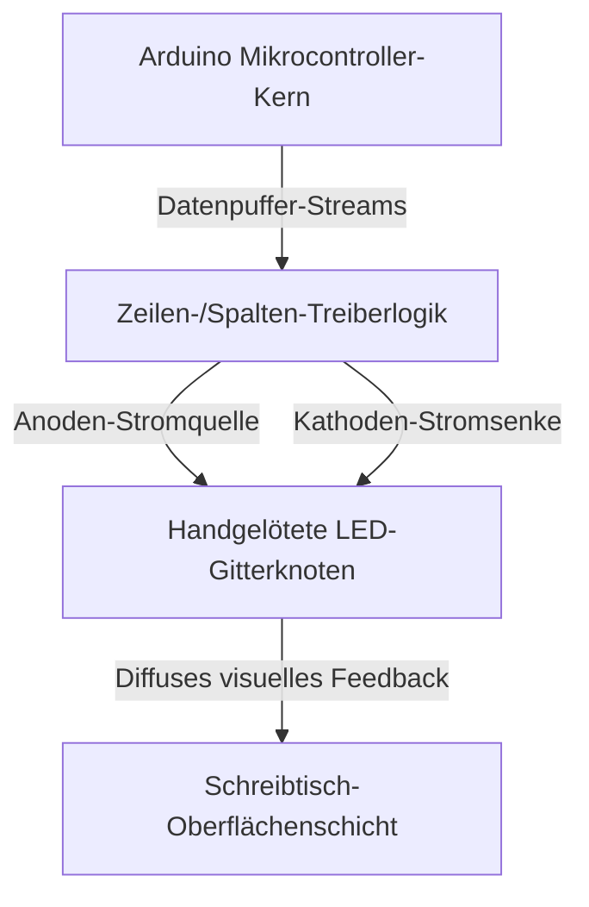

import ProjectGallery from '../../../components/projects/ProjectGallery.astro';
import ledDeskPic from '../../../assets/projects/led-desk/featured.webp';

## Das Briefing

Interaktive Möbel und großflächige Anzeige-Displays erfordern eine robuste Hardware-Koordination, um mehrere Lichtzonen ohne explodierende Komponentenkosten zu steuern. Entwickelt als kompetitiver Team-Beitrag für die nationalen technischen Disziplinen, konzentrierte sich dieses Projekt auf den Entwurf und die Konstruktion eines voll funktionsfähigen „Programmable LED Desk“ – eines strukturellen Arbeitsplatzes mit einem integrierten, adressierbaren LED-Gitter, das dynamische visuelle Indikatoren, geometrische Muster und Lauftext rendern kann.

Die primäre technische Herausforderung lag in der schieren Dimension der manuellen Hardware-Konstruktion und des Daten-Routings. Anstatt auf vorgefertigte kommerzielle LED-Panels zurückzugreifen, erforderte das Kern-Matrix-Layout manuelle strukturelle Platzierung, diskrete Komponentenísolierung und dichte Point-to-Point-Lötarbeiten. Auf der Softwareseite bestand die Aufgabe darin, eine optimierte Embedded-Firmware zu entwickeln, um Frame-Buffer-Berechnungen, Zeilen-/Spalten-Scanning-Logik und flüssige räumliche Übergänge auf einer ressourcenbeschränkten Mikrocontroller-Architektur zu verarbeiten.

Der fertige Prototyp in Industriequalität wurde auf dem **nationalen Wettbewerb „XI Festival rada“ (Ausstellung technischer Arbeiten) in Bužim** präsentiert, wo er den **1. Platz** in seiner Kategorie belegte.

## Aufgabenbereiche & Umsetzung

Dieses Projekt erforderte eine präzise Balance zwischen repetitiver physicalischer Montage mit Null-Toleranz-Schnittstellen und algorithmischer Software-Ausführung.

### Low-Level-Firmware-Entwicklung & Musterlogik
* **Algorithmische visuelle Generierung:** Entwurf und Programmierung maßgeschneiderter Firmware-Architekturen zur Berechnung und Ausgabe komplexer mathematischer Lichtmuster, räumlicher Wellen und Echtzeit-Aktualisierungsschleifen.
* **Text-Rendering-Matrix:** Entwicklung einer benutzerdefinierten Font-Mapping-Matrixschicht, die rohe Zeichenketten (Strings) in spezifische Pixel-Koordinaten-Zustände übersetzt, um scrollende Textdaten auf dem Display-Layout anzuzeigen.
* **Optimierte Ausführungsarchitektur:** Strukturierung der Kern-Laufzeitschleifen in Embedded C++, um einen effizienten Zeilendaten-Versand zu gewährleisten, sichtbares Flackern zu eliminieren und Display-Updates bei intensiven Berechnungsänderungen zu stabilisieren.

### Hardware-Prototyping & Matrix-Lötarbeiten
* **Manuelle Gitter-Montage:** Eigenhändige Mitentwicklung und Ausführung der physischen Montage der Display-Matrix. Jedes einzelne LED-Nodi im strukturellen Fußabdruck des Schreibtischs wurde manuell positioniert, ausgerichtet und mit den gemeinsamen Daten- und Stromschienen verlötet.
* **Signalleitungs-Konditionierung:** Konzeptionierung des internen Verkabelungs-Routings, einschließlich der Implementierung von Pull-up/Pull-down-Widerstandsnetzwerken, um elektronisches Übersprechen (Cross-talk), Signaldegradation und Spannungsabfälle über das dichte Hardware-Gitter hinweg zu verhindern.
* **Strukturelle Integration & Testing:** Nahtlose Integration der fertigen Kupfergitter-Matrix unter der schützenden Oberfläche des Schreibtischs, gefolgt von kontinuierlichen Stresstests, Multimeter-Diagnosen und thermischen Bewertungen, um einen sicheren Einsatz bei längeren öffentlichen Ausstellungen zu garantieren.

## Technischer Stack & Materialmatrix

* **Kern-Rechenarchitektur:** Arduino Microcontroller Development Framework
* **Anzeigeelemente:** Hochpräzise diskrete Leuchtdioden (LEDs), Transistor-Array-Schalter
* **Steuerungssoftware:** Embedded C/C++ Optimierungsschicht, Low-Level-Bitmanipulations-Routinen
* **Konstruktion & Fertigung:** Hochleitfähige Kupferverkabelung, thermische Präzisionslötsysteme, perforierte Isolierbasen
* **Analyse-Hardware:** Digitale Multimeter, Labornetzteile

## Matrix-Steuerungstopologie

Das Hardware-Layout des Systems fungiert als lokalisierte Koordinaten-Pipeline, bei der die Firmware individuelle Grafikpuffer verarbeitet und Ausführungssignale über Array-Treiber sendet, um präzise Display-Kreuzungspunkte aufleuchten zu lassen:

## Wettbewerbserfolge & Kennzahlen

| Metrik / Dimension | Leistungsnachweis | Technische Verifizierung |
| :--- | :--- | :--- |
| **Wettbewerbsplatzierung** | <a href="/assets/diplomas/1st-place-diploma-xi-festival-rada.pdf" target="_blank" rel="noopener noreferrer" data-astro-reload>Urkunde für den 1. Platz</a> | Nationale Ausstellung technischer Arbeiten (XI Festival Rada) in Bužim |
| **Fertigungsmethode** | 100% manuelle Komponentenverlötung | Vollständige Point-to-Point-Knotenleitungskonstruktion |
| **Rendering-Unterstützung** | Statischer/Lauftext & Muster | Koordinaten-Map-Vektorallokationslogik |
| **Systemzuverlässigkeit** | Fehlerfreie Ausführung | Mehrstündige Validierung des Diagnoselaufs unter Volllast |

---

## Fazit

Der Erfolg des „Programmable LED Desk“-Projekts krönte eine aufeinanderfolgende, mehrjährige Serie von technischen Meistertiteln. Die Bewältigung der strengen physischen Anforderungen beim manuellen Aufbau einer hochdichten Komponentenmatrix von Grund auf lieferte unschätzbares Fachwissen im Low-Level-Hardware-Debugging, der Signalpfadoptimierung und der eingebetteten Timing-Steuerung – strukturelle Kernkompetenzen, die meinen heutigen Ansatz in der modernen Softwareentwicklung maßgeblich stärken.

## Projektgalerie

<ProjectGallery images={[
  { 
    src: ledDeskPic, 
    alt: 'Messestand des programmierbaren LED-Schreibtischs, der die maßgeschneiderte Hardware-Integration und die Umgebungsbeleuchtung zeigt, die die nationale Meisterschaft gewonnen haben', 
    caption: 'Das preisgekrönte Projekt des programmierbaren LED-Schreibtischs, das vor Ort bei der nationalen Ausstellung präsentiert wird und das maßgeschneiderte eingebettete Hardware-Layout, den strukturellen Aufbau sowie die Synchronisation des Umgebungslichts hervorhebt, die den nationalen Meistertitel sicherten.' 
  }
]} />