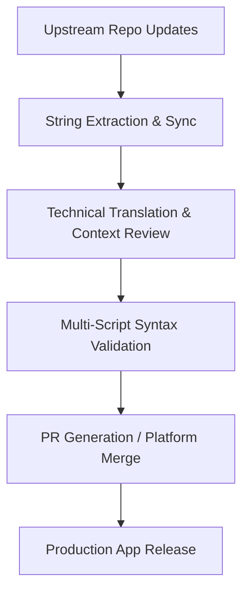

## Das Briefing

In der modernen Softwareentwicklung werden einflussreiche Sicherheitswerkzeuge, System-Utilities und Multimedia-Anwendungen oft nicht für kleinere, regionale Sprachen lokalisiert. Dies schafft eine spürbare Barriere für die Balkan-Community (Sprecher von Bosnisch, Kroatisch und Serbisch).

Ziel dieses übergreifenden Projekts ist es, präzise und technisch konsistente Übersetzungen für Open-Source-Anwendungen bereitzustellen. Technische Lokalisation geht weit über reines Übersetzen hinaus; sie erfordert ein tiefes technisches Verständnis von Sicherheitsprotokollen, UI/UX-Beschränkungen, Zeichenkodierungen und Multi-Script-Deployments (wie der nahtlose Wechsel zwischen lateinischen und kyrillischen Alphabeten), bez bez breaking-down-Effekte auf nachgelagerte App-Layouts oder kompilierte Translation-Strings.

## Verantwortlichkeiten & Kernbeiträge

Anstatt die Lokalisierung kao passiven Task zu betrachten, binde ich sie direkt in eine Continuous-Integration-Pipeline ein. Ich verwalte die Synchronisation von Übersetzungen aktiv über mehrere Enterprise-Lokalisierungsplattformen i direkte Versionskontrollsysteme hinweg.

### Wichtigste Beiträge & Projekte

* **Aegis Authenticator:** Lokalisierung dieser führenden, sicheren Open-Source-2FA-Android-Lösung via Crowdin. Der Fokus lag auf der präzisen Übersetzung kryptografischer Terminologie, hardwaregestützter Sicherheitsprotokolle und Anweisungen zur Sicherung/Wiederherstellung verschlüsselter Vaults, bei denen sprachliche Fehler zu Datenverlust führen könnten.
* **TizenBrew & TizenTube:** Verwaltung von Lokalisierungs-Workflows direkt in GitHub-Repositories unter Verwendung von JSON-Flat-File-Wörterbüchern. Dies umfasste das Aufsetzen von Lokalisierungstabellen, das Verwalten von Pull Requests (PRs), die Sicherstellung der Multi-Script-Konsistenz und das Implementieren experimenteller, benutzerdefinierter Sprach-Strings (wie Klingonisch-Variablen), um die zugrunde liegende i18n-Parsing-Engine der App zu testen.
* **Blowfish Theme (HUGO):** Technische Lokalisierung direkt über GitHub Pull Requests (PRs) für dieses performante Hugo-Framework-Ökosystem, um sicherzustellen, dass Konfigurationsbegriffe und Layout-Variablen für die regionale Developer-Community korrekt gemappt werden.
* **RetroArch:** Lokalisierung dieses legendären Open-Source-Multi-System-Emulator-Frontends via Crowdin, einschließlich der Übersetzung komplexer System-Settings, Core-Konfigurationen und emulierter Hardware-Interface-Parameter für eine optimale User Experience.
* **Gallery Compose:** Lokalisierung dieser modernen, leichtgewichtigen Android-Galerie-App, die mit Jetpack Compose gebaut wurde, via Crowdin, wobei UI-Komponenten und Media-Schema-Anweisungen direkt in das native Android-Ressourcen-Ökosystem gemappt wurden.
* **CustomRP:** Übersetzung des komplexen Konfigurations-Interfaces via PoEditor, um die Benutzerfreundlichkeit und Barrierefreiheit für die globale Discord-Rich-Presence-Entwickler-Community zu verbessern.

## Technischer Stack & Plattformen

* **Versionskontrolle & Workflows:** Git, GitHub (Branching, Konfliktlösung, Pull Requests)
* **Lokalisierungsplattformen:** Crowdin Enterprise, PoEditor
* **Standards & Paradigmen:** i18n String-Interpolation, Flat-File-Dictionaries (JSON, XML, ARB), Multi-Script-Systemmanagement (Lateinisch/Kyrillisch-Mapping)

## Der Workflow

Mein Lokalisierungsprozess spiegelt einen standardisierten Software Development Life Cycle (SDLC) wider, um zu garantieren, dass keine fehlerhaften Strings oder Syntaxfehler die Produktions-Pipelines erreichen:

*   **Kontext- & Code-Review:** Vor der Übersetzung inspiziere ich den Upstream-Quellcode oder die Ressourcendateien, um Variablenplatzierungen (`{user}`, `%s`), Layout-Limits und das dynamische Verhalten der Strings in der UI zu verstehen.
*   **Linguistische Normalisierung:** Ich setze standardisierte technische Terminologie für die bosnische, kroatische und serbische Sprache durch, damit komplexe Software-Engineering-Begriffe natürlich, aber dennoch hochprofessionell klingen.
*   **Syntax-Guarding:** Ich verifiziere String-Escapes, abschließende Leerzeichen und die Markdown-Syntax innerhalb des Lokalisierungs-Payloads manuell, um sicherzustellen, dass ein valider Build beim Kompilieren nicht beschädigt wird.

---

## Projekt-Ledger (Fortlaufende Matrix)

Nachfolgend finden Sie die verifizierte Übersicht der Open-Source-Projekte, die ich lokalisiert habe oder derzeit betreue. Diese Matrix wird kontinuierlich aktualisiert, sobald neue Übersetzungsmodule in die Produktion einfließen:

| Projekt- / Tool-Name | Plattform / Stack | Zielgruppe / Komponente |
| :--- | :--- | :--- |
| **Aegis Authenticator** | Crowdin / XML | Security / 2FA Vault Android App |
| **TizenBrew** | GitHub / JSON | Multimedia / Eigene OS-Integration |
| **TizenTube** | GitHub / JSON | Video-Streaming / Client-Side UI |
| **Blowfish Theme** | GitHub / YAML | Developer Framework / HUGO Ökosystem |
| **RetroArch** | Crowdin / C Strings | Frontend / Multi-System Emulator |
| **Gallery Compose** | Crowdin / XML | Multimedia / Android Jetpack Compose App |
| **CustomRP** | PoEditor / Rich Text | Entwickler-Tool / Discord Rich Presence |

---

## Verifizierung & Live-Metriken

Jeder Beitrag ist kryptografisch mit meinen Profilen verknüpft oder wurde explizit über verifizierte GitHub Pull Requests gemerged. Mein aktuelles Übersetzungsvolumen, freigegebene Strings und aktive Voting-Metriken innerhalb der Open-Source-Ökosysteme können direkt über meine öffentlichen Profile eingesehen werden:

* **Verifiziertes Crowdin-Profil & Beiträge:** <a href="https://crowdin.com/profile/lukapiplica" target="_blank" rel="noopener noreferrer">crowdin.com/profile/lukapiplica</a>
* **Open-Source-Code-Beiträge:** <a href="https://github.com/lukapiplica" target="_blank" rel="noopener noreferrer">github.com/lukapiplica</a>