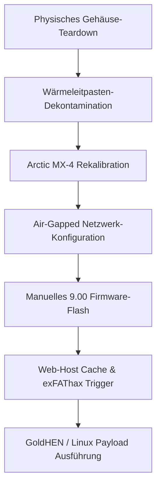

import img1 from "../../../assets/projects/ps4-restoration/1.webp";
import img2 from "../../../assets/projects/ps4-restoration/2.webp";
import img3 from "../../../assets/projects/ps4-restoration/3.webp";
import img4 from "../../../assets/projects/ps4-restoration/4.webp";
import img5 from "../../../assets/projects/ps4-restoration/5.webp";
import img6 from "../../../assets/projects/ps4-restoration/6.webp";
import img7 from "../../../assets/projects/ps4-restoration/7.webp";
import img8 from "../../../assets/projects/ps4-restoration/8.webp";

## Das Briefing
Gaming-Konsolen für Endverbraucher leiden über längere Lebenszyklen hinweg oft pod starkem thermischen Throttling und Leistungsabfällen, die durch Staubansammlungen und brüchig gewordene Wärmeleitpads oder -pasten verursacht werden. Dieses Systems-Engineering-Projekt konzentrierte sich auf die vollständige physische Restaurierung, thermische Optimierung und die Kernel-Einführung (Exploitation) einer PlayStation 4 Slim-Konsole.  

**Rechtlicher Haftungsausschluss:** Ich nutze diese PS4, um aus reiner technischer Neugier Linux zu installieren und damit zu experimentieren. Ich unterstütze oder toleriere keine Softwarepiraterie; dieser Artikel dient ausschließlich Bildungszwecken! Ich übernehme keine Verantwortung für Ihre Handlungen!  

Das Ziel war zweigeteilt: Erstens sollte das kritische thermische Throttling durch ein vollständiges Hardware-Teardown und eine präzise chemische Reinigung behoben werden; zweitens sollte ein kontrolliertes Firmware-Upgrade auf exakt die Version 9.00 durchgeführt werden, um über einen manuellen Web-Vektor-Kernel-Exploit (exfathax) eine unabhängige Linux-Laufzeitumgebung für Testzwecke sicher zu booten.

  

## Aufgabenbereiche & Umsetzung
Ich habe den gesamten Lebenszyklus dieses Projekts eigenständig durchgeführt und den Workflow zwischen physischem Hardware-Engineering und Low-Level-System-Exploitation aufgeteilt.

## Hardware-Restaurierung & thermisches Management
* **Vollständiges Teardown:** Durchführung einer umfassenden strukturellen Demontage des Konsolengehäuses, um Zugang zum Mainboard, den Lüftern und der internen Kühlkörperbaugruppe zu erhalten.

  

  

* **Chemische Dekontamination:** Einsatz von hochreinem Isopropylalkohol (IPA), um alte, degradierte originale Wärmeleitpasten rückstandslos zu entfernen, ohne die umliegenden empfindlichen SMD-Bauteile (Surface-Mount Devices) zu beschädigen.

  

* **Upgrade der thermischen Schnittstelle:** Reinigung der internen Kühlrippen und Applikation von Hochleistungs-Wärmeleitpaste (Arctic MX-4) durch ein optimiertes, gleichmäßiges Auftragen in einer dünnen Schicht. Dies senkte die Lautstärke der Konsole drastisch und beseitigte thermische Engpässe unter Rechenlast vollständig.

  

  

## Firmware-Manipulation & Exploitation
* **Air-Gapped OS-Optimierung:** Isolation der Konsole von automatisierten Sony-Netzwerk-Update-Pfaden durch vollständiges Umschreiben der System-Netzwerkschnittstellen. Automatische Telemetrie und Downloads wurden deaktiviert und ein spezielles primäres/sekundäres DNS-Routing (`192.241.221.79` / `165.227.83.145`) konfiguriert, um eingehende Vendor-Payloads sicher zu blockieren.
* **Manuelles Firmware-Upgrade:** Konstruktion einer strikt vorgegebenen statischen Ordnerstruktur (`/PS4/UPDATE/PS4UPDATE.PUP`) na einem exFAT-formatierten Blockspeichermedium, gefolgt vom Staging und Deployment eines offiziellen 9.00-Recovery-Systempartition-Images über einen lokalen Medien-Boot.

  

* **Kernel-Speicher-Exploitation:** Nutzung spezialisierter Web-Host-Caching-Tools (GoldHEN-Payload-Ökosysteme via Karo) zusammen mit einem externen Mechanismus zur Injektion roher Binärdaten (`exfathax.img`), das via Rufus auf ein USB-Laufwerk geschrieben wurde. Dies löste einen Speicherbegrenzungs-Bypass (Memory Boundary Bypass) über eine Sicherheitslücke im exFAT-Dateisystem-Parser aus.

## Technischer Stack & Hardware-Matrix
* **Hardware-Materialien:** Arctic MX-4 Wärmeleitpaste, Isopropylalkohol-Dekontaminationsmittel, spezialisierte Präzisionsschraubendreher
* **Exploitation-Frameworks:** GoldHEN Payloads, Web-Exploit-Vector-Engines (Karo), Rufus Block-Writer
* **Ziel-Betriebssystemarchitekturen:** Orbis OS (BSD-basiert), angepasste Client-seitige Embedded-Linux-Umgebungen

## System-Workflow-Pipeline
Die gesamte Bereitstellungspipeline folgte einer strikten Sequenz, um sicherzustellen, dass die Hardware-Stabilität vollständig etabliert war, bevor instabile Kernel-Speichermodifikationen zur Laufzeit ausgeführt wurden:

## Hardware- & System-Artefakt-Ledger
Nachfolgend finden Sie die technischen Spezifikationen der Bereitstellungszustände und Materialien, die während des gesamten System-Lebenszyklus verwaltet wurden:

| Systemkomponente | Technologie / Framework | Implementierungsstrategie |
| :--- | :--- | :--- |
| **Thermische Schnittstelle** | Arctic MX-4 Kohlenstoff-Verbindung | Erneuerung der Paste mit hoher thermischer Leitfähigkeit |
| **Firmware-Basis** | Sony System Image v9.00 | Gezielter Upgrade-Pfad über das Recovery-System |
| **Exploit-Vektor** | Webkit / exFAT-Dateisystemfehler | Manuelle Payload-Cache-Injektion über den Webbrowser |
| **Payload-Handler** | GoldHEN-Ökosystem | Low-Level Homebrew- & Kernel-Zugriffsvermittler |
| **Netzwerk-Gateway** | Custom Air-Gapped Manuelles DNS | Blockade von Sony-Telemetrie & Update-Vektoren |

## Endergebnis

    

### Fazit & Projektstatus
> **HINWEIS:** Falls Fehler auftreten oder die Konsole abstürzt, starten Sie die PS4 neu und versuchen Sie es erneut! Dieser Jailbreak ist nicht persistent, was bedeutet, dass nach einem Herunterfahren oder einem Neustart alle Schritte wiederholt werden müssen. Eine Lösung hierfür ist, die PS4 in den Restmodus (Bereitschaftsmodus) zu versetzen, oder die Payload-Auslieferung lokal über einen ESP32- oder Raspberry-Pi-Mikrocontroller zu automatisieren.

Die physische Restaurierung war ein vollständiger Erfolg: Die internen Lüftergeräusche der Konsole wurden dauerhaft eliminiert und thermisch bedingte Abstürze erfolgreich verhindert. Der Low-Level-exfathax-Kernel-Exploit erreichte eine Erfolgsquote bei der Initialisierung von ca. 80 % und bietet eine voll funktionsfähige Sandbox-Umgebung, die sich ideal für fortlaufende Linux-Kernel-Experimente i die Erforschung angepasster eingebetteter Systeme eignet.