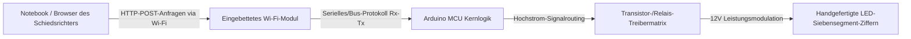

## Das Briefing

Traditionelle Sport-Anzeigetafeln (Scoreboards) basieren oft auf teuren, proprietären Hardware-Controllern oder kabelgebundenen Schnittstellen, die die Mobilität einschränken und die Installationskomplexität erhöhen. Entwickelt als Teil eines kompetitiven Schülerteams unter akademischer Mentorschaft, zielte dieses Projekt darauf ab, eine kostengünstige, weithin sichtbare und Wi-Fi-fähige Basketball-Anzeigetafel von Grund auf neu zu bauen.

Die Kernherausforderung bestand darin, ein durchgängiges Internet-of-Things-Ökosystem (IoT) zu konstruieren. Dies erforderte die Entwicklung maßgeschneiderter physischer Displays mit hoher Leuchtkraft zur Darstellung von Echtzeit-Spielmetriken, die Programmierung einer stabilen Embedded-Firmware zur Verarbeitung asynchroner Hardware-Interrupts und das Deployment eines lokalen drahtlosen Webservers, damit Schiedsrichter Spielstände und Timer nahtlos über jeden Browser-Client steuern können.

Das fertige System wurde beim **nationalen Wettbewerb „IX Festival rada“ (Ausstellung technischer Arbeiten) in Hadžići** präsentiert, wo es sich gegen technische Projekte aus dem ganzen Land durchsetzte und erfolgreich den **1. Platz** belegte.

## Aufgabenbereiche & Umsetzung

Dieses Projekt war eine gemeinschaftliche Teamleistung, die eine tiefe Synchronisation zwischen Softwarelogik, Netzwerkarchitektur und physischem Elektronik-Prototyping erforderte.

### Embedded-Software & drahtlose Vernetzung
* **Mikrocontroller-Firmware:** Unterstützung bei der Programmierung der zentralen Arduino-Mikrocontroller-Architektur, einschließlich der Implementierung einer State-Machine-Logik (Zustandsautomat) zur blockierungsfreien Verwaltung von Spiel-Timern, Countdown-Zyklen und strukturellen Ziffernberechnungen.
* **Lokale Webserver-Integration:** Mitentwicklung der Firmware für das integrierte Wi-Fi-Modul, sodass dieses als lokaler Access Point agieren und ein zustandsloses (stateless) HTML-Steuerungsportal hosten konnte.
* **Asynchroner Web-Inbound:** Mapping eingehender HTTP-Anfragen, die durch Benutzerinteraktionen auf dem Web-Terminal des Clients ausgelöst wurden, direkt in Hardware-Ausführungsroutinen, um Spielstände und Spielzeituhr-Parameter in Echtzeit zu verändern.

### Hardware-Entwicklung & physische Display-Architektur
* **Maßgeschneiderte Siebensegment-Module:** Entwurf und Bau großflächiger Siebensegmentanzeigen. Anstatt kleine kommerzielle IC-Komponenten zu verwenden, wurden hochdichte LED-Streifen manuell zugeschnitten, verkabelt und zu isolierten strukturellen geometrischen Segmenten verlötet.
* **Layout der Treiberschaltung:** Mitentwicklung der Hardware-Routing-Schnittstelle unter Verwendung od Tranzistoren und Relaismodulen, um die Strompfade von den Low-Power-Arduino-Logikpins sicher zu puffern und na die höheren Spannungsanforderungen der LED-Arrays anzupassen (Step-up).
* **Systemmontage & Integration:** Zusammenarbeit bei der Montage des strukturellen Hardware-Rahmens, dem Aufbau sauberer Common-Ground-Stromschienen und der Isolierung von Verbindungen, um eine zuverlässige physische Haltbarkeit während des Transports und bei Belastungstests im Live-Ausstellungsbetrieb zu garantieren.

## Technischer Stack & Materialmatrix

* **Zentrale Steuerungs-Hardware:** Arduino-Mikrocontroller-Ökosystem, eingebettete ESP8266/Wi-Fi-Modullayouts
* **Anzeigeelemente:** Hochdichte 12V-LED-Streifen, modifizierte strukturelle Polycarbonat-Gehäuse
* **Schnittstellentechnologien:** Native HTML5-Layouts, HTTP-Protokollschichten, Embedded C/C++ (Arduino IDE)
* **Fertigungswerkzeuge:** Präzisionslötausrüstung, digitale Multimeter, strukturelle Prototyping-Suites

## IoT-Infrastrukturtopologie

Die Orchestrierung von Hardware und Software folgte einer lokalisierten drahtlosen Schleife. Dadurch wurde sichergestellt, dass keinerlei externe Internetabhängigkeiten erforderlich waren, um die Betriebsbereitschaft während der Turniershow aufrechterhalten zu können:

## Projekt-Legacy & Kennzahlen

| Metrik / Dimension | Leistungsnachweis | Technische Verifizierung |
| :--- | :--- | :--- |
| **Wettbewerbsplatzierung** | <a href="/assets/diplomas/1st-place-diploma-ix-festival-rada.pdf" target="_blank" rel="noopener noreferrer" data-astro-reload>Urkunde für den 1. Platz</a> | Nationale Ausstellung technischer Arbeiten (IX Festival Rada) |
| **Schnittstellen-Latenz** | Nahezu verzögerungsfrei (&lt;50ms) | Lokalisierte Air-Gapped Wi-Fi-Routing-Implementierung |
| **Display-Fertigung** | 100 % maßgeschneiderte Konstruktion | Optimierung handgefertigter Matrix-Segmente |
| **Systemkosten** | Minimaler Budget-Footprint | Wesentlich kostengünstiger als proprietäre Industrie-Hardware |

## Fazit
Dieses Projekt stellt einen entscheidenden Meilenstein dar, der meine frühen Fähigkeiten in der Systemkonvergenz demonstriert. Die erfolgreiche Bewältigung struktureller Herausforderungen – wie das manuelle Löten, das Filtern von Signalleitungsrauschen und das eingebettete Web-Routing – lieferte das fundamentale Wissen im Low-Level-Debugging und dem physischen Schnittstellenmanagement, das heute direkt in meine moderne Full-Stack-Anwendungsentwicklung einfließt.