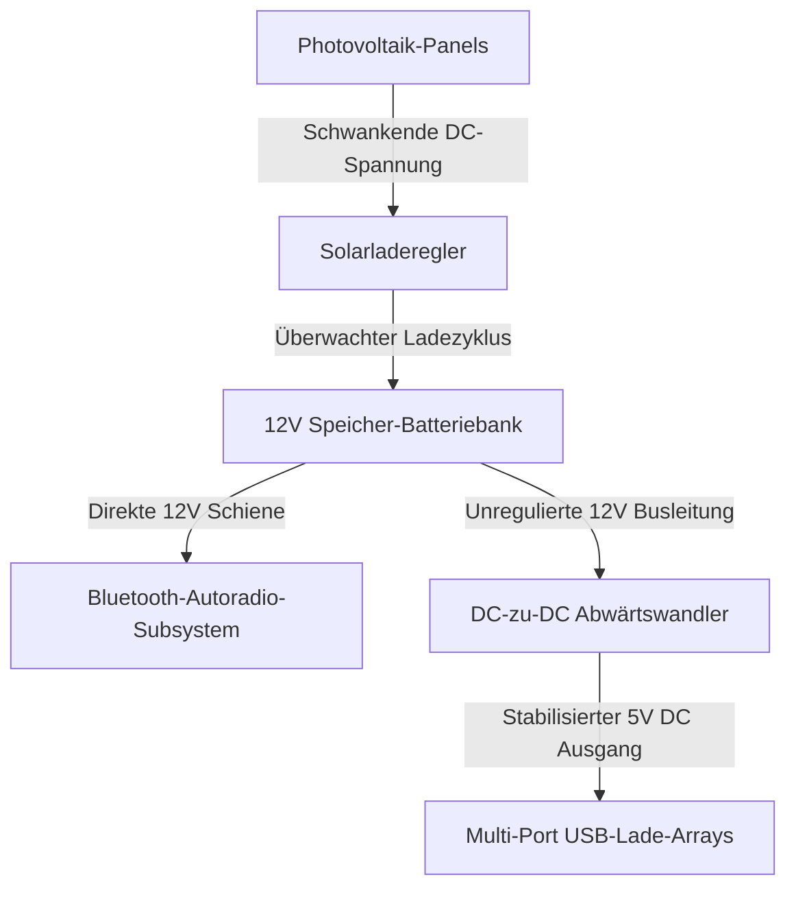

import ProjectGallery from '../../../components/projects/ProjectGallery.astro';
import solarTreePic from '../../../assets/projects/solar-tree/featured.webp';

## Das Briefing

Im Zuge des Wandels öffentlicher Infrastrukturen hin zu Smart-City-Frameworks gewinnen nachhaltige Energieknotenpunkte mit geringem Verbrauch in urbanen Räumen immer mehr an Bedeutung. Entwickelt als kompetitiver Teambeitrag unter akademischer Anleitung, zielte dieses Projekt darauf ab, den funktionalen Prototyp eines „Solar-Tree“ (Solar-Baum) zu konstruieren – eine netzunabhängige (off-grid) öffentliche Ladestation, die Solarenergie erntet und den Strom sicher an elektronische Endgeräte sowie lokalisierte drahtlose Audiosubsysteme verteilt.

Der Fokus des gesamten Engineering-Protokolls lag strikt auf der Integration der Hardware-Subsysteme. Das System musste unbeständige Umgebungssolarenergie einfangen, die schwankenden Gleichströme (DC) aus den Photovoltaikzellen stabilisieren, die Reservekapazität sicher in einer chemischen Batteriebank speichern und die Ausgangsspannung herabsetzen, um sauberen, geregelten Ladestrom an mehrere USB-Anschlüsse und ein integriertes, Bluetooth-fähiges Autoradio-Audiosystem zu liefern.

Der fertige Prototyp für grüne Energie wurde beim **nationalen Wettbewerb „X Festival rada“ (Ausstellung technischer Arbeiten) in Zenica** präsentiert, wo er sich gegen konkurrierende landesweite Installationen durchsetzte und erfolgreich den **1. Platz** belegte.

## Aufgabenbereiche & Umsetzung

Dieser Entwicklungszyklus basierte stark auf physischer Ausführung, präziser elektrischer Verteilung und einer sicheren Partitionierung der Leistungsstufen.

### Photovoltaik-Einspeisung & Isolation der Batteriespeicherung
* **Integration der Solarmatrix:** Mitkonfiguration des Deployments der hocheffizienten Solarpanel-Module einschließlich der Montage der strukturellen Arrays zur Maximierung der Lichteinfallswinkel.
* **Optimierung der Ladeschleife:** Verkabelung der Photovoltaik-Ausgänge in eine dedizierte Ladereglerschleife, wodurch ein zuverlässiges mehrstufiges Batterieladeverfahren etabliert wurde, um den chemischen Akkumulatorkern vor Überladung und Rückströmen zu schützen.
* **Kapazitätsverteilung:** Isolation und Management der Leitungsführung für Starkstromkabel zwischen den Solarpanels, den Batteriebänken und dem zentralen Verteiler-Klemmenblock.

### Ausgangsregelung & Verkabelung der Subsysteme
* **Stabilisierte USB-Ausgangs-Arrays:** Unterstützung beim Entwurf und Testen der Spannungsregelungsschaltung unter Verwendung von Abwärtswandlern (Buck-Konvertern), um die native Batteriespannung auf ein festes 5V-DC-Ausgangslayout herunterzustufen. Dies ermöglichte das gleichzeitige, sichere Laden mehrerer mobiler Endgeräte.
* **Deployment der Bluetooth-Audioeinheit:** Konfiguration des internen elektrischen Layouts zur Stromversorgung eines standardmäßigen Autoradios mit hohem Stromverbrauch, das mit einer Bluetooth-Schnittstelle für drahtloses Medienstreaming ausgestattet war. Mein Fokus lag hierbei auf der Entkopplung der Audio- und Stromleitungen, um hochfrequente HF-Störungen und Erdschleifen (Ground Loops) auf den aktiven Ladekanälen zu verhindern.
* **Gehäusemontage & öffentliche Sicherheit:** Zusammenarbeit bei der gesamten strukturellen Montage, dem Löten von Hochleistungsverbindungen, dem Aufschrumpfen von Thermoschläuchen an anfälligen Leitungsunterbrechungen und der Erdung des internen Chassis, um die Betriebszuverlässigkeit während der Live-Präsentationen vor Publikum zu gewährleisten.

## Technischer Stack & Materialmatrix

* **Energieerfassungs-Hardware:** Hocheffiziente Photovoltaik (PV)-Solarpanel-Arrays
* **Leistungsmanagement:** DC-zu-DC-Abwärtswandler (Buck-Konverter für 5V-USB-Staging), dedizierte Solarladeregler
* **Energieakkumulation:** Versiegelte Blei-Säure-Deep-Cycle-Speicherbatteriebank (SLA)
* **Konnektivität & Audio:** Bluetooth-fähiges 12V-Autoradio, USB-Multiport-Lade-Hubs
* **Fertigungs- & Testwerkzeuge:** Digitale Voltmeter, Bluetooth 4.0/HF-Signalprüfgeräte, Hochleistungslötstationen, schützende Isolationsmatrix

## Elektrischer Verteilungsworkflow

Die gesamte Infrastrukturarchitektur arbeitete als ein vom Stromnetz getrenntes (air-gapped), geschlossenes DC-Verteilungssystem. Dadurch entfielen teure AC-Wechselrichter und Energieverluste durch mehrfache Konvertierungen wurden minimiert:

## Wettbewerbsnachweise & Kennzahlen

| Metrik / Dimension | Leistungsnachweis | Technische Verifizierung |
| :--- | :--- | :--- |
| **Wettbewerbsplatzierung** | <a href="/assets/diplomas/1st-place-diploma-x-festival-rada.pdf" target="_blank" rel="noopener noreferrer" data-astro-reload>Urkunde für den 1. Platz</a> | Nationale technische Ausstellung (X Festival Rada) in Zenica |
| **Ausgangsregelung** | Saubere 5V-DC-Schienen | Implementierung isolierter Feedback-Abwärtswandler |
| **Systemautonomie** | 100 % netzunabhängig (Off-Grid) | Abhängigkeitsfreie lokale Solar-Verteilungsschleife |
| **Drahtlose Schnittstelle** | Integriertes Bluetooth-Streaming | Strategie zur parallelen Stromschienen- & HF-Rauschentkopplung |

## Fazit
Das erfolgreiche Deployment und die Verteidigung des Solar-Tree-Prototyps auf der nationalen Ausstellung haben unseren interdisziplinären Ansatz beim Systembau eindrucksvoll bestätigt. Die Balance zwischen Hochstrom-Batteriesicherheit, der Stromverteilung für Low-Power-Endgeräte und drahtlosen HF-Subsystemen lieferte tiefgehendes, praktisches Engineering-Wissen in den Bereichen Hardwareschutz, Stromstärkekalkulation (Current Budgeting) und modularer physischer Montage. Diese Erfahrungen prägen bis heute maßgeblich das Design meiner strukturellen Systemarchitekturen.

## Projektgalerie

<ProjectGallery images={[
  { 
    src: solarTreePic, 
    alt: 'Ausstellung des technischen Prototyps des Solarbaums, der die nachhaltige Energieinstallation und die integrierten Solarmodule zeigt', 
    caption: 'Der vollständig montierte technische Prototyp des Solarbaums bei der öffentlichen Ausstellung, der die strukturelle Integration von Photovoltaik-Modulen und das nachhaltige architektonische Design zeigt.' 
  }
]} />