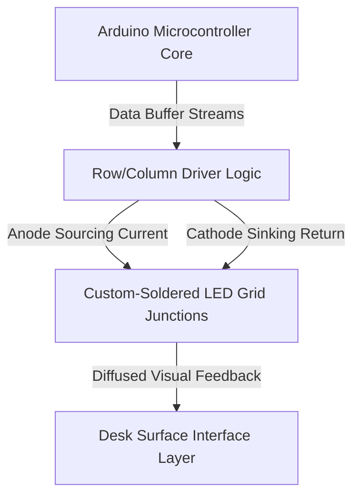

import ProjectGallery from '../../../components/projects/ProjectGallery.astro';
import ledDeskPic from '../../../assets/projects/led-desk/featured.webp';

## The Brief

Interactive furniture and large-scale indicator displays require robust hardware coordination to manage multiple lighting zones without high component costs. Developed as a competitive team entry for the national technical disciplines, this project focused on designing and constructing a fully functional "Programmable LED Desk"—a structural workstation embedded with a custom-built, addressable LED grid capable of rendering dynamic visual indicators, geometric patterns, and scrolling text.

The primary engineering obstacle was the sheer scale of manual hardware fabrication and data routing. Instead of deploying off-the-shelf commercial LED panels, the core matrix layout required manual structural placement, discrete component isolation, and dense point-to-point soldering. On the software side, the challenge lay in developing optimized embedded firmware to handle frame-buffer calculations, row/column scanning logic, and smooth spatial transitions on a constrained microcontroller architecture.

The finalized industrial-grade prototype was showcased at the **National Competition \"XI Festival rada\" (Exhibition of Technical Works) in Bužim**, where it secured **1st Place** in its category.

## What I Managed & Build

This project demanded a precise balance between repetitive, zero-tolerance physical assembly and algorithmic software execution.

### Low-Level Firmware Development & Pattern Logic
* **Algorithmic Visual Generation:** Designed and programmed custom firmware architectures to calculate and output complex mathematical lighting patterns, spatial waves, and real-time refresh loops.
* **Text Rendering Matrix:** Engineered a custom font-mapping matrix layer, translating raw character strings into specific pixel-coordinate coordinate states to display scrolling textual data across the display layout.
* **Optimized Execution Architecture:** Structured the core runtime loops in Embedded C++ to ensure efficient row data dispatching, eliminating visible flickering and stabilizing display updates under intense calculation shifts.

### Custom Hardware Prototyping & Matrix Soldering
* **Manual Grid Assembly:** Personally co-engineered and executed the physical assembly of the display matrix. Every single LED node throughout the desk structural footprint was manually positioned, aligned, and soldered to the common data and power rails.
* **Signal Line Conditioning:** Formulated the internal wiring routing framework, implementing pull-up/pull-down resistor networks to prevent electronic cross-talk, signal degradation, and power drops across the dense hardware grid.
* **Structural Integration & Testing:** Integrated the finalized copper grid matrix seamlessly underneath the desk’s protective surface layer, executing continuous stress tests, multi-meter diagnostic checks, and thermal evaluations to guarantee safe deployment for prolonged public exhibitions.

## Technical Stack & Materials Matrix

* **Core Compute Architecture:** Arduino Microcontroller Development Framework
* **Display Elements:** High-Brightness Discrete Light Emitting Diodes (LEDs), Transistor Array Switches
* **Control Software:** Embedded C/C++ Optimization Layer, Low-Level Bit-Manipulation Routines
* **Fabrication Arrays:** High-Conductivity Copper Wiring, Precision Thermal Soldering Systems, Perforated Insulating Baselines
* **Analysis Hardware:** Digital Multimeters, Bench-Top Power Regulators

## Matrix Control Topology

The system hardware layout functions as a localized coordinate pipeline, where the firmware processes individual graphic buffers and dispatches execution signals through array drivers to illuminate precise display intersections:

## Championship Track Record & Impact

| Metric / Dimension | Achievement Record | Technical Verification |
| :--- | :--- | :--- |
| **Competition Rank** | <a href="/assets/certificates/1st-place-certificate-xi-festival-rada.pdf" target="_blank" rel="noopener noreferrer" data-astro-reload>1st Place Diploma</a> | National Exhibition of Technical Works (XI Festival Rada) in Bužim |
| **Fabrication Method** | 100% Manual Component Soldering | Full Point-to-Point Node Line Construction |
| **Rendering Support** | Static / Scrolling Text & Patterns | Coordinate-Map Vector Allocation Logic |
| **System Reliability** | Zero-Fault Execution | Multi-Hour Diagnostic Run Validation under Load |

## Conclusion
The success of the Programmable LED Desk project capped off an elite, consecutive multi-year run of technical championship titles. Confronting the rigorous physical demands of manually building a high-density component matrix from scratch provided invaluable expertise in low-level hardware debugging, signal path optimization, and embedded timing controls—core structural disciplines that heavily reinforce my approach to modern software engineering.

## Project Gallery 

<ProjectGallery images={[
  { 
    src: ledDeskPic, 
    alt: 'Programmable LED Desk exhibition booth showcasing the custom hardware integration and ambient illumination that won the national championship', 
    caption: "The award-winning Programmable LED Desk project displayed on-site at the national exhibition, highlighting the customized embedded hardware layout, structural assembly, and ambient light synchronization that secured the national champion title." 
  }
]} />