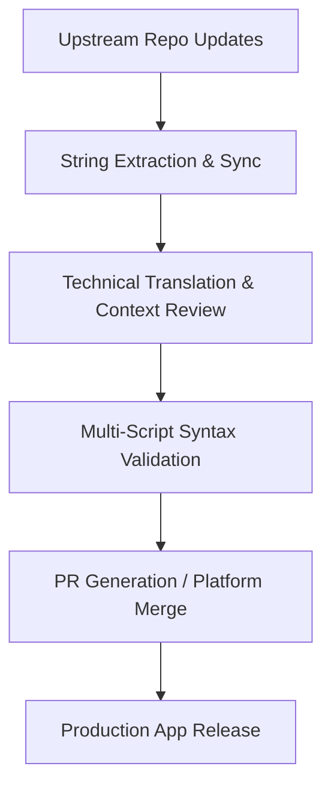

## The Brief

In modern software development, high-impact security tools, system utilities, and multimedia applications often overlook localization for smaller regional languages. This creates an accessibility barrier for the Balkan community (Bosnian, Croatian, and Serbian speakers).

My mission under this umbrella project is to provide precise, technically consistent translations for open-source applications. Technical localization goes far beyond literal translation; it requires a deep engineering understanding of security protocols, UI/UX constraints, character encoding, and multi-script deployment (seamlessly navigating between Latin and Cyrillic alphabets) without breaking downstream application layouts or compiled translation strings.

## What I Manage & Build

Instead of treating localization as a passive task, I treat it as a continuous integration pipeline. I actively manage translation synchronization across multiple enterprise-grade localization platforms and direct version control systems.

### Core Contributions & Projects

*   **Aegis Authenticator:** Localized this premier, secure, open-source 2FA Android solution via Crowdin. Focused on the precise translation of cryptographic terminology, hardware-backed security protocols, and encrypted vault backup/restore instructions where linguistic errors could result in user data loss.
*   **TizenBrew & TizenTube:** Managed localization workflows directly through GitHub repositories using JSON flat-file dictionaries. This included setting up localization tables, managing pull requests (PRs), ensuring multi-script consistency, and implementing experimental custom language strings (such as Klingon variables) to stress-test the application's underlying i18n parsing engine.
*   **Blowfish Theme (HUGO):** Contributed technical localization directly through GitHub Pull Requests (PRs) for this popular, high-performance Hugo framework ecosystem, ensuring precise configuration terms and layout variables map correctly for the regional developer community.
*   **RetroArch:** Localized this massive, legendary open-source multi-system emulator frontend via Crowdin, translating complex system settings, core configurations, and emulated hardware interface parameters to ensure optimal user experience.
*   **Gallery Compose:** Localized this modern, lightweight Android media gallery application built with Jetpack Compose via Crowdin, mapping UI components and media schema instructions directly within the native Android localized resource ecosystem.
*   **CustomRP:** Translated the complex configuration interface via PoEditor, improving the user experience and accessibility for the Discord Rich Presence global developer community.

## Technical Stack & Platforms

*   **Version Control & Workflows:** Git, GitHub (Branching, Conflict Resolution, Pull Requests)
*   **Localization Platforms:** Crowdin Enterprise, PoEditor
*   **Standards & Paradigms:** i18n string interpolation, flat-file dictionaries (JSON, XML, ARB), Multi-script system management (Latin/Cyrillic mapping)

## The Process

My localization workflow mimics a standard software development lifecycle (SDLC) to guarantee that zero broken strings or syntax errors reach production pipelines:

*   **Context & Code Review:** Before translating, I inspect the upstream source code or resource files to understand variable placements (`{user}`, `%s`), layout limits, and how strings behave dynamically in the UI.
*   **Linguistic Normalization:** I enforce standard technical terminology across the Bosnian, Croatian, and Serbian languages, ensuring that complex software engineering terms sound natural yet highly professional.
*   **Syntax Guarding:** I manually verify string escapes, trailing whitespaces, and markdown syntax inside the localization strings to ensure that a localized payload never breaks the compiled production build.

### Project Ledger (Continuous Matrix)

Below is the verified record of open-source projects I have localized or currently maintain. This ledger is updated continuously as new translation modules are shipped to production:

| Project / Tool Name | Platform / Stack | Target Audience / Component |
| :--- | :--- | :--- |
| **Aegis Authenticator** | Crowdin / XML | Security / 2FA Vault Android App |
| **TizenBrew** | GitHub / JSON | Multimedia / Custom OS Integration |
| **TizenTube** | GitHub / JSON | Video Streaming / Client-Side UI |
| **Blowfish Theme** | GitHub / YAML | Developer Framework / HUGO Ecosystem |
| **RetroArch** | Crowdin / C Strings | Frontend / Multi-System Emulator |
| **Gallery Compose** | Crowdin / XML | Multimedia / Android Jetpack Compose App |
| **CustomRP** | PoEditor / Rich Text | Developer Tool / Discord Rich Presence |

### Verification & Live Metrics

Every contribution is cryptographically bound to my profiles or explicitly merged via verified GitHub Pull Requests. You can track my live translation volume, approved strings, and active voting metrics across open-source ecosystems directly through my public profiles:

* **Verified Crowdin Profile & Contributions:** <a href="https://crowdin.com/profile/lukapiplica" target="_blank" rel="noopener noreferrer">crowdin.com/profile/lukapiplica</a>
* **Open Source Code Contributions:** <a href="https://github.com/lukapiplica" target="_blank" rel="noopener noreferrer">github.com/lukapiplica</a>