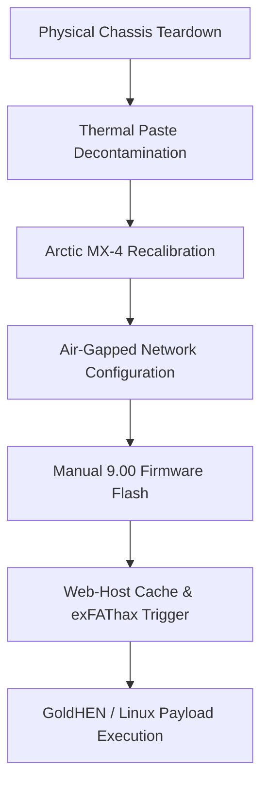

## The Brief
Consumer gaming consoles often face severe thermal throttling and performance degradation over extended lifecycles due to dust accumulation and broken thermal interfaces. This systems engineering project focused on the complete physical restoration, thermal optimization, and kernel exploitation of a PlayStation 4 Slim console.  

**Legal disclaimer:** I plan on using this PS4 to install Linux on it and play with it out of curiosity. I do not condone piracy; this article is meant only for educational purposes! I am not held accountable for your actions!  

The goal was twofold: first, to reverse severe thermal throttling by executing a full hardware teardown and applying precision chemical cleaning; second, to perform a controlled firmware upgrade to exactly version 9.00, implement a manual web-vector kernel exploit (exfathax), and safely bootstrap an independent Linux runtime environment for educational testing.

    

## What I Manage & Build
I executed the entire lifecycle of this project, dividing the workflow between physical hardware engineering and low-level system exploitation.

## Hardware Restoration & Thermal Management
* **Complete Teardown:** Conducted a comprehensive structural disassembly of the console chassis to access the core motherboard, blower fans, and internal heatsink assembly.

    

    

* **Chemical Decontamination:** Utilized high-purity isopropyl alcohol to completely remove aged, degraded original factory thermal interface materials without damaging the surrounding delicate surface-mount devices (SMDs).

    

* **Thermal Interface Upgrade:** Cleaned the internal radiator fins and applied high-performance Arctic MX-4 thermal paste via a manually spread uniform layer, successfully lowering acoustic output and fixing thermal bottlenecks under heavy computing loads.

    

    

## Firmware Manipulation & Exploitation
* **Air-Gapped OS Optimization:** Isolated the console from automated Sony network update paths by completely rewriting system network interfaces, disabling automatic telemetry/downloads, and configuring specialized primary/secondary DNS routing (`192.241.221.79` / `165.227.83.145`) to safely drop inbound vendor payloads.
* **Manual Firmware Upgrade:** Constructed a capital-enforced static structure (`/PS4/UPDATE/PS4UPDATE.PUP`) on an exFAT filesystem block device, staging and deploying an official 9.00 recovery system partition image via local media boot.

    

* **Kernel Memory Exploitation:** Utilized specialized web-host caching tools (GoldHEN payload ecosystems via Karo) alongside an external raw binary injection mechanism (`exfathax.img`) flashed onto a raw block storage device via Rufus, triggering a memory boundary bypass via an exFAT filesystem parser vulnerability.

## Technical Stack & Hardware Matrix
* **Hardware Materials:** Arctic MX-4 Thermal Compound, Isopropyl Alcohol Decontaminant, Specialized Precision Screwdrivers
* **Exploitation Frameworks:** GoldHEN Payloads, Web-Exploit Vector Engines (Karo), Rufus Block-Writer
* **Target OS Architectures:** Orbis OS (BSD-derived), Custom Client-Side Embedded Linux Environments

## System Workflow Pipeline
The entire system provisioning pipeline followed a strict sequence to ensure that hardware stability was fully established before executing unstable runtime kernel memory modifications:

## Hardware & System Artifacts Ledger
Below is the technical specification of the deployment states and materials managed throughout the system life-cycle:

| System Component | Technology / Framework | Implementation Strategy |
| :--- | :--- | :--- |
| **Thermal Interface** | Arctic MX-4 Carbon Compound | High-Thermal Conductivity Core Re-pasting |
| **Firmware Base** | Sony System Image v9.00 | Targeted Recovery Upgrade Path |
| **Exploit Vector** | Webkit / exFAT Filesystem Bug | Manual Web Browser Payload Cache Injection |
| **Payload Handler** | GoldHEN Ecosystem | Low-Level Homebrew & Kernel Access Broker |
| **Network Gateway** | Custom Air-Gapped Manual DNS | Sony Telemetry & Update Vector Drop Block |

## Final Result

    

### Conclusion & Project State
> **NOTE:** If there are any errors or the console crashes, restart the PS4 and try again! This Jailbreak is not persistent, which means after a shutdown or a reboot, you have to do everything again. One solution is to put your PS4 in rest mode, or you could automate the payload delivery locally using an ESP32 or a Raspberry Pi micro-controller.

The physical restoration was completely successful, permanently silencing the console's internal fan noise and preventing thermal crashes. The low-level exfathax kernel exploit achieved an approximate 80% initialization success rate, providing a fully functional sandbox environment suitable for continuous low-level Linux kernel experiments and custom embedded system research.