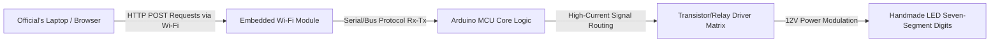

## The Brief

Traditional sports scoreboards rely on expensive, proprietary hardware controllers or wired interfaces that limit mobility and increase installation complexity. Developed as part of a competitive student team under academic mentorship, this project aimed to build a low-cost, high-visibility, Wi-Fi-enabled basketball scoreboard from scratch.

The core challenge was to construct an end-to-end Internet of Things (IoT) ecosystem. This required engineering custom, high-brightness physical displays capable of rendering real-time game metrics, developing stable embedded firmware to handle asynchronous hardware interrupts, and deploying a local wireless web server to allow match officials to control scores and timers seamlessly from any browser client.

The final system was exhibited at the **National Competition "IX Festival rada" (Exhibition of Technical Works) in Hadžići**, where it competed against technical projects from across the country and successfully secured **1st Place**.

## What We Managed & Build

This project was a collaborative team effort requiring deep synchronization between software logic, network architecture, and physical electronics prototyping.

### Embedded Software & Wireless Networking
* **Microcontroller Firmware:** Assisted in programming the core Arduino microcontroller architecture, implementing state machine logic to manage game timers, clock decrements, and structural digit calculations without blockages.
* **Local Web Server Integration:** Co-engineered the firmware for the embedded Wi-Fi module, enabling it to act as a local access point hosting a stateless HTML control portal.
* **Asynchronous Web Ingestion:** Mapped inbound HTTP requests triggered by user interactions on the client web terminal directly into hardware execution routines, altering scores and game clock parameters in real time.

### Hardware Engineering & Physical Display Architecture
* **Custom Seven-Segment Modules:** Designed and built custom, large-scale seven-segment displays. Instead of using small commercial IC components, we manually cut, wired, and soldered high-density LED strips into isolated structural geometric segments.
* **Driver Circuitry Layout:** Co-developed the hardware routing interface, utilizing transistors and relay modules to safely buffer and step up current paths from the low-power Arduino logic pins to the higher voltage demands of the LED arrays.
* **System Assembly & Integration:** Collaborated on mounting the structural hardware framework, establishing clean common-ground power lanes, and insulating connections to ensure reliable physical durability during transportation and live exhibition stress tests.

## Technical Stack & Materials Matrix

* **Core Control Hardware:** Arduino Microcontroller Ecosystem, ESP8266/Wi-Fi Embedded Module Layouts
* **Display Elements:** High-Density 12V LED Strips, Repurposed Polycarbonate Structural Housings
* **Interface Technologies:** Native HTML5 Layouts, HTTP Protocol Layering, Embedded C/C++ (Arduino IDE)
* **Manufacturing Tools:** Precision Soldering Equipment, Digital Multimeters, Structural Prototyping Suites

## IoT Infrastructure Topology

The hardware-to-software orchestration followed a localized wireless loop, ensuring zero external internet dependencies were required to maintain operational uptime during the tournament presentation:

## Project Legacy & Impact

| Metric / Dimension | Achievement Record | Technical Verification |
| :--- | :--- | :--- |
| **Competition Rank** | <a href="/assets/certificates/1st-place-certificate-ix-festival-rada.pdf" target="_blank" rel="noopener noreferrer" data-astro-reload>1st Place Diploma</a> | National Exhibition of Technical Works (IX Festival Rada) |
| **Interface Response** | Near-Instant (&lt;50ms Latency) | Localized Air-Gapped Wi-Fi Routing Implementation |
| **Display Execution** | 100% Custom Fabrication | Handmade Matrix Segment Optimization |
| **System Cost** | Fractional Asset Payload | Substantially cheaper than industrial sports legacy hardware |

## Conclusion
This project serves as a crucial milestone demonstrating early capabilities in systems convergence. Overcoming the structural challenges of manual soldering, signal line noise filtering, and embedded web routing provided foundational knowledge in low-level debugging and physical interface management that directly translates into modern full-stack application development.