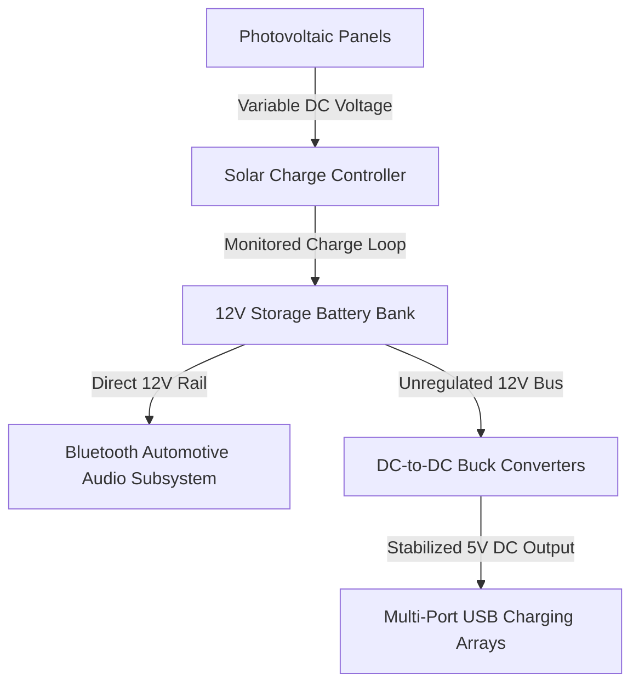

import ProjectGallery from '../../../components/projects/ProjectGallery.astro';
import solarTreePic from '../../../assets/projects/solar-tree/featured.webp';

## The Brief

As public infrastructure shifts toward smart-city frameworks, low-power sustainable energy nodes are becoming essential for urban environments. Developed as a competitive team entry under academic guidance, this project aimed to prototype a functional "Solar Tree"—an off-grid public charging station engineered to harvest solar energy and safely redistribute power to consumer electronic devices and localized wireless audio subsystems.

The engineering challenge layout was strictly focused on hardware subsystem integration. The system needed to capture variable ambient solar energy, stabilize the fluctuating DC currents coming from the photovoltaic cells, store the reserve capacity safely within a chemical battery bank, and step down the output voltage to deliver a clean, regulated charge to multiple USB ports and an integrated Bluetooth-enabled automotive audio system.

The finalized green-energy prototype was presented at the **National Competition "X Festival rada" (Exhibition of Technical Works) in Zenica**, outperforming competing state-wide installations to secure **1st Place**.

## What We Managed & Build

This development run relied heavily on physical execution, precision electrical distribution, and safe power-stage partitioning.

### Photovoltaic Harvesting & Battery Storage Isolation
* **Solar Matrix Integration:** Co-configured the deployment of the high-efficiency solar panel modules, mounting the structural arrays to maximize light incidence angles.
* **Charge Loop Optimization:** Wired the photovoltaic outputs into a dedicated charge controller loop, establishing a reliable multi-stage battery charging scheme to protect the chemical accumulation core from overcharging and reverse currents.
* **Power Capacity Distribution:** Isolated and managed the heavy-gauge wire routing between the solar panels, battery banks, and the centralized distribution terminal block.

### Output Regulation & Subsystem Wiring
* **Stabilized USB Output Arrays:** Assisted in designing and testing the voltage regulation circuitry, utilizing buck-converters to step down the native battery voltage to a fixed 5V DC output layout, allowing safe, concurrent charging for multiple mobile client devices.
* **Bluetooth Audio Unit Deployment:** Configured the internal electrical layout to power a standard high-draw automotive radio system equipped with a Bluetooth interface for wireless media streaming. I focused on decoupling the audio lines and power rails to prevent high-frequency RF noise and ground-loop interference across the active charging channels.
* **Chassis Rigging & Public Safety:** Collaborated on the full structural assembly, soldering heavy-duty joints, heat-shrinking vulnerable line breaks, and grounding the internal chassis to ensure operational reliability during live public demonstrations.

## Technical Stack & Materials Matrix

* **Energy Capture Hardware:** High-Efficiency Photovoltaic (PV) Solar Panel Arrays
* **Power Management:** DC-to-DC Buck Voltage Regulators (5V USB Staging), Dedicated Solar Charge Controllers
* **Energy Accumulation:** Sealed Lead-Acid (SLA) Deep-Cycle Storage Battery Bank
* **Connectivity & Audio:** Bluetooth-Enabled 12V Automotive Radio Unit, Multi-Port USB Ingestion Hubs
* **Deployment Tools:** Digital Voltmeters, Bluetooth 4.0/RF Signal Testing, Heavy-Duty Soldering Assemblies, Protective Insulation Matrix

## Electrical Distribution Workflow

The entire infrastructure architecture operated as an air-gapped, closed-loop DC distribution system, removing any requirement for expensive AC inversions and minimizing power conversion loss:

## Competitive Records & Impact

| Metric / Dimension | Achievement Record | Technical Verification |
| :--- | :--- | :--- |
| **Competition Rank** | <a href="/assets/diplomas/1st-place-diploma-x-festival-rada.pdf" target="_blank" rel="noopener noreferrer" data-astro-reload>1st Place Diploma</a> | National Technical Exhibition (X Festival Rada) in Zenica |
| **Output Regulation** | Clean 5V DC Rails | Isolated Feedback Buck Converters Implementation |
| **System Autonomy** | 100% Air-Gapped Off-Grid | Zero-Dependency Localized Solar Distribution Loop |
| **Wireless Interface** | Integrated Bluetooth Streaming | Parallel Power Rail & RF Noise Allocation Strategy |

## Conclusion
The successful deployment and defense of the Solar Tree prototype at the national exhibition validated our approach to multi-disciplinary system building. Balancing high-current battery safety with low-power consumer electronics distribution and wireless RF subsystems provided hands-on engineering insights into hardware protection, current budgeting, and modular physical assembly that continue to influence my structural system designs.

## Project Gallery 

<ProjectGallery images={[
  { 
    src: solarTreePic, 
    alt: 'Solar Tree Technical Prototype Exhibition displaying the sustainable energy installation and integrated solar panels', 
    caption: "The fully assembled Solar Tree technical prototype on public exhibition, showcasing the structural integration of photovoltaic panels and the sustainable architectural design." 
  }
]} />