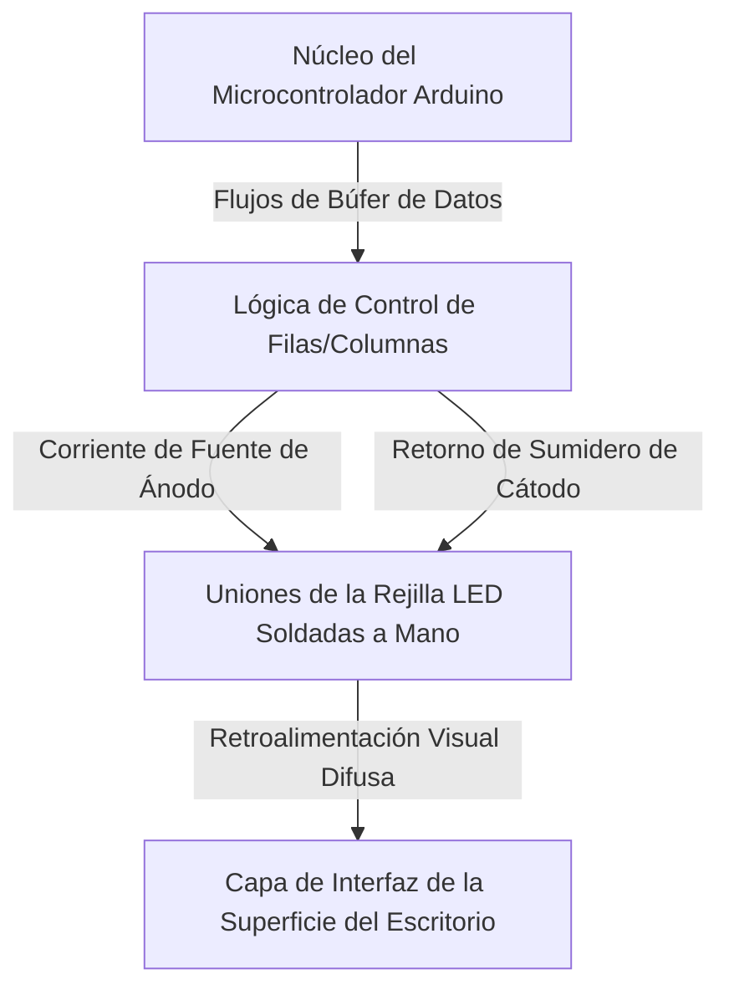

import ProjectGallery from '../../../components/projects/ProjectGallery.astro';
import ledDeskPic from '../../../assets/projects/led-desk/featured.webp';

## El Brief

El mobiliario interactivo y las pantallas indicadoras a gran escala requieren una coordinación robusta de hardware para gestionar múltiples zonas de iluminación sin incurrir en altos costes de componentes. Desarrollado como una propuesta de equipo competitiva para las disciplinas técnicas nacionales, este proyecto se centró en diseñar y construir un "Escritorio LED Programable" completamente funcional: una estación de trabajo estructural equipada con una rejilla de LED direccionables construida a medida, capaz de renderizar indicadores visuales dinámicos, patrones geométricos y texto en desplazamiento.

El principal obstáculo de ingeniería fue la magnitud de la fabricación manual del hardware y el enrutamiento de datos. En lugar de desplegar paneles LED comerciales ya listos para usar, la disposición de la matriz central requirió la colocación estructural manual, el aislamiento de componentes discretos y una densa soldadura punto a punto. En el lado del software, el desafío radicó en desarrollar un firmware embebido optimizado para manejar cálculos de búfer de fotogramas (*frame-buffer*), lógica de escaneo de filas/columnas y transiciones espaciales fluidas en una arquitectura de microcontrolador limitada.

El prototipo finalizado de grado industrial se exhibió en el **Concurso Nacional „XI Festival rada“ (Exposición de Trabajos Técnicos) en Bužim**, donde obtuvo el **1.º Premio** en su categoría.

## Responsabilidades y Ejecución

Este proyecto exigió un equilibrio preciso entre el ensamblaje physisco repetitivo de tolerancia cero y la ejecución de software algorítmico.

### Desarrollo de Firmware de Bajo Nivel y Lógica de Patrones
* **Generación Visual Algorítmica:** Diseño y programación de arquitecturas de firmware personalizadas para calcular y emitir patrones de iluminación matemáticos complejos, ondas espaciales y bucles de refresco en tiempo real.
* **Matriz de Renderizado de Texto:** Creación de una capa de matriz de mapeo de fuentes personalizada, transformando cadenas de caracteres puros en estados de coordenadas de píxeles específicos para mostrar datos de texto en desplazamiento a lo largo del diseño de la pantalla.
* **Arquitectura de Ejecución Optimizada:** Estructuración de los bucles de ejecución centrales en C++ Embebido para garantizar el envío eficiente de datos de filas, eliminando el parpadeo visible y estabilizando las actualizaciones de la pantalla bajo cambios intensos de cálculo.

### Prototipado de Hardware Personalizado y Soldadura de Matriz
* **Ensamblaje Manual de la Rejilla:** Co-diseñé y ejecuté personalmente el ensamblaje físico de la matriz de la pantalla. Cada nodo LED individual a lo largo del espacio estructural del escritorio se colocó, alineó y soldó manualmente a las líneas comunes de datos y alimentación.
* **Acondicionamiento de Líneas de Señal:** Formulación del marco de enrutamiento del cableado interno, implementando redes de resistencias pull-up/pull-down para prevenir la diafonía electrónica (*cross-talk*), la degradación de la señal y las caídas de tensión a través de la densa rejilla de hardware.
* **Integración Estructural y Pruebas:** Integración perfecta de la matriz de cobre finalizada debajo de la capa protectora de la superficie del escritorio, ejecutando pruebas de estrés continuas, comprobaciones de diagnóstico con multímetro y evaluaciones térmicas para garantizar un despliegue seguro durante exposiciones públicas prolongadas.

## Stack Técnico y Matriz de Materiales

* **Arquitectura de Cómputo Central:** Framework de Desarrollo de Microcontroladores Arduino
* **Elementos de Pantalla:** Diodos Emisores de Luz (LED) discretos de alto brillo, interruptores de matriz de transistores
* **Software de Control:** Capa de optimización en C/C++ Embebido, rutinas de manipulación de bits a bajo nivel
* **Componentes de Fabricación:** Cableado de cobre de alta conductividad, sistemas de soldadura térmica de precisión, bases aislantes perforadas
* **Hardware de Análisis:** Multímetros digitales, reguladores de fuente de alimentación de banco

## Topología de Control de la Matriz

El diseño del hardware del sistema funciona como un pipeline de coordenadas localizado, donde el firmware procesa los búferes gráficos individuales y envía señales de ejecución a través de los controladores de la matriz para iluminar intersecciones precisas de la pantalla:

## Historial de Campeonatos e Impacto

| Métrica / Dimensión | Registro de Logros | Verificación Técnica |
| :--- | :--- | :--- |
| **Puesto en la Competencia** | <a href="/assets/certificates/1st-place-certificate-xi-festival-rada.pdf" target="_blank" rel="noopener noreferrer" data-astro-reload>Diploma de 1.º Premio</a> | Concurso Nacional „XI Festival rada“ en Bužim |
| **Método de Fabricación** | Soldadura de Componentes 100 % Manual | Construcción completa de líneas de nodos punto a punto |
| **Soporte de Renderizado** | Texto Estático/Desplazable y Patrones | Lógica de asignación vectorial por mapa de coordenadas |
| **Fiabilidad del Sistema** | Ejecución Cero Fallos | Validación de diagnóstico de ejecución continua bajo carga |

## Conclusión
El éxito del proyecto del Escritorio LED Programable coronó una trayectoria consecutiva de élite durante varios años en los títulos de campeonatos técnicos nacionales. Afrontar las rigurosas exigencias físicas de construir desde cero una matriz de componentes de alta densidad me aportó una experiencia inestimable en la depuración de hardware de bajo nivel, la optimización de rutas de señal y el control de tiempos embebidos: disciplinas estructurales clave que refuerzan sólidamente mi enfoque de la ingeniería de software moderna.

## Galería del Proyecto

<ProjectGallery images={[
  { 
    src: ledDeskPic, 
    alt: 'Stand de exhibición del proyecto Escritorio LED Programable que muestra la integración de hardware personalizado y la iluminación ambiental que ganaron el campeonato nacional', 
    caption: 'El galardonado proyecto Escritorio LED Programable exhibido en el evento nacional, destacando el diseño de hardware integrado personalizado, el ensamblaje estructural y la sincronización de luz ambiental que aseguraron el título de campeón nacional.' 
  }
]} />
