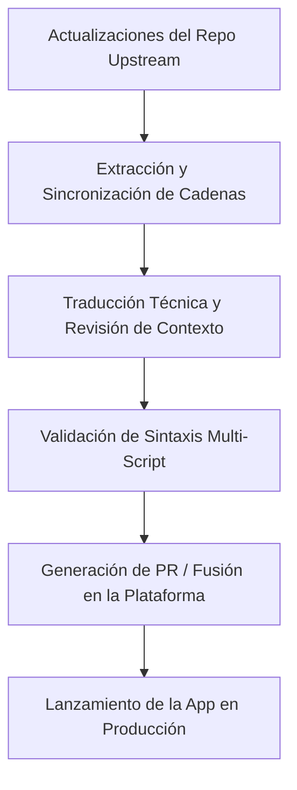

## El Brief

In el desarrollo de software moderno, las herramientas de seguridad de alto impacto, las utilidades del sistema y las aplicaciones multimedia a menudo pasan por alto la localización para idiomas regionales más pequeños. Esto crea una barrera de accesibilidad para la comunidad de los Balcanes (hablantes de bosnio, croata y serbio).

Mi misión bajo este proyecto global es proporcionar traducciones precisas y técnicamente consistentes para aplicaciones de código abierto. La localización técnica va mucho más allá de la traducción literal; requiere una profunda comprensión de ingeniería sobre protocolos de seguridad, restricciones de UI/UX, codificación de caracteres y despliegue multi-script (navegando sin problemas entre los alfabetos latino y cirílico) sin romper el diseño de la aplicación ni las cadenas de traducción compiladas.

## Responsabilidades y Ejecución

En lugar de tratar la localización como una tarea pasiva, la gestiono como un pipeline de integración continua. Administro activamente la sincronización de traducciones a través de múltiples plataformas de localización de nivel empresarial y sistemas de control de versiones directos.

### Contribuciones Clave y Proyectos

*   **Aegis Authenticator:** Localicé esta aplicación de código abierto líder en autenticación 2FA para Android a través de Crowdin. Me enfoqué en la traducción precisa de terminología criptográfica, protocolos de seguridad respaldados por hardware e instrucciones de copia de seguridad/restauración de bóvedas cifradas, donde los errores lingüísticos podrían provocar la pérdida de datos del usuario.
*   **TizenBrew & TizenTube:** Gestioné los flujos de trabajo de localización directamente a través de repositorios de GitHub utilizando diccionarios de archivos planos en JSON. Esto incluyó la configuración de tablas de localización, la gestión de pull requests (PRs), la garantía de consistencia multi-script y la implementación experimental de cadenas de texto personalizadas (como variables en klingon) para someter a pruebas de estrés al motor de renderizado i18n de la aplicación.
*   **Blowfish Theme (HUGO):** Contribuí a la localización técnica directamente a través de Pull Requests (PRs) en GitHub para este popular ecosistema del framework Hugo de alto rendimiento, asegurando que los términos de configuración y las variables de diseño se mapeen correctamente para la comunidad de desarrolladores regionales.
*   **RetroArch:** Localicé este masivo y legendario frontend de emulación multisistema de código abierto a través de Crowdin, traduciendo configuraciones complejas del sistema, parámetros del núcleo (core) e interfaces de hardware emulado para garantizar una experiencia de usuario óptima.
*   **Gallery Compose:** Localicé esta aplicación moderna y ligera de galería multimedia para Android construida con Jetpack Compose a través de Crowdin, mapeando componentes de la interfaz de usuario e instrucciones del esquema multimedia directamente dentro del ecosistema nativo de recursos localizados de Android.
*   **CustomRP:** Traduje la compleja interfaz de configuración a través de PoEditor, mejorando la experiencia de usuario y la accesibilidad para la comunidad global de desarrolladores de Discord Rich Presence.

## Stack Técnico y Plataformas

*   **Control de Versiones y Flujos de Trabajo:** Git, GitHub (Ramificaciones, Resolución de Conflictos, Pull Requests)
*   **Plataformas de Localización:** Crowdin Enterprise, PoEditor
*   **Estándares y Paradigmas:** Interpolación de cadenas i18n, diccionarios de archivos planos (JSON, XML, ARB), gestión de sistemas multi-script (mapeo Latino/Cirílico)

## El Proceso

Mi flujo de trabajo de localización imita el ciclo de vida del desarrollo de software (SDLC) estándar para garantizar que ninguna cadena rota o error de sintaxis llegue a los pipelines de producción:

*   **Revisión de Código y Contexto:** Antes de traducir, inspecciono el código fuente original o los archivos de recursos para comprender la ubicación de las variables (`{user}`, `%s`), los límites del diseño de la interfaz y cómo se comportan dinámicamente las cadenas de texto en la UI.
*   **Normalización Lingüística:** Implemento terminología técnica estandarizada para los idiomas bosnio, croata y serbio, asegurando que los términos complejos de ingeniería de software suenen naturales pero altamente profesionales.
*   **Protección de Sintaxis:** Verifico manualmente los caracteres de escape, los espacios en blanco finales y la sintaxis Markdown dentro de las cadenas de localización para garantizar que el payload traducido nunca rompa la compilación de producción.

### Registro de Proyectos (Matriz Continua)

A continuación se presenta el registro verificado de los proyectos de código abierto que he localizado o que mantengo actualmente. Este registro se actualiza continuamente a medida que se envían nuevos módulos de traducción a producción:

| Nombre del Proyecto / Herramienta | Plataforma / Stack | Componente / Público Objetivo |
| :--- | :--- | :--- |
| **Aegis Authenticator** | Crowdin / XML | Seguridad / Aplicación Android de Bóveda 2FA |
| **TizenBrew** | GitHub / JSON | Multimedia / Integración de SO Personalizado |
| **TizenTube** | GitHub / JSON | Streaming de Video / UI del Lado del Cliente |
| **Blowfish Theme** | GitHub / YAML | Framework de Desarrollo / Ecosistema HUGO |
| **RetroArch** | Crowdin / C Strings | Frontend / Emulador Multisistema |
| **Gallery Compose** | Crowdin / XML | Multimedia / Aplicación Android con Jetpack Compose |
| **CustomRP** | PoEditor / Rich Text | Herramienta de Desarrollo / Discord Rich Presence |

### Verificación y Métricas en Vivo

Cada contribución está vinculada criptográficamente a mis perfiles o fusionada explícitamente a través de Pull Requests verificadas en GitHub. Puedes realizar un seguimiento en vivo de mi volumen de traducción, cadenas aprobadas y métricas de votación activa en los ecosistemas de código abierto directamente a través de mi perfil público:

* **Perfil de Crowdin Verificado y Contribuciones:** <a href="https://crowdin.com/profile/lukapiplica" target="_blank" rel="noopener noreferrer">crowdin.com/profile/lukapiplica</a>
* **Contribuciones de Código en Open Source:** <a href="https://github.com/lukapiplica" target="_blank" rel="noopener noreferrer">github.com/lukapiplica</a>