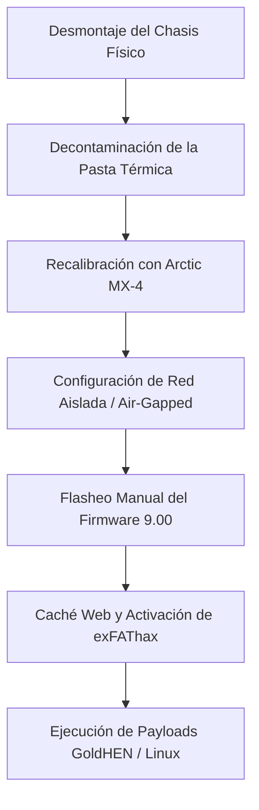

## El Brief

Las consolas de videojuegos comerciales a menudo se enfrentan a un grave estrangulamiento térmico (*thermal throttling*) y a la degradación del rendimiento a lo largo de su ciclo de vida debido a la acumulación de polvo y al deterioro de las interfaces térmicas. Este proyecto de ingeniería de sistemas se centró en la restauración física completa, la optimización térmica y la explotación a nivel de kernel de una consola PlayStation 4 Slim.

**Aviso legal:** Planeo usar esta PS4 para instalar Linux y experimentar con ella por pura curiosidad. ¡No condeno ni apoyo la piratería; este artículo tiene fines puramente educativos! ¡No me hago responsable de tus acciones!

El objetivo era doble: primero, revertir el estrangulamiento térmico extremo mediante un desmontaje completo del hardware (*teardown*) y la aplicación de una limpieza química de precisión; segundo, realizar una actualización controlada del firmware exactamente a la versión 9.00, implementar un exploit manual del kernel mediante un vector web (*exfathax*) y arrancar de forma segura un entorno de ejecución de Linux independiente para pruebas educativas.

  

## Responsabilidades y Ejecución

Ejecuté el ciclo de vida completo de este proyecto, dividiendo el flujo de trabajo entre la ingeniería de hardware físico y la explotación de sistemas a bajo nivel.

## Restauración de Hardware y Gestión Térmica

* **Desmontaje Completo:** Realicé un desmontaje estructural exhaustivo del chasis de la consola para acceder a la placa base, los ventiladores de soplado y el conjunto del disipador de calor interno.

  

  

* **Decontaminación Química:** Utilicé alcohol isopropílico de alta pureza para eliminar por completo los materiales de la interfaz térmica original de fábrica envejecidos y degradados, sin dañar los delicados dispositivos de montaje superficial (SMD) circundantes.

  

* **Actualización de la Interfaz Térmica:** Limpié las aletas del radiador interno y apliqué pasta térmica de alto rendimiento Arctic MX-4 mediante una aplicación optimizada en capa fina y uniforme, logrando reducir drásticamente el ruido acústico y solucionando los cuellos de botella térmicos bajo cargas de trabajo pesadas.

  

  

## Manipulación y Explotación de Firmware

* **Optimización del SO en Red Aislada (Air-Gapped):** Aislé la consola de las rutas de actualización automática de la red de Sony reconfigurando por completo las interfaces de red del sistema, desactivando la telemetría/descargas automáticas y configurando un enrutamiento DNS primario/secundario especializado (`192.241.221.79` / `165.227.83.145`) za descartar de forma segura los payloads entrantes del proveedor.
* **Actualización Manual del Firmware:** Construí una estructura estática estricta (`/PS4/UPDATE/PS4UPDATE.PUP`) en un dispositivo de almacenamiento de bloques con sistema de archivos exFAT, desplegando e instalando una imagen oficial de la partición del sistema de recuperación de la versión 9.00 a través del arranque de medios locales.

  

* **Explotación de la Memoria del Kernel:** Utilicé herramientas especializadas de almacenamiento en caché web (ecosistemas de payloads GoldHEN a través de Karo) junto con un mecanismo de inyección de binarios crudos externos (`exfathax.img`) flasheados en un dispositivo de almacenamiento masivo a través de Rufus, provocando un desbordamiento de los límites de memoria mediante una vulnerabilidad en el analizador del sistema de archivos exFAT.

## Stack Técnico y Matriz de Hardware

* **Materiales de Hardware:** Compuesto térmico Arctic MX-4, decontaminante de alcohol isopropílico, destornilladores de precisión especializados.
* **Frameworks de Explotación:** Payloads de GoldHEN, motores de vectores de exploits web (Karo), escritor de bloques Rufus.
* **Arquitecturas de SO Objetivo:** Orbis OS (derivado de BSD), entornos personalizados de Linux embebido del lado del cliente.

## Pipeline del Flujo de Trabajo del Sistema

Todo el pipeline de aprovisionamiento del sistema siguió una secuencia estricta para garantizar que la estabilidad del hardware estuviera completamente establecida antes de ejecutar modificaciones inestables en la memoria del kernel en tiempo de ejecución:

## Registro de Artefactos del Sistema y Hardware
A continuación se presenta la especificación técnica de los estados de despliegue y los materiales gestionados a lo largo del ciclo de vida del sistema:

| Componente del Sistema | Tecnología / Framework | Estrategia de Implementación |
| :--- | :--- | :--- |
| **Interfaz Térmica** | Compuesto de Carbono Arctic MX-4 | Cambio de pasta térmica del núcleo con alta conductividad |
| **Base del Firmware** | Imagen del Sistema Sony v9.00 | Ruta de actualización dirigida a la recuperación (*Recovery*) |
| **Vector del Exploit** | Bug del sistema de archivos Webkit / exFAT | Inyección manual en la caché de payloads del navegador web |
| **Gestor de Payloads** | Ecosistema GoldHEN | Gestor de acceso al kernel y aplicaciones caseras (*Homebrew*) |
| **Pasarela de Red** | DNS manual en red aislada (*Air-Gapped*) | Bloqueo de telemetría de Sony y descarte de vectores de actualización |

## Resultado Final

    

### Conclusión y Estado del Proyecto
> **NOTA:** ¡Si ocurre algún error o la consola se congela, reinicia la PS4 e inténtalo de nuevo! Este Jailbreak no es persistente, lo que significa que después de un apagado o un reinicio completo, tendrás que repetir el proceso. Una solución viable es poner tu PS4 en modo de reposo (*Rest Mode*), o bien automatizar el envío del payload de forma local utilizando un microcontrolador ESP32 o una Raspberry Pi.

La restauración física fue un éxito rotundo, silenciando de forma permanente el ruido del ventilador interno de la consola y previniendo por completo los cuajes por sobrecalentamiento. El exploit de kernel de bajo nivel *exfathax* alcanzó una tasa de éxito de inicialización cercana al 80%, proporcionando un entorno de sandbox totalmente funcional e ideal para experimentos continuos con el kernel de Linux y la investigación de sistemas embebidos personalizados.
