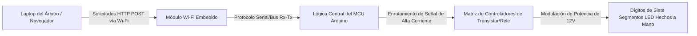

## El Brief

Los marcadores deportivos tradicionales dependen de controladores de hardware propietarios costosos o de interfaces cableadas que limitan la movilidad e incrementan la complejidad de la instalación. Desarrollado como parte de un equipo estudiantil competitivo bajo mentoría académica, este proyecto tuvo como objetivo construir desde cero un marcador de baloncesto de bajo coste, alta visibilidad y habilitado para Wi-Fi.

El desafío central fue construir un ecosistema completo de Internet de las Cosas (IoT) de extremo a extremo. Esto requirió diseñar pantallas físicas personalizadas de alto brillo capaces de renderizar métricas del juego en tiempo real, desarrollar un firmware embebido estable para manejar interrupciones de hardware asíncronas y desplegar un servidor web inalámbrico local para permitir a los árbitros del encuentro controlar las puntuaciones y los temporizadores de forma fluida desde cualquier navegador cliente.

El sistema final se exhibió en el **Concurso Nacional „IX Festival rada“ (Exposición de Trabajos Técnicos) en Hadžići**, donde compitió contra proyectos técnicos de todo el país y obtuvo con éxito el **1.º Premio**.

## Responsabilidades y Ejecución

Este proyecto fue un esfuerzo colaborativo en equipo que requirió una profunda sincronización entre la lógica de software, la arquitectura de red y el prototipado físico de la electrónica.

### Software Embebido y Redes Inalámbricas
* **Firmware del Microcontrolador:** Asistí en la programación de la arquitectura del microcontrolador Arduino central, implementando la lógica de máquinas de estado para gestionar los temporizadores del juego, los decrementos del reloj y los cálculos estructurales de los dígitos sin generar bloqueos.
* **Integración del Servidor Web Local:** Co-diseñé el firmware para el módulo Wi-Fi embebido, permitiéndole actuar como un punto de acceso local que alojaba un portal de control HTML sin estado (*stateless*).
* **Ingesta Web Asíncrona:** Mapeé las solicitudes HTTP entrantes activadas por las interacciones del usuario en la terminal web del cliente directamente hacia las rutinas de ejecución del hardware, alterando los marcadores y los parámetros del reloj de juego en tiempo real.

### Ingeniería de Hardware y Arquitectura de la Pantalla Física
* **Módulos de Siete Segmentos Personalizados:** Diseñé y construí pantallas de siete segmentos a gran escala personalizadas. En lugar de utilizar componentes comerciales de circuitos integrados pequeños, cortamos, cableamos y soldamos manualmente tiras LED de alta densidad en segmentos geométricos estructurales aislados.
* **Diseño del Circuito de Controladores:** Co-desarrollé la interfaz de enrutamiento del hardware, utilizando transistores y módulos de relés para amortiguar y elevar de forma segura las rutas de corriente desde los pines lógicos de bajo consumo de Arduino hacia las demandas de mayor voltaje de las matrices LED.
* **Ensamblaje e Integración del Sistema:** Colaboré en el montaje de la estructura física del hardware, estableciendo líneas limpias de alimentación con masa común y aislando las conexiones para garantizar una durabilidad física fiable durante el transporte y las pruebas de estrés en la exhibición en vivo.

## Stack Técnico y Matriz de Materiales

* **Hardware de Control Central:** Ecosistema de Microcontroladores Arduino, Arquitecturas de Módulos Embebidos Wi-Fi ESP8266
* **Elementos de Pantalla:** Tiras LED de 12V de alta densidad, carcasas estructurales de policarbonato modificadas
* **Tecnologías de Interfaz:** Diseños Nativos en HTML5, Capas del Protocolo HTTP, C/C++ Embebido (Arduino IDE)
* **Herramientas de Fabricación:** Equipos de Soldadura de Precisión, Multímetros Digitales, Suites de Prototipado Estructural

## Topología de la Infraestructura IoT

La orquestación entre hardware y software siguió un bucle inalámbrico localizado, garantizando que no se requirieran dependencias externas de Internet para mantener el tiempo de actividad operativo durante la presentación del torneo:

## Legado del Proyecto e Impacto

| Métrica / Dimensión | Registro de Logros | Verificación Técnica |
| :--- | :--- | :--- |
| **Puesto en la Competencia** | <a href="/assets/certificates/1st-place-certificate-ix-festival-rada.pdf" target="_blank" rel="noopener noreferrer" data-astro-reload>Diploma de 1.º Premio</a> | Concurso Nacional „IX Festival rada“ |
| **Respuesta de la Interfaz** | Casi instantánea (&lt;50ms de latencia) | Implementación de enrutamiento Wi-Fi local en red aislada |
| **Ejecución de la Pantalla** | Fabricación 100 % personalizada | Optimización manual de los segmentos de la matriz |
| **Coste del Sistema** | Fracción del coste comercial | Sustancialmente más barato que el hardware industrial deportivo tradicional |

## Conclusión
Este proyecto representa un hito crucial que demostró mis primeras capacidades en la convergencia de sistemas. Superar los desafíos estructurales de la soldadura manual, el filtrado de ruido en las líneas de señal y el enrutamiento web embebido me proporcionó conocimientos fundamentales en la depuración de bajo nivel y la gestión de interfaces físicas, los cuales se traducen directamente en mi enfoque moderno para el desarrollo de aplicaciones full-stack.