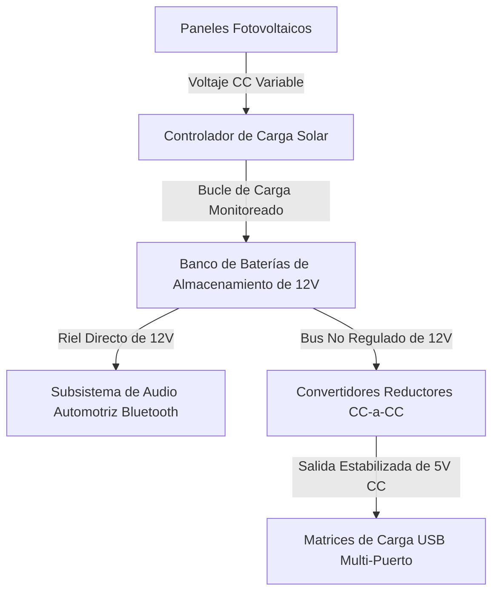

import ProjectGallery from '../../../components/projects/ProjectGallery.astro';
import solarTreePic from '../../../assets/projects/solar-tree/featured.webp';

## El Brief

A medida que la infraestructura pública se desplaza hacia los entornos de ciudades inteligentes (*smart-cities*), los nodos de energía sostenible de bajo consumo se vuelven esenciales para los entornos urbanos. Desarrollado como una propuesta de equipo competitiva podo tutoría académica, este proyecto tuvo como objetivo construir el prototipo de un "Árbol Solar" funcional: una estación de carga pública aislada de la red (*off-grid*) diseñada para captar energía solar y redistribuir potencia de forma segura a dispositivos electrónicos de consumo y subisistemas locales de audio inalámbrico.

El desafío de ingeniería se enfocó estrictamente en la integración de los subsistemas de hardware. El sistema debía capturar energía solar ambiental variable, estabilizar las corrientes continuas (CC) fluctuantes provenientes de las células fotovoltaicas, almacenar la capacidad de reserva de forma segura dentro de un banco de baterías químicas, y reducir el voltaje de salida para entregar una carga limpia y regulada a múltiples puertos USB y a un sistema de audio automotriz integrado con conectividad Bluetooth.

El prototipo finalizado de energía verde se presentó en el **Concurso Nacional „X Festival rada“ (Exposición de Trabajos Técnicos) en Zenica**, superando a las instalaciones competidoras de todo el país para asegurar el **1.º Premio**.

## Responsabilidades y Ejecución

Este desarrollo dependió en gran medida de la ejecución física, la distribución eléctrica de precisión y la partición segura de las etapas de potencia.

### Captación Fotovoltaica y Aislamiento del Almacenamiento por Baterías
* **Integración de la Matriz Solar:** Co-configuré el despliegue de los módulos de paneles solares de alta eficiencia, montando los arreglos estructurales para maximizar los ángulos de incidencia de la luz.
* **Optimización del Bucle de Carga:** Cableé las salidas fotovoltaicas hacia un bucle controlador de carga dedicado, estableciendo un esquema de carga de batería de múltiples etapas fiable para proteger el núcleo de acumulación química contra sobrecargas y corrientes inversas.
* **Distribución de Capacidad de Potencia:** Aislé y gestioné el enrutamiento de cables de gran calibre entre los paneles solares, los bancos de baterías y el bloque de terminales de distribución centralizado.

### Regulación de Salida y Cableado de Subsistemas
* **Matrices de Salida USB Estabilizadas:** Asistí en el diseño y prueba de los circuitos de regulación de voltaje, utilizando convertidores reducedores (*buck-converters*) para disminuir el voltaje nativo de la batería a un diseño de salida fija de 5V CC, permitiendo una carga segura y simultánea para múltiples dispositivos clientes móviles.
* **Despliegue de la Unidad de Audio Bluetooth:** Configuré el diseño eléctrico interno para alimentar un sistema de radio automotriz estándar de alto consumo equipado con una interfaz Bluetooth para la transmisión inalámbrica de medios. Me enfoqué en desacoplar las líneas de audio y los rieles de potencia para prevenir el ruido de alta frecuencia de RF y la interferencia de bucle de tierra a través de los canales de carga activos.
* **Montaje del Chasis y Seguridad Pública:** Colaboré en el ensamblaje estructural completo, soldando uniones de alta resistencia, aplicando aislante termoencogible en los cortes de línea vulnerables y conectando a tierra el chasis interno para garantizar la fiabilidad operativa durante las demostraciones públicas en vivo.

## Stack Técnico y Matriz de Materiales

* **Hardware de Captación de Energía:** Matrices de Paneles Solares Fotovoltaicos (PV) de Alta Eficiencia
* **Gestión de Potencia:** Reguladores de Voltaje Reductores CC-a-CC (Etapa USB de 5V), Controladores de Carga Solar Dedicados
* **Acumulación de Energía:** Banco de Baterías de Almacenamiento de Ciclo Profundo de Plomo-Ácido Selladas (SLA)
* **Conectividad y Audio:** Unidad de Radio Automotriz de 12V con Bluetooth, Hubs de Ingesta USB Multi-Puerto
* **Herramientas de Despliegue:** Voltímetros Digitales, Pruebas de Señal RF/Bluetooth 4.0, Ensamblajes de Soldadura de Alta Resistencia, Matriz de Aislamiento Protector

## Flujo de Trabajo de la Distribución Eléctrica

Toda la arquitectura de la infraestructura operó como un sistema de distribución de CC en red aislada (*air-gapped*) y de bucle cerrado, eliminando cualquier requerimiento de costosas inversiones a CA y minimizando las pérdidas por conversión de energía:

## Historial Competitivo e Impacto

| Métrica / Dimensión | Registro de Logros | Verificación Técnica |
| :--- | :--- | :--- |
| **Puesto en la Competencia** | <a href="/assets/diplomas/1st-place-diploma-x-festival-rada.pdf" target="_blank" rel="noopener noreferrer" data-astro-reload>Diploma de 1.º Premio</a> | Concurso Nacional „X Festival rada“ en Zenica |
| **Regulación de Salida** | Rieles limpios de 5V CC | Implementación de convertidores reductores con retroalimentación aislada |
| **Autonomía del Sistema** | 100 % fuera de la red e independiente | Bucle de distribución solar localizado con cero dependencias externas |
| **Interfaz Inalámbrica** | Streaming Bluetooth Integrado | Estrategia de asignación de rieles de potencia paralelos y ruido de RF |

## Conclusión
El despliegue exitoso y la defensa del prototipo del Árbol Solar en la exposición nacional validaron nuestro enfoque en la construcción de sistemas multidisciplinarios. Equilibrar la seguridad de las baterías de alta corriente con la distribución para electrónica de consumo de bajo consumo y subsistemas inalámbricos de RF me aportó conocimientos prácticos de ingeniería sobre protección de hardware, gestión del presupuesto de corriente y ensamblaje físico modular; conceptos estructurales koja siguen influyendo en mis diseños de sistemas actuales.

## Galería del Proyecto

<ProjectGallery images={[
  { 
    src: solarTreePic, 
    alt: 'Exhibición del prototipo técnico de Árbol Solar que muestra la instalación de energía sostenible y los paneles solares integrados', 
    caption: 'El prototipo técnico del Árbol Solar completamente ensamblado en exhibición pública, que muestra la integración estructural de paneles fotovoltaicos y el diseño arquitectónico sostenible.' 
  }
]} />
