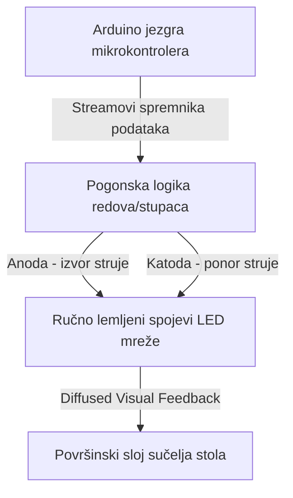

import ProjectGallery from '../../../components/projects/ProjectGallery.astro';
import ledDeskPic from '../../../assets/projects/led-desk/featured.webp';

## Ukratko o projektu

Interaktivni namještaj i indikatorski zasloni velikih razmjera zahtijevaju robusnu koordinaciju hardvera kako bi se upravljalo s više svjetlosnih zona bez visokih troškova komponenti. Razvijen kao natjecateljski timski rad za državne tehničke discipline, ovaj se projekt fokusirao na dizajn i konstrukciju potpuno funkcionalnog "Programabilnog LED stola" – strukturalne radne stanice s ugrađenom, prilagođenom adresabilnom LED mrežom sposobnom za prikaz dinamičkih vizualnih indikatora, geometrijskih obrazaca i skrolajućeg teksta.

Glavna inženjerska prepreka bila je sama ljestvica ručne izrade hardvera i usmjeravanja podataka. Umjesto postavljanja gotovih komercijalnih LED panela, core raspored matrice zahtijevao je ručno postavljanje strukture, izolaciju diskretnih komponenti i gusto povezivanje lemljenjem od točke do točke. Na strani softvera, izazov je bio razviti optimizirani ugradbeni firmware za obradu izračuna spremnika okvira (*frame-buffer*), logiku skeniranja redaka/stupaca i glatke prostorne prijelaze na ograničenoj arhitekturi mikrokontrolera.

Finalizirani prototip industrijske klase predstavljen je na **Državnom natjecanju „XI Festival rada“ (Izložba tehničkih radova) u Bužimu**, gdje je osvojio **1. mjesto** u svojoj kategoriji.

## Moja uloga i izvedba

Ovaj je projekt zahtijevao preciznu ravnotežu između repetitivnog fizičkog sklapanja s nultom tolerancijom na pogreške i algoritamskog izvršavanja softvera.

### Razvoj niskorazinskog firmware-a i logike obrazaca
* **Algoritamsko generiranje vizuala:** Dizajnirao sam i programirao prilagođenu arhitekturu firmware-a za izračunavanje i isporuku složenih matematičkih svjetlosnih obrazaca, prostornih valova i petlji za osvježavanje u stvarnom vremenu.
* **Matrica za renderiranje teksta:** Izradio sam prilagođeni sloj za mapiranje fontova, pretvarajući čiste tekstualne nizove (*strings*) u specifična stanja koordinata piksela kako bi se omogućio prikaz skrolajućih tekstualnih podataka preko cijelog zaslona.
* **Optimizirana arhitektura izvršavanja:** Strukturirao sam glavne runtime petlje u Embedded C++ jeziku kako bih osigurao učinkovito slanje podataka o redovima, eliminirajući vidljivo treperenje (*flickering*) i stabilizirajući ažuriranje zaslona pod intenzivnim računskim pomacima.

### Izrada hardverskog prototipa i lemljenje matrice
* **Ručno sklapanje mreže:** Osobno sam su-projektirao i izveo fizičko sklapanje matrice zaslona. Svaki pojedinačni LED čvor u strukturi stola bio je ručno pozicioniran, poravnat i zalemljen na zajedničke sabirnice podataka i napajanja.
* **Kondicioniranje signalnih linija:** Formulirao sam interni okvir za usmjeravanje ožičenja, implementirajući mreže pull-up/pull-down otpornika kako bih spriječio elektroničko preslušavanje (*cross-talk*), degradaciju signala i padove napona kroz gustu hardversku mrežu.
* **Strukturna integracija i testiranje:** Integrirao sam finaliziranu bakrenu mrežnu matricu neprimjetno ispod zaštitnog površinskog sloja stola, provodeći kontinuirane testove opterećenja, dijagnostičke provjere multimetrom i toplinske evaluacije kako bih zajamčio siguran rad tijekom dugotrajnih javnih izložbi.

## Tehnički stack i matrica materijala

* **Glavna računalna arhitektura:** Arduino razvojni okvir za mikrokontrolere
* **Zaslonski elementi:** Visoko-svijetleće diskretne svjetleće diode (LED), prekidači s tranzistorskim matricama
* **Upravljački softver:** Optimizacijski sloj u ugrađenom (Embedded) C/C++ jeziku, niskorazinske rutine za manipulaciju bitovima
* **Materijali za izradu:** Visoko-vodljivo bakreno ožičenje, sustavi za precizno toplinsko lemljenje, perforirane izolacijske podloge
* **Hardver za analizu:** Digitalni multimetri, laboratorijski regulatori napajanja

## Topologija upravljanja matricom

Hardverski raspored sustava funkcionira kao lokalizirani pipeline koordinata, gdje firmware obrađuje pojedinačne grafičke spremnike (*buffers*) i šalje signale za izvršenje kroz pogonske sklopove kako bi osvijetlio točna sjecišta zaslona:

## Natjecateljski rezultati i utjecaj

| Métrica / Dimenzija | Ostvareni rezultat | Tehnička verifikacija |
| :--- | :--- | :--- |
| **Poredak na natjecanju** | <a href="/assets/diplomas/1st-place-diploma-xi-festival-rada.pdf" target="_blank" rel="noopener noreferrer" data-astro-reload>Diploma za 1. mjesto</a> | Državna izložba tehničkih radova (XI Festival rada) u Bužimu |
| **Metoda izrade** | 100% ručno lemljenje komponenti | Potpuna izrada linija čvorova tehnikom od točke do točke |
| **Podrška za renderiranje** | Statični/skrolajući tekst i obrasci | Logika raspodjele vektora putem koordinatnih mapa |
| **Pouzdanost sustava** | Izvršavanje bez ijedne pogreške | Višesatna dijagnostička provjera rada pod opterećenjem |

## Zaključak
Uspjeh projekta Programabilnog LED stola zaokružio je niz uzastopnih osvajanja titula državnog prvaka kroz više godina. Suočavanje s rigoroznim fizičkim zahtjevima ručne izrade matrice komponenti visoke gustoće od same nule donijelo mi je neprocjenjivo iskustvo u niskorazinskom otklanjanju pogrešaka na hardveru (*hardware debugging*), optimizaciji putanja signala i ugrađenoj kontroli vremena (*embedded timing controls*). Riječ je o temeljnim strukturalnim disciplinama koje snažno podupiru moj današnji pristup modernom softverskom inženjerstvu.

## Galerija projekta

<ProjectGallery images={[
  { 
    src: ledDeskPic, 
    alt: 'Izložbeni štand projekta Programabilni LED stol koji prikazuje integraciju prilagođenog hardvera i ambijentalno osvjetljenje koji su osvojili nacionalno prvenstvo', 
    caption: 'Nagrađivani projekt Programabilni LED stol izložen na nacionalnoj izložbi, koji ističe prilagođeni raspored ugrađenog hardvera, strukturnu montažu i sinkronizaciju ambijentalnog svjetla koji su osigurali titulu nacionalnog prvaka.' 
  }
]} />