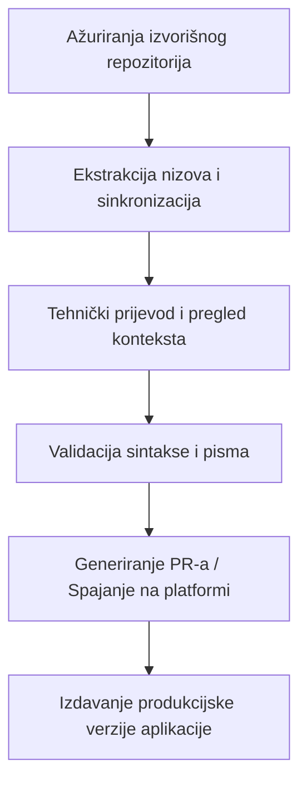

## Ukratko o projektu

U modernom razvoju softvera, visokoučinkoviti sigurnosni alati, sistemski uslužni programi i multimedijske aplikacije često zanemaruju lokalizaciju za manje regionalne jezike. To stvara barijeru pristupačnosti za zajednicu na Balkanu (govornike bosanskog, hrvatskog i srpskog jezika).

Moja misija u sklopu ovog krovnog projekta jest pružiti precizne, tehnički dosljedne prijevode za aplikacije otvorenog koda (*open-source*). Tehnička lokalizacija ide daleko izvan doslovnog prijevoda; ona zahtijeva duboko inženjersko razumijevanje sigurnosnih protokola, UI/UX ograničenja, kodiranja znakova (*character encoding*) i upravljanja višestrukim pismima (neometano kretanje između latinice i ćirilice) bez narušavanja izgleda aplikacije ili kompajliranih tekstualnih nizova (*strings*).

## Moja uloga i izvedba

Umjesto da lokalizaciju tretiram kao pasivan zadatak, ja je vodim kao pipeline za kontinuiranu integraciju (CI). Aktivno upravljam sinkronizacijom prijevoda na više platformi za lokalizaciju korporativne razine, kao i izravno unutar sustava za kontrolu verzija.

### Ključni doprinosi i projekti

* **Aegis Authenticator:** Lokalizirao sam ovo vrhunsko, sigurno open-source 2FA rješenje za Android putem Crowdin platforme. Fokusirao sam se na precizan prijevod kriptografske terminologije, hardverski podržanih sigurnosnih protokola i uputa za sigurnosno kopiranje i obnavljanje šifriranih trezora (*vaults*), gdje bi lingvističke pogreške mogle dovesti do gubitka korisničkih podataka.
* **TizenBrew & TizenTube:** Upravljao sam lokalizacijskim workflow-om izravno kroz GitHub repozitorije koristeći JSON datoteke rječnika (*flat-file dictionaries*). To je uključivalo postavljanje lokalizacijskih tablica, upravljanje zahtjevima za spajanje (PR-ovima), osiguravanje konzistentnosti pisma i implementaciju eksperimentalnih prilagođenih jezičnih nizova (poput klingonskih varijabli) kako bi se testirao temeljni i18n mehanizam aplikacije.
* **Blowfish Theme (HUGO):** Pridonio sam tehničkoj lokalizaciji izravno putem GitHub Pull Requesta (PR) za ovaj popularni Hugo framework ekosustav visokih performansi, osiguravajući da se precizni konfiguracijski pojmovi i varijable rasporeda ispravno mapiraju za regionalnu zajednicu programera.
* **RetroArch:** Lokalizirao sam ovo masivno, legendarno open-source sučelje za emulaciju više sustava putem Crowdin-a, prevodeći složene sistemske postavke, konfiguracije jezgri (*cores*) i parametre emuliranog hardverskog sučelja kako bi se osiguralo optimalno korisničko iskustvo.
* **Gallery Compose:** Lokalizirao sam ovu modernu, laganu Android aplikaciju za medijsku galeriju izgrađenu pomoću Jetpack Compose-a putem Crowdin-a, mapirajući UI komponente i instrukcije medijske sheme izravno unutar nativnog Androidovog lokaliziranog ekosustava resursa.
* **CustomRP:** Preveo sam složeno konfiguracijsko sučelje putem PoEditora, poboljšavajući korisničko iskustvo i pristupačnost za globalnu zajednicu programera koji koriste Discord Rich Presence.

## Tehnički stack i platforme

* **Kontrola verzija i workflow:** Git, GitHub (Grananje, rješavanje konflikata, Pull Requesti)
* **Platforme za lokalizaciju:** Crowdin Enterprise, PoEditor
* **Standardi i paradigme:** i18n interpolacija nizova, datoteke rječnika (JSON, XML, ARB), upravljanje višestrukim pismima (latinica/ćirilica mapiranje)

## Proces

Moj lokalizacijski workflow oponaša standardni životni ciklus razvoja softvera (SDLC) kako bi se zajamčilo da slomljeni nizovi ili sintaktičke pogreške nikada ne stignu do produkcije:

* **Pregled konteksta i koda:** Prije prevođenja pregledavam izvorišni kod (*upstream source code*) ili datoteke resursa kako bih razumio smještaj varijabli (`{user}`, `%s`), ograničenja izgleda sučelja i kako se tekstualni nizovi ponašaju dinamički u UI-ju.
* **Lingvistička normalizacija:** Primjenjujem standardnu tehničku terminologiju za bosanski, hrvatski i srpski jezik, osiguravajući da složeni pojmovi softverskog inženjerstva zvuče prirodno, a istovremeno visoko profesionalno.
* **Sintaktička zaštita:** Ručno provjeravam ispravljanje znakova (*string escapes*), završne razmake (*trailing whitespaces*) i markdown sintaksu unutar lokalizacijskih nizova kako bih osigurao da lokalizirani payload nikada ne sruši kompajlirani produkcijski build.

### Registar projekata (Kontinuirana matrica)

U nastavku se nalazi provjereni zapis projekata otvorenog koda koje sam lokalizirao ili ih trenutno održavam. Ovaj se registar kontinuirano ažurira kako se novi prevoditeljski moduli isporučuju u produkciju:

| Naziv projekta / alata | Platforma / Stack | Ciljana publika / Komponenta |
| :--- | :--- | :--- |
| **Aegis Authenticator** | Crowdin / XML | Sigurnost / 2FA Vault Android aplikacija |
| **TizenBrew** | GitHub / JSON | Multimedija / Prilagođena integracija OS-a |
| **TizenTube** | GitHub / JSON | Video streaming / UI na strani klijenta |
| **Blowfish Theme** | GitHub / YAML | Razvojni framework / HUGO ekosustav |
| **RetroArch** | Crowdin / C Strings | Frontend / Emulator za više sustava |
| **Gallery Compose** | Crowdin / XML | Multimedija / Android Jetpack Compose aplikacija |
| **CustomRP** | PoEditor / Rich Text | Razvojni alat / Discord Rich Presence |

### Verifikacija i metrike uživo

Svaki doprinos je kriptografski povezan s mojim profilima ili eksplicitno spojen putem provjerenih GitHub Pull Requesta. Moj aktivni volumen prijevoda, odobrene nizove i metrike glasovanja unutar open-source ekosustava možete pratiti uživo izravno putem mojih javnih profila:

* **Provjereni Crowdin profil i doprinosi:** [crowdin.com/profile/lukapiplica](https://crowdin.com/profile/lukapiplica)
* **Doprinosi kodu otvorenog koda:** [github.com/lukapiplica](https://github.com/lukapiplica)