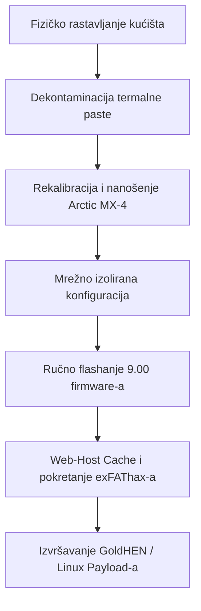

import img1 from "../../../assets/projects/ps4-restoration/1.webp";
import img2 from "../../../assets/projects/ps4-restoration/2.webp";
import img3 from "../../../assets/projects/ps4-restoration/3.webp";
import img4 from "../../../assets/projects/ps4-restoration/4.webp";
import img5 from "../../../assets/projects/ps4-restoration/5.webp";
import img6 from "../../../assets/projects/ps4-restoration/6.webp";
import img7 from "../../../assets/projects/ps4-restoration/7.webp";
import img8 from "../../../assets/projects/ps4-restoration/8.webp";

## Ukratko o projektu

Komercijalne igraće konzole često se suočavaju s teškim toplinskim prigušenjem (*thermal throttling*) i padom performansi tijekom duljeg životnog vijeka zbog nakupljanja prašine i dotrajalih toplinskih sučelja. Ovaj projekt sistemskog inženjerstva bio je usmjeren na potpunu fizičku restauraciju, toplinsku optimizaciju i eksploataciju kernela (jezgre) PlayStation 4 Slim konzole.  

**Pravno odricanje odgovornosti:** Ovu PS4 konzolu planiram koristiti isključivo za instalaciju Linuxa i eksperimentiranje iz čiste radoznalosti. Ne odobravam i ne podržavam piratstvo; ovaj je članak napisan isključivo u edukativne svrhe! Ne snosim odgovornost za vaše postupke!  

Cilj je bio dvostruk: prvo, ukloniti teško toplinsko prigušenje provođenjem potpunog rastavljanja hardvera (*hardware teardown*) i preciznim kemijskim čišćenjem; drugo, izvršiti kontroliranu nadogradnju firmware-a na točnu verziju 9.00, implementirati ručni kernel exploit putem web vektora (*exfathax*) i sigurno pokrenuti neovisno Linux radno okruženje za edukativno testiranje.

    

## Moja uloga i izvedba
Izveo sam kompletan životni ciklus ovog projekta, podijelivši radni proces na fizičko hardversko inženjerstvo i niskorazinsku eksploataciju sustava.

## Restauracija hardvera i upravljanje toplinom
* **Potpuno rastavljanje (Teardown):** Proveo sam sveobuhvatno strukturalno rastavljanje kućišta konzole kako bih pristupio matičnoj ploči, ventilatoru i unutarnjem sklopu hladnjaka (*heatsink*).

    

    

* **Kemijska dekontaminacija:** Koristio sam izopropilni alkohol visoke čistoće (99% IPA) za potpuno uklanjanje stare, degradirane tvorničke termalne paste bez oštećenja okolnih osjetljivih površinski montiranih komponenti (SMD).

    

* **Nadogradnja termalnog sučelja:** Očistio sam unutarnja rebra hladnjaka i nanio visokoučinkovitu Arctic MX-4 termalnu pastu ravnomjernim nanošenjem tankog sloja po cijeloj površini, čime sam uspješno smanjio razinu buke ventilatora i uklonio toplinska uska grla pod teškim opterećenjima.

    

    

## Manipulacija firmware-om i eksploatacija
* **Optimizacija mrežno izoliranog (Air-Gapped) OS-a:** Izolirao sam konzolu od Sonyjevih automatiziranih mrežnih ažuriranja potpunim preoblikovanjem mrežnih sučelja sustava, isključivanjem automatske telemetrije/preuzimanja i konfiguriranjem specijaliziranog primarnog i sekundarnog DNS usmjeravanja (`192.241.221.79` / `165.227.83.145`) kako bih sigurno blokirao dolazne pakete proizvođača.
* **Ručna nadogradnja firmware-a:** Kreirao sam strogo definiranu statičnu strukturu mapa (`/PS4/UPDATE/PS4UPDATE.PUP`) na exFAT datotečnom sustavu USB memorije, pripremajući i instalirajući službenu sliku particije oporavka (*recovery system image*) za verziju 9.00 putem lokalnog medija.

    

* **Eksploatacija memorije jezgre (Kernel Memory Exploitation):** Koristio sam specijalizirane alate za predmemoriranje web-hosta (GoldHEN ekosustav payload-a putem Karo domaćina) zajedno s vanjskim mehanizmom za ubrizgavanje binarnog koda (`exfathax.img`), koji je flashan na USB pogon pomoću alata Rufus. Time je izazvan zaobilazak granica memorije iskorištavanjem ranjivosti u parseru exFAT datotečnog sustava.

## Tehnički stack i hardverska matrica
* **Hardverski materijali:** Arctic MX-4 termalna pasta, izopropilni alkohol (dekompatibilat), specijalizirani precizni odvijači
* **Okviri za eksploataciju:** GoldHEN Payloads, Web-Exploit vektorski mehanizmi (Karo), Rufus softver za pisanje po blokovima memorije
* **Ciljane arhitekture OS-a:** Orbis OS (baziran na BSD-u), prilagođena klijentska ugrađena Linux okruženja

## Pipeline radnog procesa sustava
Cijeli proces pripreme sustava pratio je strogi slijed kako bi se osiguralo da je hardverska stabilnost u potpunosti uspostavljena prije izvođenja nestabilnih modifikacija memorije jezgre u vremenu izvodišta:

## Registar hardverskih i sistemskih artefakata
U nastavku se nalaze tehničke specifikacije stanja deploymenta i materijala kojima se upravljalo tijekom životnog ciklusa sustava:

| Komponenta sustava | Tehnologija / Okvir | Strategija implementacije |
| :--- | :--- | :--- |
| **Termalno sučelje** | Arctic MX-4 Carbon Compound | Ponovno nanošenje paste s visokom toplinskom vodljivošću |
| **Baza firmware-a** | Sony System Image v9.00 | Ciljana nadogradnja putem particije za oporavak |
| **Vektor eksploatacije** | Webkit / Bug exFAT datotečnog sustava | Ručno ubrizgavanje payload-a u predmemoriju web preglednika |
| **Upravitelj payload-om** | GoldHEN ekosustav | Niskorazinski posrednik za homebrew i pristup kernelu |
| **Mrežni prolaz (Gateway)** | Prilagođeni izolirani ručni DNS | Blokiranje Sonyjeve telemetrije i vektora ažuriranja |

## Konačni rezultat

    

### Zaključak i stanje projekta
> **NAPOMENA:** Ako dođe do pogrešaka ili se konzola sruši, ponovno pokrenite PS4 i pokušajte opet! Ovaj Jailbreak nije postojan (*persistent*), što znači da nakon isključivanja ili ponovnog pokretanja morate ponoviti cijeli postupak. Jedno od rješenja je prebacivanje PS4 konzole u način mirovanja (*rest mode*), ili možete automatizirati isporuku payload-a lokalno koristeći ESP32 ili Raspberry Pi mikrokontroler.

Fizička restauracija bila je potpuno uspješna, trajno utišavši buku unutarnjeg ventilatora konzole i spriječivši rušenje sustava uslijed pregrijavanja. Niskorazinski *exfathax* kernel exploit postigao je stopu uspješnosti inicijalizacije od približno 80%, pružajući potpuno funkcionalno sandbox okruženje pogodno za kontinuirane eksperimente s Linux kernelom i istraživanje prilagođenih ugrađenih sustava.

