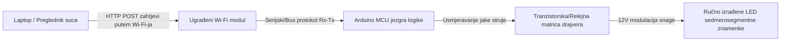

## Ukratko o projektu

Tradicionalni sportski semafori oslanjaju se na skupe, vlasničke (*proprietary*) hardverske kontrolere ili žičane veze koje ograničavaju mobilnost i povećavaju složenost instalacije. Razvijen u sklopu natjecateljskog učeničkog tima pod akademskim mentorstvom, ovaj je projekt imao za cilj izgraditi jeftin, visoko vidljiv košarkaški semafor s Wi-Fi vezom od same nule.

Glavni izazov bio je konstruirati cjeloviti ekosustav Interneta stvari (IoT). To je zahtijevalo projektiranje prilagođenih fizičkih zaslona visoke svjetline sposobnih za prikaz metrika utakmice u stvarnom vremenu, razvoj stabilnog ugrađenog firmware-a za rukovanje asinkronim hardverskim prekidima (*interrupts*) te podizanje lokalnog bežičnog web poslužitelja koji sucima omogućuje neometano upravljanje rezultatima i vremenom iz bilo kojeg web preglednika.

Finalni sustav predstavljen je na **Državnom natjecanju „IX Festival rada“ (Izložba tehničkih radova) u Hadžićima**, gdje je u konkurenciji tehničkih projekata iz cijele zemlje uspješno osvojio **1. mjesto**.

## Moja uloga i izvedba

Ovaj projekt bio je zajednički timski rad koji je zahtijevao duboku sinkronizaciju između softverske logike, mrežne arhitekture i fizičkog prototipiranja elektronike.

### Ugrađeni softver i bežično umrežavanje
* **Firmware mikrokontrolera:** Sudjelovao sam u programiranju jezgre arhitekture Arduino mikrokontrolera, implementirajući logiku konačnih automata (*state machine*) za upravljanje sportskim štopericama, smanjenjem vremena i strukturalnim izračunima znamenki bez blokiranja sustava.
* **Integracija lokalnog web poslužitelja:** Su-dizajnirao sam firmware za ugrađeni Wi-Fi modul, omogućujući mu da djeluje kao lokalna pristupna točka (*Access Point*) koja udomljuje stateless HTML upravljački portal.
* **Asinkroni prihvat web zahtjeva:** Mapirao sam dolazne HTTP zahtjeve pokrenute interakcijom korisnika na klijentskom web terminalu izravno u hardverske rutine za izvršavanje, mijenjajući rezultate i parametre vremena utakmice u stvarnom vremenu.

### Hardversko inženjerstvo i arhitektura fizičkog zaslona
* **Prilagođeni sedmerosegmentni moduli:** Dizajnirali smo i izradili prilagođene, velike sedmerosegmentne zaslone. Umjesto korištenja malih komercijalnih IC komponenti, ručno smo rezali, povezivali i lemili LED trake visoke gustoće u izolirane strukturalne geometrijske segmente.
* **Raspored pogonskih sklopova (Drivers):** Sudjelovao sam u razvoju hardverskog sučelja za usmjeravanje, koristeći tranzistore i relejne module za sigurno pojačavanje i podizanje strujnih putanja s logičkih pinova Arduina niske snage na više naponske zahtjeve LED matrica (12V).
* **Sklapanje i integracija sustava:** Surađivao sam na montaži strukturalnog hardverskog okvira, uspostavljanju čistih zajedničkih linija uzemljenja (*common-ground*) i izolaciji spojeva kako bi se osigurala pouzdana fizička izdržljivost tijekom transporta i stres testova na izložbi uživo.

## Tehnički stack i matrica materijala

* **Glavni upravljački hardver:** Arduino ekosustav mikrokontrolera, ESP8266 ugrađeni Wi-Fi moduli
* **Zaslonski elementi:** Visoko-gustoćne 12V LED trake, modificirana polikarbonatna strukturalna kućišta
* **Tehnologije sučelja:** Izvorni HTML5 rasporedi, HTTP protokol, ugrađeni C/C++ (Arduino IDE)
* **Alati za proizvodnju:** Oprema za precizno lemljenje, digitalni multimetri, kompleti za strukturalno prototipiranje

## Topologija IoT infrastrukture

Orkestracija hardvera i softvera pratila je lokaliziranu bežičnu petlju, osiguravajući da nisu potrebne nikakve vanjske internetske ovisnosti za održavanje rada sustava tijekom prezentacije na turniru:

## Povijest prvenstva i tehnički utjecaj

| Metrika / Dimenzija | Ostvareni rezultat | Tehnička verifikacija |
| :--- | :--- | :--- |
| **Poredak na natjecanju** | <a href="/assets/certificates/1st-place-certificate-ix-festival-rada.pdf" target="_blank" rel="noopener noreferrer" data-astro-reload>Diploma za 1. mjesto</a> | Državna izložba tehničkih radova (IX Festival rada) |
| **Odziv sučelja** | Gotovo trenutačan (&lt;50ms latencija) | Implementacija lokaliziranog i izoliranog Wi-Fi usmjeravanja |
| **Izvedba zaslona** | 100% prilagođena izrada | Optimizacija ručno izrađenih segmenata matrice |
| **Trošak sustava** | Minimalni utrošak resursa | Znatno jeftinije od industrijskog, tradicionalnog sportskog hardvera |

## Zaključak
Ovaj projekt predstavlja ključnu prekretnicu koja je pokazala moje rane sposobnosti u konvergenciji različitih sustava. Svladavanje strukturalnih izazova poput ručnog lemljenja, filtriranja šuma na signalnim linijama i ugrađenog web usmjeravanja, donijelo mi je temeljna znanja o niskorazinskom otklanjanju pogrešaka (*low-level debugging*) i upravljanju fizičkim sučeljima. Ta se znanja danas izravno očituju u mom pristupu razvoju modernih *full-stack* aplikacija.
