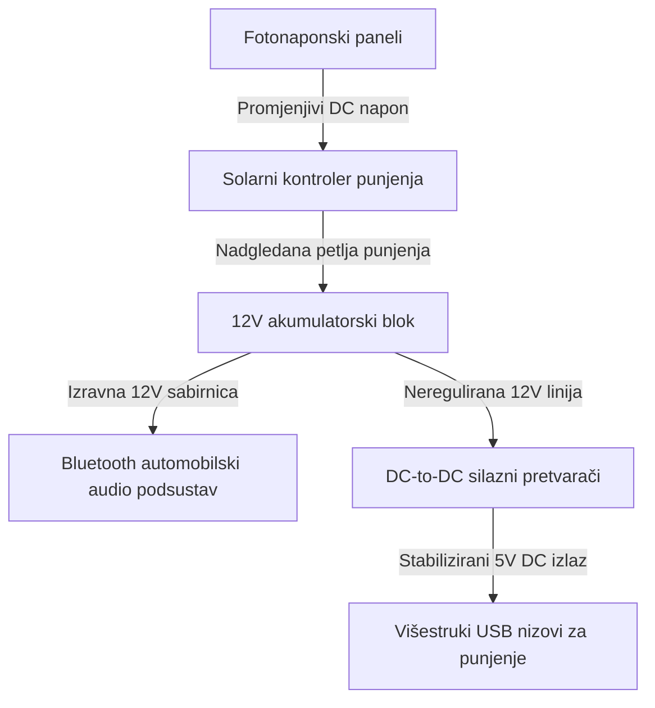

import ProjectGallery from '../../../components/projects/ProjectGallery.astro';
import solarTreePic from '../../../assets/projects/solar-tree/featured.webp';

## Ukratko o projektu

Kako se javna infrastruktura pomiče prema pametnim gradovima (*smart-city*), održivi energetski čvorovi niske potrošnje postaju ključni za urbana okruženja. Razvijen pod akademskim vodstvom kao natjecateljski rad učeničkog tima, ovaj je projekt imao za cilj izgraditi funkcionalni prototip "Solarnog stabla" – javne punionice izvan mreže (*off-grid*) projektirane za prikupljanje solarne energije i sigurnu distribuciju struje do potrošačke elektronike i lokalnih bežičnih audio podsustava.

Inženjerski izazov bio je strogo fokusiran na integraciju hardverskih podsustava. Sustav je morao uhvatiti promjenjivu ambijentalnu solarnu energiju, stabilizirati fluktuirajuće istosmjerne struje (DC) koje dolaze iz fotonaponskih ćelija, sigurno pohraniti rezervni kapacitet unutar kemijskog baterijskog bloka te spustiti izlazni napon kako bi isporučio čisto, regulirano napajanje na više USB priključaka i integrirani automobilski audio sustav s Bluetooth vezom.

Finalizirani prototip zelene energije predstavljen je na **Državnom natjecanju „X Festival rada“ (Izložba tehničkih radova) u Zenici**, gdje je u jakoj konkurenciji osvojio **1. mjesto**.

## Moja uloga i izvedba

Razvoj ovog projekta uvelike se oslanjao na fizičku izvedbu, preciznu električnu distribuciju i sigurnu podjelu energetskih faza.

### Fotonaponsko prikupljanje i izolacija baterijske pohrane
* **Integracija solarne matrice:** Sudjelovao sam u konfiguriranju i postavljanju modula solarnih panela visoke učinkovitosti, montirajući strukturalne nizove kako bi se maksimizirali kutovi upada svjetlosti.
* **Optimizacija petlje punjenja:** Povezao sam fotonaponske izlaze u namjensku petlju kontrolera punjenja, uspostavljajući pouzdan višefazni režim punjenja baterija kako bi se kemijska jezgra akumulatora zaštitila od prekomjernog punjenja i povratnih struja.
* **Distribucija energetskog kapaciteta:** Izolirao sam i upravljao usmjeravanjem kabela jakog presjeka između solarnih panela, baterijskih blokova i središnje distribucijske stezaljke.

### Regulacija izlaza i ožičenje podsustava
* **Stabilizirani USB izlazni nizovi:** Pomogao sam u dizajnu i testiranju krugova za regulaciju napona, koristeći silazne pretvarače (*buck-converters*) za spuštanje izvornog napona baterije na fiksni izlaz od 5V DC, omogućujući sigurno, istodobno punjenje više mobilnih uređaja.
* **Implementacija Bluetooth audio jedinice:** Konfigurirao sam interni električni raspored za napajanje standardnog automobilskog radija opremljenog Bluetooth sučeljem za bežični streaming medija. Fokusirao sam se na odvajanje audio linija i energetskih sabirnica kako bih spriječio visokofrekventni RF šum i smetnje uzemljene petlje (*ground-loop*) kroz aktivne kanale za punjenje.
* **Montaža kućišta i javna sigurnost:** Surađivao sam na potpunom strukturalnom sklapanju, lemljenju robusnih spojeva, postavljanju termo-bužira na ranjiva mjesta te uzemljenju unutarnje šasije kako bi se osigurala operativna pouzdanost i sigurnost tijekom demonstracija uživo pred publikom.

## Tehnički stack i matrica materijala

* **Hardver za prikupljanje energije:** Visokoučinkoviti fotonaponski (PV) solarni paneli
* **Upravljanje energijom:** DC-to-DC silazni pretvarači napona (*buck-converters* za 5V USB), namjenski solarni kontroleri punjenja
* **Akumulacija energije:** Blok olovnih hermetičkih baterija s dubokim ciklusom pražnjenja (SLA Deep-Cycle)
* **Povezivost i audio:** 12V automobilski radio s Bluetooth-om, višestruki USB čvorišta za punjenje
* **Alati za implementaciju:** Digitalni voltmetri, oprema za testiranje Bluetooth 4.0/RF signala, kompleti za snažno lemljenje, zaštitna izolacijska matrica

## Dijagram električne distribucije

Cijeli sustav funkcionira kao zatvorena, izolirana (*air-gapped*) DC distribucijska mreža, čime se eliminira potreba za skupim i neučinkovitim pretvaranjem u izmjeničnu struju (AC) i minimiziraju gubici u konverziji energije:

## Povijest prvenstva i tehnički utjecaj

| Metrika / Dimenzija | Ostvareni rezultat | Tehnička verifikacija |
| :--- | :--- | :--- |
| **Poredak na natjecanju** | <a href="/assets/diplomas/1st-place-diploma-x-festival-rada.pdf" target="_blank" rel="noopener noreferrer" data-astro-reload>Diploma za 1. mjesto</a> | Državna izložba tehničkih radova (X Festival rada) u Zenici |
| **Regulacija izlaza** | Čiste 5V DC sabirnice | Implementacija izoliranih silaznih pretvarača s povratnom vezom |
| **Autonomija sustava** | 100% izvan mreže (*Off-Grid*) | Lokalizirana solarna distribucijska petlja bez vanjskih ovisnosti |
| **Bežično sučelje** | Integrirani Bluetooth streaming | Strategija dodjele paralelnih energetskih linija i suzbijanja RF šuma |

## Zaključak
Uspješna implementacija i obrana prototipa Solarnog stabla na državnoj izložbi potvrdili su naš pristup izgradnji multidisciplinarnih sustava. Balansiranje između sigurnosti akumulatora visoke struje, distribucije energije za potrošačku elektroniku niske potrošnje i bežičnih RF podsustava pružilo mi je praktične inženjerske uvide u hardversku zaštitu, planiranje potrošnje struje (*current budgeting*) i modularno fizičko sklapanje, što i danas utječe na moj dizajn strukturalnih sustava.

## Galerija projekta

<ProjectGallery images={[
  { 
    src: solarTreePic, 
    alt: 'Izložba tehničkog prototipa Solarnog stabla koja prikazuje instalaciju održive energije i integrirane solarne panele', 
    caption: 'Potpuno sastavljeni tehnički prototip Solarnog stabla na javnoj izložbi, koji ističe strukturnu integraciju fotonaponskih panela i održivi arhitektonski dizajn.' 
  }
]} />