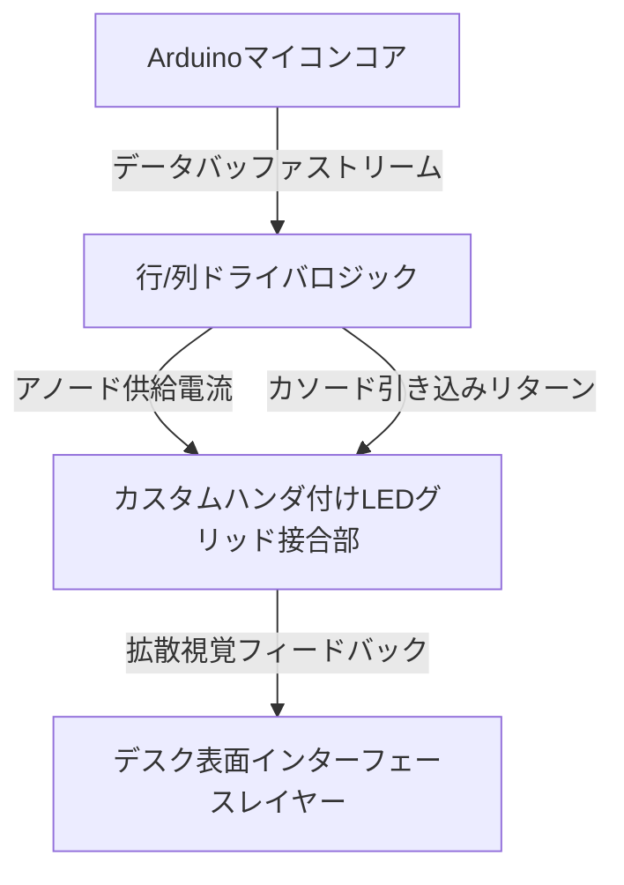

import ProjectGallery from '../../../components/projects/ProjectGallery.astro';
import ledDeskPic from '../../../assets/projects/led-desk/featured.webp';

## プロジェクト概要

インタラクティブな家具や大型のインジケーターディスプレイは、部品コストを抑えつつ複数の発光ゾーンを管理するために、堅牢なハードウェアの協調制御が必要となります。全国の技術系コンテストへの学生チーム出展作品として開発された本プロジェクトでは、動的な視覚インジケーター、幾何学パターン、スクロールテキストをレンダリングできる、カスタム構築のアドレス指定可能なLEDグリッドを組み込んだ、完全機能型の「プログラマブルLEDデスク」の設計と製作に焦点を当てました。

最大のエンジニアリング上の障壁は、すべて手作業によるハードウェア製造とデータルーティングの規模の大きさでした。市販の既製品LEDパネルを採用するのではなく、コアとなるマトリックスレイアウトは、手作業による構造配置、個々のコンポーネントの絶縁、そして高密度なポイント・ツー・ポイントのハンダ付けを必要としました。ソフトウェア側では、制約の多いマイコンアーキテクチャ上で、フレームバッファ計算、行・列のスキャンロジック、および滑らかな空間遷移を処理するための最適化された組込みファームウェアを開発することが課題でした。

完成した製品レベルのプロトタイプは、**ブジム（Bužim）で開催された全国技術コンテスト「XI Festival rada（技術作品展）」**に出展され、該当部門で**1位（最優秀賞）**を獲得しました。

## 担当業務と構築内容

このプロジェクトは、許容誤差ゼロの反復的な物理的組み立てと、アルゴリズムによるソフトウェア実行との間の正確なバランスが求められました。

### 低レイヤファームウェア開発とパターンロジック
*   **アルゴリズムによる視覚パターン生成：** 複雑な数学的発光パターン、空間波、およびリアルタイムのリフレッシュループを計算して出力するための、カスタムファームウェアアーキテクチャを設計・プログラム。
*   **テキストレンダリングマトリックス：** 生の文字文字列を特定のピクセル座標状態に変換するカスタムフォントマッピングマトリックスレイヤーを構築し、ディスプレイレイアウト全体にスクロールテキストデータを表示。
*   **最適化された実行アーキテクチャ：** 激しい計算シフトの下でも目に見えるチラつき（フリッカー）を排除し、ディスプレイの更新を安定させるため、組込みC++で効率的な行データディスパッチを行うコアランタイムループを構造化。

### カスタムハードウェア試作とマトリックスハンダ付け
*   **手作業によるグリッド組み立て：** ディスプレイマトリックスの物理的な組み立てを共同エンジニアとして主導・実行。デスクの構造的フットプリント内のすべてのLEDノードをすべて手作業で配置、整列させ、共通のデータレールおよび電源レールにハンダ付け。
*   **信号線のコンディショニング：** 内部配線のルーティングフレームワークを策定。高密度なハードウェアグリッド全体での電子的なクロストーク、信号の劣化、および電圧降下を防ぐために、プルアップ/プルダウン抵抗ネットワークを実装。
*   **構造的統合とテスト：** 完成した銅線グリッドマトリックスをデスクの保護表面レイヤーの真下にシームレスに統合。長期にわたる一般展示での安全な運用を保証するために、連続ストレスチェック、マルチメーターによる診断、および熱評価を実行。

## 技術スタックとマトリックス材料

*   **コア演算アーキテクチャ：** Arduino マイコン開発フレームワーク
*   **ディスプレイ要素：** 高輝度ディスクリート発光ダイオード（LED）、トランジスタアレイマトリックススイッチ
*   **制御ソフトウェア：** 組込みC/C++最適化レイヤー、低レイヤビット操作ルーチン
*   **製造アセット：** 高導電性銅配線、高精度熱ハンダ付けシステム、有孔絶縁基板
*   **解析ハードウェア：** デジタルマルチメーター、卓上型安定化電源

## マトリックス制御トポロジー

システムのハードウェアレイアウトは、ローカライズされた座標パイプラインとして機能します。ファームウェアが個々のグラフィックバッファを処理し、アレイドライバーを介して実行信号をディスパッチすることで、正確なディスプレイの交差点を点灯させます。

## コンテスト実績と技術的影響

| メリカ / 次元 | 達成記録 | 技術的検証 |
| :--- | :--- | :--- |
| **コンテスト順位** | <a href="/assets/diplomas/1st-place-diploma-xi-festival-rada.pdf" target="_blank" rel="noopener noreferrer" data-astro-reload>1位賞状</a> | 全国技術作品展（XI Festival rada）ブジム大会 |
| **製造手法** | 100%手作業による部品ハンダ付け | 完全なポイント・ツー・ポイントによるノード配線構築 |
| **レンダリング対応** | 静止・スクロールテキスト＆パターン | 座標マップによるベクター割り当てロジック |
| **システムの信頼性** | 障害ゼロの実行環境 | 負荷条件下での複数時間にわたる診断実行検証 |

## 結論
プログラマブルLEDデスクプロジェクトの成功により、技術系コンテストにおける数年連続の最優秀賞獲得という、極めて優れた実績を締めくくることができました。高密度な部品マトリックスを一から手作業で構築するという厳格な物理的要求に立ち向かったことで、低レイヤのハードウェアデバッグ、信号経路の最適化、および組込みタイミング制御に関する非常に貴重な専門知識を得ることができました。ここで培ったコアとなる構造的規律は、現在の私のソフトウェアエンジニアリングへのアプローチを強力に支えています。

## プロジェクトギャラリー

<ProjectGallery images={[
  { 
    src: ledDeskPic, 
    alt: '全国大会で優勝を果たした、カスタムハードウェア統合と環境照明を披露するプログラマブルLEDデスクの展示ブース', 
    caption: '全国展示会の会場に展示された、受賞歴のあるプログラマブルLEDデスクプロジェクト。全国優勝のタイトルを獲得する決め手となった、カスタマイズされた組み込みハードウェアのレイアウト、構造体の組み立て、そして環境光の同期を強調しています。' 
  }
]} />