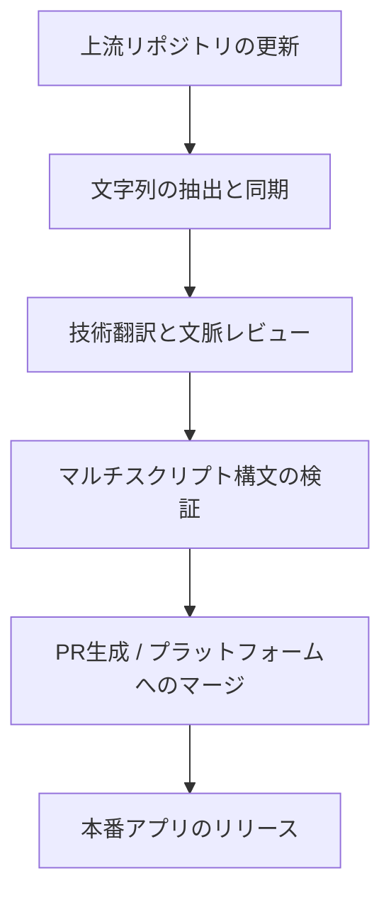

## プロジェクト概要

現代のソフトウェア開発において、影響力の高いセキュリティツール、システムユーティリティ、マルチメディアアプリケーションは、小規模な地域言語へのローカライズが見落とされがちです。これが、バルカン地域のコミュニティ（ボスニア語、クロアチア語、セルビア語の言語圏）におけるアクセシビリティの障壁となっています。

この包括的プロジェクトにおける私の使命は、オープンソースアプリケーションに対して正確で技術的に一貫した翻訳を提供することです。技術的なローカライズは、単なる直訳を遥かに超える作業です。アプリケーションのレイアウトを崩したり、コンパイルされた翻訳文字列を破損させたりすることなく、セキュリティプロトコル、UI/UXの制約、文字エンコーディング、そしてマルチスクリプト展開（ラテン文字とキリル文字のシームレスな切り替え）に対する深いエンジニアリングの理解が求められます。

## 担当業務と貢献内容

私はローカライズを受動的なタスクとして扱うのではなく、継続的インテグレーション（CI）パイプラインとして捉えています。複数のエンタープライズグレードのローカライズプラットフォームや、直接的なバージョン管理システムをまたいで、翻訳の同期を能動的に管理しています。

### 主な貢献実績とプロジェクト

*   **Aegis Authenticator：** 非常に優れた安全なオープンソースの2要素認証（2FA）Androidソリューション。Crowdinを介してローカライズを実施。言語的な誤りがユーザーデータの損失につながる可能性があるため、暗号化用語、ハードウェアベースのセキュリティプロトコル、暗号化された保管庫（Vault）のバックアップ/復元手順の正確な翻訳に集中。
*   **TizenBrew & TizenTube：** JSONフラットファイル辞書を使用し、GitHubリポジトリを通じてローカライズワークフローを直接管理。これには、ローカライズテーブルの設定、プルリクエスト（PR）の管理、マルチスクリプトの一貫性確保、およびアプリケーションの基礎となるi18n解析エンジンをストレステストするための実験的なカスタム言語文字列（クリンゴン語の変数など）の実装が含まれます。
*   **Blowfish Theme (HUGO)：** 高性能なHugoフレームワークエコシステムであるこの人気テーマに対し、GitHubのプルリクエスト（PR）を通じて技術的なローカライズに貢献。地域の開発者コミュニティ向けに、正確な構成用語とレイアウト変数が正しくマッピングされるように対応。
*   **RetroArch：** 伝説的な大規模オープンソース・マルチシステムエミュレータフロントエンド。Crowdinを通じてローカライズを行い、複雑なシステム設定、コア構成、エミュレートされたハードウェアインターフェースのパラメータを翻訳し、最適なユーザーエクスペリエンスを確保。
*   **Gallery Compose：** Jetpack Composeで構築された、モダンで軽量なAndroidメディアギャラリーアプリケーション。Crowdinを介してローカライズを行い、ネイティブAndroidのローカライズリソースエコシステム内でUIコンポーネントとメディアスキーマの指示を直接マッピング。
*   **CustomRP：** Discord Rich Presenceのグローバル開発者コミュニティ向けに、PoEditorを介して複雑な設定インターフェースを翻訳し、ユーザーエクスペリエンスとアクセシビリティを向上。

## 技術スタックとプラットフォーム

*   **バージョン管理＆ワークフロー：** Git, GitHub（ブランチ戦略、競合解消、プルリクエスト）
*   **ローカライズプラットフォーム：** Crowdin Enterprise, PoEditor
*   **標準・パラダイム：** i18n文字列補間、フラットファイル辞書（JSON, XML, ARB）、マルチスクリプトシステム管理（ラテン文字/キリル文字のマッピング）

## プロセス

私のローカライズワークフローは、破損した文字列や構文エラーが本番環境のパイプラインに到達しないことを保証するため、標準的なソフトウェア開発ライフサイクル（SDLC）を模倣しています。

*   **文脈とコードレビュー：** 翻訳を行う前に、上流のソースコードやリソースファイルを検査し、変数の配置（`{user}` や `%s` など）、レイアウトの制限、およびUI内で文字列がどのように動的に動作するかを把握します。
*   **言語の標準化：** ボスニア語、クロアチア語、セルビア語において標準的な技術用語を厳格に適用し、複雑なソフトウェアエンジニアリングの表現が自然でありながらも極めて専門的に響くように調整します。
*   **構文の保護（Syntax Guarding）：** ローカライズ文字列内のエスケープ文字、末尾の空白、Markdown構文を手動で検証し、ローカライズされたペイロードがコンパイル後の本番ビルドを破損させないように徹底します。

### プロジェクト台帳

以下は、私がこれまでにローカライズを担当した、または現在メンテナーを務めているオープンソースプロジェクトの検証済み記録です。この台帳は、新しい翻訳モジュールが本番環境に出荷されるたびに継続的に更新されます。

| プロジェクト / ツール名 | プラットフォーム / スタック | 対象オーディエンス / コンポーネント |
| :--- | :--- | :--- |
| **Aegis Authenticator** | Crowdin / XML | セキュリティ / 2FA保管庫 Androidアプリ |
| **TizenBrew** | GitHub / JSON | マルチメディア / カスタムOS統合 |
| **TizenTube** | GitHub / JSON | ビデオストリーミング / クライアント側UI |
| **Blowfish Theme** | GitHub / YAML | 開発者フレームワーク / HUGOエコシステム |
| **RetroArch** | Crowdin / C構造体文字列 | フロントエンド / マルチシステムエミュレータ |
| **Gallery Compose** | Crowdin / XML | マルチメディア / Android Jetpack Composeアプリ |
| **CustomRP** | PoEditor / リッチテキスト | 開発者ツール / Discord Rich Presence |

### 検証とライブメトリクス

すべての貢献は、私のプロフィールに暗号学的に結び付けられているか、検証済みのGitHubプルリクエストを通じて明示的にマージされています。オープンソースエコシステムにおける私のリアルタイムの翻訳量、承認された文字列、およびアクティブな投票メトリクスは、以下のパブリックプロフィールから直接追跡できます。

* **検証済み Crowdin プロフィール＆貢献実績：** <a href="https://crowdin.com/profile/lukapiplica" target="_blank" rel="noopener noreferrer">crowdin.com/profile/lukapiplica</a>
* **オープンソース コード貢献実績（GitHub）：** <a href="https://github.com/lukapiplica" target="_blank" rel="noopener noreferrer">github.com/lukapiplica</a>
