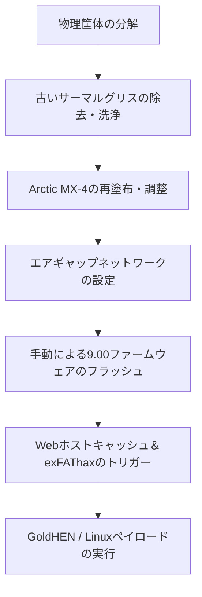

import img1 from "@/assets/projects/ps4-restoration/1.webp";
import img2 from "@/assets/projects/ps4-restoration/2.webp";
import img3 from "@/assets/projects/ps4-restoration/3.webp";
import img4 from "@/assets/projects/ps4-restoration/4.webp";
import img5 from "@/assets/projects/ps4-restoration/5.webp";
import img6 from "@/assets/projects/ps4-restoration/6.webp";
import img7 from "@/assets/projects/ps4-restoration/7.webp";
import img8 from "@/assets/projects/ps4-restoration/8.webp";

## プロジェクト概要

家庭用ゲーム機は、長期間の使用に伴うホコリの蓄積や熱伝導媒体の劣化により、深刻なサーマルスロットリングや性能低下に直面することがよくあります。本システムエンジニアリングプロジェクトでは、PlayStation 4 Slimコンソールの完全な物理的レストア、熱最適化、およびカーネルエクスプロイトに焦点を当てました。

**免責事項：** 本プロジェクトは、好奇心からLinuxをインストールして検証・実験を行うことを目的としています。著作権侵害（マジコン・海賊版行為等）を容認・推奨するものではありません。この記事は純粋に教育的な目的でのみ提供されており、本情報を基に行ったいかなる行動に対しても、私は一切の責任を負いません。

目標は2つありました。1つ目は、ハードウェアの完全な分解と精密な化学洗浄を実行して深刻なサーマルスロットリングを解消すること。2つ目は、ファームウェアを手動で正確にバージョン9.00にアップグレードし、Webベースのカーネルエクスプロイト（exfathax）を実装して、教育的テスト用の独立したLinuxランタイム環境を安全にブートストラップすることです。

    

## 担当業務と構築内容

物理的なハードウェアエンジニアリングと低レイヤのシステムエクスプロイトの間でワークフローを分割し、このプロジェクトの全ライフサイクルを単独で実行しました。

## ハードウェアレストアとサーマルマネジメント

*   **完全な分解：** コンソールの筐体を構造的に完全に分解し、コアとなるマザーボード、ブロワーファン、および内部ヒートシンクアセンブリにアクセス。

    

    

*   **化学的除染：** 周囲の繊細な表面実装部品（SMD）を損傷することなく、高純度イソプロピルアルコールを使用して、経年劣化した工場出荷時の古い熱伝導材料（グリス）を完全に除去。

    

* **熱伝導インターフェースのアップグレード：** 内部ラジエーターのフィンを清掃し、最適化された均一な薄塗り塗布法で高性能なArctic MX-4サーマルグリスを適用。高負荷の演算処理下でも静音化に成功し、熱によるボトルネックを解消。

    

    

## ファームウェア操作とエクスプロイト

*   **エアギャップによるOSの最適化：** システムのネットワークインターフェースを完全に書き換え、自動テレメトリ（遠隔測定）やダウンロードを無効化。さらに、特定のプライマリ/セカンダリDNSルーティング（`192.241.221.79` / `165.227.83.145`）を設定して外部からのアップデート要求を安全に遮断することで、ソニーの自動ネットワークアップデートパスからコンソールを隔離。
*   **手動ファームウェアアップグレード：** exFATファイルシステムブロックデバイス上に静的なディレクトリ構造（`/PS4/UPDATE/PS4UPDATE.PUP`）を構築し、ローカルメディアのブートを介して公式の9.00リカバリシステムパーティションイメージを展開。

    

*   **カーネルメモリのエクスプロイト：** Rufusを介して外部の生のバイナリインジェクションメカニズム（`exfathax.img`）をストレージデバイスにフラッシュ。Karo経由のGoldHENペイロードエコシステムなどの専用Webホストキャッシュツールと組み合わせ、exFATファイルシステムパーサーの脆弱性を突いてメモリ境界のバイパス（境界外アクセス）をトリガー。

## 技術スタックとハードウェアマトリックス

*   **ハードウェア材料：** Arctic MX-4 サーマルコンパウンド、高純度イソプロピルアルコール、精密特殊ドライバー
*   **エクスプロイトフレームワーク：** GoldHEN ペイロード、Webエクスプロイトベクトルエンジン（Karo）、Rufus ブロックライター
*   **対象OSアーキテクチャ：** Orbis OS（BSD派生）、カスタムクライアント側組み込みLinux環境

## システムワークフローパイプライン

システムプロビジョニングのパイプライン全体は、不安定な実行時カーネルメモリの改変を実行する前にハードウェアの安定性を完全に確立するため、厳格な順序に従って進行しました。

## ハードウェア＆システム構成台帳

以下は、システムのライフサイクル全体を通じて管理された、デプロイ状態および使用材料の技術仕様です。

| システムコンポーネント | テクノロジー / フレームワーク | 実装戦略 |
| :--- | :--- | :--- |
| **熱伝導インターフェース** | Arctic MX-4 カーボンコンパウンド | 高熱伝導率コアへの再塗布 |
| **ファームウェアベース** | Sony システムイメージ v9.00 | ピンポイントでのリカバリ・アップグレードパス |
| **エクスプロイトベクトル** | Webkit / exFATファイルシステムバグ | 手動のWebブラウザ・ペイロードキャッシュ注入 |
| **ペイロードハンドラー** | GoldHEN エコシステム | 低レイヤの自作ソフト＆カーネルアクセスブローカー |
| **ネットワークゲートウェイ** | カスタムエアギャップ手動DNS | ソニーの遠隔測定＆アップデートベクトルの遮断 |

## 最終結果

    

### 結論とプロジェクトの状態

> **注意：** エラーが発生したりコンソールがクラッシュした場合は、PS4を再起動してもう一度試してください。このジェイルブレイク（脱獄）は不揮発性（永続的）ではないため、シャットダウンや再起動を行うと、すべての手順を再度実行する必要があります。解決策の1つとしては、PS4を「スタンバイモード（レストモード）」にするか、ESP32やRaspberry Piなどのマイコンを使用してローカルでペイロードの配信を自動化することです。

物理的なレストアは完全に成功し、コンソールの内部ファンノイズを恒久的に静音化し、熱によるクラッシュを防止しました。低レイヤのexfathaxカーネルエクスプロイトは、約80%の初期化成功率を達成し、継続的な低レイヤLinuxカーネル実験やカスタム組み込みシステム研究に適した、完全に機能するサンドボックス環境を実現しました。
