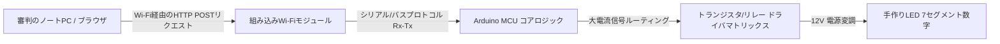

## プロジェクト概要

従来のスポーツ用スコアボードは、高価な専用ハードウェアコントローラーや有線インターフェースに依存していることが多く、これが移動性を制限し、設置の複雑さを増す要因となっていました。本プロジェクトは、学術的なメンターシップのもと、学生チームのコンテスト出展作品として開発され、低コストで視認性が高く、Wi-Fiに対応したバスケットボール用スコアボードを一から構築することを目指しました。

最大の挑戦は、エンド・ツー・エンドのモノのインターネット（IoT）エコシステムを構築することでした。リアルタイムの試合メトリクスをレンダリングできる高輝度な物理ディスプレイの自作、非同期ハードウェア割込みを処理する安定した組込みファームウェアの開発、そして試合の審判が任意のブラウザクライアントからスコアやタイマーをシームレスに制御できるようにするためのローカルワイヤレスWebサーバーの展開が必要とされました。

完成したシステムは、**ハジチ（Hadžići）で開催された全国技術コンテスト「IX Festival rada（技術作品展）」**に出展され、全国から集まった技術プロジェクトと競い合い、見事に**1位（最優秀賞）**を獲得しました。

## 担当業務と構築内容

このプロジェクトは、ソフトウェアロジック、ネットワークアーキテクチャ、および物理的な電子部品の試作の間で深い同期を必要とする、チームでの共同開発の成果です。

### 組込みソフトウェアとワイヤレスネットワーキング
*   **マイコンファームウェア：** コアとなるArduinoマイコンアーキテクチャのプログラミングを補助。ブロッキング（処理の停滞）を発生させることなく、試合のタイマー、時計のカウントダウン、および構造的な桁計算を管理するためのステートマシンロジックを実装。
*   **ローカルWebサーバーの統合：** 組込みWi-Fiモジュールのファームウェアを共同設計し、ステートレスなHTML制御ポータルをホストするローカルアクセスポイントとして機能するように設定。
*   **非同期Webインジェクション：** クライアントのWeb端末上でのユーザー操作によってトリガーされるインバウンドのHTTPリクエストを、ハードウェアの実行ルーチンに直接マッピングし、リアルタイムでスコアや試合クロックのパラメータを変更。

### ハードウェアエンジニアリングと物理ディスプレイアーキテクチャ
*   **カスタム7セグメントモジュール：** 大型でカスタム仕様の7セグメントディスプレイを設計・製作。市販の小さなICコンポーネントを使用する代わりに、高密度LEDストリップを手作業でカット、配線、ハンダ付けし、独立した構造的な幾何学セグメントを構築。
*   **ドライバ回路レイアウト：** ハードウェアのルーティングインターフェースを共同開発。トランジスタとリレーモジュールを活用し、低電力のArduinoロジックピンからの電流経路を、LEDアレイの高い電圧要求に合わせて安全にバッファおよび昇圧。
*   **システムの組み立てと統合：** 構造的なハードウェアフレームワークの取り付け、クリーンな共通グランド電源ラインの確立、および輸送時や実演展示のストレスチェックに耐えうる信頼性の高い物理的耐久性を確保するための絶縁処理を共同で実施。

## 技術スタックと材料マトリックス

*   **コア制御ハードウェア：** Arduino マイコンエコシステム、ESP8266/組み込みWi-Fiモジュールレイアウト
*   **ディスプレイ要素：** 高密度12V LEDストリップ、加工されたポリカーボネート製構造筐体
*   **インターフェース技術：** ネイティブHTML5レイアウト、HTTPプロトコルレイヤー、組み込みC/C++（Arduino IDE）
*   **製造ツール：** 精密ハンダ付け装置、デジタルマルチメーター、構造プロトタイピングスイート

## IoTインフラストラクチャトポロジー

ハードウェアとソフトウェアのオーケストレーションは、ローカライズされたワイヤレスループに従って実行され、トーナメントのプレゼンテーション中に運用のアップタイムを維持するために、外部インターネットへの依存を完全にゼロにしました。

## プロジェクトの実績と技術的影響

| メトリクス / 次元 | 達成記録 | 技術的検証 |
| :--- | :--- | :--- |
| **コンテスト順位** | <a href="/assets/diplomas/1st-place-diploma-ix-festival-rada.pdf" target="_blank" rel="noopener noreferrer" data-astro-reload>1位賞状</a> | 全国技術作品展（IX Festival rada）ハジチ大会 |
| **インターフェース応答** | ほぼ即時（50ms未満のレイテンシ） | ローカライズされたエアギャップWi-Fiルーティングの実装 |
| **ディスプレイの実装** | 100%カスタム製造 | 手作りマトリックスセグメントの最適化 |
| **システムコスト** | 非常に限定的な資産ペイロード | 従来の産業用スポーツハードウェアと比較して大幅な低コスト化 |

## 結論
このプロジェクトは、システム統合における初期のスキルを示す重要なマイルストーンとなりました。手作業によるハンダ付け、信号線のノイズフィルタリング、および組み込みWebルーティングの構造的な課題を克服したことで、低レイヤのデバッグや物理インターフェース管理における基礎的な知識を得ることができました。ここで得た経験は、現在のモダンなフルスタックアプリケーション開発に直接活かされています。