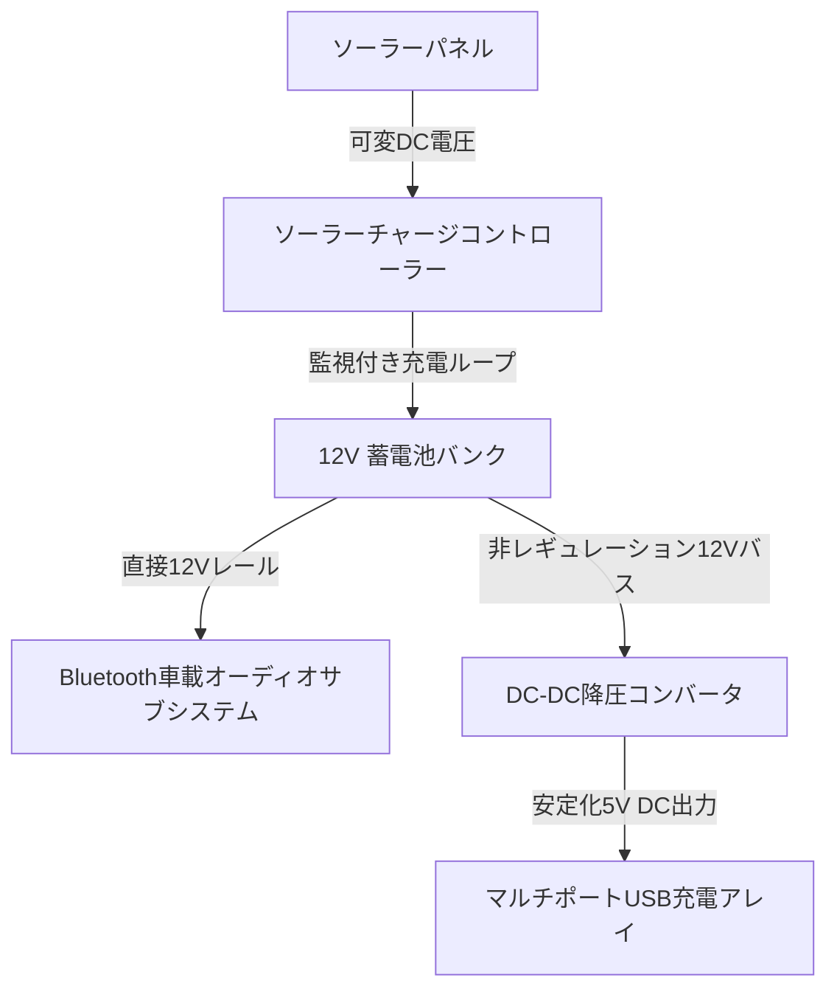

import ProjectGallery from '../../../components/projects/ProjectGallery.astro';
import solarTreePic from '../../../assets/projects/solar-tree/featured.webp';

## プロジェクト概要

公共インフラがスマートシティの枠組みへと移行する中、都市環境において低電力の持続可能エネルギーノードは不可欠な存在となりつつあります。学術的な指導のもと、コンテスト出展作品として開発された本プロジェクトでは、太陽エネルギーを回生し、消費者向けの電子機器やローカライズされたワイヤレスオーディオサブシステムへ安全に電力を再分配する、オフグリッド型の公共充電スタンド「ソーラーツリー（Solar Tree）」のプロトタイプ製作を目的としました。

エンジニアリング上の課題は、完全にハードウェアサブシステムの統合に焦点が絞られていました。変動する周囲の太陽エネルギーを取り込み、太陽電池から出力される不安定な直流（DC）電流を安定させ、化学バッテリーバンク内に予備容量を安全に蓄電。さらに、その出力電圧を降圧して、複数のUSBポートおよび統合されたBluetooth対応車載オーディオシステムへ、クリーンでレギュレーションされた電力を供給する必要がありました。

完成したグリーンエネルギープロトタイプは、**ゼニカ（Zenica）で開催された全国技術コンテスト「X Festival rada（技術作品展）」**に出展され、州内の競合する展示作品を抑えて見事に**1位（最優秀賞）**を獲得しました。

## 担当業務と構築内容

この開発プロセスは、物理的な実装、精密な電力配分、および安全 na パワーステージのパーティショニング（絶縁分離）に大きく依存していました。

### 太陽光発電の回生とバッテリーストレージの隔離
*   **ソーラーマトリックスの統合：** 高効率なソーラーパネルモジュールの配置・設定を共同で担当。光の入射角を最大化するように構造アレイをマウント。
*   **充電ループの最適化：** 太陽光発電の出力を専用のチャージコントラーループに配線。化学蓄電コアを過充電や逆電流から保護するために、信頼性の高いマルチステージバッテリー充電スキームを確立。
*   **電力容量の配分：** ソーラーパネル、バッテリーバンク、および中央配電端子ブロック間の太いゲージ線のルーティングを隔離して管理。

### 出力レギュレーションとサブシステム配線
*   **安定化USB出力アレイ：** 電圧レギュレータ回路の設計とテストを補助。降圧コンバータ（Buck Converter）を利用してバッテリー固有の電圧を固定の5V DC出力レイアウトに降圧し、複数のモバイルクライアント機器への安全な同時充電を実現。
*   **Bluetoothオーディオユニットの展開：** Bluetoothインターフェースを備えた標準的な高消費電力の車載ラジオシステムに給電するため、内部のエレクトロニクスレイアウトを構成。活発な充電チャネル全体で高周波RFノイズやグランドループ干渉を防ぐため、オーディオラインと電源レールのデカップリングに集中。
*   **筐体の組み上げとパブリックセーフティ：** 構造アセンブリ全体の構築、高耐久なジョイントのハンダ付け、脆弱な配線断線部への熱収縮チューブ加工、および一般公開の実演中に運用の信頼性を確保するための内部筐体の接地（アース）処理を共同で実施。

## 技術スタックと材料マトリックス

*   **エネルギー捕捉ハードウェア：** 高効率太陽光発電（PV）ソーラーパネルアレイ
*   **電力管理：** DC-DC降圧コンバータ（5V USBステージ）、専用ソーラーチャージコントローラー
*   **エネルギー蓄電：** 密閉型ディープサイクル鉛蓄電池（SLA）バンク
*   **接続性＆オーディオ：** Bluetooth対応12V車載ラジオユニット、マルチポートUSB充電ハブ
*   **展開ツール：** デジタル電圧計、Bluetooth 4.0/RF信号テスト、高耐久ハンダ付けアセンブリ、保護絶縁マトリックス

## 配電ワークフロー

インフラアーキテクチャ全体は、高価なAC（交流）インバータによる逆変換を必要とせず、電力変換損失を最小限に抑えるため、完全に隔離されたクローズドループのDC（直流）配電システムとして動作しました。

## コンテスト実績と技術的影響

| メトリクス / 次元 | 達成記録 | 技術的検証 |
| :--- | :--- | :--- |
| **コンテスト順位** | <a href="/assets/diplomas/1st-place-diploma-x-festival-rada.pdf" target="_blank" rel="noopener noreferrer" data-astro-reload>1位賞状</a> | 全国技術作品展（X Festival rada）ゼニカ大会 |
| **出力レギュレーション** | クリーンな5V DCレール | 独立フィードバック型降圧コンバータの実装 |
| **システムの自律性** | 100%エアギャップ・オフグリッド | 外部依存ゼロのローカライズされた太陽光配電ループ |
| **ワイヤレスインターフェース** | 統合型Bluetoothストリーミング | 並列電源レール＆RFノイズ配置戦略 |

## 結論
全国規模の展示会におけるソーラーツリープロトタイプの展開と実演の成功は、複数の専門分野にまたがるシステム構築へのアプローチが正しいことを証明しました。大電流を扱うバッテリーの安全性と、低電力の消費者向け電子機器への配電、さらにはワイヤレスのRFサブシステムとのバランスを維持することは、ハードウェア保護、電流バジェット、およびモジュール式の物理的な組み立てにおける実践的なエンジニアリングの洞察をもたらしました。ここで得た経験は、現在の私の構造的なシステム設計に大きな影響を与え続けています。

## プロジェクトギャラリー

<ProjectGallery images={[
  { 
    src: solarTreePic, 
    alt: '持続可能なエネルギー設備と統合されたソーラーパネルを展示する、ソーラーツリー技術プロトタイプの展覧会', 
    caption: '一般公開で展示された、完全に組み立てられたソーラーツリーの技術プロトタイプ。太陽光パネルの構造的な統合と、持続可能な建築デザインを強調しています。' 
  }
]} />
