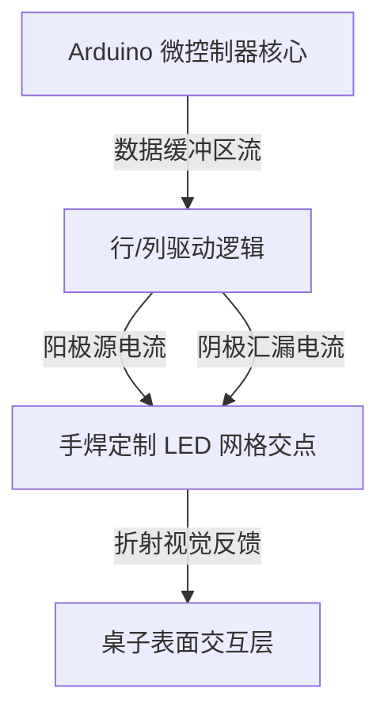

import ProjectGallery from '../../../components/projects/ProjectGallery.astro';
import ledDeskPic from '../../../assets/projects/led-desk/featured.webp';

## 项目概要

交互式家具和大尺寸指示显示器需要强大的硬件协同能力，以便在不增加高昂组件成本的情况下管理多个照明区域。本项目作为全国技术学科竞赛的学生团队作品，专注于设计与构建一个完全功能齐备的“可编程 LED 智能桌”——这是一个在结构化工作台内部嵌入了手焊、可寻址 LED 点阵网格的智能系统，能够渲染动态视觉效果、几何图形以及滚动文本。

主要的工程瓶颈在于纯手工硬件制造和数据路由的庞大规模。我们没有部署现成的商业化 LED 面板，而是对核心点阵布局进行了手动的结构化放置、分立元件隔离以及高密度的点到点焊接。在软件端，挑战在于如何在资源受限的微控制器架构上，开发经过深度优化的嵌入式固件，以处理帧缓冲区计算、行列扫描逻辑以及平滑的空间过渡。

该工业级原型机最终在**于布日姆（Bužim）举行的全国竞赛“XI Festival rada”（技术作品展）**上展出，并成功荣获其所属类别的**一等奖（最高荣誉）**。

## 担当业务与构建内容

该项目要求在严苛的零容错物理组装与算法软件执行之间取得精确的平衡。

### 底层固件开发与图样逻辑
*   **算法视觉生成：** 设计并编写了定制的固件架构，用以计算并输出复杂的数学照明图案、空间波动和实时刷新循环。
*   **点阵字模映射层：** 构建了定制的字体映射矩阵层，将原始字符串转换为特定的像素坐标状态，从而实现文本数据在显示布局上的滚动显示。
*   **优化执行架构：** 使用嵌入式 C++ 结构化核心运行时循环，以确保高效的行数据调度，在剧烈的计算切换下成功消除了肉眼可见的闪烁并稳定了显示刷新。

### 定制硬件原型开发与点阵焊接
*   **手工网格组装：** 亲身协同设计并执行了显示点阵的物理组装。整个课桌结构内的每一个单体 LED 节点均由手工定位、对齐，并拼焊至公共数据总线和电源轨上。
*   **信号线缆调校：** 制定了内部布线路由框架，实现了上拉/下拉电阻网络，以防止在如此密集的硬件网格中产生电子串扰、信号衰减和电压降。
*   **结构集成与测试：** 将最终的铜线网格点阵无缝集成在课桌的保护表层下方，进行了持续的压力测试、万用表诊断检查以及热效应评估，以确保在长期的公开实演中安全部署。

## 技术栈与材料矩阵

*   **核心计算架构：** Arduino 微控制器开发框架
*   **显示元件：** 高亮度分立式发光二极管（LED）、晶体管开关阵列
*   **控制软件：** 嵌入式 C/C++ 优化层、底层位操作（Bit-Manipulation）例程
*   **制造与装配材料：** 高导电铜线、精密热焊接系统、穿孔绝缘基底
*   **分析硬件：** 数字万用表、台式稳压电源

## 点阵控制拓扑

系统硬件布局作为一个本地化的坐标管线运行，固件在此处理单个图形缓冲区，并通过阵列驱动器调度执行信号，以点亮精确的显示交点：

## 竞赛纪录与技术影响

| 指标 / 维度 | 成就记录 | 技术验证 |
| :--- | :--- | :--- |
| **竞赛名次** | <a href="/assets/certificates/1st-place-certificate-xi-festival-rada.pdf" target="_blank" rel="noopener noreferrer" data-astro-reload>第一名证书</a> | 布日姆全国技术作品展（XI Festival rada） |
| **制造工艺** | 100% 纯手工元件焊接 | 完整点对点节点线路构筑 |
| **渲染支持** | 静态/滚动文本及几何图案 | 坐标映射矢量分配逻辑 |
| **系统可靠性** | 零故障运行 | 负载下多小时诊断运行验证 |

## 结语
“可编程 LED 智能桌”项目的成功，为我连续多年斩获全国技术竞赛冠军的辉煌历程画上了圆满的句号。直面从零开始纯手工构建高密度元件矩阵的严苛物理需求，为我提供了底层硬件调试、信号路径优化以及嵌入式时序控制方面无与伦比的专业知识——这些核心结构化学科至今仍在强力支撑着我的现代软件工程开发方法。

## 项目画廊

<ProjectGallery images={[
  { 
    src: ledDeskPic, 
    alt: '可编程 LED 电脑桌的展位，展示了荣获全国冠军的自定义硬件集成与环境照明', 
    caption: '在全国展览会现场展出的获奖作品——“可编程 LED 电脑桌”项目，突显了助力其荣获全国冠军头衔的自定义嵌入式硬件布局、结构组装以及环境光同步技术。' 
  }
]} />