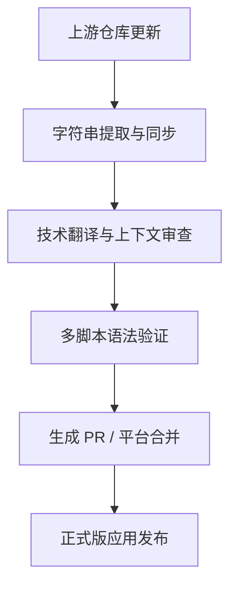

## 项目概要

在现代软件开发中，许多高影响力的安全工具、系统实用程序和多媒体应用程序往往忽略了对较小区域语言的本地化支持。这给巴尔干社区（使用波斯尼亚语、克罗地亚语和塞尔维亚语的用户）带来了可访问性壁垒。

我在该总体项目下的使命是为开源应用程序提供精确、技术一致性极高的翻译。技术本地化远不止字面上的语言翻译，它需要对安全协议、UI/UX 限制、字符编码以及多脚本部署（在拉丁字母和基里尔字母之间无缝切换）有深层的工程级理解，从而确保在不破坏下游应用布局或已编译翻译字符串的前提下完成交付。

## 担当业务与构建内容

我并没有将本地化视为一项被动的任务，而是将其视作一个持续集成（CI）管线。我积极管理并同步多个企业级本地化平台与直接版本控制系统之间的翻译数据。

### 核心贡献与项目成果

*   **Aegis Authenticator：** 通过 Crowdin 本地化了这款顶级、安全的开源 2FA Android 解决方案。专注于密码学专业术语、硬件级安全协议以及加密金库备份/恢复指令的精准翻译，因为这些地方的任何语言逻辑错误都可能导致用户数据丢失。
*   **TizenBrew & TizenTube：** 直接通过 GitHub 仓库使用 JSON 平面文件字典管理本地化工作流。这包括配置本地化映射表、管理 Pull Requests（PR）、确保多脚本的一致性，以及实现实验性的自定义语言字符串（例如克林贡语变量），以压力测试应用程序底层的 i18n 解析引擎。
*   **Blowfish Theme (HUGO)：** 直接通过 GitHub PR 为这款流行、高性能的 Hugo 框架生态系统贡献了技术本地化，确保精确的配置术语和布局变量在区域开发者社区中能够正确映射。
*   **RetroArch：** 通过 Crowdin 本地化了这款体量庞大的传奇开源多系统模拟器前端，翻译了复杂的系统设置、核心配置以及模拟硬件接口参数，以确保最佳的用户体验。
*   **Gallery Compose：** 通过 Crowdin 本地化了这款使用 Jetpack Compose 构建的现代、轻量级 Android 媒体相册应用程序，在原生 Android 本地化资源生态内直接映射了 UI 组件和媒体 Schema 指令。
*   **CustomRP：** 通过 PoEditor 翻译了其复杂的配置界面，提升了全球 Discord Rich Presence 开发者社区的用户体验和可访问性。

## 技术栈与平台工具

*   **版本控制与工作流：** Git, GitHub（分支管理、冲突解决、Pull Requests）
*   **本地化平台：** Crowdin Enterprise, PoEditor
*   **标准与范式：** i18n 字符串插值、平面文件字典（JSON, XML, ARB）、多脚本系统管理（拉丁/基里尔字母映射）

## 核心流程

我的本地化工作流模拟了标准的软件开发生命周期（SDLC），以确保绝无损坏的字符串或语法错误流入生产管线：

*   **上下文与代码审查：** 在翻译前，我会仔细检查上游源码或资源文件，以理解变量位置（如 `{user}`、`%s`）、布局边界限制以及字符串在 UI 中的动态表现行为。
*   **语言规范化：** 我在波斯尼亚语、克罗地亚语和塞尔维亚语之间推行标准化的技术术语规范，确保复杂的软件工程词汇既符合母语习惯又具备极高的专业度。
*   **语法守卫：** 我会手动验证本地化字符串内部的转义字符、尾随空格以及 Markdown 语法，以确保本地化后的资产绝不会破坏编译后的生产环境构建。

### 项目台账（持续更新矩阵）

以下是我已经本地化或目前正在维护的开源项目的经验证记录。该台账随着新翻译模块推向生产环境而持续更新：

| 项目 / 工具名称 | 平台 / 技术栈 | 目标受众 / 核心组件 |
| :--- | :--- | :--- |
| **Aegis Authenticator** | Crowdin / XML | 安全 / 2FA 加密金库 Android 应用 |
| **TizenBrew** | GitHub / JSON | 多媒体 / 自定义系统集成底层 |
| **TizenTube** | GitHub / JSON | 视频流媒体 / 客户端用户界面 |
| **Blowfish Theme** | GitHub / YAML | 开发者框架 / HUGO 生态系统 |
| **RetroArch** | Crowdin / C 语言字符串 | 前端 / 多系统模拟器架构 |
| **Gallery Compose** | Crowdin / XML | 多媒体 / Android Jetpack Compose 应用 |
| **CustomRP** | PoEditor / 富文本 | 开发者工具 / Discord Rich Presence 状态 |

### 验证与实时指标

每一次贡献都通过加密方式与我的个人资料绑定，或通过验证后的 GitHub Pull Requests 显式合并。您可以直接通过我的公开主页，追踪我在开源生态系统中的实时翻译量、已通过审核的字符串以及活跃投票指标：

* **经认证的 Crowdin 主页与贡献：** <a href="https://crowdin.com/profile/lukapiplica" target="_blank" rel="noopener noreferrer">crowdin.com/profile/lukapiplica</a>
* **开源代码贡献仓库：** <a href="https://github.com/lukapiplica" target="_blank" rel="noopener noreferrer">github.com/lukapiplica</a>
