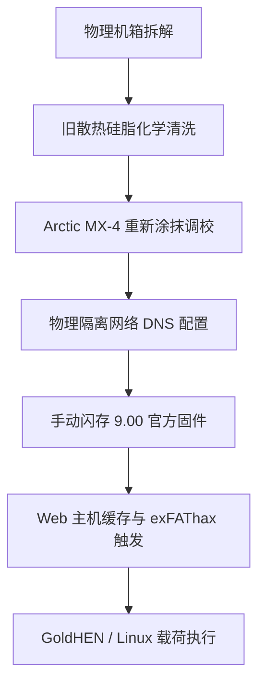

## 项目概要

家用游戏机在长期的生命周期中，由于灰尘堆积和热传导介质（硅脂）老化失效，经常面临严重的表面热节流（散热限速）和性能退化。本系统工程项目专注于一台 PlayStation 4 Slim 主机的完整物理翻新、散热优化以及内核漏洞利用。

**法律声明：** 我计划使用这台 PS4 安装 Linux 系统并出于好奇进行实验。我绝不姑息或支持盗版行为；本文仅用于教育和技术交流目的！本人不对您的任何后续行为承担任何责任！

该项目包含双重目标：首先，通过执行完整的硬件拆解和精密化学清洗，逆转严重的散热限速问题；其次，将固件控制升级至精确的 9.00 版本，实施手动的 Web 矢量内核漏洞利用（exfathax），并安全地引导一个独立的 Linux 运行时环境以进行教育性测试。

    

## 担当业务与构建内容

我全权负责了该项目的整个生命周期，将工作流清晰地划分为物理硬件工程与底层系统漏洞利用两大部分。

## 硬件翻新与散热管理

*   **完整拆解：** 对主机外壳及内部框架进行了彻底的结构性拆解，以触及核心主板、离心风扇和内部散热片总成。

    

    

*   **化学去污：** 利用高纯度异丙醇（IPA）彻底清除已经老化、变质的工厂原装热传导介质，同时确保不对周围精密的表面贴装器件（SMD）造成任何物理损伤。

    

* **散热介质升级：** 清洗了内部散热鳍片，并采用优化后的均匀薄涂法重新涂抹了高性能 Arctic MX-4 导热硅脂，成功降低了高负载计算状态下的风扇噪音并消除了散热瓶颈。

    

    

## 固件操纵与漏洞利用

*   **物理隔离 OS 优化：** 通过完全重写系统网络接口、禁用自动遥测与下载，切断了主机与索尼官方网络自动更新路径的连接。配置了特定的主/备 DNS 路由（`192.241.221.79` / `165.227.83.145`），以安全地拦截并丢弃来自官方的入站更新载荷。
*   **手动固件升级：** 在 exFAT 文件系统的块存储设备上构建了严格的静态目录结构（`/PS4/UPDATE/PS4UPDATE.PUP`），通过本地媒体引导，暂存并部署了官方的 9.00 系统恢复分区镜像。

    

*   **内核内存漏洞利用：** 利用专业的 Web 主机缓存工具（通过 Karo 运行的 GoldHEN 载荷生态系统），配合通过 Rufus 烧录到原生块存储设备上的外部原始二进制注入机制（`exfathax.img`），利用 exFAT 文件系统解析器漏洞成功触发了内存边界绕过。

## 技术栈与硬件矩阵

*   **硬件材料：** Arctic MX-4 导热化合物、高纯度异丙醇清洗剂、专用精密螺丝刀组
*   **漏洞利用框架：** GoldHEN Payload、Web 漏洞利用矢量引擎（Karo）、Rufus 块级写入工具
*   **目标 OS 架构：** Orbis OS（基于 BSD 衍生）、自定义客户端嵌入式 Linux 环境

## 系统工作流管线

整个系统配置管线遵循严格的先后顺序，以确保在执行不稳定的运行时内核内存修改之前，硬件稳定性已完全确立：

## 硬件与系统构成台账

以下是系统生命周期内所管理的部署状态及材料的技术规范：

| 系统组件 | 技术 / 框架 | 实施策略 |
| :--- | :--- | :--- |
| **热传导介质** | Arctic MX-4 碳素化合物 | 高导热核心重新涂抹 |
| **固件基准** | 索尼系统镜像 v9.00 | 定向恢复升级路径 |
| **漏洞利用矢量** | Webkit / exFAT 文件系统漏洞 | 手动浏览器载荷缓存注入 |
| **载荷处理器** | GoldHEN 生态系统 | 底层自制软件与内核访问代理 |
| **网络网关** | 自定义物理隔离手动 DNS | 索尼遥测与更新矢量拦截丢弃 |

## 最终结果

    

### 结论与项目状态

> **注意：** 如果出现任何错误或主机崩溃，请重启 PS4 并重试！此越狱是非持久性的，这意味着在关机或重启后，您必须重新执行所有步骤。一种解决方案是将 PS4 设为待机模式（Rest Mode），或者您也可以使用 ESP32 或 Raspberry Pi 微控制器在本地实现载荷交付的自动化。

物理翻新完全成功，永久消除了主机内部的风扇噪音并防止了表面热崩溃。底层 exfathax 内核漏洞利用达到了约 80% 的初始化成功率，提供了一个完全功能齐备的沙盒环境，适用于持续的底层 Linux 内核实验和自定义嵌入式系统研究。