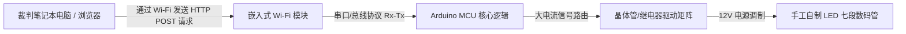

## 项目概要

传统的体育计分板依赖于昂贵且专有的硬件控制器或有线接口，这限制了设备的移动性并增加了安装的复杂性。本项目作为学术导师指导下的竞赛学生团队作品，旨在从零开始构建一个低成本、高可见度且支持 Wi-Fi 连接的篮球计分板。

核心挑战在于构建一个端到端的物联网（IoT）生态系统。这需要设计高亮度的物理自制显示屏以实时渲染比赛指标、开发稳定的嵌入式固件以处理异步硬件中断，并部署一个本地无线 Web 服务器，允许裁判员通过任何浏览器客户端无缝控制比分和计时器。

最终的系统在**于哈吉奇（Hadžići）举行的全国竞赛“IX Festival rada”（技术作品展）**上展出，与来自全国各地的技术项目展开角逐，并成功斩获**一等奖（最高荣誉）**。

## 担当业务与构建内容

该项目是团队协作的成果，需要软件逻辑、网络架构和物理电子原型设计之间的深度同步。

### 嵌入式软件与无线网络
*   **微控制器固件：** 协助编写核心 Arduino 微控制器架构的程序，实现状态机逻辑（State machine logic）以管理比赛计时器、时钟倒计时和结构化数字计算，确保系统无阻塞运行。
*   **本地 Web 服务器集成：** 共同设计嵌入式 Wi-Fi 模块的固件，使其充当本地接入点（Access Point），托管无状态的 HTML 控制门户。
*   **非异步 Web 数据捕获：** 将客户端 Web 终端上用户操作触发的输入 HTTP 请求直接映射到硬件执行例程中，实时更改比分和比赛时钟参数。

### 硬件工程与物理显示架构
*   **自制七段数码管模块：** 设计并制作了定制的大型七段显示屏。我们没有使用市售的小型集成电路（IC）组件，而是手工作业裁剪、配线并将高密度 LED 灯带焊接成独立的结构化几何段。
*   **驱动电路布局：** 共同开发了硬件布线接口，利用晶体管和继电器模块安全地缓冲并放大来自低功耗 Arduino 逻辑引脚的电流路径，以满足 LED 阵列更高的电压需求。
*   **系统组装与集成：** 协同安装结构化硬件框架，建立干净的共地（Common-ground）电源线，并对连接处进行绝缘处理，以确保在运输和现场展览压力测试期间具备可靠的物理耐久性。

## 技术栈与材料矩阵

*   **核心控制硬件：** Arduino 微控制器生态系统、ESP8266/嵌入式 Wi-Fi 模块布局
*   **显示元件：** 高密度 12V LED 灯带、改装聚碳酸酯结构外壳
*   **接口技术：** 原生 HTML5 布局、HTTP 协议层、嵌入式 C/C++（Arduino IDE）
*   **制造与测试工具：** 精密焊接设备、数字万用表、结构原型设计套件

## 物联网基础设施拓扑

硬件与软件的协同运行遵循本地化无线闭环，确保在锦标赛演示期间不需要任何外部互联网依赖即可维持系统的正常运行时间：

## 竞赛纪录与技术影响

| 指标 / 维度 | 成就记录 | 技术验证 |
| :--- | :--- | :--- |
| **竞赛名次** | <a href="/assets/diplomas/1st-place-diploma-ix-festival-rada.pdf" target="_blank" rel="noopener noreferrer" data-astro-reload>第一名证书</a> | 哈吉奇全国技术作品展（IX Festival rada） |
| **接口响应速度** | 几乎瞬时（小于 50ms 延迟） | 本地化物理隔离 Wi-Fi 路由的部署实现 |
| **显示执行力** | 100% 定制化制造 | 手工自制数码管段的矩阵优化设计 |
| **系统成本** | 极低的资产开销 | 大幅低于传统的工业级专用体育硬件 |

## 结语
该项目是我在系统集成领域展现早期核心能力的一个重要里程碑。克服手工焊接、信号线噪声过滤以及嵌入式 Web 路由等结构性挑战，为我提供了低层调试和物理接口管理方面的基石知识，这些经验已直接转化为如今现代全栈应用程序开发的技术底层。