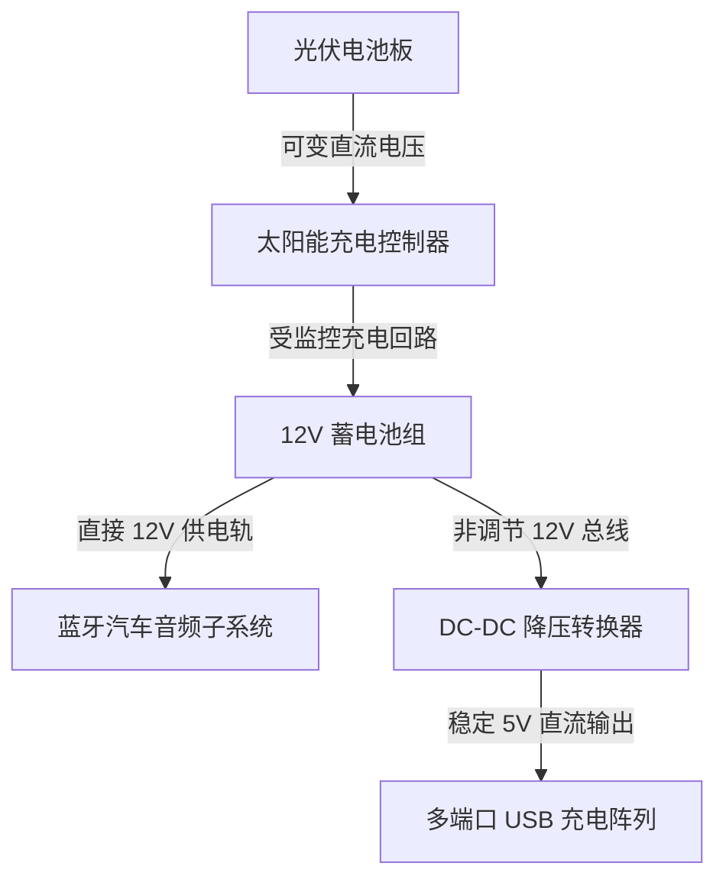

import ProjectGallery from '../../../components/projects/ProjectGallery.astro';
import solarTreePic from '../../../assets/projects/solar-tree/featured.webp';

## 项目概要

随着公共基础设施向智能城市框架演进，低功耗可持续能源节点正成为城市环境不可或缺的一部分。在学术导师的指导下，本项目作为学生团队的竞赛作品，旨在开发一款功能性的“太阳能树（Solar Tree）”原型——这是一个离网公共充电站，旨在收集太阳能并安全地向消费电子设备和本地无线音频 subsystems 分配电力。

工程挑战完全集中在硬件子系统的集成上。系统需要捕获波动的环境太阳能，稳定光伏电池输出的波动直流电，将储备电量安全地存储在化学蓄电池组中，并进行降压调压，以向多个 USB 端口和集成的蓝牙车载音频系统提供纯净、稳定的电力交付。

最终的绿色能源原型机在**泽尼化（Zenica）举行的全国竞赛“X Festival rada”（技术作品展）**上展出，在与全国内众多展出项目的激烈角逐中脱颖而出，荣获**一等奖（最高荣誉）**。

## 担当业务与构建内容

整个开发过程高度依赖于物理实现、精密电能分配以及安全功率级的隔离规划。

### 光伏能量收集与蓄电池隔离保护
*   **光伏矩阵集成：** 共同配置高效率太阳能电池板模块的部署，优化结构阵列的安装角度以最大化光线入射角。
*   **充电回路优化：** 将光伏输出接入专用充电控制器回路，建立可靠的多阶段蓄电池充电方案，保护化学蓄电核心免受过充和反向电流的影响。
*   **电力容量分配：** 隔离并管理太阳能电池板、蓄电池组与中央配电端子排之间的粗规格线缆布线。

### 输出调压与子系统配线
*   **稳定 USB 输出阵列：** 协助设计和测试电压调节电路，利用降压转换器（Buck Converter）将原生蓄电池电压降至固定的 5V 直流输出，实现为多个移动端客户端设备提供安全的同步充电。
*   **蓝牙音频单元部署：** 配置内部电气布局，为配备蓝牙无线媒体流接口的标准高功耗汽车收音机系统供电。我专注于音频线路与电源轨的去耦处理，以防止在活跃的充电通道上产生高频射频（RF）噪声和地环路干扰（Ground-loop interference）。
*   **机箱构筑与公共安全：** 协同进行整体结构组装，焊接高强度接头，对脆弱的断线处进行热缩管绝缘保护，并对内部机箱进行接地处理，以确保在现场公开实演期间的运行可靠性与安全性。

## 技术栈与材料矩阵

*   **能量捕获硬件：** 高效光伏（PV）太阳能电池板阵列
*   **电源管理：** DC-DC 降压电压调节器（5V USB 分级）、专用太阳能充电控制器
*   **能量存储：** 阀控式密封铅酸（SLA）深循环蓄电池组
*   **连接性与音频：** 支持蓝牙的 12V 汽车收音机单元、多端口 USB 充电集线器
*   **开发与测试工具：** 数字电压表、蓝牙 4.0/射频信号测试仪、重载焊接设备、保护绝缘基矩阵

## 配电工作流

整个基础设施架构作为一个离网、闭环的直流（DC）配电系统运行，消除了对高成本交流（AC）逆变的需求，并将电能转换损耗降至最低：

## 竞赛纪录与技术影响

| 指标 / 维度 | 成就记录 | 技术验证 |
| :--- | :--- | :--- |
| **竞赛名次** | <a href="/assets/diplomas/1st-place-diploma-x-festival-rada.pdf" target="_blank" rel="noopener noreferrer" data-astro-reload>第一名证书</a> | 泽尼察全国技术作品展（X Festival rada） |
| **输出电压调节** | 纯净的 5V 直流供电轨 | 隔离反馈型降压转换器的部署实现 |
| **系统自律性** | 100% 物理隔离离网系统 | 外部零依赖的本地化太阳能配电循环 |
| **无线接口** | 集成式蓝牙音频流媒体 | 并联电源轨与射频（RF）噪声配置策略 |

## 结语
“太阳能树（Solar Tree）”原型机在全国展览上的成功部署与答辩，验证 family 了我们构建多学科交叉系统的可行性。在保障大电流蓄电池安全性的同时，平衡低功耗消费电子配电与无线射频子系统，这为硬件保护、电流预算以及模块化物理组装提供了宝贵的第一手工程经验，并持续深远地影响着我如今的结构化系统设计。

## 项目画廊

<ProjectGallery images={[
  { 
    src: solarTreePic, 
    alt: '“太阳能树”技术原型展览，展示了可持续能源设施与集成的太阳能电池板', 
    caption: '在公共展览现场展出的完全组装的“太阳能树”技术原型，突显了光伏电池板的结构集成以及可持续性建筑设计。' 
  }
]} />